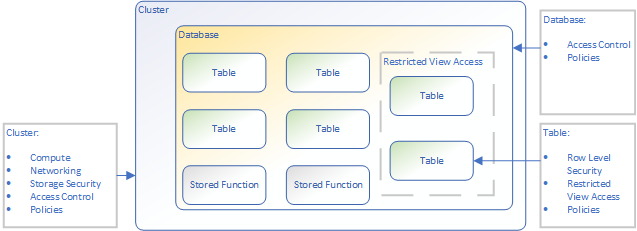
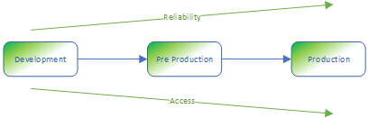
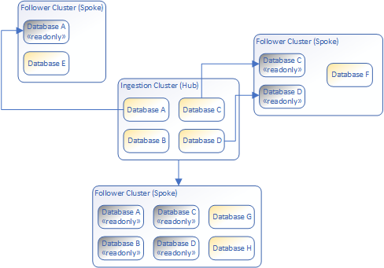

[VP]  I would see this article under straight under *Concepts*.  Same level than [Data Viz Overview](https://docs.microsoft.com/en-us/azure/data-explorer/viz-overview).

[VP] Could it be an entire section under concept with each h2 being an article?  Unless we drastically trim down the sections, that might be necessary to keep articles under the 3 pages bar.

# Governance with Azure Data Explorer clusters

This article looks at different governance patterns with Azure Data Explorer clusters.

[VP] We need to flesh out the intro once the content of the article is clearer.

## Clusters vs Databases

[VP] This is awfully long before getting to recommendations...  Could we get away with a just the diagram?

Kusto essential constructs, [tables](kusto/query/schema-entities/tables.md) & [stored functions](kusto/query/schema-entities/stored-functions.md), are what users query against.  When should we put those constructs in a single database, in different databases within the same cluster, in different databases in different clusters?

Let's look at the different parameters a cluster and a database allow us to set.

Parameter|Database|Cluster
-|-|-
Compute|N/A|Compute is configured at the cluster level.  Each cluster can have a different [compute sku](manage-cluster-choose-sku.md) and [horizontal scaling](manage-cluster-horizontal-scaling.md).  VM disks can also be encrypted at rest using [Disk Encryption](cluster-disk-encryption.md).
Networking|N/A|Networking is configured at the cluster level.  A cluster can be [deployed inside a Virtual Network](vnet-deployment.md) and from there all [network security features](security-baseline.md#network-security).
Storage Security|N/A|A storage account is associated with each cluster.  That storage account can be configured to use [customer managed keys](customer-managed-keys-portal.md) for encryption and / or to also encrypt the data at service-level using [double encryption](double-encryption.md).
Access Control|Database is an ARM resource (child of the cluster) and can have [role assignment](kusto/management/access-control/role-based-authorization.md).  Tables currently can't have role assignment (tables can be secured through [restricted view access policy](kusto/management/restrictedviewaccesspolicy.md) and [row level security policy](kusto/management/rowlevelsecuritypolicy.md), both of which aren't a perfect equivalent to table access control).  Database can hence be seen as the lowest security boundary.|Clusters offer complete isolation both on the control plane (e.g. start / stop cluster) and data plane (e.g. ingestor / viewer)
Policies|Many [policies](kusto/management/policies.md) can be applied at the cluster, database and table level with an overriding semantic (i.e. if a policy is defined at a lower level, it overrides the policy at a higher level).  A database can hence be conceptualized as a *policy container* in order to apply some policies to many tables.|Policies applied at the cluster level apply to all tables in all databases unless overridden.

On top of that, we can make those general observations:

* Compute drives cost
* [Cross-cluster queries](kusto/query/cross-cluster-or-database-queries.md) are often less performant than if they were done within the same cluster
* Cross-database queries (within the same cluster) have the same performance than if they were done on tables in the same database

For those reasons, although clusters provide more isolation, we typically try to consolidate where it makes sense.

Those are no hard rules but guidance on when to use a given pattern.

### When to use a single database

* When all tables should have similar access control rules in querying, ingestion and administration
* When tables share the same policies or have table-specific policies

### When to use multiple databases

* When tables should have different access control rules in querying, ingestion and administration:  we can use a database as a security boundary
* When groups of tables should share similar policies:  use a database as a policy container

### When to use multiple clusters

Multiple clusters are completely isolated by default.  It is possible to share data using [follower database](follower.md) if it is needed.

* When different compute should be used for different workloads
* When different networking configuration must be used for different workloads, e.g. cluster A should be accessible from VNET X but not from VNET Y
* When hard boundaries should be implemented between workloads, e.g. it should be impossible for user to join data from data set A & B
* When different teams want to isolate costs and avoid sharing compute
* In general, it is a good practice to isolate environments using different clusters, at least production vs non-production, so that configuration changes can be tested in non-production environments without impacting the production.  See more detailed in the [Environments section](#environments)

## Environments

[VP] Do we need the scenarios, or should we jump to the patterns right away?

[VP] Maybe not here, the discussion about scenario has its relevance to illustrate how ADX can be used concretely, which isn't always clear for customer.

Azure Data Explorer is used in different scenarios and the way we think [deployment environments](https://en.wikipedia.org/wiki/Deployment_environment) will change depending on the scenario.

Here are some common scenarios for using Azure Data Explorer:

Scenario|Definition|Details|Characteristics
-|-|-|-
Internal *Data Exploration*|Azure Data Explorer is used by internal users for exploration, i.e. to find insights.  It is purely ad hoc queries.|The queries, their complexity and rate of execution is ad hoc.  Sometimes different teams have different roles, e.g. ingestion, data quality, exploration, etc.  .|The cluster works in a *best effort* mode.  If a transient failure occurs because of resource exhaustion, it is the responsibility of the users to retry.  It is the responsibility of the admins to setup the cluster capacity to match the load.  Configuration changes can be introduced with a relax form of change management.
APIs|Azure Data Explorer is used to serve APIs.|API calls will be doing predictable queries, happen at a predictable cadence and certain SLOs will be expected (e.g. performance, success rate, etc.).|Configuration changes must be introduced with a controlled change management.
SaaS|Azure Data Explorer is used as a building block for a customer facing Software as a Service (SaaS).|This is sometimes Azure Data Explorer itself with restricted access for customer users, sometimes there is any number of layers of software in front of it.  Customers expect a certain level of performance, responsiveness and reliability.|Configuration changes must be introduced with a controlled change management.

Let's see a couple of patterns used to address those scenarios.

### Traditional Deployment environments

This is what we think as traditional [deployment environments](https://en.wikipedia.org/wiki/Deployment_environment).  Change goes from a development environment all the way to our production environment, passing through different environments along the way, different quality and approval gates, etc.  .

This pattern typically enforces automation, especially if the number of environments is high.

This pattern is still relevant with Azure Data Explorer, especially with the *APIs* & *SaaS* scenarios where we want controlled changed management.

It has less value in a purely *Internal Data Exploration* scenario where the nature of the scenario is exploration as opposed to repeatability.  We still want to tame the organic churn coming from an exploration environment, but controlling the changes in a formal manner is at odd with an exploration mode.  We will look at how to address this in the [organic churn](#data-exploration-organic-churn) section.

### Hub and Spoke

The hub and spoke pattern leverages the [follower database](follower.md) feature where some database from a "hub" cluster are followed by "spoke" clusters.

Typically, that pattern has the "hub" cluster being an "ingestion cluster" and is the responsibility of a specific team.  The followed databases in follower clusters are read-only and can only be queried.

This pattern gives us the flexibility to optimally configure clusters.  For instance, if the ingestion cluster is never queried, it doesn't need to cache data hence it doesn't need much local storage and can be purely compute-optimized while the follower clusters will need more local cache.

The diagram showed the follower clusters can have any subset of the ingestion cluster's databases but can also have databases of their own.

This pattern is useful for the *Internal Data Exploration* scenario where a team takes care of ingestion and other teams perform ad hoc analysis.  This allows separation of duty but also separation of costs.

This pattern could also be useful in an hybrid scenario of *Internal Data Exploration* and *APIs* (or *SaaS*), where Azure Data Explorer serves APIs (or external customers) but also is used for ad hoc analysis internally.  It could then be used in conjunction with the [traditional deployment environments](#traditional-deployment-environments) pattern in this hybrid scenario.

## Noisy neighbours

A common issue in a shared platform is the noisy neighbour problem.  In the case of Azure Data Explorer, this occurs when a subset of users using a cluster uses so much resources they slow down other users' queries or worse deplete resources to the point where queries fail.

This is typically addressed by properly sizing the cluster.

It can also be addressed with the [Hub and Spoke](#hub-and-spoke) pattern.  This allows different team to hit different clusters with their queries so that one team's query doesn't impact the performance of the other team's.

## Data Exploration organic churn

In an *Internal Data Exploration* scenario, most users will only run queries to gain insights in the data.

Some users will inevitably need to *write*.  For instance:

* They might want to write their own [stored functions](kusto/query/schema-entities/stored-functions.md) to improve their query-writing productivity
* They might want to transform some data and [ingest it](ingest-data-overview.md) to new tables
* They might want to try out alternative [update policies](kusto/management/updatepolicy.md) to ingest data differently
* etc.

A lot of those *writes* are temporary.  They are part of experience ran by users.  This is what we called the Data Exploration *organic churn*.

On one hand those are essential to advanced data exploration process and shouldn't be forbidden.  Some of that churn will become permanent as an evolution of a database.  On the other hand, those *writes* can pollute databases but also consume resources (e.g. [hot cache](kusto/management/cachepolicy.md)).

We therefore want to control the *organic churn* in a way to enable advanced data exploration but also avoid resource depletion and pollution of our cluster.  Here are some patterns to help doing that.

### Just in Time write-access

On large teams (i.e. tens or hundreds of users), not everyone should be able to ingest / create stored functions & tables at all time.

This privilege should be given to users as needed and preferably for a given time period:  just in time.

By reducing the number of users able to write in each database at all time, we make the problem more manageable.

### Cafeteria refrigerator policy

Another simple pattern to control churn is what most companies do with the office refrigerator, i.e. clean it up every Friday.

A simple way to implement that in Azure Data Explorer is to have a list of tables and stored functions and simply delete any object outside of that list periodically (e.g. once a week).

This pattern can also ease a transition to a [DataOps](https://en.wikipedia.org/wiki/DataOps) methodology where databases are at least partially scripted.

Users then need to pro-actively commit the code they want to keep so it doesn't get deleted.  This code can then be reviewed and approve in due process.

## See also

* [Security Overview](security.md)
* [Security Baseline](security-baseline.md)
* [Business Continuity](business-continuity-overview.md)
* [Follower Databases](follower.md)