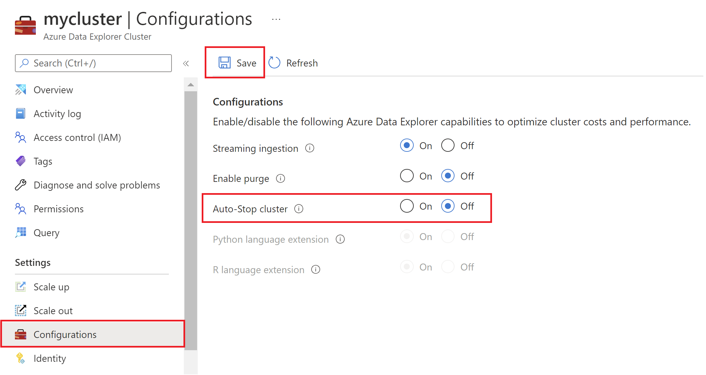
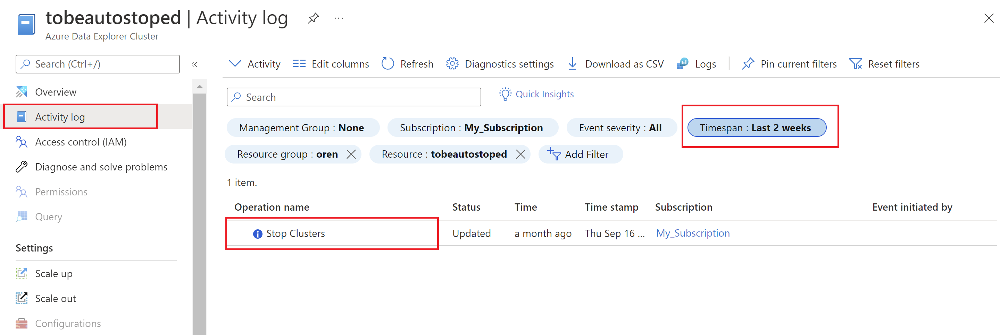

# Automatic stop inactive Azure Data Explorer clusters 

Azure Data Explorer clusters which have been *inactive* for a several days would be automatically stopped.

**Inactivity** means that neither queries nor ingestion were done in a certain time period.

An *inactive* cluster would be stopped after:
1. 5 days - if cluster has no data (or a very small amount of data).
2. 10 day - if cluster has data ingested.

> [!NOTE]
> There is no automatically resume cluster behavior. Cluster owners would have to resume the cluster by themselves. 

> [!NOTE]
> Leader clusters won't be automatically stopped. More info on follower/leader clusters [here](./follower.md).

> [!NOTE]
> Cluster Avg. CPU, above a certain threshold, could also lead to consider cluster as active. 

## Recommendations and automatic stop

Azure Data Explorer clusters would be stopped only after several days of recommendations to stop the cluster. 
Those recommendations are populated through Azure Advisor service. More info about Azure Data Explorer cost recommendations [here](./azure-advisor.md#cost-recommendations).  

## Manage Automatic stop behavior on your cluster (how do I disable automatic stop experience?)

Azure Data Explorer clusters are created with `enableAutoStop = true` cluster property. 
This property can be set either on cluster creation or post creation.
The value for this property can be set using [ARM Templates](/azure/templates/microsoft.kusto/clusters?tabs=json#trustedexternaltenant-object), [AZ CLI](/cli/azure/kusto/cluster?view=azure-cli-latest#az_kusto_cluster_update-optional-parameters), [PowerShell](/powershell/module/az.kusto/new-azkustocluster), or the [Azure Resource Explorer](https://resources.azure.com/). For more information, see [Azure Data Explorer cluster request body](/rest/api/azurerekusto/clusters/createorupdate#request-body). 

## Azure portal

You can enable/disable automatic stop cluster while creating a new cluster.
While creating a cluster using the steps in [Create an Azure Data Explorer cluster and database](create-cluster-database-portal.md), in the **Configurations** tab, select **Auto-Stop cluster** > **On**.


You can enable/disable Auto-Stop cluster after cluster was created:
1. In the Azure portal, go to your Azure Data Explorer cluster.
1. In **Settings**, select **Configurations**.
1. In the **Configurations** pane, select **On**/**Off** to enable/disable **Auto-Stop cluster**.
1. Select **Save**.



## Activity log (how I verify if my cluster was automatically stopped ) 
When cluster is automatically stopped an Activity log is sent.
To verify when and how the cluster was stopped, go to your Azure Data Explorer cluster in Azure portal, click on **Activity log** pane, 
choose a timespan and search for **Stop Clusters** operation name.


## REST Example

Update the cluster using the following operation:

```http
PATCH https://management.azure.com/subscriptions/12345678-1234-1234-1234-123456789098/resourceGroups/kustorgtest/providers/Microsoft.Kusto/clusters/kustoclustertest?api-version=2021-08-27
```

### Request body for disabling automatic stop experience

```json
{
    "properties": { 
        "enableAutoStop": false 
    }
}
```

### Request body for enabling automatic stop experience

```json
{
  "properties": {
    "enableAutoStop": true
  }
}
```