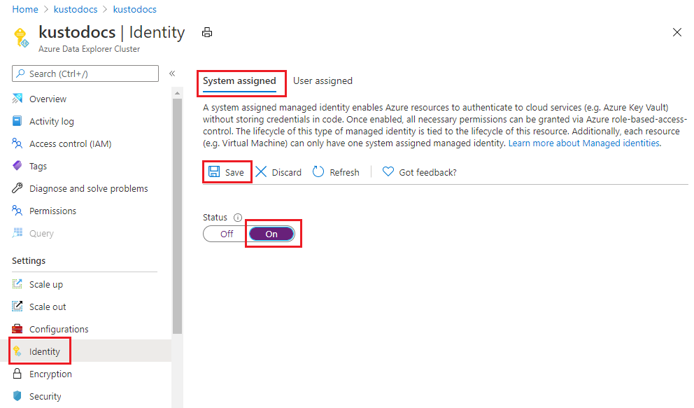
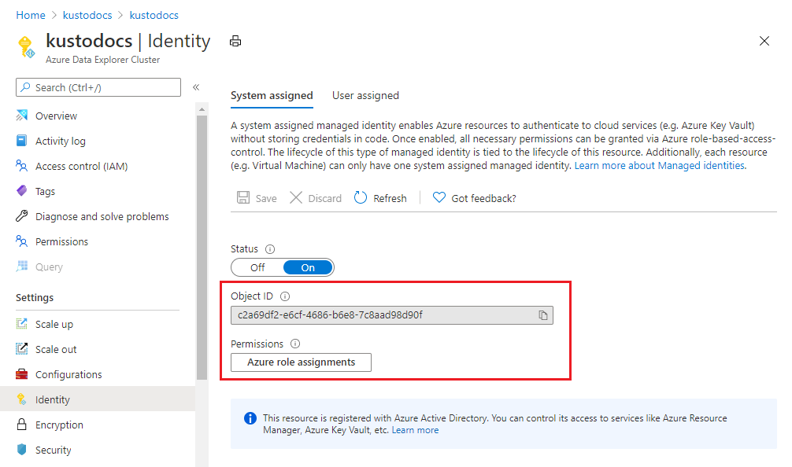
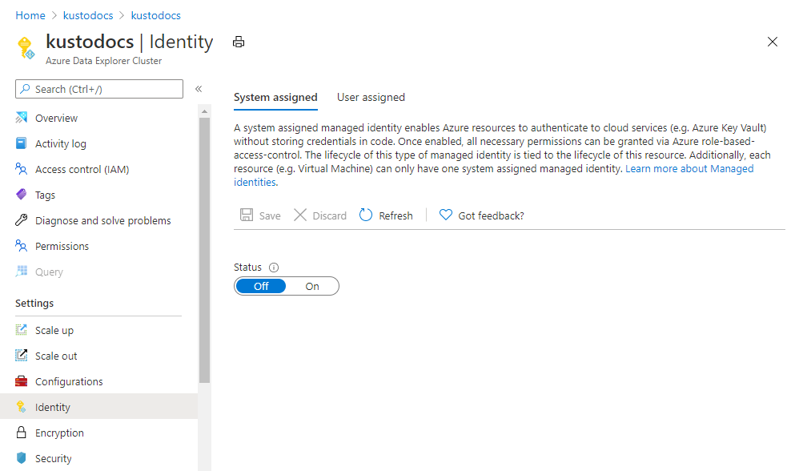
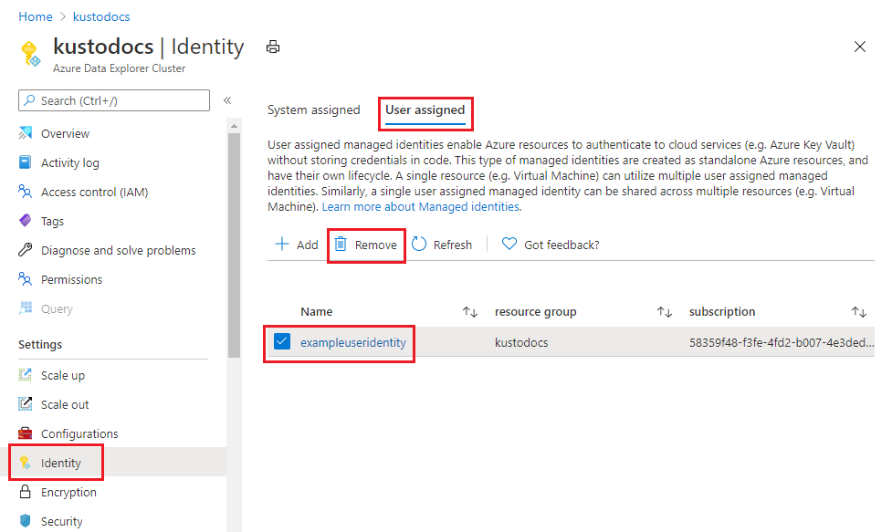

# Configure managed identities for your Azure Data Explorer cluster

A [managed identity from Azure Active Directory](/azure/active-directory/managed-identities-azure-resources/overview) allows your cluster to access other Azure AD-protected resources such as Azure Key Vault. The identity is managed by the Azure platform and doesn't require you to provision or rotate any secrets.

This article shows you how to add and remove managed identities on your cluster. For more information on managed identities, see [Managed identities overview](managed-identities-overview.md).

> [!NOTE]
> Managed identities for Azure Data Explorer won't behave as expected if your Azure Data Explorer cluster is migrated across subscriptions or tenants. The app will need to obtain a new identity, which can be done by [removing a system-assigned identity](#remove-a-system-assigned-identity) and then [adding a system-assigned identity](#add-a-system-assigned-identity). Access policies of downstream resources will also need to be updated to use the new identity.

> For code samples based on previous SDK versions, see the [archived article](/previous-versions/azure/data-explorer/configure-managed-identities-cluster).

## Types of managed identities

Your Azure Data Explorer cluster can be granted two types of identities:

* **System-assigned identity**: Tied to your cluster and deleted if your resource is deleted. A cluster can only have one system-assigned identity.

* **User-assigned identity**: A standalone Azure resource that can be assigned to your cluster. A cluster can have multiple user-assigned identities.

## Add a system-assigned identity

Assign a system-assigned identity that is tied to your cluster, and is deleted if your cluster is deleted. A cluster can only have one system-assigned identity. Creating a cluster with a system-assigned identity requires an additional property to be set on the cluster. Add the system-assigned identity using the Azure portal, C#, or Resource Manager template as detailed below.

# [Azure portal](#tab/portal)

### Add a system-assigned identity using the Azure portal

Sign in to the [Azure portal](https://portal.azure.com/).

#### New Azure Data Explorer cluster

1. [Create an Azure Data Explorer cluster](create-cluster-and-database.md#create-a-cluster) 
1. In the **Security** tab > **System assigned identity**, select **On**. To remove the system assigned identity, select **Off**.
1. Select **Next : Tags >** or **Review + create** to create the cluster.

    

#### Existing Azure Data Explorer cluster

1. Open an existing Azure Data Explorer cluster.
1. Select **Settings** > **Identity** in left pane of portal.
1. In the **Identity** pane > **System assigned** tab:
   1. Move the **Status** slider to **On**.
   1. Select **Save**
   1. In the pop-up window, select **Yes**

    

1. After a few minutes, the screen shows:
    * **Object ID** - Used for customer-managed keys
    * **Permissions** - Select relevant role assignments

    

# [C#](#tab/c-sharp)

### Add a system-assigned identity using C#

#### Prerequisites

To set up a managed identity using the Azure Data Explorer C# client:

* Install the [Azure Data Explorer NuGet package](https://www.nuget.org/packages/Azure.ResourceManager.Kusto/).
* Install the [Azure.Identity NuGet package](https://www.nuget.org/packages/Azure.Identity/) for authentication.
* [Create an Azure AD application](/azure/active-directory/develop/howto-create-service-principal-portal) and service principal that can access resources. You add role assignment at the subscription scope and get the required `Directory (tenant) ID`, `Application ID`, and `Client Secret`.

#### Create or update your cluster

1. Create or update your cluster using the `Identity` property:

    ```csharp
    var tenantId = "xxxxxxxx-xxxxx-xxxx-xxxx-xxxxxxxxx"; //Directory (tenant) ID
    var clientId = "xxxxxxxx-xxxxx-xxxx-xxxx-xxxxxxxxx"; //Application ID
    var clientSecret = "PlaceholderClientSecret"; //Client Secret
    var subscriptionId = "xxxxxxxx-xxxxx-xxxx-xxxx-xxxxxxxxx";
    var credentials = new ClientSecretCredential(tenantId, clientId, clientSecret);
    var resourceManagementClient = new ArmClient(credentials, subscriptionId);
    var resourceGroupName = "testrg";
    var subscription = await resourceManagementClient.GetDefaultSubscriptionAsync();
    var resourceGroup = (await subscription.GetResourceGroupAsync(resourceGroupName)).Value;
    var clusters = resourceGroup.GetKustoClusters();
    var clusterName = "mykustocluster";
    var clusterData = new KustoClusterData(
        location: AzureLocation.CentralUS,
        sku: new KustoSku(KustoSkuName.StandardE8adsV5, KustoSkuTier.Standard) { Capacity = 5 }
    ) { Identity = new ManagedServiceIdentity(ManagedServiceIdentityType.SystemAssigned) };
    await clusters.CreateOrUpdateAsync(WaitUntil.Completed, clusterName, clusterData);
    ```

2. Run the following command to check if your cluster was successfully created or updated with an identity:

    ```csharp
    clusterData = (await clusters.GetAsync(clusterName)).Value.Data;
    ```

    If the result contains `ProvisioningState` with the `Succeeded` value, then the cluster was created or updated, and should have the following properties:

    ```csharp
    var principalGuid = clusterData.Identity.PrincipalId.GetValueOrDefault();
    var tenantGuid = clusterData.Identity.TenantId.GetValueOrDefault();
    ```

    `PrincipalId` and `TenantId` are replaced with GUIDs. The `TenantId` property identifies the Azure AD tenant to which the identity belongs. The `PrincipalId` is a unique identifier for the cluster's new identity. Within Azure AD, the service principal has the same name that you gave to your App Service or Azure Functions instance.

# [Resource Manager template](#tab/arm)

### Add a system-assigned identity using an Azure Resource Manager template

An Azure Resource Manager template can be used to automate deployment of your Azure resources. To learn more about deploying to Azure Data Explorer, see [Create an Azure Data Explorer cluster and database by using an Azure Resource Manager template](create-cluster-database-resource-manager.md).

Adding the system-assigned type tells Azure to create and manage the identity for your cluster. Any resource of type `Microsoft.Kusto/clusters` can be created with an identity by including the following property in the resource definition:

```json
{
   "identity": {
      "type": "SystemAssigned"
   }
}
```

For example:

```json
{
   "identity": {
      "type": "SystemAssigned",
      "tenantId": "<TENANTID>",
      "principalId": "<PRINCIPALID>"
   }
}
```

> [!NOTE]
> A cluster can have both system-assigned and user-assigned identities at the same time. The `type` property would be `SystemAssigned,UserAssigned`

When the cluster is created, it has the following additional properties:

```json
{
    "identity": {
        "type": "SystemAssigned",
        "tenantId": "<TENANTID>",
        "principalId": "<PRINCIPALID>"
    }
}
```

`<TENANTID>` and `<PRINCIPALID>` are replaced with GUIDs. The `TenantId` property identifies the Azure AD tenant to which the identity belongs. The `PrincipalId` is a unique identifier for the cluster's new identity. Within Azure AD, the service principal has the same name that you gave to your App Service or Azure Functions instance.

---

## Remove a system-assigned identity

Removing a system-assigned identity will also delete it from Azure AD. System-assigned identities are also automatically removed from Azure AD when the cluster resource is deleted. A system-assigned identity can be removed by disabling the feature. Remove the system-assigned identity using the Azure portal, C#, or Resource Manager template as detailed below.

# [Azure portal](#tab/portal)

### Remove a system-assigned identity using the Azure portal

1. Sign in to the [Azure portal](https://portal.azure.com/).
1. Select **Settings** > **Identity** in left pane of portal.
1. In the **Identity** pane > **System assigned** tab:
    1. Move the **Status** slider to **Off**.
    1. Select **Save**
    1. In the pop-up window, select **Yes** to disable the system-assigned identity. The **Identity** pane reverts to same condition as before the addition of the system-assigned identity.

    

# [C#](#tab/c-sharp)

### Remove a system-assigned identity using C#

Run the following to remove the system-assigned identity:

```csharp
var cluster = (await clusters.GetAsync(clusterName)).Value;
var clusterPatch = new KustoClusterPatch(clusterData.Location)
{
    Identity = new ManagedServiceIdentity(ManagedServiceIdentityType.None)
};
await cluster.UpdateAsync(WaitUntil.Completed, clusterPatch);
```

# [Resource Manager template](#tab/arm)

### Remove a system-assigned identity using an Azure Resource Manager template

Run the following to remove the system-assigned identity:

```json
{
   "identity": {
      "type": "None"
   }
}
```

> [!NOTE]
> If the cluster had both system-assigned and user-assigned identities at the same time, following system-assigned identity removal, the `type` property will be `UserAssigned`

---

## Add a user-assigned identity

Assign a user-assigned managed identity to your cluster. A cluster can have more than one user-assigned identity. Creating a cluster with a user-assigned identity requires an additional property to be set on the cluster. Add the user-assigned identity using the Azure portal, C#, or Resource Manager template as detailed below.

# [Azure portal](#tab/portal)

### Add a user-assigned identity using the Azure portal

[!INCLUDE [user-assigned-identity](includes/user-assigned-identity.md)]

# [C#](#tab/c-sharp)

### Add a user-assigned identity using C#

#### Prerequisites

To set up a managed identity using the Azure Data Explorer C# client:

* Install the [Azure Data Explorer NuGet package](https://www.nuget.org/packages/Azure.ResourceManager.Kusto/).
* Install the [Azure.Identity NuGet package](https://www.nuget.org/packages/Azure.Identity/) for authentication.
* [Create an Azure AD application](/azure/active-directory/develop/howto-create-service-principal-portal) and service principal that can access resources. You add role assignment at the subscription scope and get the required `Directory (tenant) ID`, `Application ID`, and `Client Secret`.

#### Create or update your cluster

1. Create or update your cluster using the `Identity` property:

    ```csharp
    var tenantId = "xxxxxxxx-xxxxx-xxxx-xxxx-xxxxxxxxx"; //Directory (tenant) ID
    var clientId = "xxxxxxxx-xxxxx-xxxx-xxxx-xxxxxxxxx"; //Application ID
    var clientSecret = "PlaceholderClientSecret"; //Client Secret
    var subscriptionId = "xxxxxxxx-xxxxx-xxxx-xxxx-xxxxxxxxx";
    var credentials = new ClientSecretCredential(tenantId, clientId, clientSecret);
    var resourceManagementClient = new ArmClient(credentials, subscriptionId);
    var resourceGroupName = "testrg";
    var subscription = await resourceManagementClient.GetDefaultSubscriptionAsync();
    var resourceGroup = (await subscription.GetResourceGroupAsync(resourceGroupName)).Value;
    var clusters = resourceGroup.GetKustoClusters();
    var clusterName = "mykustocluster";
    var userIdentityResourceId = new ResourceIdentifier($"/subscriptions/{subscriptionId}/resourceGroups/{resourceGroupName}/providers/Microsoft.ManagedIdentity/userAssignedIdentities/<identityName>");
    var clusterData = new KustoClusterData(
        location: AzureLocation.CentralUS,
        sku: new KustoSku(KustoSkuName.StandardE8adsV5, KustoSkuTier.Standard) { Capacity = 5 }
    )
    {
        Identity = new ManagedServiceIdentity(ManagedServiceIdentityType.UserAssigned)
        {
            UserAssignedIdentities = { { userIdentityResourceId, new UserAssignedIdentity() } }
        }
    };
    await clusters.CreateOrUpdateAsync(WaitUntil.Completed, clusterName, clusterData);
    ```

2. Run the following command to check if your cluster was successfully created or updated with an identity:

    ```csharp
    clusterData = (await clusters.GetAsync(clusterName)).Value.Data;
    ```

    If the result contains `ProvisioningState` with the `Succeeded` value, then the cluster was created or updated, and should have the following properties:

    ```csharp
    var userIdentity = clusterData.Identity.UserAssignedIdentities[userIdentityResourceId];
    var principalGuid = userIdentity.PrincipalId.GetValueOrDefault();
    var clientGuid = userIdentity.ClientId.GetValueOrDefault();
    ```

    The `PrincipalId` is a unique identifier for the identity that's used for Azure AD administration. The `ClientId` is a unique identifier for the application's new identity that's used for specifying which identity to use during runtime calls.

# [Resource Manager template](#tab/arm)

### Add a user-assigned identity using an Azure Resource Manager template

An Azure Resource Manager template can be used to automate deployment of your Azure resources. To learn more about deploying to Azure Data Explorer, see [Create an Azure Data Explorer cluster and database by using an Azure Resource Manager template](create-cluster-database-resource-manager.md).

Any resource of type `Microsoft.Kusto/clusters` can be created with a user-assigned identity by including the following property in the resource definition, replacing `<RESOURCEID>` with the resource ID of the desired identity:

```json
{
   "identity": {
      "type": "UserAssigned",
      "userAssignedIdentities": {
         "<RESOURCEID>": {}
      }
   }
}
```

For example:

```json
{
    "apiVersion": "2019-09-07",
    "type": "Microsoft.Kusto/clusters",
    "name": "[variables('clusterName')]",
    "location": "[resourceGroup().location]",
    "identity": {
        "type": "UserAssigned",
        "userAssignedIdentities": {
            "[resourceId('Microsoft.ManagedIdentity/userAssignedIdentities', variables('identityName'))]": {}
        }
    },
    "dependsOn": [
        "[resourceId('Microsoft.ManagedIdentity/userAssignedIdentities', variables('identityName'))]"
    ]
}
```

When the cluster is created, it has the following additional properties:

```json
{
   "identity": {
      "type": "UserAssigned",
      "userAssignedIdentities": {
         "<RESOURCEID>": {
            "principalId": "<PRINCIPALID>",
            "clientId": "<CLIENTID>"
         }
      }
   }
}
```

The `PrincipalId` is a unique identifier for the identity that's used for Azure AD administration. The `ClientId` is a unique identifier for the application's new identity that's used for specifying which identity to use during runtime calls.

> [!NOTE]
> A cluster can have both system-assigned and user-assigned identities at the same time. In this case, the `type` property would be `SystemAssigned,UserAssigned`.

---

## Remove a user-assigned managed identity from a cluster

Remove the user-assigned identity using the Azure portal, C#, or Resource Manager template as detailed below.

# [Azure portal](#tab/portal)

### Remove a user-assigned managed identity using the Azure portal

1. Sign in to the [Azure portal](https://portal.azure.com/).
1. Select **Settings** > **Identity** in left pane of portal.
1. Select the **User assigned** tab.
1. Search for the identity you created earlier and select it. Select **Remove**.

    

1. In the pop-up window, select **Yes** to remove the user-assigned identity. The **Identity** pane reverts to same condition as before the addition of the user-assigned identity.

# [C#](#tab/c-sharp)

### Remove a user-assigned identity using C#

Run the following to remove the user-assigned identity:

```csharp
var cluster = (await clusters.GetAsync(clusterName)).Value;
var clusterUpdate = new KustoClusterPatch(clusterData.Location)
{
    Identity = new ManagedServiceIdentity(ManagedServiceIdentityType.UserAssigned)
    {
        UserAssignedIdentities = { { userIdentityResourceId, null } }
    }
};
await cluster.UpdateAsync(WaitUntil.Completed, clusterUpdate);
```

# [Resource Manager template](#tab/arm)

### Remove a user-assigned identity using an Azure Resource Manager template

Run the following to remove the user-assigned identity:

```json
{
   "identity": {
      "type": "UserAssigned",
      "userAssignedIdentities": {
         "<RESOURCEID>": null
      }
   }
}
```

> [!NOTE]
>
> * To remove identities, set their values to null. All other existing identities won't be affected.
> * To remove all user-assigned identities the `type` property would be `None`,
> * If the cluster had both system-assigned and user-assigned identities at the same time, the `type` property would be `SystemAssigned,UserAssigned` with the identities to remove, or `SystemAssigned` to remove all user-assigned identities.

---

## Next steps

* [Secure Azure Data Explorer clusters in Azure](security.md)
* [Secure your cluster using Disk Encryption](cluster-encryption-disk.md) by enabling encryption at rest.
* [Configure customer-managed-keys using C#](customer-managed-keys-csharp.md)
* [Configure customer-managed-keys using the Azure Resource Manager template](customer-managed-keys-resource-manager.md)
