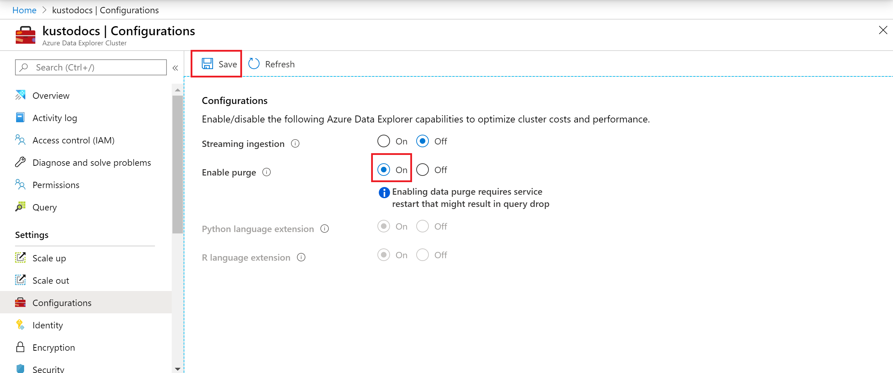
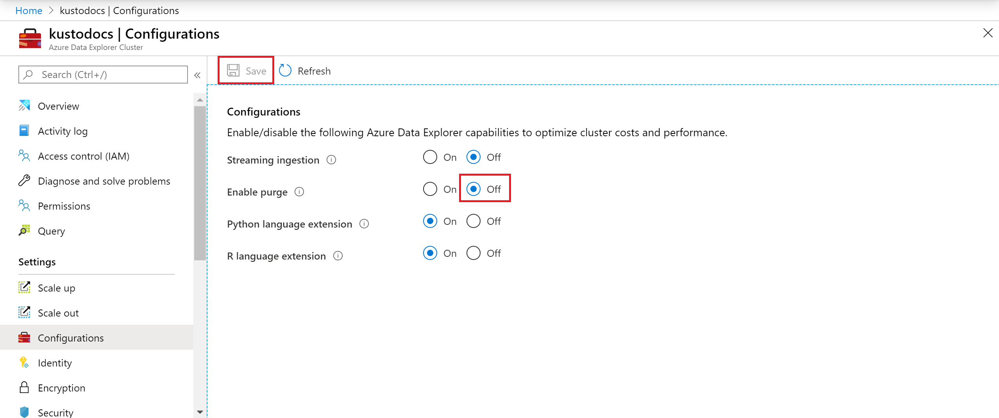

# Enable data purge on your Azure Data Explorer cluster

[!INCLUDE [gdpr-intro-sentence](includes/gdpr-intro-sentence.md)]

Azure Data Explorer supports the ability to delete individual records. Data deletion through the `.purge` command protects personal data and shouldn't be used in other scenarios. It isn't designed to support frequent delete requests, or deletion of massive quantities of data, and may have a significant performance impact on the service.

Executing a `.purge` command triggers a process that can take a few days to complete. If the "density" of records on which the `predicate` is applied is large, the process will reingest all the data in the table. This process has a significant impact on performance and COGS (cost of goods sold). For more information, see [Data purge in Azure Data Explorer](kusto/concepts/data-purge.md).

## Methods of invoking purge operations

Azure Data Explorer supports both individual record deletion and purging an entire table. The `.purge` command can be [invoked in two ways](kusto/concepts/data-purge.md#purge-table-tablename-records-command) for differing usage scenarios:

* Programmatic invocation: A single step that is intended to be invoked by applications. Calling this command directly triggers the purge execution sequence.

* Human invocation: A two-step process that requires an explicit confirmation as a separate step. Invocation of the command returns a verification token, which should be provided to run the actual purge. This process reduces the risk of inadvertently deleting incorrect data. Using this option may take a long time to complete on large tables with significant cold cache data.

## Prerequisites

* If you don't have an Azure subscription, create a [free Azure account](https://azure.microsoft.com/free/) before you begin.
* Sign in to the [Azure Data Explorer web UI](https://dataexplorer.azure.com/).
* Create [an Azure Data Explorer cluster and database](create-cluster-and-database.md)

## Enable data purge on your cluster

> [!WARNING]

> * Enabling data purge requires service restart that may result in query drop.
> * Please review the [limitations](#limitations) prior to enabling data purge.

1. In the Azure portal, go to your Azure Data Explorer cluster.
1. In **Settings**, select **Configurations**.
1. In the **Configurations** pane, select **On** to enable **Enable Purge**.
1. Select **Save**.

    

## Disable data purge on your cluster

1. In the Azure portal, go to your Azure Data Explorer cluster.
1. In **Settings**, select **Configurations**.
1. In the **Configurations** pane, select **Off** to disable **Enable purge**.
1. Select **Save**.

    

## Limitations

* The purge process is final and irreversible. It isn't possible to "undo" this process or recover data that has been purged. Therefore, commands such as [undo table drop](kusto/management/undo-drop-table-command.md) can't recover purged data, and rollback of the data to a previous version can't go to "before" the latest purge.
* The `.purge` command is executed against the Data Management endpoint: *https://ingest-[YourClusterName].[Region].kusto.windows.net*. The command requires [database admin](kusto/access-control/role-based-access-control.md) permissions on the relevant databases.
* Due to the purge process performance impact, the caller is expected to modify the data schema so that minimal tables include relevant data, and batch commands per table to reduce the significant COGS impact of the purge process.
* The `predicate` parameter of the purge command is used to specify which records to purge. `Predicate` size is limited to 63 KB.

## Related content

* [Data purge in Azure Data Explorer](kusto/concepts/data-purge.md)
