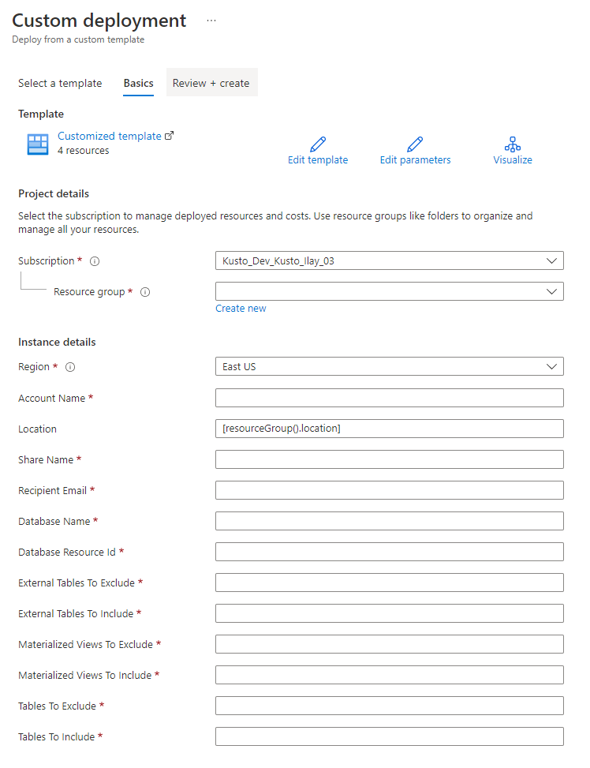

# Use Azure Data Share to share data with Azure Data Explorer

There are many traditional ways to share data, such as through file shares, FTP, e-mail, and APIs. These methods require both parties to build and maintain a data pipeline that moves data between teams and organizations. With Azure Data Explorer, you can easily and securely share your data with people in your company or external partners. Sharing occurs in near-real-time, with no need to build or maintain a data pipeline. All database changes, including schema and data, on the provider side are instantly available on the consumer side.

[](https://www.youtube.com/watch?v=Q3MJv90PegE?&autoplay=1)

Azure Data Explorer decouples storage and compute, which allows customers to run multiple compute (read-only) instances on the same underlying storage. You can attach a database as a [follower database](follower.md), which is a read-only database on a remote cluster.

## Configure data sharing

Use [Azure Data Share](/azure/data-share/) to send and manage invitations and shares across the company or with external partners and customers. Azure Data Share uses a [follower database](follower.md) to create a symbolic link between the provider and consumer's Azure Data Explorer cluster. This option provides you with a single pane to view and manage all your data shares across Azure Data Explorer clusters and other data services. Azure Data Share also enables you to share data across organizations in different Microsoft Entra tenants.

> [!Note]
> An Admin on both the clusters can directly configure the [follower database](follower.md) with various APIS. This is useful in scenarios where you need additional compute to scale out for reporting.

You can configure data sharing for the following:

* The entire database (default).
* Specific tables - [Table level sharing](#sharing-tables).

> [!Note]
> When the sharing relationship is established, Azure Data Share creates a symbolic link between the provider and consumer's Azure Data Explorer cluster. If the data provider revokes access, the symbolic link is deleted, and the shared database(s) are no longer available to the data consumer.

:::image type="content" source="media/data-share/adx-datashare-image.png" alt-text="Azure Data Explorer data sharing.":::

The data provider can share the data at the database level or at the cluster level. The cluster sharing the database is the leader cluster and the cluster receiving the share is the follower cluster. A follower cluster can follow one or more leader cluster databases. The follower cluster periodically synchronizes to check for changes. The lag time between the leader and follower varies from a few seconds to a few minutes, depending on the overall size of the metadata and the data. Data is cached on the consumer cluster and is only available for read or query operations, with an exception to override the hot caching policy and the database permissions. The queries running on the follower cluster use local cache and don't use the resources of the leader cluster.

## Prerequisites

* An Azure subscription. Create a [free Azure account](https://azure.microsoft.com/free/).
* An Azure Data Explorer cluster and database for the leader and follower. [Create a cluster and database](create-cluster-and-database.md).
* The leader database should contain data. You can [ingest data](ingest-sample-data.md) using one of the methods discussed in [ingestion overview](ingest-data-overview.md).

## Data share flow

1. The provider uses their Azure Data Share resource to share a full database or a specific table, and specify the receiver's email address.
1. Azure Data Share sends an email invite to the receiver.
1. The receiver opens the email invite and selects their Azure Data Share resource.
1. The receiver uses Azure Data Share to map the shared database or table to the appropriate cluster.

## Data provider - shares data

The data provider can share a full database or a specific table with the receiver.

### Sharing a full database

Follow the instructions in the video to create an Azure Data Share account, add a dataset, and send an invitation.
[](https://youtu.be/QmsTnr90_5o?&autoplay=1)

### Sharing tables

You can use an [Azure Resource Manager template](/azure/azure-resource-manager/management/overview) to share one or more tables via Azure Data Share.

Use the following steps to share tables:

1. Create a template and set the appropriate parameters on the dataset, table restrictions, and specify the invite recipient. Use the information in the following table to help you configure the template.

    | **Parameter** | **Description** | **Example** |
    |--|--|--|
    | *accountName* | The name of the provider's Azure Data Share account. |  |
    | *location* | The location of all the resources. The leader and the follower must be in the same location. |  |
    | *shareName* | The name of the share that will be created on the data share account. |  |
    | *recipientEmail* | The email of the Azure Data Share receiver. |  |
    | *databaseName* | The name of provider's database. |  |
    | *databaseResourceId* | The resource ID of the provider's database. |  |
    | *externalTablesToExclude* | The list of external tables to exclude. To exclude all external tables, use ["*"]. | `["ExternalTable1ToExclude", "ExternalTable2ToExclude"]` |
    | *externalTablesToInclude* | The list of external tables to include. To include all external tables starting with 'Logs', use ["Logs*"]. | `["ExternalTable1ToInclude", "ExternalTable2ToInclude"]` |
    | *materializedViewsToExclude* | The list of materialized views to exclude. To exclude all materialized views, use ["*"]. | `["Mv11ToExclude", "Mv22ToExclude"]` |
    | *materializedViewsToInclude* | The list of materialized views to include. To include all materialized views starting with 'Logs', use ["Logs*"]. | `["Mv1ToInclude", "Mv2ToInclude"]` |
    | *tablesToExclude* | The list of tables to exclude. To exclude all tables, use ["*"]. | `["table1ToExclude", "table2ToExclude"]` |
    | *tablesToInclude* | The list of tables to include. To include all tables, use ["*"]. | `["table1ToInclude", "table2ToInclude"]` |

    ```json
    {
      "$schema": "https://schema.management.azure.com/schemas/2019-04-01/deploymentTemplate.json#",
      "contentVersion": "1.0.0.0",
      "parameters": {
        "accountName": { "type": "String" },
        "location": { "defaultValue": "[resourceGroup().location]", "type": "String" },
        "shareName": { "type": "String" },
        "recipientEmail": { "type": "String" },
        "databaseName": { "type": "String" },
        "databaseResourceId": { "type": "String" },
        "externalTablesToExclude": { "type": "Array" },
        "externalTablesToInclude": { "type": "Array" },
        "materializedViewsToExclude": { "type": "Array" },
        "materializedViewsToInclude": { "type": "Array" },
        "tablesToExclude": { "type": "Array" },
        "tablesToInclude": { "type": "Array" }
      },
      "variables": {
        "invitationSuffix": "[replace(replace(parameters('recipientEmail'),'@', '_'), '.', '_')]"
      },
      "resources": [
        {
          "type": "Microsoft.DataShare/accounts",
          "apiVersion": "2021-08-01",
          "name": "[parameters('accountName')]",
          "location": "[parameters('location')]",
          "identity": {
            "type": "SystemAssigned"
          },
          "properties": {}
        },
        {
          "type": "Microsoft.DataShare/accounts/shares",
          "apiVersion": "2021-08-01",
          "name": "[concat(parameters('accountName'), '/' , parameters('shareName'))]",
          "dependsOn": [
            "[resourceId('Microsoft.DataShare/accounts', parameters('accountName'))]"
          ],
          "properties": {
            "shareKind": "InPlace"
          }
        },
        {
          "type": "Microsoft.DataShare/accounts/shares/invitations",
          "apiVersion": "2021-08-01",
          "name": "[concat(parameters('accountName'), '/',  parameters('shareName'), '/', concat(parameters('shareName'), variables('invitationSuffix')))]",
          "dependsOn": [
            "[resourceId('Microsoft.DataShare/accounts/shares', parameters('accountName'), parameters('shareName'))]",
            "[resourceId('Microsoft.DataShare/accounts', parameters('accountName'))]"
          ],
          "properties": {
            "targetEmail": "[parameters('recipientEmail')]"
          }
        },
        {
          "type": "Microsoft.DataShare/accounts/shares/dataSets",
          "apiVersion": "2021-08-01",
          "name": "[concat(parameters('accountName'), '/', parameters('shareName'), '/', parameters('databaseName'))]",
          "dependsOn": [
            "[resourceId('Microsoft.DataShare/accounts/shares', parameters('accountName'), parameters('shareName'))]",
            "[resourceId('Microsoft.DataShare/accounts', parameters('accountName'))]"
          ],
          "kind": "KustoTable",
          "properties": {
            "kustoDatabaseResourceId": "[parameters('databaseResourceId')]",
            "tableLevelSharingProperties": {
              "externalTablesToExclude": "[parameters('externalTablesToExclude')]",
              "externalTablesToInclude": "[parameters('externalTablesToInclude')]",
              "materializedViewsToExclude": "[parameters('materializedViewsToExclude')]",
              "materializedViewsToInclude": "[parameters('materializedViewsToInclude')]",
              "tablesToExclude": "[parameters('tablesToExclude')]",
              "tablesToInclude": "[parameters('tablesToInclude')]"
            }
          }
        }
      ]
    }
    ```

1. Deploy the Azure Resource Manager template using the [Azure portal](https://ms.portal.azure.com/#create/Microsoft.Template) or PowerShell.

    

## Data consumer - receive data

Follow the instructions in the video to accept the invitation, create a data share account, and map to the consumer cluster.

[](https://youtu.be/vBq6iFaCpdA?&autoplay=1)

The data consumer can now go to their Azure Data Explorer cluster to grant user permissions to the shared databases and access the data. Data ingested using queued ingestion into the source Azure Data Explorer cluster will show up on the target cluster within a few seconds to a few minutes.

## Limitations

* [Follower DB Limitations](follower.md#limitations)

## Related content

* [Azure Data Share documentation](/azure/data-share/)
* [Use follower databases](follower.md)
