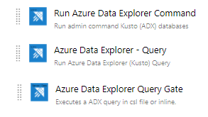
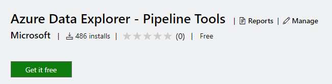
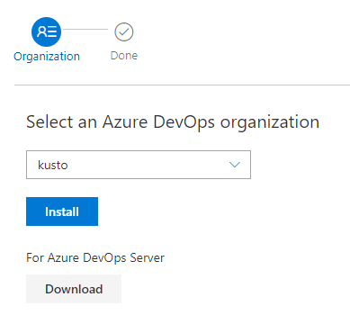
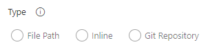
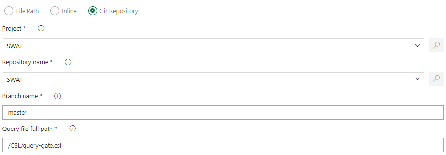
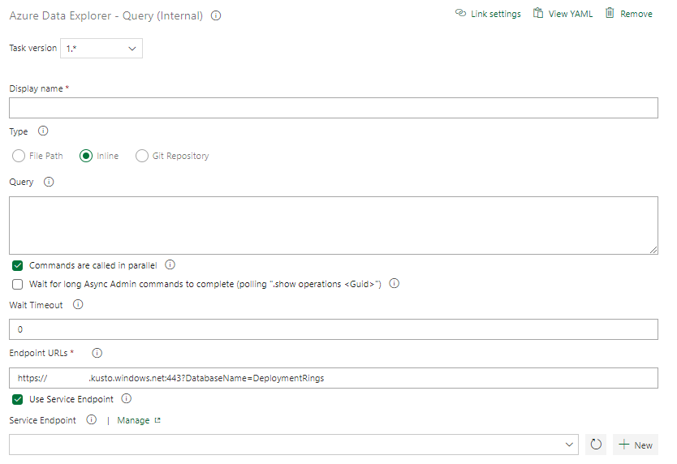
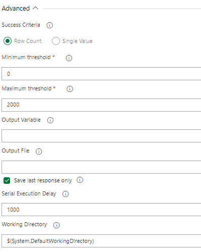
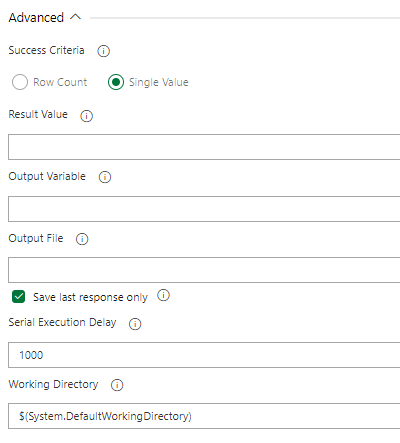

# Azure DevOps Task for Azure Data Explorer

[Azure DevOps Services](https://azure.microsoft.com/services/devops/) provides development collaboration tools such as high-performance pipelines, free private Git repositories, configurable Kanban boards, and extensive automated and continuous testing capabilities. [Azure Pipelines](https://azure.microsoft.com/services/devops/pipelines/) is an Azure DevOps capability that enables you to manage CI/CD to deploy your code with high-performance pipelines that work with any language, platform, and cloud.
[Azure Data Explorer - Pipeline Tools](https://marketplace.visualstudio.com/items?itemName=Azure-Kusto.PublishToADX) is the Azure Pipelines task that enables you to create release pipelines and deploy your database changes to your Azure Data Explorer databases. It's available for free in the [Visual Studio Marketplace](https://marketplace.visualstudio.com/).
this extension includes 3 basic tasks:

* Azure Data Explorer Command - Run Admin Commands against ADX cluster
* Azure Data Explorer Query - Run Queries against ADX cluster and parse the results
* Azure Data Explorer Query Server Gate - Agentless task to Gate releases depending on the query outcome

    

This document describes a simple example on the use of the **Azure Data Explorer - Pipeline Tools** task to deploy your schema changes to your database. For complete CI/CD pipelines, refer to [Azure DevOps documentation](/azure/devops/user-guide/what-is-azure-devops#vsts).

## Prerequisites

* If you don't have an Azure subscription, create a [free Azure account](https://azure.microsoft.com/free/) before you begin.
* Azure Data Explorer Cluster setup:
    * An [Azure Data Explorer cluster and database](create-cluster-database-portal.md).
    * Create Azure Active Directory (Azure AD) app by [provisioning an Azure AD application](./provision-azure-ad-app.md).
    * Grant access to your Azure AD App on your Azure Data Explorer database by [managing Azure Data Explorer database permissions](manage-database-permissions.md).
* Azure DevOps setup:
    * [Sign up for a free organization](/azure/devops/user-guide/sign-up-invite-teammates)
    * [Create an organization](/azure/devops/organizations/accounts/create-organization)
    * [Create a project in Azure DevOps](/azure/devops/organizations/projects/create-project)
    * [Code with Git](/azure/devops/user-guide/code-with-git)
* Extension Installation:
    * If you are the Azure DevOps instance owner, install the extension from the [Marketplace](https://marketplace.visualstudio.com/items?itemName=Azure-Kusto.PublishToADX).

        
        
    * If you are NOT the Azure DevOps instance owner, contact your [owner](https://docs.microsoft.com/en-us/azure/devops/organizations/security/lookup-organization-owner-admin?view=azure-devops&tabs=preview-page#look-up-the-organization-owner) and ask them to install it.

## Prepare your content for release

* There are three options to get the ADX commands / script to run in the task

    

    ### Get a file path directly from git source control:
    
    Create the following sample folders (*Functions*, *Policies*, *Tables*) in your Git repository. Copy the files from [here](https://github.com/Azure/azure-kusto-docs-samples/tree/master/DevOps_release_pipeline) into the respective folders as seen below and commit the changes. The sample files are provided to execute the following workflow.

    

    > [!TIP]
    > When creating your own workflow, we recommend making your code idempotent. For example, use [`.create-merge table`](kusto/management/create-merge-table-command.md) instead of [`.create table`](kusto/management/create-table-command.md), and use [`.create-or-alter`](kusto/management/create-alter-function.md) function instead of [`.create`](kusto/management/create-function.md) function.

    

    ### Get Multiple Files from Local Agent Folder (Build Sources / Release Artifacts) using search pattern 

    

    ### Write the commands inline in the task

    
 

## Create a release pipeline

1. Sign in to your [Azure DevOps organization](https://dev.azure.com/).
1. Select **Pipelines** > **Releases** from left-hand menu and select **New pipeline**.

    

1. The **New release pipeline** window opens. In the **Pipelines** tab, in the **Select a template** pane, select **Empty job**.

    

1. Select **Stage** button. In **Stage** pane, add the **Stage name**. Select **Save** to save your pipeline.

    

1. Select **Add an artifact** button. In the **Add an artifact** pane, select the repository where your code exists, fill out relevant information, and click **Add**. Select **Save** to save your pipeline.

    

1. In the **Variables** tab, select **+ Add** to create a variable for **Endpoint URL** that will be used in the task. Write the **Name** and the **Value** of the endpoint. Select **Save** to save your pipeline.

    

    To find your Endpoint_URL, the overview page of your **Azure Data Explorer Cluster** in the Azure portal contains the Azure Data Explorer cluster URI. Construct the URI in the following format `https://<Azure Data Explorer cluster URI>?DatabaseName=<DBName>`.  For example, https:\//kustodocs.westus.kusto.windows.net?DatabaseName=SampleDB

    

### Create tasks to deploy the folders

1. In the **Pipeline** tab, click on **1 job, 0 task** to add tasks.

    

1. Repeat the following steps to create command tasks to deploy files from the **Tables**, **Functions**, and **Policies** folders:

    

    1. In the **Tasks** tab, select **+** by **Agent job** and search for **Azure Data Explorer**.
    1. Under **Run Azure Data Explorer Command**, select **Add**.
    1. Select **Kusto Command** and update the task with the following information:
        * **Display name**: Name of the task. For example, **`Deploy <FOLDER>`** where `<FOLDER>` is the name of the folder for the deployment task you are creating.
        * **File path**: For each folder, specify the path as `*/<FOLDER>/*.csl` where `<FOLDER>` is the relevant folder for the task.
        * **Endpoint URL**: Specify the `EndPoint URL` variable created in previous step.
        * **Use Service Endpoint**: Select this option.
        * **Service Endpoint**: Select an existing service endpoint or create a new one (**+ New**) providing the following information in the **Add Azure Data Explorer service connection** window:

            | Setting | Suggested value |
            |--|--|
            | **Connection name** | Enter a name to identify this service endpoint |
            | **Cluster Url** | Value can be found in the overview section of your Azure Data Explorer Cluster in the Azure portal |
            | **Service Principal Id** | Enter the AAD App ID (created as prerequisite) |
            | **Service Principal App Key** | Enter the AAD App Key (created as prerequisite) |
            | **AAD tenant Id** | Enter your AAD tenant (such as microsoft.com or contoso.com) |

        Select **Allow all pipelines to use this connection** checkbox. Select **OK**.

        

1. Select **Save**. In the **Tasks** tab, verify that there are three tasks: **Deploy Tables**, **Deploy Functions**, and **Deploy Policies**.

    

### Create a Query task

If required, create a task to run a query against a cluster.
Runing Queries in a Build / Release pipeline may be used either for informational purposes or to validate a data set and have a step succeed / fail based on the query results.
The results exit criteria are either row count threshold or a single value (in the single value case the query needs to be written in a way that it returns a single value [using |project])

1. In the **Tasks** tab, select **+** by **Agent job** and search for **Azure Data Explorer**.

1. Under **Run Azure Data Explorer Query**, select **Add**.
1. Select **Kusto Query** and update the task with the following information:

    * **Display name**: Name of the task. For example, **Query cluster**.
    * **Type**: Select **Inline**.
    * **Query**: Enter the query you want to run.
    * **Endpoint URL**: Specify the `EndPoint URL` variable created earlier.
    * **Use Service Endpoint**: Select this option.
    * **Service Endpoint**: Select a service endpoint.

    

1. Under Task Results, select the task's success criteria based on the results of your query, as follows:

    * If your query returns rows, select **Row Count** and provide the criteria you require.

        

    * If your query returns a value, select **Single Value** and provide the expected result.

        

### Create a Query Server Gate task

If required, create a task to run a query against a cluster and gate release progress pending Query Results Row Count.
The Server Query Gate is an **Agentless** that runs the query directly from the Azure DevOps server.

1. In the **Tasks** tab, select **+** by **Agentless job** and search for **Azure Data Explorer**.

1. Under **Run Azure Data Explorer Query Server Gate**, select **Add**.
1. Select **Kusto Query Server Gate** and update the task with the following information:
1. Select **Server Gate Test**.

    

1. Configure the task providing the following information:

    * **Display name**: Name of the gate. For example, **ADX Query Gate**.
    * **Service Endpoint**: Select a service endpoint.
    * **Database name**: Specify the database name.
    * **Type**: Select **Inline query**.
    * **Query**: Enter the query you want to run.
    * **Maximum threshold**: Specify the maximum row count for the query's success criteria.

    

> [!NOTE]
> You should see results like the following When running the release.
>
> 

### Run the release

1. Select **+ Release** > **Create release** to create a release.

    

1. In the **Logs** tab, check the deployment status is successful.

    

You have now completed creation of a release pipeline for deployment to pre-production.
