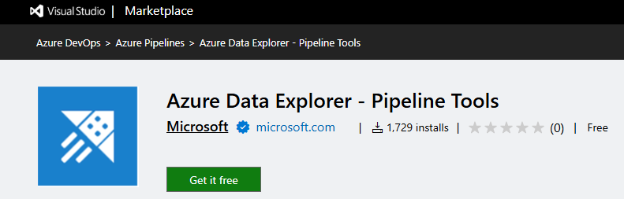
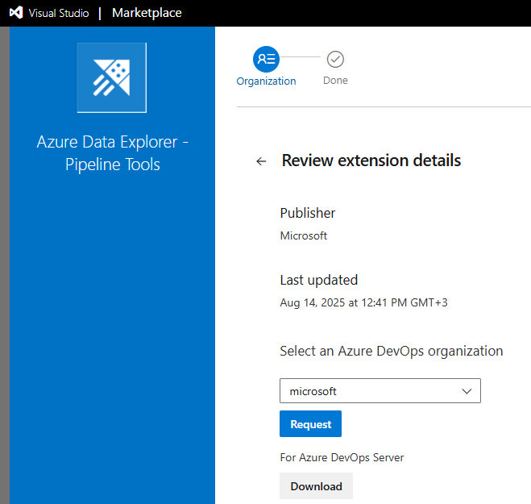
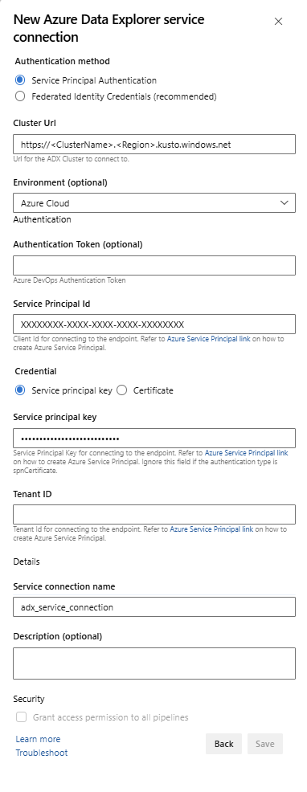

# Azure DevOps Task for Azure Data Explorer

[Azure DevOps Services](https://azure.microsoft.com/services/devops/) provides development collaboration tools such as high-performance pipelines, free private Git repositories, configurable Kanban boards, and extensive automated and continuous testing capabilities. [Azure Pipelines](https://azure.microsoft.com/services/devops/pipelines/) is an Azure DevOps capability that enables you to manage CI/CD to deploy your code with high-performance pipelines that work with any language, platform, and cloud.
[Azure Data Explorer - Pipeline Tools](https://marketplace.visualstudio.com/items?itemName=Azure-Kusto.PublishToADX) is the Azure Pipelines task that enables you to create release pipelines and deploy your database changes to your Azure Data Explorer databases. It's available for free in the [Visual Studio Marketplace](https://marketplace.visualstudio.com/).
This extension includes 3 basic tasks:

* Azure Data Explorer Command - Run Admin Commands against an Azure Data Explorer cluster
* Azure Data Explorer Query - Run Queries against an Azure Data Explorer cluster and parse the results
* Azure Data Explorer Query Server Gate - Agentless task to Gate releases depending on the query outcome

    

This document describes a simple example on the use of the **Azure Data Explorer - Pipeline Tools** task to deploy your schema changes to your database. For complete CI/CD pipelines, refer to [Azure DevOps documentation](/azure/devops/user-guide/what-is-azure-devops#vsts).

## Prerequisites

* An Azure subscription. Create a [free Azure account](https://azure.microsoft.com/free/).
* An Azure Data Explorer cluster and database. [Create a cluster and database](create-cluster-and-database.md).
* Azure Data Explorer cluster setup:
    * Create Microsoft Entra app by [provisioning a Microsoft Entra application](./provision-azure-ad-app.md).
    * Grant access to your Microsoft Entra App on your Azure Data Explorer database by [managing Azure Data Explorer database permissions](manage-database-permissions.md).
* Azure DevOps setup:
    * [Sign up for a free organization](/azure/devops/user-guide/sign-up-invite-teammates).
    * [Create an organization](/azure/devops/organizations/accounts/create-organization).
    * [Create a project in Azure DevOps](/azure/devops/organizations/projects/create-project).
    * [Code with Git](/azure/devops/user-guide/code-with-git).
* Extension Installation:
    * If you are the Azure DevOps instance owner, install the extension from the [Marketplace](https://marketplace.visualstudio.com/items?itemName=Azure-Kusto.PublishToADX).
        
        
    * If you are NOT the Azure DevOps instance owner, contact your [owner](/azure/devops/organizations/security/look-up-organization-owner) and ask them to install it.

## Prepare your content for release

The are three ways to run admin commands against cluster in a task.


* Use a search pattern to get multiple command files from a local agent folder (Build sources or Release artifacts)

    

* Write commands inline

    

* Specify a file path to get command files directly from git source control (recommended)

    

    Create the following sample folders (*Functions*, *Policies*, *Tables*) in your Git repository. Copy the files from [here](https://github.com/Azure/azure-kusto-docs-samples/tree/master/DevOps_release_pipeline) into the respective folders as seen below and commit the changes. The sample files are provided to execute the following workflow.

    

    > [!TIP]
    > When creating your own workflow, we recommend making your code idempotent. For example, use [`.create-merge table`](kusto/management/create-merge-table-command.md) instead of [`.create table`](kusto/management/create-table-command.md), and use [`.create-or-alter`](kusto/management/create-alter-function.md) function instead of [`.create`](kusto/management/create-function.md) function.


## Create a release pipeline

1. Sign in to your [Azure DevOps organization](https://dev.azure.com/).
1. Select **Pipelines** > **Releases** from left-hand menu and select **New pipeline**.

    

1. The **New release pipeline** window opens. In the **Pipelines** tab, in the **Select a template** pane, select **Empty job**.

    

1. Select **Stage** button. In **Stage** pane, add the **Stage name**. Select **Save** to save your pipeline.

    

1. Select **Add an artifact** button. In the **Add an artifact** pane, select the repository where your code exists, fill out relevant information, and click **Add**. Select **Save** to save your pipeline.

    

1. In the **Variables** tab, select **+ Add** to create a variable for **Endpoint URL** that will be used in the task. Write the **Name** and the **Value** of the endpoint. Select **Save** to save your pipeline.

    

    To find your Endpoint_URL, the overview page of your **Azure Data Explorer Cluster** in the Azure portal contains the Azure Data Explorer cluster URI. Construct the URI in the following format `https://<Azure Data Explorer cluster URI>?DatabaseName=<DBName>`.  For example, https:\//kustodocs.westus.kusto.windows.net?DatabaseName=SampleDB

    

### Create tasks to deploy the folders

1. In the **Pipeline** tab, click on **1 job, 0 task** to add tasks.

    

1. Repeat the following steps to create command tasks to deploy files from the **Tables**, **Functions**, and **Policies** folders:

    

    1. In the **Tasks** tab, select **+** by **Agent job** and search for **Azure Data Explorer**.
    1. Under **Run Azure Data Explorer Command**, select **Add**.
    1. Select **Kusto Command** and update the task with the following information:
        * **Display name**: Name of the task. For example, **`Deploy <FOLDER>`** where `<FOLDER>` is the name of the folder for the deployment task you are creating.
        * **File path**: For each folder, specify the path as `*/<FOLDER>/*.csl` where `<FOLDER>` is the relevant folder for the task.
        * **Endpoint URL**: Specify the `EndPoint URL` variable created in previous step.
        * **Use Service Endpoint**: Select this option.
        * **Service Endpoint**: Select an existing service endpoint or create a new one (**+ New**) providing the following information in the **Add Azure Data Explorer service connection** window:

            | Setting | Suggested value |
            |--|--|
            | **Connection name** | Enter a name to identify this service endpoint |
            | **Cluster Url** | Value can be found in the overview section of your Azure Data Explorer Cluster in the Azure portal |
            | **Service Principal Id** | Enter the Microsoft Entra App ID (created as prerequisite) |
            | **Service Principal App Key** | Enter the Microsoft Entra App Key (created as prerequisite) |
            | **Microsoft Entra tenant ID** | Enter your Microsoft Entra tenant (such as microsoft.com or contoso.com) |

        Select **Allow all pipelines to use this connection** checkbox and then select **OK**.

        

1. Select **Save** and then in the **Tasks** tab, verify that there are three tasks: **Deploy Tables**, **Deploy Functions**, and **Deploy Policies**.

    

### Create a Query task

If required, create a task to run a query against the cluster. Running queries in a Build or Release pipeline can be used to validate a dataset and have a step succeed or fail based on the query results. The tasks success criteria can be based on a row count threshold or a single value depending on what the query returns.

1. In the **Tasks** tab, select **+** by **Agent job** and search for **Azure Data Explorer**.

1. Under **Run Azure Data Explorer Query**, select **Add**.
1. Select **Kusto Query** and update the task with the following information:

    * **Display name**: Name of the task. For example, **Query cluster**.
    * **Type**: Select **Inline**.
    * **Query**: Enter the query you want to run.
    * **Endpoint URL**: Specify the `EndPoint URL` variable created earlier.
    * **Use Service Endpoint**: Select this option.
    * **Service Endpoint**: Select a service endpoint.

    

1. Under Task Results, select the task's success criteria based on the results of your query, as follows:

    * If your query returns rows, select **Row Count** and provide the criteria you require.

        

    * If your query returns a value, select **Single Value** and provide the expected result.

        

### Create a Query Server Gate task

If required, create a task to run a query against a cluster and gate the release progress pending Query Results Row Count. The Server Query Gate task is an agentless job, meaning that the query runs directly on the Azure DevOps Server.

1. In the **Tasks** tab, select **+** by **Agentless job** and search for **Azure Data Explorer**.

1. Under **Run Azure Data Explorer Query Server Gate**, select **Add**.
1. Select **Kusto Query Server Gate** and then select **Server Gate Test**.

    

1. Configure the task providing the following information:

    * **Display name**: Name of the gate.
    * **Service Endpoint**: Select a service endpoint.
    * **Database name**: Specify the database name.
    * **Type**: Select **Inline query**.
    * **Query**: Enter the query you want to run.
    * **Maximum threshold**: Specify the maximum row count for the query's success criteria.

    

> [!NOTE]
> You should see results like the following When running the release.
>
> 

### Run the release

1. Select **+ Release** > **Create release** to create a release.

    

1. In the **Logs** tab, check the deployment status is successful.

    

You have now completed creation of a release pipeline for deployment to pre-production.

## Yaml Pipeline configuration

The tasks can be configured both via Azure DevOps Web UI (as shown above) and via Yaml code within the [pipeline schema](/azure/devops/pipelines/yaml-schema)

### Admin Command Sample Usage

``` 
steps:
- task: Azure-Kusto.PublishToADX.PublishToADX.PublishToADX@1
  displayName: '<Task Name>'
  inputs:
    script: '<inline Script>'
    waitForOperation: true
    kustoUrls: '$(CONNECTIONSTRING):443?DatabaseName=""'
    customAuth: true
    connectedServiceName: '<Service Endpoint Name>'
    serialDelay: 1000
  continueOnError: true
  condition: ne(variables['ProductVersion'], '') ## Custom condition Sample
```

### Query Sample Usage

``` 
steps:
- task: Azure-Kusto.PublishToADX.ADXQuery.ADXQuery@1
  displayName: '<Task Display Name>'
  inputs:
    script: |  
     let badVer=
     RunnersLogs | where Timestamp > ago(30m)
         | where EventText startswith "$$runnerresult" and Source has "ShowDiagnostics"
         | extend State = extract(@"Status='(.*)', Duration.*",1, EventText)
         | where State == "Unhealthy"
         | extend Reason = extract(@'"NotHealthyReason":"(.*)","IsAttentionRequired.*',1, EventText)
         | extend Cluster = extract(@'Kusto.(Engine|DM|CM|ArmResourceProvider).(.*).ShowDiagnostics',2, Source)
         | where Reason != "Merge success rate past 60min is < 90%"
         | where Reason != "Ingestion success rate past 5min is < 90%"
         | where Reason != "Ingestion success rate past 5min is < 90%, Merge success rate past 60min is < 90%"
         | where isnotempty(Cluster)
         | summarize max(Timestamp) by Cluster,Reason 
         | order by  max_Timestamp desc      
         | where Reason startswith "Differe"
         | summarize by Cluster
     ;   
      DimClusters | where Cluster in (badVer)
     | summarize by Cluster , CmConnectionString , ServiceConnectionString ,DeploymentRing
     | extend ServiceConnectionString = strcat("#connect ", ServiceConnectionString)
     | where DeploymentRing == "$(DeploymentRing)"
    kustoUrls: 'https://<ClusterName>.kusto.windows.net?DatabaseName=<DataBaneName>'
    customAuth: true
    connectedServiceName: '<Service Endpoint Name>'
  continueOnError: true
```
