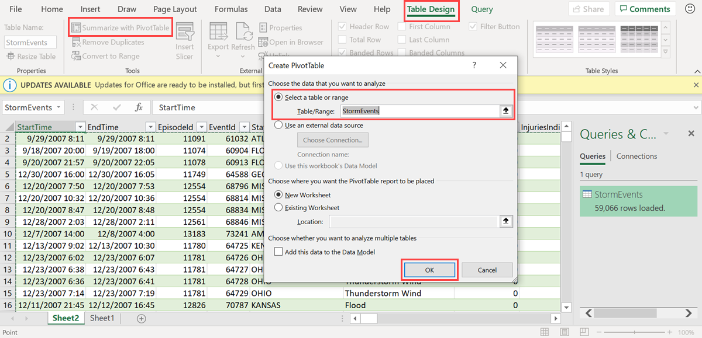
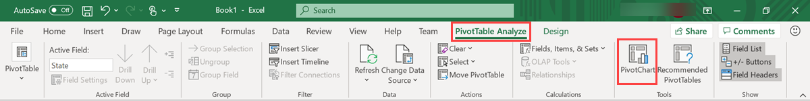

# Use Excel to visualize data from a query

This article shows you how to view your Kusto query in Excel, by exporting directly from Azure Data Explorer or importing in to Excel.

## Prerequisites

* A Microsoft account or a Microsoft Entra user identity to sign in to the [help cluster](https://dataexplorer.azure.com/clusters/help/databases/Samples).

## View data in Excel

Azure Data Explorer provides two options for using data in Excel:

1. Start in Azure Data Explorer: export the query directly.

1. Start in Excel: use the native connector.

Add Kusto query as an Excel data source to do additional calculations or visualizations on the data.

### [Start from Azure Data Explorer](#tab/azure-data-explorer)

Export the query directly from Azure Data Explorer.

1. In [Azure Data Explorer web UI](https://dataexplorer.azure.com/clusters/help/databases/Samples), run the query and check the results.

1. Select the **Export** tab and select **Open in Excel**.

    

    The query is saved as an Excel workbook in the Downloads folder.

1. Open the downloaded workbook to view your data. Enable editing and enable content if requested in the top ribbon.

### [Start from Excel](#tab/excel)

Get data from Azure Data Explorer in to Excel.

1. Open **Microsoft Excel**.

1. In the **Data** tab, select **Get Data** > **From Azure** > **From Azure Data Explorer**.

    

1. In the **Azure Data Explorer (Kusto)** window, complete the following fields and select **OK**.

    

    |Field   |Description |
    |---------|---------|
    |**Cluster**   |   Name of cluster, for example *Help* (mandatory)      |
    |**Database**     |    Name of database, for example *Samples*      |
    |**Table name or Azure Data Explorer query**    |     Name of table or Azure Data Explorer query, for example table name *StormEvents*    |

    **Advanced Options:**

     |Field   |Description |
    |---------|---------|
    |**Limit query result record number**     |     Limit the number of records loaded into excel  |
    |**Limit query result data size (bytes)**    |    Limit the data size      |
    |**Disable result-set truncation**    |         |
    |**Additional Set statements (separated by semicolons)**    |    Add `set` statements to apply to data source     |

    Repeat the previous steps to add more queries. You can rename the queries to more meaningful names.

1. If sign-in is required, a pop-up box appears. Select **Organizational account** and **Sign in**. Complete the sign-in process and then select **Connect**.

    

1. In the **Navigator** pane, navigate to the correct table. In the table preview pane, select **Transform Data** to open the **Power Query Editor** and make changes to your data, or select **Load** to load it straight to Excel.

    

    > [!TIP]
    > If **Database** and/or **Table name or Azure Data Explorer query** are already specified, the correct table preview pane will open automatically.

1. If you select **Transform Data**, the **Power Query Editor** window opens. In the window, select **Advanced Editor**.

    :::image type="content" source="media/excel/power-query-editor.png" alt-text="Power query editor window.":::

    In the **Advanced Editor** window, you can edit the query and select **Done** to keep your changes.

    :::image type="content" source="media/excel/advanced-editor-query.png" alt-text="Advanced editor query":::

1. Select the **Close & Load** button to get your data into Excel.

    :::image type="content" source="media/excel/close-and-load.png" alt-text="Select close and load.":::

1. Select the **Refresh** button under the **Table Design** tab to refresh the query.

    

---

## Analyze and visualize data in Excel

Once the data loads to excel and is available in your Excel sheet, you can analyze, summarize, and visualize the data by creating relationships and visuals.

1. In the **Table Design** tab, select **Summarize with PivotTable**. In the **Create PivotTable** window, select the relevant table, and select **OK**.

    

1. In the **PivotTable Fields** pane, select the relevant table columns to create summary tables. In the following example,  **EventId** and **State** are selected.

    

1. In the **PivotTable Analyze** tab, select **PivotChart** to create visuals based on the table.

    

1. In the following example, use **Event Id**, **StartTime**, and **EventType** to view additional information about the weather events.

    

1. Create full dashboards to monitor your data.

## Related content

To learn about other ways to visualize your data, see [Visualization integrations overview](integrate-visualize-overview.md).
