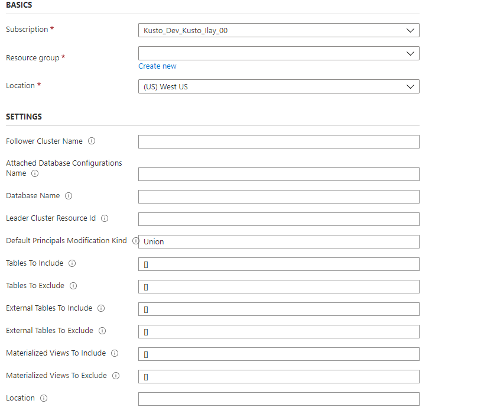

# Use follower databases

The **follower database** feature allows you to attach a database located in a different cluster to your Azure Data Explorer cluster. The **follower database** is attached in *read-only* mode, making it possible to view the data and run queries on the data that was ingested into the **leader database**. The follower database synchronizes changes in the leader databases. Because of the synchronization, there's a data lag of a few seconds to a few minutes in data availability. The length of the time lag depends on the overall size of the leader database metadata. The leader and follower databases use the same storage account to fetch the data. The storage is owned by the leader database. The follower database views the data without needing to ingest it. Since the attached database is a read-only database, the data, tables, and policies in the database can't be modified except for [caching policy](#configure-caching-policy), [principals](#manage-principals), and [permissions](#manage-permissions). Attached databases can't be deleted. They must be detached by the leader or follower and only then they can be deleted.

Attaching a database to a different cluster using the follower capability is used as the infrastructure to share data between organizations and teams. The feature is useful to segregate compute resources to protect a production environment from non-production use cases. Follower can also be used to associate the cost of Azure Data Explorer cluster to the party that runs queries on the data.

> For code samples based on previous SDK versions, see the [archived article](/previous-versions/azure/data-explorer/follower).

## Which databases are followed?

* A cluster can follow one database, several databases, or all databases of a leader cluster.
* A single cluster can follow databases from multiple leader clusters.
* A cluster can contain both follower databases and leader databases.

## Prerequisites

* An Azure subscription. Create a [free Azure account](https://azure.microsoft.com/free/).
* An Azure Data Explorer cluster and database for the leader and follower. [Create a cluster and database](create-cluster-and-database.md).
* The leader database should contain data. You can [ingest data](ingest-sample-data.md) using one of the methods discussed in [ingestion overview](ingest-data-overview.md).

## Attach a database

There are various methods you can use to attach a database. In this article, we discuss attaching a database using C#, Python, PowerShell, or an Azure Resource Manager template.
To attach a database, you must have user, group, service principal, or managed identity with at least contributor role on the leader cluster and the follower cluster. Add or remove role assignments using [Azure portal](/azure/role-based-access-control/role-assignments-portal), [PowerShell](/azure/role-based-access-control/role-assignments-powershell), [Azure CLI](/azure/role-based-access-control/role-assignments-cli), and [ARM template](/azure/role-based-access-control/role-assignments-template). Learn more about [Azure role-based access control (Azure RBAC)](/azure/role-based-access-control/overview) and the [different roles](/azure/role-based-access-control/rbac-and-directory-admin-roles).

### Table level sharing

When attaching the database all tables, external tables and materialized views are followed as well. You can share specific tables/external tables/materialized views by configuring the '*TableLevelSharingProperties*'.

'*TableLevelSharingProperties*' contains eight arrays of strings: `tablesToInclude`, `tablesToExclude`, `externalTablesToInclude`, `externalTablesToExclude`, `materializedViewsToInclude`, `materializedViewsToExclude`, `functionsToInclude`, and `functionsToExclude`. The maximum number of entries in all arrays together is 100.

> [!NOTE]
> Table level sharing is not supported when using '*' all databases notation.

> [!NOTE]
> When materialized views are included, their source tables are included as well.

#### Examples

1. Include all tables. No '*' is needed, since all tables are followed by default:

    ```kusto
    tablesToInclude = []
    ```

1. Include all tables with names that start with "Logs":

    ```kusto
    tablesToInclude = ["Logs*"]
    ```

1. Exclude all external tables:

    ```kusto
    externalTablesToExclude = ["*"]
    ```

1. Exclude all materialized views:

    ```kusto
    materializedViewsToExclude=["*"]
    ```

### Database name override

You can optionally make the database name in the follower cluster different from the leader cluster. For example, you may want to attach the same database name from multiple leader clusters to a follower cluster. To specify a different database name, configure the '*DatabaseNameOverride*' or '*DatabaseNamePrefix*' property.

## [C#](#tab/csharp)

### Attach a database using C\#

### Required NuGet packages

* Install [Azure.ResourceManager.Kusto](https://www.nuget.org/packages/Azure.ResourceManager.Kusto/).
* Install [Azure.Identity for authentication](https://www.nuget.org/packages/Azure.Identity/).

### C\# example

```csharp
var tenantId = "xxxxxxxx-xxxxx-xxxx-xxxx-xxxxxxxxx"; //Directory (tenant) ID
var clientId = "xxxxxxxx-xxxxx-xxxx-xxxx-xxxxxxxxx"; //Application ID
var clientSecret = "PlaceholderClientSecret"; //Client Secret
var followerSubscriptionId = "xxxxxxxx-xxxxx-xxxx-xxxx-xxxxxxxxx";
var credentials = new ClientSecretCredential(tenantId, clientId, clientSecret);
var resourceManagementClient = new ArmClient(credentials, followerSubscriptionId);
var followerResourceGroupName = "followerResourceGroup";
var followerClusterName = "follower";
var subscription = await resourceManagementClient.GetDefaultSubscriptionAsync();
var resourceGroup = (await subscription.GetResourceGroupAsync(followerResourceGroupName)).Value;
var cluster = (await resourceGroup.GetKustoClusterAsync(followerClusterName)).Value;
var attachedDatabaseConfigurations = cluster.GetKustoAttachedDatabaseConfigurations();
var attachedDatabaseConfigurationName = "attachedDatabaseConfiguration"
var leaderSubscriptionId = "xxxxxxxx-xxxxx-xxxx-xxxx-xxxxxxxxx";
var leaderResourceGroup = "leaderResourceGroup";
var leaderClusterName = "leader";
var attachedDatabaseConfigurationData = new KustoAttachedDatabaseConfigurationData
{
    ClusterResourceId = new ResourceIdentifier($"/subscriptions/{leaderSubscriptionId}/resourceGroups/{leaderResourceGroup}/providers/Microsoft.Kusto/Clusters/{leaderClusterName}"),
    DatabaseName = "<databaseName>", // Can be specific database name or * for all databases
    DefaultPrincipalsModificationKind = KustoDatabaseDefaultPrincipalsModificationKind.Union,
    Location = AzureLocation.NorthCentralUS
};
// Table level sharing properties are not supported when using '*' all databases notation.
if (attachedDatabaseConfigurationData.DatabaseName != "*")
{
    // Set up the table level sharing properties - the following is just an example.
    attachedDatabaseConfigurationData.TableLevelSharingProperties = new KustoDatabaseTableLevelSharingProperties();
    attachedDatabaseConfigurationData.TableLevelSharingProperties.TablesToInclude.Add("table1");
    attachedDatabaseConfigurationData.TableLevelSharingProperties.TablesToExclude.Add("table2");
    attachedDatabaseConfigurationData.TableLevelSharingProperties.ExternalTablesToExclude.Add("exTable1");
    attachedDatabaseConfigurationData.TableLevelSharingProperties.ExternalTablesToInclude.Add("exTable2");
    attachedDatabaseConfigurationData.TableLevelSharingProperties.MaterializedViewsToInclude.Add("matTable1");
    attachedDatabaseConfigurationData.TableLevelSharingProperties.MaterializedViewsToExclude.Add("matTable2");
    attachedDatabaseConfigurationData.TableLevelSharingProperties.FunctionsToInclude.Add("func1");
    attachedDatabaseConfigurationData.TableLevelSharingProperties.FunctionsToExclude.Add("func2");
}
await attachedDatabaseConfigurations.CreateOrUpdateAsync(WaitUntil.Completed, attachedDatabaseConfigurationName, attachedDatabaseConfigurationData);
```

## [Python](#tab/python)

### Attach a database using Python

### Prerequisite modules

```python
pip install azure-common
pip install azure-mgmt-kusto
```

### Python example

```python
from azure.mgmt.kusto import KustoManagementClient
from azure.mgmt.kusto.models import AttachedDatabaseConfiguration
from azure.common.credentials import ServicePrincipalCredentials
import datetime

#Directory (tenant) ID
tenant_id = "xxxxxxxx-xxxxx-xxxx-xxxx-xxxxxxxxx"
#Application ID
client_id = "xxxxxxxx-xxxxx-xxxx-xxxx-xxxxxxxxx"
#Client Secret
client_secret = "xxxxxxxxxxxxxx"
follower_subscription_id = "xxxxxxxx-xxxxx-xxxx-xxxx-xxxxxxxxx"
leader_subscription_id = "xxxxxxxx-xxxxx-xxxx-xxxx-xxxxxxxxx"
credentials = ServicePrincipalCredentials(
        client_id=client_id,
        secret=client_secret,
        tenant=tenant_id
    )
kusto_management_client = KustoManagementClient(credentials, follower_subscription_id)

follower_resource_group_name = "followerResourceGroup"
leader_resource_group_name = "leaderResourceGroup"
follower_cluster_name = "follower"
leader_cluster_name = "leader"
attached_database_Configuration_name = "uniqueNameForAttachedDatabaseConfiguration"
database_name  = "db" # Can be specific database name or * for all databases
default_principals_modification_kind  = "Union"
location = "North Central US"
cluster_resource_id = "/subscriptions/" + leader_subscription_id + "/resourceGroups/" + leader_resource_group_name + "/providers/Microsoft.Kusto/Clusters/" + leader_cluster_name
table_level_sharing_properties = None
if (database_name != "*"):
    #Set up the table level sharing properties - the following is just an example.
    tables_to_include = ["table1", "table2", "table3"]
    external_tables_to_exclude =  ["Logs*"]
    table_level_sharing_properties = TableLevelSharingProperties(tables_to_include = tables_to_include, external_tables_to_exclude = external_tables_to_exclude)


attached_database_configuration_properties = AttachedDatabaseConfiguration(cluster_resource_id = cluster_resource_id, database_name = database_name, default_principals_modification_kind = default_principals_modification_kind, location = location, table_level_sharing_properties = table_level_sharing_properties)

#Returns an instance of LROPoller, see https://learn.microsoft.com/python/api/msrest/msrest.polling.lropoller?view=azure-python
poller = kusto_management_client.attached_database_configurations.create_or_update(follower_resource_group_name, follower_cluster_name, attached_database_Configuration_name, attached_database_configuration_properties)
```

## [PowerShell](#tab/azure-powershell)

### Attach a database using PowerShell

### Prerequisite module

```powershell
Install : Az.Kusto
```

### PowerShell example

```Powershell
$FollowerClustername = 'follower'
$FollowerClusterSubscriptionID = 'xxxxxxxx-xxxxx-xxxx-xxxx-xxxxxxxxx'
$FollowerResourceGroupName = 'followerResourceGroup'
$DatabaseName = "db"  ## Can be a specific database name in a leader cluster or * for all databases
$LeaderClustername = 'leader'
$LeaderClusterSubscriptionID = 'xxxxxxxx-xxxxx-xxxx-xxxx-xxxxxxxxx'
$LeaderClusterResourceGroup = 'leaderResourceGroup'
$DefaultPrincipalsModificationKind = 'Union'
##Construct the LeaderClusterResourceId and Location
$getleadercluster = Get-AzKustoCluster -Name $LeaderClustername -ResourceGroupName $LeaderClusterResourceGroup -SubscriptionId $LeaderClusterSubscriptionID -ErrorAction Stop
$LeaderClusterResourceid = $getleadercluster.Id
$Location = $getleadercluster.Location
## Handle the config name if all databases need to be followed. The config name can be given any unique name
if($DatabaseName -eq '*')  {
        $configname = $FollowerClustername + 'config'  
       }
else {
        $configname = $DatabaseName
     }
##Table level sharing is not supported when using '*' all databases notation. If you use the all database notation please remove all table level sharing lines from the powershell command.
New-AzKustoAttachedDatabaseConfiguration -ClusterName $FollowerClustername `
    -Name $configname `
    -ResourceGroupName $FollowerResourceGroupName `
    -SubscriptionId $FollowerClusterSubscriptionID `
    -DatabaseName $DatabaseName `
    -ClusterResourceId $LeaderClusterResourceid `
    -DefaultPrincipalsModificationKind $DefaultPrincipalsModificationKind `
    -Location $Location `
    -TableLevelSharingPropertyTablesToInclude "table1", "table2", "table3" `
    -TableLevelSharingPropertyExternalTablesToExclude "Logs*" `
    -ErrorAction Stop
```

## [Resource Manager Template](#tab/azure-resource-manager)

### Attach a database using an Azure Resource Manager template

You can use an [Azure Resource Manager template](/azure/azure-resource-manager/management/overview) to attach a database to an existing cluster.

Use the following steps to attach a database:

1. Create a template using the information in the following table to help you configure it.

    | **Parameter** | **Description** | **Example** |
    |--|--|--|
    | *followerClusterName* | The name of the follower cluster; where the template will be deployed. |  |
    | *attachedDatabaseConfigurationsName* | The name of the attached database configurations object. The name can be any string that is unique at the cluster level. |  |
    | *databaseName* | The name of the database to be followed. To follow all the leader's databases, use '*'. |  |
    | *leaderClusterResourceId* | The resource ID of the leader cluster. |  |
    | *defaultPrincipalsModificationKind* | The default principal modification kind. | Can be `Union`, `Replace`, or `None`. For more information about the default principal modification kind, see [principal modification kind management command](kusto/management/cluster-follower.md#alter-follower-database-principals-modification-kind). |
    | *tablesToInclude* | The list of tables to include. To include all tables starting with 'Logs', use ["Logs*"]. | `["table1ToInclude", "table2ToInclude"]` |
    | *tablesToExclude* | The list of tables to exclude. To exclude all tables, use ["*"]. | `["table1ToExclude", "table2ToExclude"]` |
    | *externalTablesToInclude* | The list of tables to include. To include all external tables starting with 'Logs', use ["Logs*"]. | `["ExternalTable1ToInclude", "ExternalTable2ToInclude"]` |
    | *externalTablesToExclude* | The list of tables to exclude. To exclude all external tables, use ["*"]. | `["ExternalTable1ToExclude", "ExternalTable2ToExclude"]` |
    | *materializedViewsToInclude* | The list of materialized views to include. To include all materialized views starting with 'Logs', use ["Logs*"]. | `["Mv1ToInclude", "Mv2ToInclude"]` |
    | *materializedViewsToExclude* | The list of materialized views to exclude. To exclude all materialized views, use ["*"]. | `["Mv11ToExclude", "Mv22ToExclude"]` |
    | *functionsToInclude* | The list of functions to include. | `["FunctionToInclude"]` |
    | *functionsToExclude* | The list of functions to exclude. | `["FunctionToExclude"]` |
    | *location* | The location of all the resources. The leader and the follower must be in the same location. |  |

    ```json
    {
        "$schema": "https://schema.management.azure.com/schemas/2015-01-01/deploymentTemplate.json#",
        "contentVersion": "1.0.0.0",
        "parameters": {
            "followerClusterName": {
                "type": "string",
                "defaultValue": "",
                "metadata": {
                    "description": "Name of the cluster to which the database will be attached."
                }
            },
            "attachedDatabaseConfigurationsName": {
                "type": "string",
                "defaultValue": "",
                "metadata": {
                    "description": "Name of the attached database configurations to create."
                }
            },
            "databaseName": {
                "type": "string",
                "defaultValue": "",
                "metadata": {
                    "description": "The name of the database to follow. You can follow all databases by using '*'."
                }
            },
            "leaderClusterResourceId": {
                "type": "string",
                "defaultValue": "",
                "metadata": {
                    "description": "The resource ID of the leader cluster."
                }
            },
            "defaultPrincipalsModificationKind": {
                "type": "string",
                "defaultValue": "Union",
                "metadata": {
                    "description": "The default principal modification kind."
                }
            },
            "tablesToInclude": {
                "type": "array",
                "defaultValue": [],
                "metadata": {
                    "description": "The list of tables to include. Not supported when following all databases."
                }
            },
            "tablesToExclude": {
                "type": "array",
                "defaultValue": [],
                "metadata": {
                    "description": "The list of tables to exclude. Not supported when following all databases."
                }
            },
            "externalTablesToInclude": {
                "type": "array",
                "defaultValue": [],
                "metadata": {
                    "description": "The list of external tables to include. Not supported when following all databases."
                }
            },
            "externalTablesToExclude": {
                "type": "array",
                "defaultValue": [],
                "metadata": {
                    "description": "The list of external tables to exclude. Not supported when following all databases."
                }
            },
            "materializedViewsToInclude": {
                "type": "array",
                "defaultValue": [],
                "metadata": {
                    "description": "The list of materialized views to include. Not supported when following all databases."
                }
            },
            "materializedViewsToExclude": {
                "type": "array",
                "defaultValue": [],
                "metadata": {
                    "description": "The list of materialized views to exclude. Not supported when following all databases."
                }
            },
            "functionsToInclude": {
                "type": "array",
                "defaultValue": [],
                "metadata": {
                    "description": "The list of functions to include."
                }
            },
            "functionsToExclude": {
                "type": "array",
                "defaultValue": [],
                "metadata": {
                    "description": "The list of functions to exclude."
                }
            },
            "location": {
                "type": "string",
                "defaultValue": "",
                "metadata": {
                    "description": "Location for all resources."
                }
            }
        },
        "variables": {},
        "resources": [
            {
                "name": "[concat(parameters('followerClusterName'), '/', parameters('attachedDatabaseConfigurationsName'))]",
                "type": "Microsoft.Kusto/clusters/attachedDatabaseConfigurations",
                "apiVersion": "2021-01-01",
                "location": "[parameters('location')]",
                "properties": {
                    "databaseName": "[parameters('databaseName')]",
                    "clusterResourceId": "[parameters('leaderClusterResourceId')]",
                    "defaultPrincipalsModificationKind": "[parameters('defaultPrincipalsModificationKind')]",
                    "tableLevelSharingProperties":{
                        "tablesToInclude": "[parameters('tablesToInclude')]",
                        "tablesToExclude": "[parameters('tablesToExclude')]",
                        "externalTablesToInclude": "[parameters('externalTablesToInclude')]",
                        "externalTablesToExclude": "[parameters('externalTablesToExclude')]",
                        "materializedViewsToInclude": "[parameters('materializedViewsToInclude')]",
                        "materializedViewsToExclude": "[parameters('materializedViewsToExclude')]",
                        "functionsToInclude": "[parameters('functionsToInclude')]",
                        "functionsToExclude": "[parameters('functionsToExclude')]"
                    }
                }
            }
        ]
    }
    ```

1. Deploy the Azure Resource Manager template using the [Azure portal](https://ms.portal.azure.com/#create/Microsoft.Template) or PowerShell.

    

---

## Verify that the database was successfully attached

To verify that the database was successfully attached, find your attached databases in the [Azure portal](https://portal.azure.com). You can verify the databases were successfully attached in either the [follower](#check-your-follower-cluster) or [leader](#check-your-leader-cluster) clusters.

### Check your follower cluster

1. Browse to the follower cluster and select **Databases**.
1. In the database list, search for new read-only databases.

    :::image type="content" source="media/follower/read-only-follower-database.png" lightbox="media/follower/read-only-follower-database.png" alt-text="Screenshot of read-only follower databases in portal.":::

    You can also view this list in the database overview page:

    :::image type="content" source="media/follower/read-only-follower-database-overview.png" alt-text="Screenshot of databases overview page with list of follower clusters.":::    

### Check your leader cluster

1. Browse to the leader cluster and select **Databases**
1. Check that the relevant databases are marked as **SHARED WITH OTHERS** > **Yes**
1. Toggle the relationship link to view details.

    :::image type="content" source="media/follower/read-write-databases-shared.png" alt-text="Screenshot of databases shared with others to check leader cluster.":::

    You can also view this in the database overview page:

   :::image type="content" source="media/follower/read-write-databases-shared-overview.png" alt-text="Screenshot of overview with list of databases shared with others.":::

## Detach the follower database

> [!NOTE]
> To detach a database from the follower or leader side, you must have user, group, service principal, or managed identity with at least contributor role on the cluster from which you are detaching the database. In the example below, we use service principal.

## [C#](#tab/csharp)

### Detach the attached follower database from the follower cluster using C#**

The follower cluster can detach any attached follower database as follows:

```csharp
var tenantId = "xxxxxxxx-xxxxx-xxxx-xxxx-xxxxxxxxx"; //Directory (tenant) ID
var clientId = "xxxxxxxx-xxxxx-xxxx-xxxx-xxxxxxxxx"; //Application ID
var clientSecret = "PlaceholderClientSecret"; //Client Secret
var followerSubscriptionId = "xxxxxxxx-xxxxx-xxxx-xxxx-xxxxxxxxx";
var credentials = new ClientSecretCredential(tenantId, clientId, clientSecret);
var resourceManagementClient = new ArmClient(credentials, followerSubscriptionId);
var followerResourceGroupName = "testrg";
//The cluster and database attached database configuration are created as part of the prerequisites
var followerClusterName = "follower";
var attachedDatabaseConfigurationsName = "attachedDatabaseConfiguration";
var subscription = await resourceManagementClient.GetDefaultSubscriptionAsync();
var resourceGroup = (await subscription.GetResourceGroupAsync(followerResourceGroupName)).Value;
var cluster = (await resourceGroup.GetKustoClusterAsync(followerClusterName)).Value;
var attachedDatabaseConfiguration = (await cluster.GetKustoAttachedDatabaseConfigurationAsync(attachedDatabaseConfigurationsName)).Value;
await attachedDatabaseConfiguration.DeleteAsync(WaitUntil.Completed);
```

### Detach the attached follower database from the leader cluster using C\#

The leader cluster can detach any attached database as follows:

```csharp
var tenantId = "xxxxxxxx-xxxxx-xxxx-xxxx-xxxxxxxxx"; //Directory (tenant) ID
var clientId = "xxxxxxxx-xxxxx-xxxx-xxxx-xxxxxxxxx"; //Application ID
var clientSecret = "PlaceholderClientSecret"; //Client Secret
var leaderSubscriptionId = "xxxxxxxx-xxxxx-xxxx-xxxx-xxxxxxxxx";
var credentials = new ClientSecretCredential(tenantId, clientId, clientSecret);
var resourceManagementClient = new ArmClient(credentials, leaderSubscriptionId);
var leaderResourceGroupName = "testrg";
var leaderClusterName = "leader";
var subscription = await resourceManagementClient.GetDefaultSubscriptionAsync();
var resourceGroup = (await subscription.GetResourceGroupAsync(leaderResourceGroupName)).Value;
var cluster = (await resourceGroup.GetKustoClusterAsync(leaderClusterName)).Value;
var followerSubscriptionId = "xxxxxxxx-xxxxx-xxxx-xxxx-xxxxxxxxx";
var followerResourceGroupName = "followerResourceGroup";
//The cluster and attached database configuration that are created as part of the Prerequisites
var followerClusterName = "follower";
var attachedDatabaseConfigurationsName = "attachedDatabaseConfiguration";
var followerDatabaseDefinition = new KustoFollowerDatabaseDefinition(
    clusterResourceId: new ResourceIdentifier($"/subscriptions/{followerSubscriptionId}/resourceGroups/{followerResourceGroupName}/providers/Microsoft.Kusto/Clusters/{followerClusterName}"),
    attachedDatabaseConfigurationName: attachedDatabaseConfigurationsName
);
await cluster.DetachFollowerDatabasesAsync(WaitUntil.Completed, followerDatabaseDefinition);
```

## [Python](#tab/python)

### Detach the attached follower database from the follower cluster using Python

The follower cluster can detach any attached database as follows:

```python
from azure.mgmt.kusto import KustoManagementClient
from azure.common.credentials import ServicePrincipalCredentials
import datetime

#Directory (tenant) ID
tenant_id = "xxxxxxxx-xxxxx-xxxx-xxxx-xxxxxxxxx"
#Application ID
client_id = "xxxxxxxx-xxxxx-xxxx-xxxx-xxxxxxxxx"
#Client Secret
client_secret = "xxxxxxxxxxxxxx"
follower_subscription_id = "xxxxxxxx-xxxxx-xxxx-xxxx-xxxxxxxxx"
credentials = ServicePrincipalCredentials(
        client_id=client_id,
        secret=client_secret,
        tenant=tenant_id
    )
kusto_management_client = KustoManagementClient(credentials, follower_subscription_id)

follower_resource_group_name = "followerResourceGroup"
follower_cluster_name = "follower"
attached_database_configurationName = "uniqueName"

#Returns an instance of LROPoller, see https://learn.microsoft.com/python/api/msrest/msrest.polling.lropoller?view=azure-python
poller = kusto_management_client.attached_database_configurations.delete(follower_resource_group_name, follower_cluster_name, attached_database_configurationName)
```

### Detach the attached follower database from the leader cluster using Python

The leader cluster can detach any attached database as follows:

```python

from azure.mgmt.kusto import KustoManagementClient
from azure.mgmt.kusto.models import FollowerDatabaseDefinition
from azure.common.credentials import ServicePrincipalCredentials
import datetime

#Directory (tenant) ID
tenant_id = "xxxxxxxx-xxxxx-xxxx-xxxx-xxxxxxxxx"
#Application ID
client_id = "xxxxxxxx-xxxxx-xxxx-xxxx-xxxxxxxxx"
#Client Secret
client_secret = "xxxxxxxxxxxxxx"
follower_subscription_id = "xxxxxxxx-xxxxx-xxxx-xxxx-xxxxxxxxx"
leader_subscription_id = "xxxxxxxx-xxxxx-xxxx-xxxx-xxxxxxxxx"
credentials = ServicePrincipalCredentials(
        client_id=client_id,
        secret=client_secret,
        tenant=tenant_id
    )
kusto_management_client = KustoManagementClient(credentials, follower_subscription_id)

follower_resource_group_name = "followerResourceGroup"
leader_resource_group_name = "leaderResourceGroup"
follower_cluster_name = "follower"
leader_cluster_name = "leader"
attached_database_configuration_name = "uniqueName"
location = "North Central US"
cluster_resource_id = "/subscriptions/" + follower_subscription_id + "/resourceGroups/" + follower_resource_group_name + "/providers/Microsoft.Kusto/Clusters/" + follower_cluster_name

#Returns an instance of LROPoller, see https://learn.microsoft.com/python/api/msrest/msrest.polling.lropoller?view=azure-python
poller = kusto_management_client.clusters.detach_follower_databases(resource_group_name = leader_resource_group_name, cluster_name = leader_cluster_name, cluster_resource_id = cluster_resource_id, attached_database_configuration_name = attached_database_configuration_name)
```

## [PowerShell](#tab/azure-powershell)

### Detach a database using PowerShell

#### Prerequisite Module

```powershell
Install : Az.Kusto
```

#### Example

```powershell
$FollowerClustername = 'follower'
$FollowerClusterSubscriptionID = 'xxxxxxxx-xxxxx-xxxx-xxxx-xxxxxxxxx'
$FollowerResourceGroupName = 'followerResourceGroup'
$DatabaseName = "sanjn"  ## Can be specific database name or * for all databases

##Construct the Configuration name
$confignameraw = (Get-AzKustoAttachedDatabaseConfiguration -ClusterName $FollowerClustername -ResourceGroupName $FollowerResourceGroupName -SubscriptionId $FollowerClusterSubscriptionID) | Where-Object {$_.DatabaseName -eq $DatabaseName }
$configname =$confignameraw.Name.Split("/")[1]

Remove-AzKustoAttachedDatabaseConfiguration -ClusterName $FollowerClustername -Name $configname -ResourceGroupName $FollowerResourceGroupName -SubscriptionId $FollowerClusterSubscriptionID
```

## [Resource Manager Template](#tab/azure-resource-manager)

[Detach the follower database](#detach-the-follower-database) using C#, Python or PowerShell.

---

## Manage principals, permissions, and caching policy

### Manage principals

When attaching a database, specify the **"default principals modification kind"**. The default is to combine the override authorized principals with the leader database collection of [authorized principals](kusto/access-control/index.md#authorization)

|**Kind** |**Description**  |
|---------|---------|
|**Union**     |   The attached database principals will always include the original database principals plus other new principals added to the follower database.      |
|**Replace**   |    No inheritance of principals from the original database. New principals must be created for the attached database.     |
|**None**   |   The attached database principals include only the principals of the original database with no other principals.      |

For more information about using management commands to configure the authorized principals, see [Management commands for managing a follower cluster](kusto/management/cluster-follower.md).

### Manage permissions

Managing read-only database permission is the same as for all database types. To assign permissions, see [Manage database permissions in the Azure portal](manage-database-permissions.md) or use management commands to [Manage database security roles](kusto/management/manage-database-security-roles.md).

### Configure caching policy

The follower database administrator can modify the [caching policy](./kusto/management/show-table-cache-policy-command.md) of the attached database or any of its tables on the hosting cluster. The default is to combine the source database in the leader cluster database and table-level caching policies with the policies defined in the database and table-level override policies. You can, for example, have a 30 day caching policy on the leader database for running monthly reporting and a three day caching policy on the follower database to query only the recent data for troubleshooting. For more information about using management commands to configure the caching policy on the follower database or table, see [Management commands for managing a follower cluster](kusto/management/cluster-follower.md).

## Notes

* If there are conflicts between databases of leader/follower clusters, when all databases are followed by the follower cluster, they're resolved as follows:
  * A database named *DB* created on the follower cluster takes precedence over a database with the same name that was created on the leader cluster. That's why database *DB* in the follower cluster needs to be removed or renamed for the follower cluster to include the leader's database *DB*.
  * A database named *DB* followed from two or more leader clusters will be arbitrarily chosen from *one* of the leader clusters, and won't be followed more than once.
* Commands for showing [cluster activity log and history](kusto/management/systeminfo.md) run on a follower cluster will show the activity and history on the follower cluster, and their result sets won't include those results of the leader cluster or clusters.
  * For example: a `.show queries` command run on the follower cluster will only show queries run on databases followed by follower cluster, and not queries run against the same database in the leader cluster.

## Limitations

* The follower and the leader clusters must be in the same region.
* If [Streaming ingestion](ingest-data-streaming.md) is used on a database that is being followed, the follower cluster should be enabled for Streaming Ingestion to allow following of streaming ingestion data.
* Data encryption using [customer managed keys](security.md#customer-managed-keys-with-azure-key-vault) isn't supported on both leader and follower clusters.
* You can't delete a database that is attached to a different cluster before detaching it.
* You can't delete a cluster that has a database attached to a different cluster before detaching it.
* Table level sharing properties aren't supported when following all database.

## Next steps

* For information about follower cluster configuration, see [Management commands for managing a follower cluster](kusto/management/cluster-follower.md).
