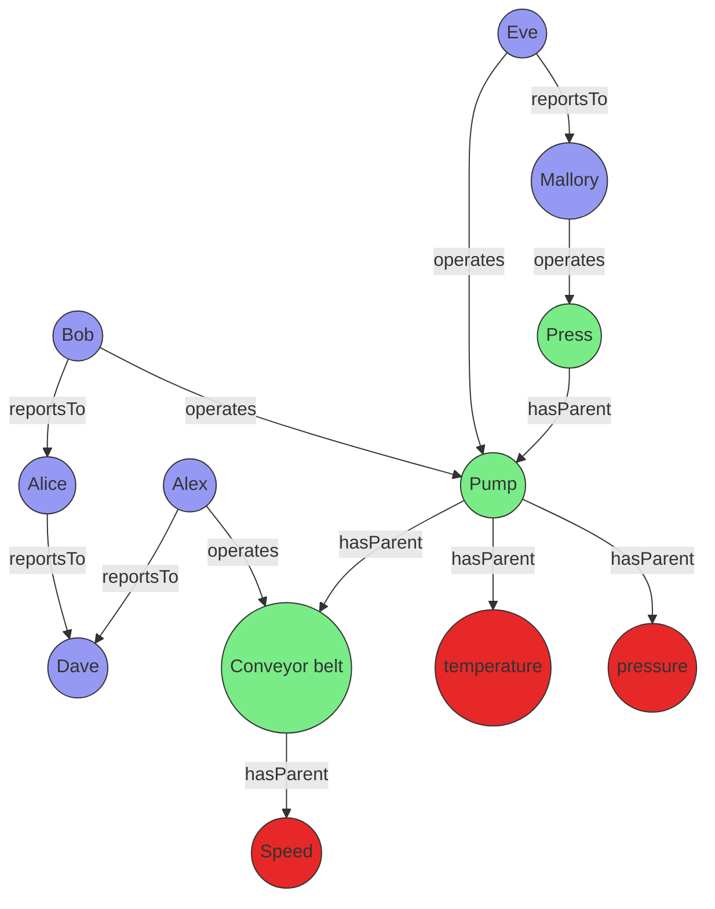

# Best practices for Kusto Query Language (KQL) graph semantics

Kusto supports two approaches for working with graphs: **transient graphs** (created in-memory for each query) and **persistent graphs** (defined as graph models and snapshots in the database). This article provides best practices for both approaches, helping you choose the right method and use KQL graph semantics efficiently and effectively. It covers graph creation, querying, schema design, and integration with other KQL features, and highlights common pitfalls to avoid.

## Approaches to graph modeling in Kusto

- **Transient graphs**: Created dynamically using the [`make-graph`](https://learn.microsoft.com/azure/data-explorer/kusto/query/make-graph-operator) operator. These graphs exist only for the duration of the query and are best for ad hoc or exploratory analysis on small to medium datasets.
- **Persistent graphs**: Defined using [graph models](graph-model-overview.md) and [graph snapshots](graph-snapshot-overview.md). These are stored in the database, support schema and versioning, and are optimized for repeated, large-scale, or collaborative analysis.

The following sections provide best practices for each approach.

## Best practices for transient graphs

Transient graphs are created in-memory for each query using the `make-graph` operator. They are ideal for ad hoc analysis, prototyping, and scenarios where the graph structure changes frequently or only a subset of the data is needed.

### Size of graph

The [make-graph operator](/kusto/query/make-graph-operator?view=azure-data-explorer&preserve-view=true) creates an in-memory representation of a graph. It consists of the graph structure itself and its properties. When making a graph, use appropriate filters, projections, and aggregations to select only the relevant nodes and edges and their properties.

The following example shows how to reduce the number of nodes and edges and their properties. In this scenario, Bob changed manager from Alice to Eve and the user only wants to see the latest state of the graph for their organization. To reduce the size of the graph, the nodes are first filtered by the organization property and then the property is removed from the graph using the [project-away operator](/kusto/query/project-away-operator?view=azure-data-explorer&preserve-view=true). The same happens for edges. Then [summarize operator](/kusto/query/summarize-operator?view=azure-data-explorer&preserve-view=true) together with [arg_max](/kusto/query/arg-max-aggregation-function?view=azure-data-explorer&preserve-view=true) is used to get the last known state of the graph.

```kusto
let allEmployees = datatable(organization: string, name:string, age:long)
[
  "R&D", "Alice", 32,
  "R&D","Bob", 31,
  "R&D","Eve", 27,
  "R&D","Mallory", 29,
  "Marketing", "Alex", 35
];
let allReports = datatable(employee:string, manager:string, modificationDate: datetime)
[
  "Bob", "Alice", datetime(2022-05-23),
  "Bob", "Eve", datetime(2023-01-01),
  "Eve", "Mallory", datetime(2022-05-23),
  "Alice", "Dave", datetime(2022-05-23)
];
let filteredEmployees =
    allEmployees
    | where organization == "R&D"
    | project-away age, organization;
let filteredReports =
    allReports
    | summarize arg_max(modificationDate, *) by employee
    | project-away modificationDate;
filteredReports
| make-graph employee --> manager with filteredEmployees on name
| graph-match (employee)-[hasManager*2..5]-(manager)
  where employee.name == "Bob"
  project employee = employee.name, topManager = manager.name
```

**Output**

| employee | topManager |
| -------- | ---------- |
| Bob      | Mallory    |

### Last known state of the graph

The [Size of graph](#size-of-graph) example demonstrated how to get the last known state of the edges of a graph by using `summarize` operator and the `arg_max` aggregation function. Obtaining the last known state is a compute-intensive operation.

Consider creating a materialized view to improve the query performance, as follows:

1. Create tables that have some notion of version as part of their model. We recommend using a `datetime` column that you can later use to create a graph time series.

    ```kusto
    .create table employees (organization: string, name:string, stateOfEmployment:string, properties:dynamic, modificationDate:datetime)

    .create table reportsTo (employee:string, manager:string, modificationDate: datetime)
    ```

1. Create a materialized view for each table and use the [arg_max aggregation](/kusto/query/arg-max-aggregation-function?view=azure-data-explorer&preserve-view=true) function to determine the *last known state* of employees and the *reportsTo* relation.

    ```kusto
    .create materialized-view employees_MV on table employees
    {
        employees
        | summarize arg_max(modificationDate, *) by name
    }

    .create materialized-view reportsTo_MV on table reportsTo
    {
        reportsTo
        | summarize arg_max(modificationDate, *) by employee
    }
    ```

1. Create two functions that ensure that only the materialized component of the materialized view is used and additional filters and projections are applied.

    ```kusto
    .create function currentEmployees () {
        materialized_view('employees_MV')
        | where stateOfEmployment == "employed"
    }

    .create function reportsTo_lastKnownState () {
        materialized_view('reportsTo_MV')
        | project-away modificationDate
    }
    ```

The resulting query using materialized makes the query faster and more efficient for larger graphs. It also enables higher concurrency and lower latency queries for the latest state of the graph. The user can still query the graph history based on the employees and *reportsTo* tables, if needed

```kusto
let filteredEmployees =
    currentEmployees
    | where organization == "R&D"
    | project-away organization;
reportsTo_lastKnownState
| make-graph employee --> manager with filteredEmployees on name
| graph-match (employee)-[hasManager*2..5]-(manager)
  where employee.name == "Bob"
  project employee = employee.name, reportingPath = hasManager.manager
```

### Graph time travel

Some scenarios require you to analyze data based on the state of a graph at a specific point in time. Graph time travel uses a combination of time filters and summarizes using the arg_max aggregation function.

The following KQL statement creates a function with a parameter that defines the interesting point in time for the graph. It returns a ready-made graph.

```kusto
.create function graph_time_travel (interestingPointInTime:datetime ) {
    let filteredEmployees =
        employees
        | where modificationDate < interestingPointInTime
        | summarize arg_max(modificationDate, *) by name;
    let filteredReports =
        reportsTo
        | where modificationDate < interestingPointInTime
        | summarize arg_max(modificationDate, *) by employee
        | project-away modificationDate;
    filteredReports
    | make-graph employee --> manager with filteredEmployees on name
}
```

With the function in place, the user can craft a query to get the top manager of Bob based on the graph in June 2022.

```kusto
graph_time_travel(datetime(2022-06-01))
| graph-match (employee)-[hasManager*2..5]-(manager)
  where employee.name == "Bob"
  project employee = employee.name, reportingPath = hasManager.manager
```

**Output**

| employee | topManager |
| -------- | ---------- |
| Bob      | Dave       |

### Dealing with multiple node and edge types

Sometimes it's required to contextualize time series data with a graph that consists of multiple node types. One way of handling this scenario is creating a general-purpose property graph that is represented by a canonical model.

Occasionally, you may need to contextualize time series data with a graph that has multiple node types. You could approach the problem by creating a general-purpose property graph that is based on a canonical model, such as the following.

- nodes
  - nodeId (string)
  - label (string)
  - properties (dynamic)
- edges
  - source (string)
  - destination (string)
  - label (string)
  - properties (dynamic)

Even though that it's possible to create a canonical property graph model using transient graphs, it's far easier to use a graph model based approach to model different node and edge types.

The following example shows how to transform the data into a canonical model and how to query it. The base tables for the nodes and edges of the graph have different schemas.

This scenario involves a factory manager who wants to find out why equipment isn't working well and who is responsible for fixing it. The manager decides to use a graph that combines the asset graph of the production floor and the maintenance staff hierarchy which changes every day.

The following mermaid diagram visualizes a typical scenario:



The data for those entities can be stored directly in your cluster or acquired using query federation to a different service. To illustrate the example, the following tabular data is created as part of the query:

```kusto
let sensors = datatable(sensorId:string, tagName:string, unitOfMeasure:string)
[
  "1", "temperature", "°C",
  "2", "pressure", "Pa",
  "3", "speed", "m/s"
];
let timeseriesData = datatable(sensorId:string, timestamp:string, value:double, anomaly: bool )
[
    "1", datetime(2023-01-23 10:00:00), 32, false,
    "1", datetime(2023-01-24 10:00:00), 400, true,
    "3", datetime(2023-01-24 09:00:00), 9, false
];
let employees = datatable(name:string, age:long)
[
  "Alice", 32,
  "Bob", 31,
  "Eve", 27,
  "Mallory", 29,
  "Alex", 35,
  "Dave", 45
];
let allReports = datatable(employee:string, manager:string)
[
  "Bob", "Alice",
  "Alice", "Dave",
  "Eve", "Mallory",
  "Alex", "Dave"
];
let operates = datatable(employee:string, machine:string, timestamp:datetime)
[
  "Bob", "Pump", datetime(2023-01-23),
  "Eve", "Pump", datetime(2023-01-24),
  "Mallory", "Press", datetime(2023-01-24),
  "Alex", "Conveyor belt", datetime(2023-01-24),
];
let assetHierarchy = datatable(source:string, destination:string)
[
  "1", "Pump",
  "2", "Pump",
  "Pump", "Press",
  "3", "Conveyor belt"
];
```

The *employees*, *sensors*, and other entities and relationships don't share a canonical data model. You can use the [union operator](/kusto/query/union-operator?view=azure-data-explorer&preserve-view=true) to combine and canonize the data.

The following query joins the sensor data with the time series data to find the sensors that have abnormal readings. Then, it uses a projection to create a common model for the graph nodes.

```kusto
let nodes =
    union
        (
            sensors
            | join kind=leftouter
            (
                timeseriesData
                | summarize hasAnomaly=max(anomaly) by sensorId
            ) on sensorId
            | project nodeId = sensorId, label = "tag", properties = pack_all(true)
        ),
        ( employees | project nodeId = name, label = "employee", properties = pack_all(true));
```

The edges are transformed in a similar way.

```kusto
let edges =
    union
        ( assetHierarchy | extend label = "hasParent" ),
        ( allReports | project source = employee, destination = manager, label = "reportsTo" ),
        ( operates | project source = employee, destination = machine, properties = pack_all(true), label = "operates" );
```

With the canonized nodes and edges data, you can create a graph using the [make-graph operator](/kusto/query/make-graph-operator?view=azure-data-explorer&preserve-view=true), as follows:

```kusto
let graph = edges
| make-graph source --> destination with nodes on nodeId;
```

Once created, define the path pattern and project the information required. The pattern starts at a tag node followed by a variable length edge to an asset. That asset is operated by an operator that reports to a top manager via a variable length edge, called *reportsTo*. The constraints section of the [graph-match operator](/kusto/query/graph-match-operator?view=azure-data-explorer&preserve-view=true), in this instance **where**, reduces the tags to the ones that have an anomaly and were operated on a specific day.

```kusto
graph
| graph-match (tag)-[hasParent*1..5]->(asset)<-[operates]-(operator)-[reportsTo*1..5]->(topManager)
    where tag.label=="tag" and tobool(tag.properties.hasAnomaly) and
        startofday(todatetime(operates.properties.timestamp)) == datetime(2023-01-24)
        and topManager.label=="employee"
    project
        tagWithAnomaly = tostring(tag.properties.tagName),
        impactedAsset = asset.nodeId,
        operatorName = operator.nodeId,
        responsibleManager = tostring(topManager.nodeId)
```

**Output**

| tagWithAnomaly | impactedAsset | operatorName | responsibleManager |
| -------------- | ------------- | ------------ | ------------------ |
| temperature    | Pump          | Eve          | Mallory            |

The projection in graph-match outputs the information that the temperature sensor showed an anomaly on the specified day. It was operated by Eve who ultimately reports to Mallory. With this information, the factory manager can reach out to Eve and potentially Mallory to get a better understanding of the anomaly.

## Best practices for persistent graphs

Persistent graphs are defined using [graph models](graph-model-overview.md) and [graph snapshots](graph-snapshot-overview.md). They are ideal for scenarios where you need to repeatedly analyze large, complex, or evolving graphs, or when you want to share graph definitions and results across teams.

### Use schema and definition for consistency and performance

- Define a clear schema for your graph model, specifying node and edge types and their properties. This ensures data consistency and enables efficient querying.
- Use the `Definition` section to specify how nodes and edges are constructed from your tabular data, using `AddNodes` and `AddEdges` steps.

### Leverage static and dynamic labels for flexible modeling

### Leverage static and dynamic labels for flexible modeling

- **Static labels**: Use for well-defined node and edge types that rarely change. Define these in the `Schema` section and reference them in the `Labels` array of your steps.
- **Dynamic labels**: Use when node or edge types are determined by data values (for example, when the type is stored in a column). Specify a `LabelsColumn` in your step to assign labels at runtime. This is especially useful for graphs with heterogeneous or evolving schemas.
- **Combined approach**: Both mechanisms can be combined with each other. You can define a `Labels` array for static labels and also specify a `LabelsColumn` to incorporate additional labels from your data. This provides maximum flexibility when modeling complex graphs with both fixed and data-driven categorization.

#### Example: Using dynamic labels for multiple node and edge types

Suppose you have a graph with people and companies as nodes, and employment relationships as edges. The node and edge types are determined by columns in your data.

```json
{
  "Schema": {
    "Nodes": {
      "Person": {"Name": "string", "Age": "long"},
      "Company": {"Name": "string", "Industry": "string"}
    },
    "Edges": {
      "WORKS_AT": {"StartDate": "datetime", "Position": "string"}
    }
  },
  "Definition": {
    "Steps": [
      {
        "Kind": "AddNodes",
        "Query": "Employees | project Id, Name, Age, NodeType",
        "NodeIdColumn": "Id",
        "Labels": ["Person"],
        "LabelsColumn": "NodeType"
      },
      {
        "Kind": "AddEdges",
        "Query": "EmploymentRecords | project EmployeeId, CompanyId, StartDate, Position, RelationType",
        "SourceColumn": "EmployeeId",
        "TargetColumn": "CompanyId",
        "Labels": ["WORKS_AT"],
        "LabelsColumn": "RelationType"
      }
    ]
  }
}
```

This approach allows you to flexibly model graphs with many node and edge types, without changing the schema every time a new type appears in your data.

## Related content

- [Graph overview](graph-overview.md)
- [Graph operators](/kusto/query/graph-operators?view=azure-data-explorer&preserve-view=true)
