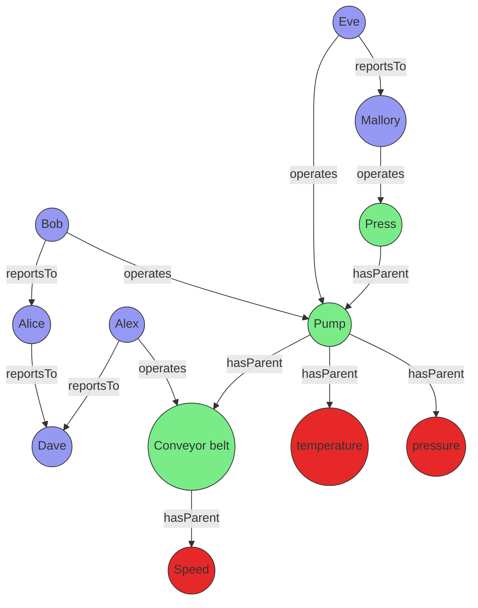

# Best practices for Kusto Query Language (KQL) graph semantics

Kusto supports two primary approaches for working with graphs: transient graphs, which are created in-memory for each query, and persistent graphs, which are defined as graph models and snapshots within the database. This article outlines best practices for both methods, enabling you to select the most appropriate approach and use KQL graph semantics efficiently. The guidance covers graph creation, querying, schema design, integration with other KQL features, and highlights common pitfalls to avoid.

## Approaches to graph modeling in Kusto

Transient graphs are created dynamically using the [`make-graph`](kusto/query/make-graph-operator.md) operator. These graphs exist only for the duration of a query and are best suited for ad hoc or exploratory analysis on small to medium datasets. In contrast, persistent graphs are defined using [graph models](kusto/management/graph/graph-model-overview.md) and [graph snapshots](kusto/management/graph/graph-snapshot-overview.md). Persistent graphs are stored in the database, support schema and versioning, and are optimized for repeated, large-scale, or collaborative analysis.

The following sections describe best practices for each approach.

## Best practices for transient graphs

Transient graphs, created in-memory for each query using the `make-graph` operator, are ideal for ad hoc analysis, prototyping, and scenarios where the graph structure changes frequently or only a subset of the data is required.

### Optimizing graph size

The [make-graph operator](/kusto/query/make-graph-operator?view=azure-data-explorer&preserve-view=true) creates an in-memory representation of a graph, encompassing both its structure and properties. When constructing graphs, optimize performance by applying appropriate filters, projections, and aggregations to select only the relevant nodes, edges, and their properties, thereby minimizing memory consumption and improving query execution time.

The following example demonstrates how to reduce the number of nodes and edges, as well as their properties. In this scenario, Bob has changed managers from Alice to Eve, and the user wants to view only the latest state of the graph for their organization. To minimize the graph size, nodes are first filtered by the organization property, which is then removed using the [project-away operator](/kusto/query/project-away-operator?view=azure-data-explorer&preserve-view=true). The same process is applied to edges. The [summarize operator](/kusto/query/summarize-operator?view=azure-data-explorer&preserve-view=true), together with [arg_max](/kusto/query/arg-max-aggregation-function?view=azure-data-explorer&preserve-view=true), is then used to obtain the last known state of the graph.

```kusto
let allEmployees = datatable(organization: string, name:string, age:long)
[
  "R&D", "Alice", 32,
  "R&D","Bob", 31,
  "R&D","Eve", 27,
  "R&D","Mallory", 29,
  "Marketing", "Alex", 35
];
let allReports = datatable(employee:string, manager:string, modificationDate: datetime)
[
  "Bob", "Alice", datetime(2022-05-23),
  "Bob", "Eve", datetime(2023-01-01),
  "Eve", "Mallory", datetime(2022-05-23),
  "Alice", "Dave", datetime(2022-05-23)
];
let filteredEmployees =
    allEmployees
    | where organization == "R&D"
    | project-away age, organization;
let filteredReports =
    allReports
    | summarize arg_max(modificationDate, *) by employee
    | project-away modificationDate;
filteredReports
| make-graph employee --> manager with filteredEmployees on name
| graph-match (employee)-[hasManager*2..5]-(manager)
  where employee.name == "Bob"
  project employee = employee.name, topManager = manager.name
```

**Output**

| employee | topManager |
| -------- | ---------- |
| Bob      | Mallory    |

### Last known state of the graph

The previous example demonstrated how to obtain the last known state of the edges in a graph by using the `summarize` operator and the `arg_max` aggregation function. This operation can be compute-intensive, so consider creating materialized views to improve query performance.

First, create tables that include a versioning mechanism, such as a `datetime` column, which can later be used to create a graph time series:

```kusto
.create table employees (organization: string, name:string, stateOfEmployment:string, properties:dynamic, modificationDate:datetime)

.create table reportsTo (employee:string, manager:string, modificationDate: datetime)
```

Next, create a materialized view for each table and use the [arg_max aggregation](/kusto/query/arg-max-aggregation-function?view=azure-data-explorer&preserve-view=true) function to determine the last known state of employees and the reportsTo relationship:

```kusto
.create materialized-view employees_MV on table employees
{
    employees
    | summarize arg_max(modificationDate, *) by name
}

.create materialized-view reportsTo_MV on table reportsTo
{
    reportsTo
    | summarize arg_max(modificationDate, *) by employee
}
```

Finally, create two functions to ensure that only the materialized component of the materialized view is used, and to apply additional filters and projections:

```kusto
.create function currentEmployees () {
    materialized_view('employees_MV')
    | where stateOfEmployment == "employed"
}

.create function reportsTo_lastKnownState () {
    materialized_view('reportsTo_MV')
    | project-away modificationDate
}
```

Using materialized views in this way makes queries faster and more efficient for larger graphs. It also enables higher concurrency and lower latency for queries that retrieve the latest state of the graph. If needed, you can still query the graph history using the original employees and reportsTo tables.

```kusto
let filteredEmployees =
    currentEmployees
    | where organization == "R&D"
    | project-away organization;
reportsTo_lastKnownState
| make-graph employee --> manager with filteredEmployees on name
| graph-match (employee)-[hasManager*2..5]-(manager)
  where employee.name == "Bob"
  project employee = employee.name, reportingPath = hasManager.manager
```

### Implementing graph time travel

Analyzing data based on the state of a graph at a specific point in time provides valuable historical context for many scenarios. This graph time travel capability can be implemented efficiently by combining time filters with the `summarize` operator and the `arg_max` aggregation function, allowing you to reconstruct graph states from any temporal perspective.

The following KQL statement creates a function that accepts a parameter defining the point in time of interest and returns a ready-made graph:

```kusto
.create function graph_time_travel (interestingPointInTime:datetime ) {
    let filteredEmployees =
        employees
        | where modificationDate < interestingPointInTime
        | summarize arg_max(modificationDate, *) by name;
    let filteredReports =
        reportsTo
        | where modificationDate < interestingPointInTime
        | summarize arg_max(modificationDate, *) by employee
        | project-away modificationDate;
    filteredReports
    | make-graph employee --> manager with filteredEmployees on name
}
```

With the function in place, you can craft a query to get the top manager of Bob based on the graph state in June 2022.

```kusto
graph_time_travel(datetime(2022-06-01))
| graph-match (employee)-[hasManager*2..5]-(manager)
  where employee.name == "Bob"
  project employee = employee.name, reportingPath = hasManager.manager
```

**Output**

| employee | topManager |
| -------- | ---------- |
| Bob      | Dave       |

### Managing complex graphs with multiple node and edge types

When contextualizing time series data with a graph containing multiple node types, a general-purpose property graph represented by a canonical model provides an elegant solution. In this approach, nodes are defined with attributes such as `nodeId` (string), `label` (string), and `properties` (dynamic), while edges integrate `source` (string), `destination` (string), `label` (string), and `properties` (dynamic) fields.

Although canonical property graph models can be created using transient graphs, the graph model-based approach typically offers a more streamlined experience when modeling different node and edge types, particularly for complex data relationships.

The following example demonstrates how to transform data into a canonical model and how to query it, even when the base tables for nodes and edges have different schemas.

This scenario involves a factory manager who wants to find out why equipment isn't working well and who is responsible for fixing it. The manager decides to use a graph that combines the asset graph of the production floor and the maintenance staff hierarchy which changes every day.

The following mermaid diagram visualizes a typical scenario:



The data for those entities can be stored directly in your cluster or acquired using query federation to a different service. To illustrate the example, the following tabular data is created as part of the query:

```kusto
let sensors = datatable(sensorId:string, tagName:string, unitOfMeasure:string)
[
  "1", "temperature", "°C",
  "2", "pressure", "Pa",
  "3", "speed", "m/s"
];
let timeseriesData = datatable(sensorId:string, timestamp:string, value:double, anomaly: bool )
[
    "1", datetime(2023-01-23 10:00:00), 32, false,
    "1", datetime(2023-01-24 10:00:00), 400, true,
    "3", datetime(2023-01-24 09:00:00), 9, false
];
let employees = datatable(name:string, age:long)
[
  "Alice", 32,
  "Bob", 31,
  "Eve", 27,
  "Mallory", 29,
  "Alex", 35,
  "Dave", 45
];
let allReports = datatable(employee:string, manager:string)
[
  "Bob", "Alice",
  "Alice", "Dave",
  "Eve", "Mallory",
  "Alex", "Dave"
];
let operates = datatable(employee:string, machine:string, timestamp:datetime)
[
  "Bob", "Pump", datetime(2023-01-23),
  "Eve", "Pump", datetime(2023-01-24),
  "Mallory", "Press", datetime(2023-01-24),
  "Alex", "Conveyor belt", datetime(2023-01-24),
];
let assetHierarchy = datatable(source:string, destination:string)
[
  "1", "Pump",
  "2", "Pump",
  "Pump", "Press",
  "3", "Conveyor belt"
];
```

The employees, sensors, and other entities and relationships do not share a canonical data model. The [union operator](/kusto/query/union-operator?view=azure-data-explorer&preserve-view=true) can be used to combine and standardize the data.

The following query joins the sensor data with the time series data to identify sensors with abnormal readings, then uses a projection to create a common model for the graph nodes.

```kusto
let nodes =
    union
        (
            sensors
            | join kind=leftouter
            (
                timeseriesData
                | summarize hasAnomaly=max(anomaly) by sensorId
            ) on sensorId
            | project nodeId = sensorId, label = "tag", properties = pack_all(true)
        ),
        ( employees | project nodeId = name, label = "employee", properties = pack_all(true));
```

The edges are transformed in a similar manner.

```kusto
let edges =
    union
        ( assetHierarchy | extend label = "hasParent" ),
        ( allReports | project source = employee, destination = manager, label = "reportsTo" ),
        ( operates | project source = employee, destination = machine, properties = pack_all(true), label = "operates" );
```

With the standardized nodes and edges data, you can create a graph using the [make-graph operator](/kusto/query/make-graph-operator?view=azure-data-explorer&preserve-view=true):

```kusto
let graph = edges
| make-graph source --> destination with nodes on nodeId;
```

Once the graph is created, define the path pattern and project the required information. The pattern begins at a tag node, followed by a variable-length edge to an asset. That asset is operated by an operator who reports to a top manager via a variable-length edge called *reportsTo*. The constraints section of the [graph-match operator](/kusto/query/graph-match-operator?view=azure-data-explorer&preserve-view=true), in this case the **where** clause, filters the tags to those with an anomaly that were operated on a specific day.

```kusto
graph
| graph-match (tag)-[hasParent*1..5]->(asset)<-[operates]-(operator)-[reportsTo*1..5]->(topManager)
    where tag.label=="tag" and tobool(tag.properties.hasAnomaly) and
        startofday(todatetime(operates.properties.timestamp)) == datetime(2023-01-24)
        and topManager.label=="employee"
    project
        tagWithAnomaly = tostring(tag.properties.tagName),
        impactedAsset = asset.nodeId,
        operatorName = operator.nodeId,
        responsibleManager = tostring(topManager.nodeId)
```

**Output**

| tagWithAnomaly | impactedAsset | operatorName | responsibleManager |
| -------------- | ------------- | ------------ | ------------------ |
| temperature    | Pump          | Eve          | Mallory            |

The projection in `graph-match` shows that the temperature sensor exhibited an anomaly on the specified day. The sensor was operated by Eve, who ultimately reports to Mallory. With this information, the factory manager can contact Eve and, if necessary, Mallory to better understand the anomaly.

## Best practices for persistent graphs

Persistent graphs, defined using [graph models](kusto/management/graph/graph-model-overview.md) and [graph snapshots](kusto/management/graph/graph-snapshot-overview.md), provide robust solutions for advanced graph analytics needs. These graphs excel in scenarios requiring repeated analysis of large, complex, or evolving data relationships, and facilitate collaboration by enabling teams to share standardized graph definitions and consistent analytical results. By persisting graph structures in the database, this approach significantly enhances performance for recurring queries and supports sophisticated versioning capabilities.

### Use schema and definition for consistency and performance

A clear schema for your graph model is essential, as it specifies node and edge types along with their properties. This approach ensures data consistency and enables efficient querying. Utilize the `Definition` section to specify how nodes and edges are constructed from your tabular data through `AddNodes` and `AddEdges` steps.

### Leverage static and dynamic labels for flexible modeling

When modeling your graph, you can utilize both static and dynamic labeling approaches for optimal flexibility. Static labels are ideal for well-defined node and edge types that rarely change—define these in the `Schema` section and reference them in the `Labels` array of your steps. For cases where node or edge types are determined by data values (for example, when the type is stored in a column), use dynamic labels by specifying a `LabelsColumn` in your step to assign labels at runtime. This approach is especially useful for graphs with heterogeneous or evolving schemas. Both mechanisms can be effectively combined—you can define a `Labels` array for static labels and also specify a `LabelsColumn` to incorporate additional labels from your data, providing maximum flexibility when modeling complex graphs with both fixed and data-driven categorization.

#### Example: Using dynamic labels for multiple node and edge types

The following example demonstrates an effective implementation of dynamic labels in a graph representing professional relationships. In this scenario, the graph contains people and companies as nodes, with employment relationships forming the edges between them. The flexibility of this model comes from determining node and edge types directly from columns in the source data, allowing the graph structure to adapt organically to the underlying information.

```json
{
  "Schema": {
    "Nodes": {
      "Person": {"Name": "string", "Age": "long"},
      "Company": {"Name": "string", "Industry": "string"}
    },
    "Edges": {
      "WORKS_AT": {"StartDate": "datetime", "Position": "string"}
    }
  },
  "Definition": {
    "Steps": [
      {
        "Kind": "AddNodes",
        "Query": "Employees | project Id, Name, Age, NodeType",
        "NodeIdColumn": "Id",
        "Labels": ["Person"],
        "LabelsColumn": "NodeType"
      },
      {
        "Kind": "AddEdges",
        "Query": "EmploymentRecords | project EmployeeId, CompanyId, StartDate, Position, RelationType",
        "SourceColumn": "EmployeeId",
        "TargetColumn": "CompanyId",
        "Labels": ["WORKS_AT"],
        "LabelsColumn": "RelationType"
      }
    ]
  }
}
```

This dynamic labeling approach provides exceptional flexibility when modeling graphs with numerous node and edge types, eliminating the need to modify your schema each time a new entity type appears in your data. By decoupling the logical model from the physical implementation, your graph can continuously evolve to represent new relationships without requiring structural changes to the underlying schema.

## Related content

For more information about graph functionality in Azure Data Explorer, refer to the [Graph overview](graph-overview.md) documentation and explore the comprehensive set of available [Graph operators](/kusto/query/graph-operators?view=azure-data-explorer&preserve-view=true).
