# Graph semantics in Kusto - Overview

> [!INCLUDE [applies](../../includes/applies-to-version/applies.md)] [!INCLUDE [fabric](../../includes/applies-to-version/fabric.md)] [!INCLUDE [azure-data-explorer](../../includes/applies-to-version/azure-data-explorer.md)]

Graph semantics in Kusto allows you to model and query data as graphs. The structure of a graph comprises nodes and edges that connect them. Both nodes and edges can have properties that describe them, creating a rich data model for complex relationships.

Graphs are useful for representing complex and dynamic data that involve many-to-many, hierarchical, or networked relationships, such as social networks, recommendation systems, connected assets, or knowledge graphs. Graphs store data differently from relational databases, which use tables and need indexes and joins to connect related data. In graphs, each node has a direct pointer to its neighbors (adjacency), so there's no need to index or join anything, making it easy and fast to traverse the graph.

The following graph illustrates a security attack path scenario. Nodes represent different entities such as external sources, users, and critical assets, while edges represent actions or relationships relevant to a potential attack sequence.

```mermaid
graph TD
    EXT[🌐 External IP] -->|phishing email| U1[👤 User: Alice]
    U1 -->|compromised credentials| S1[🖥️ Workstation]
    S1 -->|lateral movement| FS[🗄️ File Server]
    FS -->|accesses| DB[🗄️ Sensitive Database]
    
    style EXT fill:#ff6b6b,stroke:#d63031,color:#fff
    style U1 fill:#f3e5f5,stroke:#7b1fa2,color:#000
    style S1 fill:#e8f5e8,stroke:#2e7d32,color:#000
    style FS fill:#fff3e0,stroke:#ef6c00,color:#000
    style DB fill:#ffd93d,stroke:#fdcb6e,color:#000
```

Graph queries can use the graph structure and meaning to perform complex and powerful operations, such as finding paths, patterns, shortest distances, communities, or centrality measures. Across domains, graphs are powerful for modeling relationships, interactions, dependencies, and flows—whether in social networks, supply chains, IoT device networks, digital twins, recommendation systems, or organizational structures.

The following graph illustrates a supply chain scenario, with nodes representing suppliers, manufacturers, and distributors, and edges representing supply relationships. This demonstrates how graphs can model flows and dependencies in a non-security context.

```mermaid
graph TD
    S1[🏭 Supplier A] -->|supplies| M1[🏢 Manufacturer X]
    S2[🏭 Supplier B] -->|supplies| M1
    M1 -->|ships to| D1[🚚 Distributor Y]
    
    style S1 fill:#e1f5fe,stroke:#0277bd,color:#000
    style S2 fill:#f3e5f5,stroke:#7b1fa2,color:#000
    style M1 fill:#e8f5e8,stroke:#2e7d32,color:#000
    style D1 fill:#fff3e0,stroke:#ef6c00,color:#000
```

## Why use graph semantics in Kusto?

Kusto's graph capabilities offer significant advantages by **leveraging your existing data investments** while adding sophisticated contextualization capabilities:

- **No data migration required** - Build graph models directly from your current data without duplications
- **Cost-effective solution** - Eliminates the complexity and expense of dedicated graph databases
- **Temporal analysis support** - As a time-series database, Kusto naturally lets you examine how graphs evolve over time
- **Event-based modeling** - Treats graphs as series of relationship events, aligning with Kusto's core strength in event processing
- **Seamless KQL integration** - Graph operators work alongside all existing KQL capabilities with full intellisense support

This approach delivers **enterprise-grade relationship modeling** while maintaining Kusto's performance, scale, and familiarity. Organizations can analyze complex interconnected data across domains—from supply chains and organizational hierarchies to IoT device networks and social relationships—without additional tooling investments.

## Graph creation approaches in Kusto

Kusto provides two distinct approaches for creating and working with graphs, each optimized for different scenarios and requirements.

### 1. Transient graphs

Transient graphs are created dynamically using the [`make-graph`](../../query/make-graph-operator.md) operator. These graphs are constructed in memory during query execution and exist only for the duration of the query.

#### Key characteristics

Dynamic creation allows graphs to be built from tabular data using KQL queries, with the entire graph structure residing in memory. The graph exists only during query execution, providing immediate availability without any pre-processing or setup requirements. However, graph size is constrained by available memory on any Kusto cluster node. The drivers for the graph size are the actual topology of the graph and the size of the properties, making this approach suitable for smaller to medium-sized datasets.

#### Use cases for Transient Graphs

Ad hoc analysis and exploratory data analysis benefit from this approach, particularly for one-time investigations where you need to quickly examine patterns or connections in your data. Small to medium datasets work well with in-memory graphs, especially when analyzing recent events or performing focused analyses on specific subsets of data. Rapid prototyping allows you to test graph patterns and query logic before committing to persistent models. Dynamic data analysis is ideal for frequently changing data that doesn't justify persistent storage, such as real-time monitoring scenarios across IoT networks, supply chain relationships, customer journey mapping, or any domain where relationships between entities need quick visualization and analysis.

### 2. Persistent graphs

Persistent graphs are created using a combination of [graph models](graph-model-overview.md) and [graph snapshots](graph-snapshot-overview.md). This approach provides a robust solution for scenarios requiring repeated access to large, complex graphs representing organizational networks, supply chains, IoT ecosystems, digital twins, or any domain with interconnected data.

#### Key characteristics for persistent graphs

Persistent storage ensures that graph models and snapshots are stored in database metadata, providing durability and consistency across operations. Scalability allows handling larger graphs that exceed main memory limitations, enabling enterprise-wide analysis across millions of nodes and relationships. Reusability enables multiple users to query the same graph structure without rebuilding, fostering collaborative analysis and insight discovery. Performance optimization eliminates graph construction latency for repeated queries, crucial for time-sensitive operations. Version control through multiple snapshots allows representing graphs at different points in time, essential for tracking changes and conducting historical analysis.

Schema support makes persistent graphs particularly valuable when working with multiple node and edge types, as they provide structured definitions for different entity types and their properties. The schema capability enables both static labels that are predefined in the graph model and dynamic labels that are generated at runtime from the underlying data, offering flexibility for complex environments with diverse entity types and relationship categories.

#### Use cases for Persistent Graphs

Enterprise analytics benefit significantly from persistent graphs through continuous monitoring workflows and comprehensive analysis procedures that track relationships across complex networks. Large-scale data analysis becomes feasible when working with enterprise-scale graphs spanning millions of events, activities, and connections across multiple domains. Collaborative analysis enables multiple teams to work with the same comprehensive graph structure, sharing insights and building upon each other's investigations.

##### Example: Digital Twin Persistent Graph

```mermaid
graph TD
    DT1[🏭 Digital Twin: Factory] -->|monitors| EQ1[⚙️ Equipment 1]
    DT1 -->|monitors| EQ2[⚙️ Equipment 2]
    EQ1 -->|connected to| S1[🔌 Sensor 1]
    EQ2 -->|connected to| S2[🔌 Sensor 2]
    DT1 -->|reports to| CL1[☁️ Cloud Analytics]
    
    style DT1 fill:#e1f5fe,stroke:#0277bd,color:#000
    style EQ1 fill:#f3e5f5,stroke:#7b1fa2,color:#000
    style EQ2 fill:#e8f5e8,stroke:#2e7d32,color:#000
    style S1 fill:#fff3e0,stroke:#ef6c00,color:#000
    style S2 fill:#ffd93d,stroke:#fdcb6e,color:#000
    style CL1 fill:#a3cfbb,stroke:#1b6e3c,color:#000
```

In digital twin and IoT scenarios, persistent graphs support regular analysis of device relationships, equipment dependencies, and system evolution over time. Historical analysis allows comparing system states across different periods, tracking the evolution of assets, and conducting long-term trend analysis.

##### Example: IoT and Digital Twin Persistent Graph

In IoT and digital twin applications, persistent graphs excel at modeling complex relationships between physical devices and their virtual representations across distributed systems. These graphs enable organizations to create comprehensive models of IoT deployments and connected assets, supporting real-time monitoring, predictive maintenance, and performance optimization. Maintenance teams can analyze equipment dependencies, identify potential failure points in connected systems, and optimize sensor placements by understanding both physical and logical topology. The persistent nature maintains digital representations throughout their lifecycle, tracking configuration changes, device communications, and performance characteristics over time. Engineers can detect anomalies in communication patterns, visualize the evolution of smart environments, and simulate operating conditions before implementing changes to physical infrastructure, making persistent graphs invaluable for managing complex IoT ecosystems at scale.

## Graph querying capabilities

Regardless of the creation method, once a graph is established (either through `make-graph` or from a snapshot), analysts can leverage the full suite of KQL graph operators for comprehensive analysis across any domain.

The [`graph-match`](../../query/graph-match-operator.md) operator enables sophisticated pattern matching and traversal operations, allowing analysts to identify complex patterns, relationship sequences, and multi-stage connections across any networked data. The [`graph-shortest-paths`](../../query/graph-shortest-paths-operator.md) operator is invaluable for finding optimal paths between entities, helping prioritize connections and identify critical relationships whether in supply chains, IoT networks, social networks, or infrastructure dependencies. The [`graph-to-table`](../../query/graph-to-table-operator.md) operator facilitates converting graph analysis results back to tabular format for integration with existing reporting systems and data visualization tools.

Analysts can perform time-based analysis to examine how relationships and patterns evolve over time, tracking the progression of changes and identifying emerging trends across domains. Geospatial integration capabilities allow combining graph data with location-based intelligence, enabling analysis of geographic patterns and location-based anomalies. Machine learning integration supports applying algorithms for entity clustering, pattern classification, and anomaly detection within any graph context—such as customer journey analysis, product recommendation systems, IoT networks, digital twins, or knowledge graphs.

## Choosing the right approach

The following decision tree helps you select the most appropriate graph creation approach based on your specific requirements and constraints.

### Decision Tree: Transient vs Persistent Graphs

```mermaid
flowchart TD
    Start([Which graph approach should I use?]) --> Size{Graph size > 10M nodes/edges?}
    
    Size -->|Yes| Persistent[🏛️ Use Persistent Graphs]
    Size -->|No| Teams{Multiple teams or<br/>repeated analysis?}
    
    Teams -->|Yes| Persistent
    Teams -->|No| Transient[⚡ Use Transient Graphs]
    
    style Start fill:#e1f5fe,stroke:#0277bd,color:#000
    style Persistent fill:#c8e6c9,stroke:#2e7d32,color:#000
    style Transient fill:#fff3e0,stroke:#ef6c00,color:#000
    style Size fill:#f3e5f5,stroke:#7b1fa2,color:#000
    style Teams fill:#f3e5f5,stroke:#7b1fa2,color:#000
```

### Use transient graphs when

Transient graphs are ideal when working with smaller datasets for ad hoc analysis and exploration. One-time or exploratory analysis benefits from this approach, particularly when investigating specific patterns or validating hypotheses across various domains such as social networks, supply chains, or organizational structures. Rapidly changing data that doesn't justify persistent storage, such as real-time IoT sensor networks, dynamic user interactions, or live transaction flows, works well with transient graphs. Rapid prototyping allows analysts to test graph patterns and query logic before committing to persistent models across any analytical domain.

Note that while transient graphs can handle larger datasets (beyond 10M nodes/edges), query execution will take longer as the graph must be constructed for every query. This trade-off between convenience and performance should be considered based on your specific use case.

**Key indicators for transient graphs:**

- Graph size under 10 million nodes and edges (for optimal performance)
- Single user or small team analysis
- One-time or exploratory investigations
- Real-time data analysis requirements
- Rapid prototyping and testing

### Use persistent graphs when

Persistent graphs are essential when working with large-scale graph structures containing millions of nodes and edges, representing comprehensive organizational networks, complex systems, or extensive historical data across any domain. Multiple analysts and teams from different departments need access to the same comprehensive graph structure, enabling collaborative analysis, shared insights, and coordinated operations. Repeated analysis on stable graph data, such as baseline network topology, established relationship patterns, or known infrastructure dependencies, benefits significantly from persistent storage. Production workflows and automated analysis systems require consistent graph access without reconstruction delays, ensuring reliable operations and real-time pattern detection. Memory limitations affecting query performance indicate the need for persistent graphs, particularly when dealing with enterprise-scale data monitoring. Historical state comparison requirements, essential for forensic analysis and long-term trend tracking across any field, necessitate persistent graph snapshots. Collaborative investigation workflows across multiple teams and time zones benefit from shared persistent graph access, enabling continuous operations and knowledge sharing in domains ranging from supply chain management to customer relationship analysis, infrastructure monitoring, and organizational dynamics.

**Key indicators for persistent graphs:**

- Graph size exceeding 10 million nodes and edges
- Multiple teams requiring shared access
- Repeated analysis on stable datasets
- Production workflow integration
- Historical comparison requirements
- Memory capacity limitations
- Collaborative investigation needs

## Performance considerations

### Memory usage

Transient graphs are limited by single cluster node memory, which constrains their use to smaller datasets that can fit within available RAM resources. Persistent graphs can leverage distributed storage and optimized access patterns, enabling organizations to work with enterprise-scale data that spans multiple nodes and exceeds single-machine memory limitations.

### Query latency

Transient graphs include graph construction time in each query execution, which can introduce delays when analyzing large datasets or complex topologies during time-critical scenarios. This latency significantly increases when transient graphs are built from tabular expressions that call external services (Kusto, SQL, CosmosDB), as each query must wait for these external data sources to respond before constructing the graph. Persistent graphs eliminate construction latency through pre-built snapshots, enabling rapid analysis and real-time workflows that require immediate access to comprehensive organizational data, regardless of whether the underlying data spans multiple services or data stores.

### Data freshness

Transient graphs always reflect the current data state, making them ideal for analyzing live events and real-time information where the most recent data is crucial for accurate assessment. Persistent graphs reflect the data state at snapshot creation time, which provides consistency for collaborative analysis and historical review but may require periodic refresh cycles to incorporate the latest events and indicators.

## Integration with KQL ecosystem

Graph semantics integrate seamlessly with the broader KQL ecosystem, enabling analysts to combine graph queries with time-series analysis for tracking the evolution of relationships and patterns over time. Teams can apply geospatial functions to graph data for analyzing location-based patterns and identifying geographic anomalies in access or communication. Machine learning operators can be used on graph results to detect patterns, classify behaviors, and identify previously unknown anomalies through advanced analytics. The full power of KQL scalar and tabular operators enhances graph analysis capabilities, allowing for complex data transformations, aggregations, and enrichment with external data sources.

This integration enables sophisticated analysis scenarios such as tracking the evolution of supply chains, analyzing the geographical distribution of assets or interactions, applying clustering algorithms to identify communities or coordinated activities, and correlating graph-based insights with traditional log analysis and external intelligence feeds. Organizations can leverage these combined capabilities to build comprehensive analytical workflows that span multiple data types and approaches.

## Related content

- [Graph model overview](graph-model-overview.md)
- [Graph snapshots overview](graph-snapshot-overview.md)
- [make-graph operator](../../query/make-graph-operator.md)
- [Graph operators](../../query/graph-operators.md)
- [Graph best practices](../../query/graph-best-practices.md)
