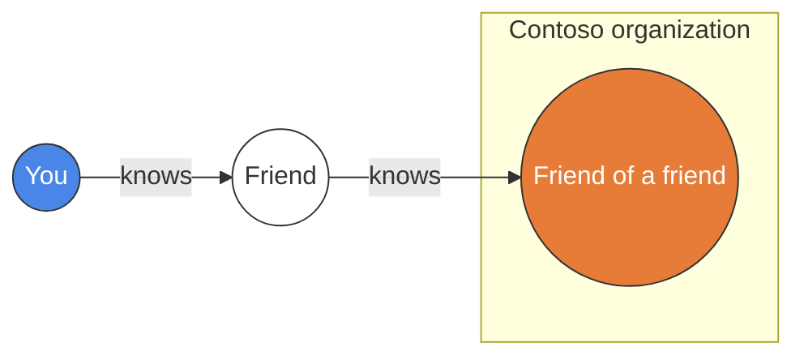
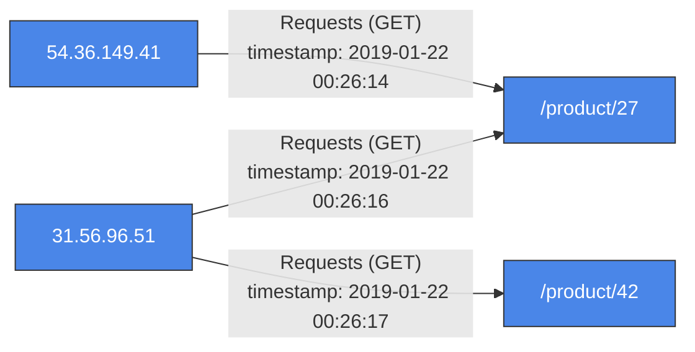
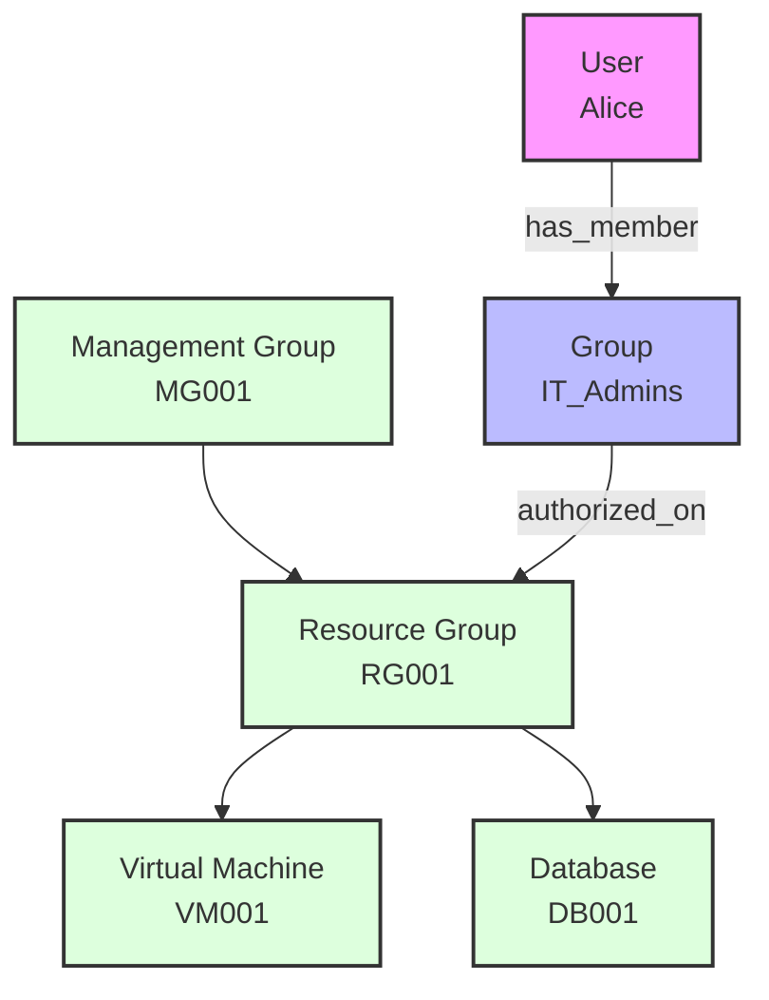
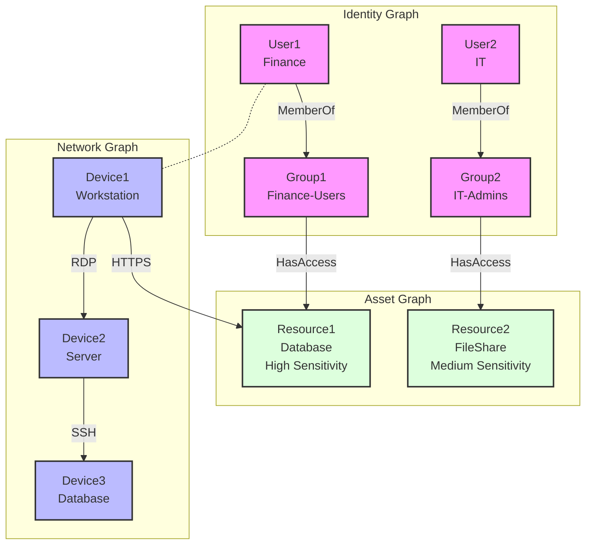
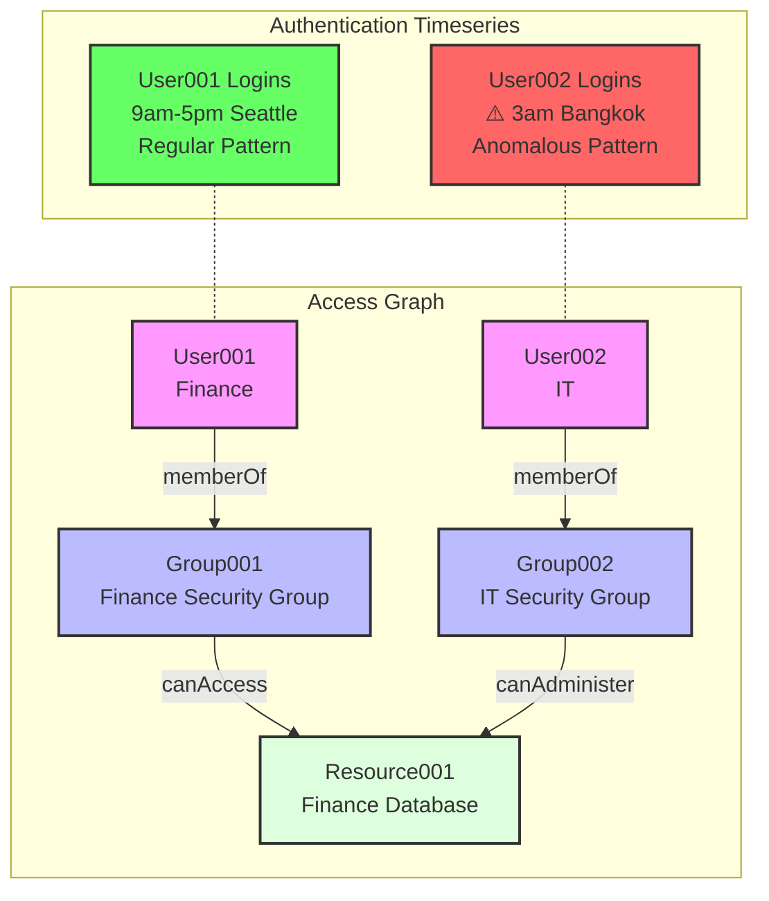
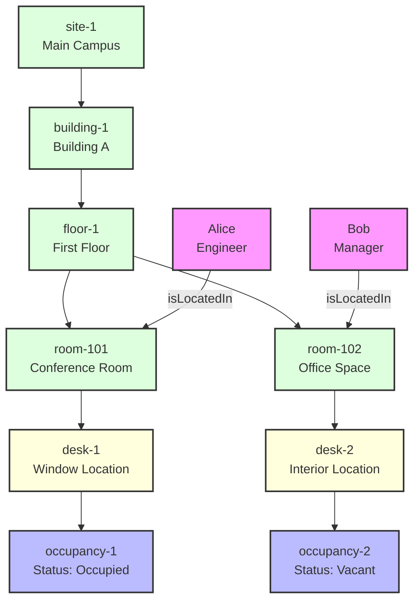

# What are common scenarios for using Kusto Query Language (KQL) graph semantics?

Graph semantics in Kusto Query Language (KQL) enables modeling and querying data as interconnected networks. This approach is particularly effective for representing complex data involving many-to-many relationships, hierarchical structures, and networked systems—including social networks, recommendation engines, connected assets, and knowledge graphs.

In this article, you learn about the following common scenarios for using KQL graph semantics:

- [Friends of a friend](#friends-of-a-friend)
- [Insights from log data](#insights-from-log-data)
- [Resource graph exploration](#resource-graph-exploration)
- [Graph of graph for security analysis](#graph-of-graph-for-security-analysis)
- [Combining time series and graph analytics](#combining-time-series-and-graph-analytics)
- [Digital twins and graph historization](#digital-twins-and-graph-historization)

## Friends of a friend

Social network analysis represents a fundamental graph use case where nodes are users and edges represent friendships or interactions. Consider a data model with a *Users* table containing user attributes (name, organization) and a *Knows* table documenting relationships between users, as illustrated in the following diagram:



Without graph semantics, finding friends-of-friends requires multiple complex joins:

```kusto
let Users = datatable (UserId: string, name: string, org: string)[]; // nodes
let Knows = datatable (FirstUser: string, SecondUser: string)[]; // edges
Users
| where org == "Contoso"
| join kind=inner (Knows) on $left.UserId == $right.FirstUser
| join kind=innerunique(Users) on $left.SecondUser == $right.UserId
| join kind=inner (Knows) on $left.SecondUser == $right.FirstUser
| join kind=innerunique(Users) on $left.SecondUser1 == $right.UserId
| where UserId != UserId1
| project name, name1, name2
```

KQL graph semantics enables the same query with significantly improved readability and efficiency. The following query uses the [make-graph operator](/kusto/query/make-graph-operator?view=azure-data-explorer&preserve-view=true) to create a directed graph from *FirstUser* to *SecondUser* and enriches nodes with properties from the *Users* table. The [graph-match operator](/kusto/query/graph-match-operator?view=azure-data-explorer&preserve-view=true) then expresses the friend-of-a-friend pattern concisely with appropriate filters and projections:

```kusto
let Users = datatable (UserId:string , name:string , org:string)[]; // nodes
let Knows = datatable (FirstUser:string , SecondUser:string)[]; // edges
Knows
| make-graph FirstUser --> SecondUser with Users on UserId
| graph-match (user)-->(middle_man)-->(friendOfAFriend)
    where user.org == "Contoso" and user.UserId != friendOfAFriend.UserId
    project contoso_person = user.name, middle_man = middle_man.name, kusto_friend_of_friend = friendOfAFriend.name
```

## Insights from log data

Log data analysis often requires extracting insights from flat tables containing time series information. Converting this data to a graph structure first requires identifying the relevant entities and relationships. Consider a table called *rawLogs* containing web server request information such as timestamps, source IP addresses, and destination resources.

The following table shows an example of the raw data:

```kusto
let rawLogs = datatable (rawLog: string) [
    "31.56.96.51 - - [2019-01-22 03:54:16 +0330] \"GET /product/27 HTTP/1.1\" 200 5379 \"https://www.contoso.com/m/filter/b113\" \"some client\" \"-\"",
    "31.56.96.51 - - [2019-01-22 03:55:17 +0330] \"GET /product/42 HTTP/1.1\" 200 5667 \"https://www.contoso.com/m/filter/b113\" \"some client\" \"-\"",
    "54.36.149.41 - - [2019-01-22 03:56:14 +0330] \"GET /product/27 HTTP/1.1\" 200 30577 \"-\" \"some client\" \"-\""
];
```

One possible way to model a graph from this table is to treat the source IP addresses as nodes and the web requests to resources as edges. You can use the [parse operator](/kusto/query/parse-operator?view=azure-data-explorer&preserve-view=true) to extract the columns you need for the graph and then you can create a graph that represents the network traffic and interactions between different sources and destinations. To create the graph, you can use the [make-graph operator](/kusto/query/make-graph-operator?view=azure-data-explorer&preserve-view=true) specifying the source and destination columns as the edge endpoints, and optionally providing additional columns as edge or node properties.

The following query creates a graph from the raw logs:

```kusto
let parsedLogs = rawLogs
    | parse rawLog with ipAddress: string " - - [" timestamp: datetime "] \"" httpVerb: string " " resource: string " " *
    | project-away rawLog;
let edges = parsedLogs;
let nodes =
    union
        (parsedLogs
        | distinct ipAddress
        | project nodeId = ipAddress, label = "IP address"),
        (parsedLogs | distinct resource | project nodeId = resource, label = "resource");
let graph = edges
    | make-graph ipAddress --> resource with nodes on nodeId;
```

This query parses the raw logs and creates a directed graph where the nodes are either IP addresses or resources and each edge is a request from the source to the destination, with the timestamp and HTTP verb as edge properties.



Once the graph is created, you can use the [graph-match operator](/kusto/query/graph-match-operator?view=azure-data-explorer&preserve-view=true) to query the graph data using patterns, filters, and projections. For example, you can create a pattern that makes a simple recommendation based on the resources that other IP addresses requested within the last five minutes, as follows:

```kusto
graph
| graph-match (startIp)-[request]->(resource)<--(otherIP)-[otherRequest]->(otherResource)
    where startIp.label == "IP address" and //start with an IP address
    resource.nodeId != otherResource.nodeId and //recommending a different resource
    startIp.nodeId != otherIP.nodeId and //only other IP addresses are interesting
    (request.timestamp - otherRequest.timestamp < 5m) //filter on recommendations based on the last 5 minutes
    project Recommendation=otherResource.nodeId
```

### Output

| Recommendation |
| -------------- |
| /product/42    |

The query returns "/product/42" as a recommendation based on a raw text-based log.

## Resource graph exploration

Resource graphs enable efficient exploration and querying of resources at scale, supporting governance, management, and security requirements. These activity graphs continuously update as resources change, providing dynamic tracking of your resource inventory. For sample code and detailed examples, see the [Resource Graph samples on GitHub](https://github.com/Azure/azure-kusto-graph-samples/tree/main/resource%20graph).



Consider an enterprise with complex cloud infrastructure spanning multiple environments, containing virtual machines, databases, storage accounts, networking components, and user identities with varying permissions. The key challenge lies in efficiently managing and querying this extensive resource inventory for security compliance and access control.

With KQL graph semantics, security administrators can model complex resource hierarchies and permission structures as graphs. This approach enables powerful queries that can trace access paths from users through groups to resources, identify overprivileged accounts, detect potential security vulnerabilities in resource configurations, and validate compliance with organizational policies.

For enterprise-scale resource graphs, materialized views can represent the last known state of nodes and edges, enabling both current state analysis and point-in-time historical queries of how resources and permissions have changed over time.

## Graph of graph for security analysis

Security operations often require analyzing relationships across multiple domains simultaneously. The "Graph of Graph" approach enables you to model and analyze interconnected data structures by combining and querying across separate graph domains: identity, network, and asset graphs. For sample code and detailed examples, see the [Graph of Graph samples on GitHub](https://github.com/Azure/azure-kusto-graph-samples/tree/main/graph%20of%20graph).



The "Graph of Graph" methodology maintains separation between domain-specific graphs while enabling sophisticated cross-domain analysis through query composition. Consider a scenario where an organization needs to detect sophisticated attackers using a combination of:

1. **Identity graph** - Modeling users, groups, and permissions to understand access rights
2. **Network graph** - Representing devices and their connections to detect unusual network patterns
3. **Asset graph** - Cataloging resources and their sensitivity levels to assess potential impact

By traversing relationships across these domains, security analysts can identify attack paths that would remain invisible when examining each domain in isolation. This approach is particularly valuable for:

- Detecting lateral movement across network segments
- Identifying privilege escalation attempts via group membership changes
- Discovering data exfiltration from high-sensitivity resources
- Correlating unusual authentication patterns with resource access

## Combining time series and graph analytics

Combining graph analysis with time series analytics creates a powerful analytical framework. This integration enables detection of temporal anomalies while understanding their impact across interconnected systems. The approach delivers significant value for security analytics, IoT monitoring, and operational intelligence. For sample code and detailed examples, see the [Time Series and Graph samples on GitHub](https://github.com/Azure/azure-kusto-graph-samples/blob/main/graph%20of%20graph/timeseriesAndGraph.kql).



Time series data often contains temporal patterns that can indicate normal or anomalous behavior. When combined with graph structures, these patterns become more meaningful by providing the context of relationships and access paths.

In security contexts, this integration can identify potentially malicious activities through:

1. **Authentication anomaly detection** - Flagging logins that deviate from usual patterns (time of day, location, frequency)
2. **Access path analysis** - Determining what sensitive resources anomalous users can reach through permission chains
3. **Impact assessment** - Evaluating the potential blast radius of an unusual activity

Beyond security, this approach can also be applied to:

- IoT systems to correlate device anomalies with the connected infrastructure
- Business operations to link transaction anomalies with organizational structures
- IT infrastructure to connect performance anomalies with service dependencies

By combining time series and graph analytics, KQL enables analysts to understand both the nature of anomalies and their contextual impact across interconnected systems.

## Digital twins and graph historization

Digital twins provide virtual representations of physical objects or systems, enabling precise modeling and simulation of real-world entities. Graph semantics in KQL excels in digital twin scenarios because relationships between entities—such as facilities, equipment, sensors, and people—inherently form graph structures. For sample code and detailed examples, see the [Digital Twins samples on GitHub](https://github.com/Azure/azure-kusto-graph-samples/tree/main/digital%20twins).



A critical aspect of digital twin management is capturing and analyzing temporal changes. By historizing graph changes in Kusto, organizations can track historical trends, conduct time-based analysis, and implement predictive analytics for their digital twin models.

By historizing digital twin graph changes in Azure Data Explorer, organizations can:

1. Track physical space and system evolution over time
1. Conduct historical analysis to identify patterns and trends
1. Compare historical states to detect anomalies or measure improvements
1. Develop predictive models based on historical utilization patterns

## Related content

- [Best practices](graph-best-practices.md)
- [Graph operators](/kusto/query/graph-operators?view=azure-data-explorer&preserve-view=true)
- [Azure Kusto Graph Samples on GitHub](https://github.com/Azure/azure-kusto-graph-samples)
- [Advanced KQL graph capabilities for security analysis](https://github.com/Azure/azure-kusto-graph-samples/blob/main/graph%20of%20graph/advanced-kql-capabilities.md)
- [Digital twins with KQL graph semantics](https://github.com/Azure/azure-kusto-graph-samples/tree/main/digital%20twins)
- [Azure Digital Twins documentation](/azure/digital-twins/)
