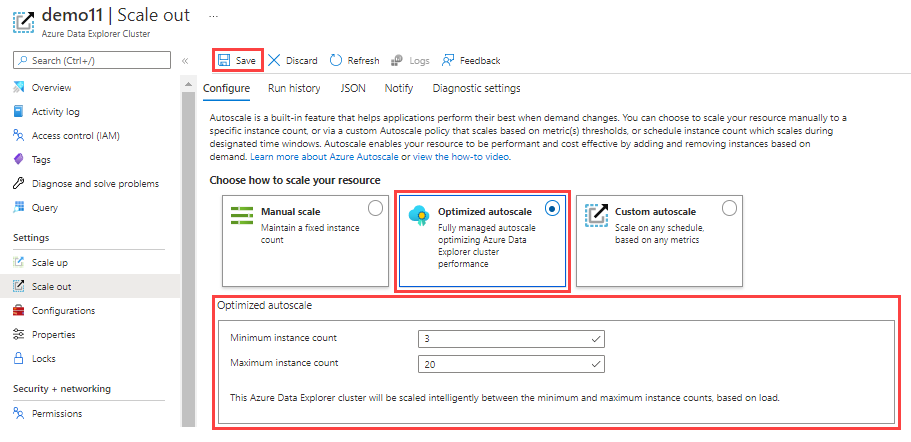

# Query cold data with hot windows

Hot windows let you efficiently query cold data without the need to export data or use other tools. Use hot windows when the cold data size is large and the relevant data is from any time in the past. Hot windows are defined in the cache policy.

Azure Data Explorer stores its data in reliable long-term storage and caches a portion of this data on the cluster engine nodes. The [cache policy](./kusto/management/cachepolicy.md) governs which data is cached. The cached data is considered *hot*, while the rest of the data is considered *cold*.  

To query cold data, Azure Data Explorer process a loading step that requires accessing a storage tier with much higher latency than the local disk. When the query is limited to a small time window, often called "point-in-time" queries, the amount of data to be retrieved will usually be small, and the query will complete quickly. For example,  forensic analyses querying telemetry on a given day in the past fall under this category. The impact on the query duration depends on the size of data that is pulled from storage, and can be significant. If you're scanning a large amount of cold data, query performance could benefit from using hot windows.


This document shows you how to use hot windows to query cold data.

## Prerequisites

* If you don't have an Azure subscription, create a [free Azure account](https://azure.microsoft.com/free/) before you begin.
* Create [an Azure Data Explorer cluster and database](create-cluster-and-database.md).
* Ingest data in your cluster with one of the methods described in the [Azure Data Explorer data ingestion overview](ingest-data-overview.md).

## Configure autoscale on cluster

After changing the cache policy, the cluster automatically caches the relevant data on its disks. You'll need to scale the cluster to accommodate the extra disk needed for the new cache definition. We recommend configuring the cluster to use the [optimize autoscale](manage-cluster-horizontal-scaling.md) settings.

1. In the Azure portal, go to your Azure Data Explorer cluster resource. Under **Settings**, select **Scale out**. 

1. In the **Scale out** window, select **Optimized autoscale**.

1. Select a minimum instance count and a maximum instance count. The cluster autoscaling ranges between those two numbers, based on load.

1. Select **Save**.

   

Now you can expect optimal performance during the use of hot windows.

## Set hot windows

Hot windows are part of the [cache policy commands syntax](./kusto/management/show-table-cache-policy-command.md) and are set with the [`.alter policy caching` command](./kusto/management/cachepolicy.md).

> [!NOTE]
> It can take up to an hour to fully update the cluster disk cache based on the updated cache policy definition.

1. Take note of the initial caching policy by using the `.show policy caching` command.

    ```kusto
    .show table MyDatabase.MyTable policy caching 
    ```

1. Alter the cache policy using the following syntax.  Several hot windows may be defined for a single database or table.

    ```kusto
    .alter <entity_type> <database_or_table_or_materialized-view_name> policy caching 
          hot = <timespan> 
          [, hot_window = datetime(*from*) .. datetime(*to*)] 
          [, hot_window = datetime(*from*) .. datetime(*to*)] 
          ...
    ```
    
    Where:
    * `from`:  Start time of the hot window (datetime)
    * `to`:  End time of the hot window (datetime)
    
    For example, queries run under the following settings will examine the last 14 days of data, on data that is kept for three years.
    
    ```kusto
    .alter table MyTable policy caching 
            hot = 14d,
            hot_window = datetime(2021-01-01) .. datetime(2021-02-01),
            hot_window = datetime(2021-04-01) .. datetime(2021-05-01)
    ```

## Run query

Run the query or queries you want over the time period specified in the hot windows.

## Revert settings

1. Use the original cache settings retrieved above in [Set hot windows](#set-hot-windows).
1. Revert the cache policy to the original settings with the [`.alter policy caching` command](./kusto/management/show-table-cache-policy-command.md).

Since you've configured optimized autoscale for that cluster, the cluster will shrink to its original size.

## See also

* [Cache policy (hot and cold cache)](kusto/management/cachepolicy.md)
* [Optimize Autoscale](manage-cluster-horizontal-scaling.md)
