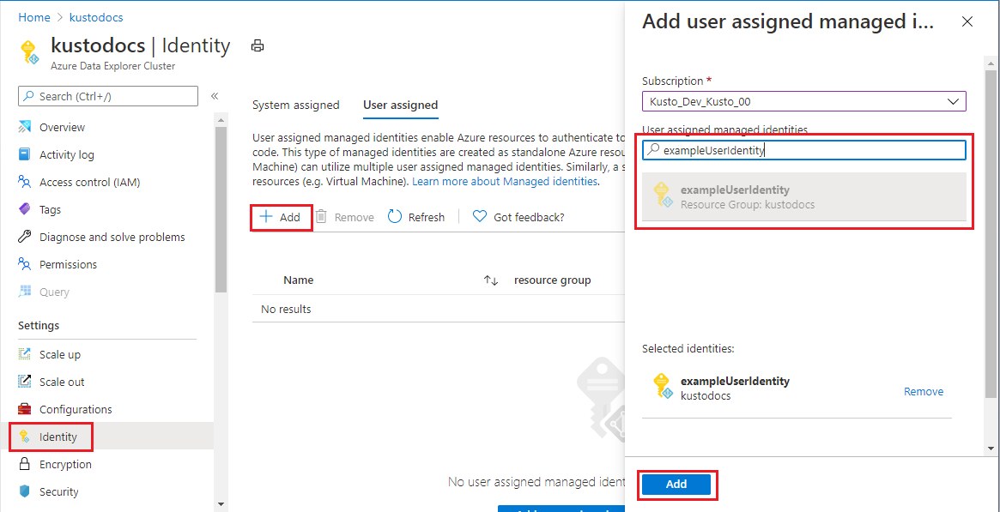

1. Sign in to the [Azure portal](https://portal.azure.com/).
1. [Create a user-assigned managed identity resource](/azure/active-directory/managed-identities-azure-resources/how-to-manage-ua-identity-portal#create-a-user-assigned-managed-identity).
1. Open an existing Azure Data Explorer cluster.
1. Select **Settings** > **Identity** in left pane of portal.
1. In the **User assigned** tab, select **Add**.
1. Search for the identity you created earlier and select it. Select **Add**.

    
