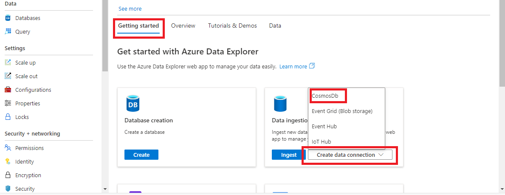
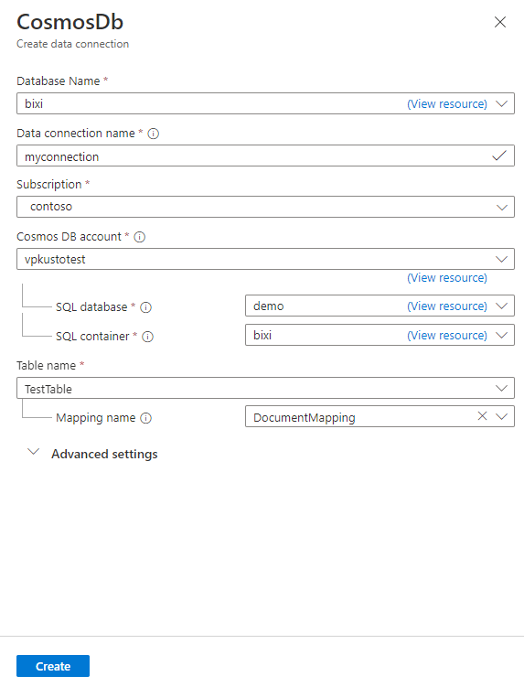
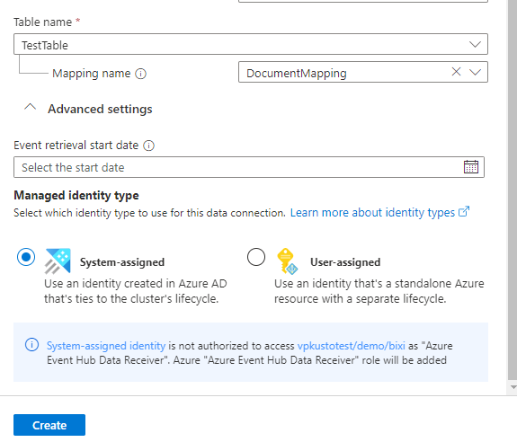
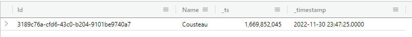

# Ingest data from Azure Cosmos DB into Azure Data Explorer (Preview)

Azure Data Explorer supports [data ingestion](ingest-data-overview.md) from [Azure Cosmos DB for NoSql](/azure/cosmos-db/nosql/) using a [change feed](/azure/cosmos-db/change-feed). The Cosmos DB change feed data connection is an ingestion pipeline that listens to your Cosmos DB change feed and ingests the data into your cluster. The change feed listens for new and updated documents but does not log deletes.

Each data connection listens to a specific Cosmos DB container and ingests data into a specified table. The ingestion method supports streaming ingestion (when enabled) and batch ingestion.

In this article, you'll learn how to set up a Cosmos DB change feed data connection to ingest data into Azure Data Explorer with System Managed Identity. Use the following steps to set up a connector.

Step 1: [Choose an Azure Data Explorer table and configure if its table mapping](#step-1-choose-an-azure-data-explorer-table-and-configure-if-its-table-mapping)

Step 2: [Configure Managed Identity Policy](#step-2-configure-managed-identity-policy)

Step 3: [Configure Cosmos DB access](#step-3-configure-cosmos-db-access)

Step 4: Create a Cosmos DB data connection

//VP:: The rest of the topics we'll move to another article and use them as next steps
//Shlomo:  If we do that (which sounds like a good idea), I would suggest to push the update policy into the other article as well.  This way we could keep this article as "the simplest use case".
//Shlomo:  something like that?  https://learn.microsoft.com/azure/data-explorer/ingest-data-event-hub-overview

## Prerequisites

//VP:: What are the prereqs?

- An Azure subscription. Create a [free Azure account](https://azure.microsoft.com/free/).
- An existing or new [cluster and database](create-cluster-database-portal.md).
- An existing container from a [Cosmos DB account for NoSql](/azure/cosmos-db/nosql/)

## Step 1: Choose an Azure Data Explorer table and configure if its table mapping

//Shlomo:  https://learn.microsoft.com/azure/data-explorer/ingest-data-event-hub#create-a-target-table-in-azure-data-explorer goes with screen shots to show how to execute a command.  I don't know if that is necessary?
// VP: Not required, though good if it's complex. I think these steps are pretty straightforward.

1. In the Azure Data Explorer web UI, select **Query** from the left navigation menu, and then select the database where you want the table to be created.

1. Copy the following command into the copy window and select Run to create the table (TestTable).

    ```kusto
    .create table TestTable(Id:string, Name:string, _ts:long, _timestamp:datetime)
    ```

1. Run the following command to create the table mapping.

    The command maps custom properties from a Cosmos DB JSON document to columns in your Azure Data Explorer table, as follows:

    | Cosmos DB property | Table column | Transformation |
    |--|--|--|
    | id | Id | None |
    | name | Name | None |
    | _ts | _ts | None |
    | _ts | _timestamp | Uses `DateTimeFromUnixSeconds` to transform **\_ts** ([UNIX seconds](https://wikipedia.org/wiki/Unix_time)) to **_timestamp** (`datetime`)) |

    > [!NOTE]
    > We recommend having two timestamp columns, as follows:
    >
    > - **_ts**: Use this column to reconcile data with Cosmos DB.
    > - **_timestamp**:  Use this column to run efficient time filters in your Kusto queries. For more information, see [Query best practice](/azure/data-explorer/kusto/query/best-practices).

    ~~~kusto
    .create table TestTable ingestion json mapping "DocumentMapping"
    ```
    [
        {"column":"Id","path":"$.id"},
        {"column":"Name","path":"$.name"},
        {"column":"_ts","path":"$._ts"},
        {"column":"_timestamp","path":"$._ts", "transform":"DateTimeFromUnixSeconds"}
    ]
    ```
    ~~~

## Step 2: Configure Managed Identity Policy

> [!NOTE]
> This configuration is done automatically when provisioning the data connection using the Azure portal.

The Cosmos DB data connector leverages [managed identity](/azure/data-explorer/managed-identities-overview) authentication.  To configure a System Managed Identity for your Cosmos DB connection:

1. In the Azure Data Explorer web UI, select **Query** from the left navigation menu, and then select the cluster or database for the data connection.

1. Run the following command to configure a [managed identity policy](/azure/data-explorer/kusto/management/managed-identity-policy) allowing the System Managed Identity to authenticate [data connections](/azure/data-explorer/kusto/management/managed-identity-policy#managed-identity-usages). This allows the System Managed Identity to be used in data connections.

    ~~~kql
    .alter database db policy managed_identity
    ```
    [
    {
        "ObjectId": "system",
        "AllowedUsages": "DataConnection"
    }
    ]
    ```
    ~~~

## Step 3: Configure Cosmos DB access

> [!NOTE]
> This configuration is done automatically when provisioning the data connection using the Azure portal.

> [!NOTE]
>
> This step can't be run in the *Role Assignement* Azure portal experience because the Cosmos DB role isn't listed as an Azure role.

> [!NOTE]
> The role configured in the following step is the [Cosmos DB Built-in Data Reader](/azure/cosmos-db/how-to-setup-rbac#built-in-role-definitions) as it contains the [Microsoft.DocumentDB/databaseAccounts/sqlDatabases/containers/readChangeFeed and Microsoft.DocumentDB/databaseAccounts/readMetadata](/azure/cosmos-db/how-to-setup-rbac#permission-model) action required for the connection. However, if you need more granular control of your permissions, you can define a custom role with only the required action and assign it to the managed identity.

### [Azure CLI](#tab/azurecli)

In a shell, run the following:

```bash
az cosmosdb sql role assignment create --account-name <CosmosDbAccountName> --resource-group <CosmosDbResourceGroup> --role-definition-id 00000000-0000-0000-0000-000000000001 --principal-id <ClusterPrincipalId> --scope "/"
```

Replace the placeholders with the appropriate values as described in the following table:

| Placeholder | Description |
|--|--|
| **\<CosmosDBAccountName>** | The name of your Cosmos DB account. |
| **\<CosmosDBResourceGroup>** | The name of the resource group that contains your Cosmos DB account. |
| **\<ClusterPrincipalId>** | The principle ID of your cluster. You can find your cluster's principle ID in the Azure portal. For more information, see [Configure managed identities for your cluster](configure-managed-identities-cluster.md#add-a-system-assigned-identity). |

### [ARM Template](#tab/arm)

Deploy the following ARM template in the Cosmos DB account resource group:

```json
{
    "$schema": "https://schema.management.azure.com/schemas/2019-04-01/deploymentTemplate.json#",
    "contentVersion": "1.0.0.0",
    "parameters": {
        "clusterPrincipalId": {
            "type": "string",
            "metadata": {
                "description": "The principle ID of your cluster."
            }
        },
        "cosmosDbAccount": {
            "type": "string",
            "metadata": {
                "description": "The name of your Cosmos DB account."
            }
        }
    },
    "variables": {
        "cosmosDataReader": "00000000-0000-0000-0000-000000000001",
        "roleDefinitionId": "[format('/subscriptions/{0}/resourceGroups/{1}/providers/Microsoft.DocumentDB/databaseAccounts/{2}/sqlRoleDefinitions/{3}', subscription().subscriptionId, resourceGroup().name, parameters('cosmosDbAccount'), variables('cosmosDataReader'))]"
    },
    "resources": [
        {
            "type": "Microsoft.DocumentDB/databaseAccounts/sqlRoleAssignments",
            "apiVersion": "2022-08-15",
            "name": "[concat(parameters('cosmosDbAccount'), '/', guid(parameters('clusterPrincipalId'), parameters('cosmosDbAccount')))]",
            "properties": {
                "principalId": "[parameters('clusterPrincipalId')]",
                "roleDefinitionId": "[variables('roleDefinitionId')]",
                "scope": "[resourceId('Microsoft.DocumentDB/databaseAccounts', parameters('cosmosDbAccount'))]"
            }
        }
    ]
}
```

You can find your cluster's principle ID (first parameter) in the Azure portal.  For more information, see [Configure managed identities for your cluster](configure-managed-identities-cluster.md#add-a-system-assigned-identity).

---

## Step 4: Create a Cosmos DB data connection

### [Azure Portal](#tab/portal)

From the Azure Portal overview pane of the Azure Data Explorer cluster, select *Getting started*, then *Create data connection* and then *Cosmos DB* from the drop down.



In the *Create data connection* form, select the Azure Data Explorer database you want to ingest data in, then name the data connection.

Select the subscription where the Cosmos DB NoSQL account is.  Select the Cosmos DB account, the database and the container.

Finally select the Azure Data Explorer table and the table mapping we configured in previous sections.



By Default, *System Assigned* managed identity is selected.  You can select *User-assigned* and then select the identity.



Click the *Create* button.

### [ARM Template](#tab/arm)

The following example shows an Azure Resource Manager template for adding a Cosmos DB data connection. You can [edit and deploy the template in the Azure portal](https://learn.microsoft.com/en-us/azure/azure-resource-manager/resource-manager-quickstart-create-templates-use-the-portal#edit-and-deploy-the-template) by using the form.

```json
{
    "$schema": "https://schema.management.azure.com/schemas/2019-04-01/deploymentTemplate.json#",
    "contentVersion": "1.0.0.0",
    "parameters": {
        "kustoClusterName": {
            "type": "string",
            "metadata": {
                "description": "Kusto Cluster name"
            }
        },
        "kustoDbName": {
            "type": "string",
            "metadata": {
                "description": "Kusto Database name"
            }
        },
        "kustoConnectionName": {
            "type": "string",
            "metadata": {
                "description": "Kusto Database connection name"
            }
        },
        "kustoLocation": {
            "type": "string",
            "metadata": {
                "description": "Location (Azure Region) of the Kusto cluster"
            }
        },
        "kustoTable": {
            "type": "string",
            "metadata": {
                "description": "Kusto Table name where to ingest data"
            }
        },
        "kustoMappingRuleName": {
            "type": "string",
            "defaultValue": "",
            "metadata": {
                "description": "Mapping name of the Kusto Table (if omitted, default mapping is applied)"
            }
        },
        "managedIdentityResourceId": {
            "type": "string",
            "metadata": {
                "description": "ARM resource ID of the managed identity (either the cluster resource ID for system identity or resource ID of the user managed identity)"
            }
        },
        "cosmosDbAccountResourceId": {
            "type": "string",
            "metadata": {
                "description": "ARM resource ID of Cosoms DB account"
            }
        },
        "cosmosDbDatabase": {
            "type": "string",
            "metadata": {
                "description": "Cosmos DB Database name"
            }
        },
        "cosmosDbContainer": {
            "type": "string",
            "metadata": {
                "description": "Cosmos DB container name"
            }
        },
        "retrievalStartDate": {
            "type": "string",
            "defaultValue": "",
            "metadata": {
                "description": "Date-time at which to start the data retrieval ; will default to 'now' if not provided.  Recommended date format is yyyy-MM-ddTHH:mm:ss.fffffffZ, i.e. ISO 8601 UTC standard."
            }
        }
    },
    "variables": {
    },
    "resources": [
        {
            "type": "Microsoft.Kusto/Clusters/Databases/DataConnections",
            "apiVersion": "2022-11-11",
            "name": "[concat(parameters('kustoClusterName'), '/', parameters('kustoDbName'), '/', parameters('kustoConnectionName'))]",
            "location": "[parameters('kustoLocation')]",
            "kind": "CosmosDb",
            "properties": {
                "tableName": "[parameters('kustoTable')]",
                "mappingRuleName": "[parameters('kustoMappingRuleName')]",
                "managedIdentityResourceId": "[parameters('managedIdentityResourceId')]",
                "cosmosDbAccountResourceId": "[parameters('cosmosDbAccountResourceId')]",
                "cosmosDbDatabase": "[parameters('cosmosDbDatabase')]",
                "cosmosDbContainer": "[parameters('cosmosDbContainer')]",
                "retrievalStartDate": "[parameters('retrievalStartDate')]"
            }
        }
    ]
}
```

## Testing data connection

Let's insert the following document in the Cosmos DB container:

```json
{
    "name":"Cousteau"
}
```

To see this document in Azure Data Explorer table, run the following query:

```kusto
TestTable
```

The result set should look like the following image:



> [!NOTE]
>
> * Azure Data Explorer has an aggregation (batching) policy for data ingestion, designed to optimize the ingestion process. The default batching policy is configured to seal a batch once one of the following conditions is true for the batch: a maximum delay time of 5 minutes, total size of 1G, or 1000 blobs. Therefore, you may experience a latency. For more information, see [batching policy](kusto/management/batchingpolicy.md).
> * To reduce response time lag, configure your table to support streaming. See [streaming policy](kusto/management/streamingingestionpolicy.md).

## Next steps
