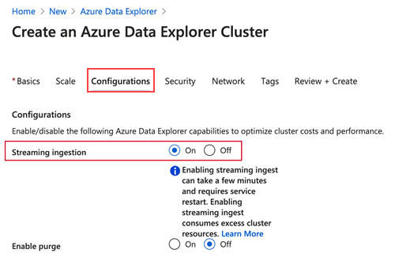

# Streaming ingestion

> [!div class="op_single_selector"]
> * [Portal](ingest-data-streaming.md)
> * [C#](ingest-data-streaming-csharp.md)

[!INCLUDE [ingest-data-streaming-intro](includes/ingest-data-streaming-intro.md)]

## Prerequisites

* If you don't have an Azure subscription, create a [free Azure account](https://azure.microsoft.com/free/) before you begin.
* Create [an Azure Data Explorer cluster and database](create-cluster-database-portal.md)

## Enable streaming ingestion on your cluster

> [!NOTE]
> You can enable streaming ingestion while creating a new Azure Data Explorer cluster. <br>
> In the **Configurations** tab, select **Streaming ingestion** > **On**.
> 

**In the Azure portal:**

1. In the Azure portal, go to your Azure Data Explorer cluster. 
1. In **Settings**, select **Configurations**. 
1. In the **Configurations** pane, select **On** to enable **Streaming ingestion**.
1. Select **Save**.

    :::image type="content" source="media/ingest-data-streaming/streaming-ingestion-on.png" alt-text="Turn on streaming ingestion in Azure Data Explorer":::

> [!WARNING]
> Review the [limitations](#limitations) prior to enabling steaming ingestion.

## Create a target table and define the policy

1. In the Azure portal, navigate to your cluster.
1. Select **Query**.

    :::image type="content" source="media/ingest-data-streaming/cluster-select-query-tab.png" alt-text="Select query in the Azure Data Explorer portal to enable streaming ingestion":::

1. To create the table that will receive the data via streaming ingestion, copy the following command into the **Query pane** and select **Run**.

    ```Kusto
    .create table TestTable (TimeStamp: datetime, Name: string, Metric: int, Source:string)
    ```

    :::image type="content" source="media/ingest-data-streaming/create-table.png" alt-text="Create a table for streaming ingestion into Azure Data Explorer":::

1. Define the [streaming ingestion policy](kusto/management/streamingingestionpolicy.md) on the table you've created or on the database that contains this table. A policy that is defined at the database level applies to all existing and future tables in the database. Copy one of the following commands into the **Query pane**, and select **Run**.

    ```kusto
    .alter table TestTable policy streamingingestion enable
    ```

    or

    ```kusto
    .alter database StreamingTestDb policy streamingingestion enable
    ```

    :::image type="content" source="media/ingest-data-streaming/define-streamingingestion-policy.png" alt-text="Define the streaming ingestion policy in Azure Data Explorer":::

[!INCLUDE [ingest-data-streaming-use](includes/ingest-data-streaming-ingest.md)]

1. In the Azure portal, go to your Azure Data Explorer cluster and select **Query**. 
1. To drop the streaming ingestion policy from the table, copy the following command into **Query pane** and select **Run**.

    ```Kusto
    .delete table TestTable policy streamingingestion 
    ```

    :::image type="content" source="media/ingest-data-streaming/delete-streamingingestion-policy.png" alt-text="Delete streaming ingestion policy in Azure Data Explorer":::

1. In **Settings**, select **Configurations**.
1. In the **Configurations** pane, select **Off** to disable **Streaming ingestion**.
1. Select **Save**.

    :::image type="content" source="media/ingest-data-streaming/streaming-ingestion-off.png" alt-text="Turn off streaming ingestion in Azure Data Explorer":::

[!INCLUDE [ingest-data-streaming-limitations](includes/ingest-data-streaming-limitations.md)]

## Next steps

* [Query data in Azure Data Explorer](web-query-data.md)
