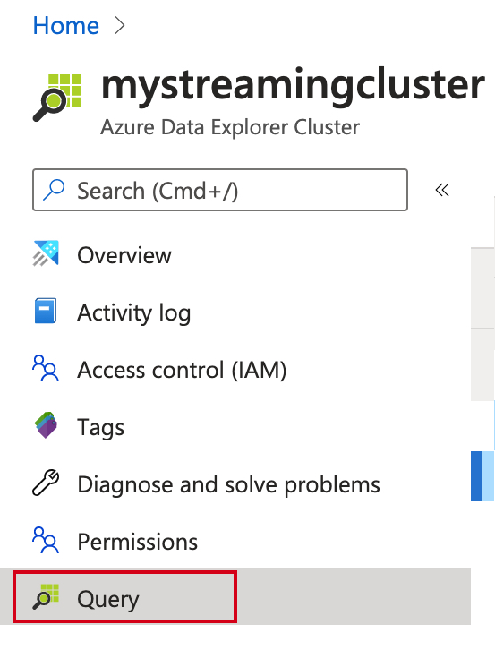
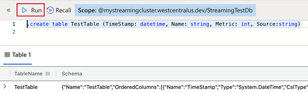
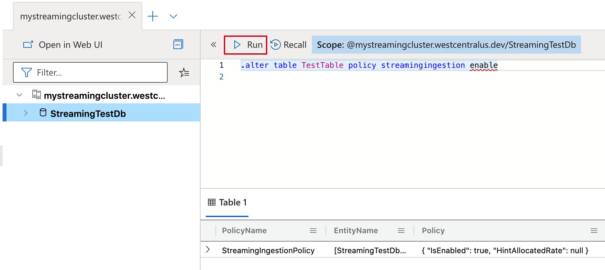
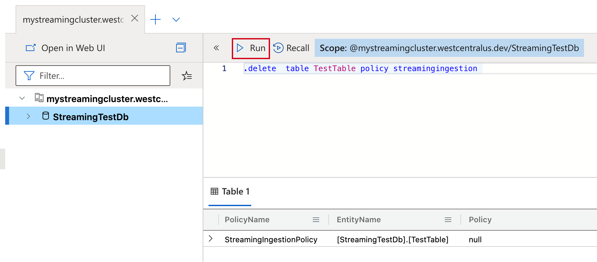
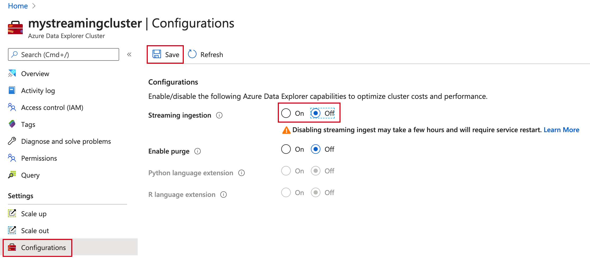

# Streaming ingestion

> [!div class="op_single_selector"]
> * [Portal](ingest-data-streaming.md)
> * [C#](streaming-ingestion-setup-csharp.md)

[!INCLUDE [ingest-data-streaming-include-intro](includes/ingest-data-streaming-include-intro.md)]

## Prerequisites

* If you don't have an Azure subscription, create a [free Azure account](https://azure.microsoft.com/free/) before you begin.
* Create [an Azure Data Explorer cluster and database](create-cluster-database-portal.md)
> [!NOTE]
You can enable streaming ingestion while creating a new Azure Data Explorer cluster
In the **Configurations** section select **On** to enable **Streaming ingestion**.


## Enable streaming ingestion on your cluster

> [!WARNING]
> Please review the [limitations](#limitations) prior to enabling steaming ingestion.

1. In the Azure portal, go to your Azure Data Explorer cluster. In **Settings**, select **Configurations**. 
1. In the **Configurations** pane, select **On** to enable **Streaming ingestion**.
1. Select **Save**.
 
    

## Create a target table and define streaming ingestion policy

1. In the Azure portal, navigate to your cluster then select **Query**.
 

1. To create the table that will receive the data via streaming copy the following command into Query pane and run
    ```Kusto
    .create table TestTable (TimeStamp: datetime, Name: string, Metric: int, Source:string)
    ```
     

1. Define [streaming ingestion policy](kusto/management/streamingingestionpolicy.md) on the table just created or on the database that contains it. Policy defined at the database level applies to all existing and future tables in the database. Copy one of the following commands into Query pane and run
    ```kusto
    .alter table TestTable policy streamingingestion enable
    ```
    or
    ```kusto
    .alter database StreamingTestDb policy streamingingestion enable
    ```
     


## Use streaming ingestion to ingest data to your cluster

There are two supported streaming ingestion types:

* [**Event Hub**](ingest-data-event-hub.md) or [**IoT Hub**](ingest-data-iot-hub.md), which is used as a data source.
* **Custom ingestion** requires you to write an application that uses one of the Azure Data Explorer [client libraries](kusto/api/client-libraries.md). See [streaming ingestion sample](https://github.com/Azure/azure-kusto-samples-dotnet/tree/master/client/StreamingIngestionSample) for a sample application.

### Choose the appropriate streaming ingestion type

|   |Event Hub  |Custom Ingestion  |
|---------|---------|---------|
|Data delay between ingestion initiation and the data available for query   |    Longer delay     |   Shorter delay      |
|Development overhead    |   Fast and easy setup, no development overhead    |   High development overhead for application to handle errors and ensure data consistency     |

## Disable streaming ingestion on your cluster

[!INCLUDE [ingest-data-streaming-include-disabling](includes/ingest-data-streaming-include-disabling.md)]
1. In the Azure portal, go to your Azure Data Explorer cluster and select **Query**.
To drop streaming ingestion policy from the table copy the following command into **Query** pane and run
    ```Kusto
    .delete  table TestTable policy streamingingestion 
    ```
    

1. In **Settings**, select **Configurations**.
1. In the **Configurations** pane, select **Off** to disable **Streaming ingestion**.
1. Select **Save**.

    

## Limitations

[!INCLUDE [ingest-data-streaming-include-limitations](includes/ingest-data-streaming-include-limitations.md)]

## Next steps

* [Query data in Azure Data Explorer](web-query-data.md)
