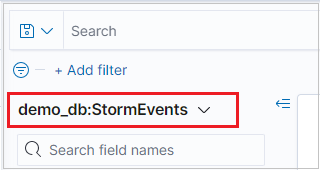
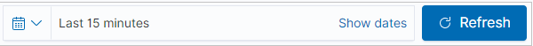
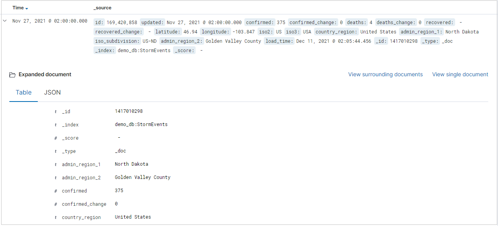
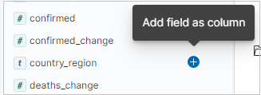
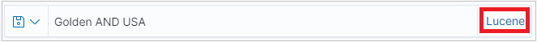
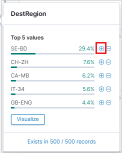
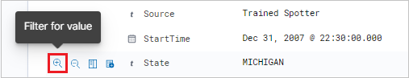
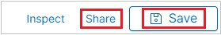

# Visualize data from Azure Data Explorer in Kibana with the K2Bridge open-source connector

K2Bridge (Kibana-Kusto Bridge) lets you use Azure Data Explorer as a data source and visualize that data in Kibana. K2Bridge is an [open-source](https://github.com/microsoft/K2Bridge), containerized application. It acts as a proxy between a Kibana instance and an Azure Data Explorer cluster. This article describes how to use K2Bridge to create that connection.

K2Bridge translates Kibana queries to Kusto Query Language (KQL) and sends the Azure Data Explorer results back to Kibana.

   

K2Bridge supports Kibana's **Discover** tab, where you can:

* Search and explore the data.
* Filter results.
* Add or remove fields in the results grid.
* View record content.
* Save and share searches.

The following image shows a Kibana instance bound to Azure Data Explorer by K2Bridge. The user experience in Kibana is unchanged.

   [](media/k2bridge/k2bridge-kibana-page.png#lightbox)

## Prerequisites

Before you can visualize data from Azure Data Explorer in Kibana, have the following ready:

* [Helm v3](https://github.com/helm/helm#install), which is the Kubernetes package manager.

* Azure Kubernetes Service (AKS) cluster or any other Kubernetes cluster. Versions 1.14 to 1.16 have been tested and verified. If you need an AKS cluster, see how to deploy an AKS cluster [using the Azure CLI](https://docs.microsoft.com/azure/aks/kubernetes-walkthrough) or [using the Azure portal](https://docs.microsoft.com/azure/aks/kubernetes-walkthrough-portal).

* An [Azure Data Explorer cluster](create-cluster-database-portal.md), including the cluster's URL and the database name.

* An Azure Active Directory (Azure AD) service principal authorized to view data in Azure Data Explorer, including the client ID and client secret.

    We recommend a service principal with viewer permission and discourage you from using higher-level permissions. [Set the cluster's view permissions for the Azure AD service principal](manage-database-permissions.md#manage-permissions-in-the-azure-portal).

    For more information about the Azure AD service principal, see [Create an Azure AD service principal](https://docs.microsoft.com/azure/active-directory/develop/howto-create-service-principal-portal#create-an-azure-active-directory-application).

## Run K2Bridge on Azure Kubernetes Service (AKS)

By default, the Helm chart of K2Bridge references a publicly available image located in Microsoft Container Registry (MCR). MCR doesn't require any credentials.

1. Download the required Helm charts.

1. Add the Elasticsearch dependency to Helm. The dependency is required because K2Bridge uses a small internal Elasticsearch instance. The instance services metadata-related requests like index-patterns queries and saved queries. This internal instance saves no business data. You can consider the instance to be an implementation detail.

    1. To add the Elasticsearch dependency to Helm, run these commands:

        ```bash
        helm repo add elastic https://helm.elastic.co
        helm repo update
        ```

    1. To get the K2Bridge chart from the charts directory of the GitHub repository:

        1. Clone the repository from [GitHub](https://github.com/microsoft/K2Bridge).
        1. Go to the K2Bridges root repository directory.
        1. Run this command:

            ```bash
            helm dependency update charts/k2bridge
            ```

1. Deploy K2Bridge.

    1. Set the variables to the correct values for your environment.

        ```bash
        ADX_URL=[YOUR_ADX_CLUSTER_URL] #For example, https://mycluster.westeurope.kusto.windows.net
        ADX_DATABASE=[YOUR_ADX_DATABASE_NAME]
        ADX_CLIENT_ID=[SERVICE_PRINCIPAL_CLIENT_ID]
        ADX_CLIENT_SECRET=[SERVICE_PRINCIPAL_CLIENT_SECRET]
        ADX_TENANT_ID=[SERVICE_PRINCIPAL_TENANT_ID]
        ```

    1. Optionally, enable Application Insights telemetry. If you're using Application Insights for the first time, [create an Application Insights resource](https://docs.microsoft.com/azure/azure-monitor/app/create-new-resource). [Copy the instrumentation key](https://docs.microsoft.com/azure/azure-monitor/app/create-new-resource#copy-the-instrumentation-key) to a variable.

        ```bash
        APPLICATION_INSIGHTS_KEY=[INSTRUMENTATION_KEY]
        COLLECT_TELEMETRY=true
        ```

    1. <a name="install-k2bridge-chart"></a>
    Install the K2Bridge chart.

        ```bash
        helm install k2bridge charts/k2bridge -n k2bridge --set image.repository=$REPOSITORY_NAME/$CONTAINER_NAME --set settings.adxClusterUrl="$ADX_URL" --set settings.adxDefaultDatabaseName="$ADX_DATABASE" --set settings.aadClientId="$ADX_CLIENT_ID" --set settings.aadClientSecret="$ADX_CLIENT_SECRET" --set settings.aadTenantId="$ADX_TENANT_ID" [--set image.tag=latest] [--set privateRegistry="$IMAGE_PULL_SECRET_NAME"] [--set settings.collectTelemetry=$COLLECT_TELEMETRY]
        ```

        In [Configuration](https://github.com/microsoft/K2Bridge/blob/master/docs/configuration.md), you can find the complete set of configuration options.

    1. <a name="install-kibana-service"></a>
    The previous command's output suggests the next Helm command to deploy Kibana. Optionally, run this command:

        ```bash
        helm install kibana elastic/kibana -n k2bridge --set image=docker.elastic.co/kibana/kibana-oss --set imageTag=6.8.5 --set elasticsearchHosts=http://k2bridge:8080
        ```

    1. Use port forwarding to access Kibana on localhost.

        ```bash
        kubectl port-forward service/kibana-kibana 5601 --namespace k2bridge
        ```

    1. Connect to Kibana by going to http://127.0.0.1:5601.

    1. Expose Kibana to users. There are multiple methods to do so. The method you use largely depends on your use case.

        For example, you can expose the service as a Load Balancer service. To do so, add the **--set service.type=LoadBalancer** parameter to the [earlier Kibana Helm **install** command](#install-kibana-service).

        Then run this command:

        ```bash
        kubectl get service -w -n k2bridge
        ```

        The output should look like this:

        ```bash
        NAME            TYPE           CLUSTER-IP     EXTERNAL-IP   PORT(S)          AGE
        kibana-kibana   LoadBalancer   xx.xx.xx.xx    <pending>     5601:30128/TCP   4m24s
        ```

        You can then use the generated EXTERNAL-IP value that appears. Use it to access Kibana by opening a browser and going to \<EXTERNAL-IP\>:5601.

1. Configure index patterns to access your data.

    In a new Kibana instance:

    1. Open Kibana.
    1. Browse to **Management**.
    1. Select **Index Patterns**.
    1. Create an index pattern. The name of the index must exactly match the table name or function name without an asterisk (\*). You can copy the relevant line from the list.

> [!Note]
> To run K2Bridge on other Kubernetes providers, change the Elasticsearch **storageClassName** value in values.yaml to match the one suggested by the provider.

## Visualize data

When Azure Data Explorer is configured as a data source for Kibana, you can use Kibana to explore the data.

1. In Kibana, on the leftmost menu, select the **Discover** tab.

1. From the leftmost drop-down list box, select an index pattern. The pattern defines the data source you want to explore. In this case, the index pattern is an Azure Data Explorer table.

   

1. If your data has a time-filter field, you can specify the time range. At the upper right of the **Discover** page, select a time filter. By default, the page shows data for the last 15 minutes.

   

1. The results table shows the first 500 records. You can expand a document to examine its field data in either JSON or table format.

   

1. By default, the results table includes the **_source** column. It also includes the **Time** column if the time field exists. You can add specific columns to the results table by selecting **add** next to the field name in the leftmost pane.

   

1. In the query bar, you can search the data by:

    * Entering a search term.
    * Using the Lucene query syntax. For example:
        * Search for "error" to find all records that contain this value.
        * Search for "status: 200" to get all records with a status value of 200.
    * Using the logical operators **AND**, **OR**, and **NOT**.
    * Using the asterisk (\*) and question mark (?) wildcard characters. For example, the query "destination_city: L*" matches records where the destination-city value starts with "L" or "l". (K2Bridge isn't case-sensitive.)

    

    > [!Tip]
    > In [Searching](https://github.com/microsoft/K2Bridge/blob/master/docs/searching.md), you can find more search rules and logic.

1. To filter your search results, use the field list on the rightmost pane of the page. The field list is where you can see:

    * The top five values for the field.
    * The number of records that contain the field.
    * The percentage of records that contain each value.

    >[!Tip]
    > Use the magnifying glass to find all records that have a specific value.

    

    You can also use the magnifying glass to filter results and see the results table-format view of each record in the results table.

     

1. Select either **Save** or **Share** for your search.

     
