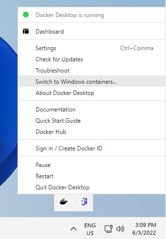

> [!NOTE]
> The image might not run in process-isolation mode. Make sure that the container is started in Hyper-V isolation mode by adding --isolation=hyperv to the docker run command.

# Kusto emulator Installation

Installing the Kusto emulator on your laptop allows to quickly get a local development environment while installing it on a CI/CD agent VM allows for running automated tests.

In this article, we'll show you how to install the Kusto emulator and quickly get started by creating a database, ingesting data and querying it.

## Prerequisites

* The host OS must be either
  * Windows Server 2022
  * Windows Server 2019 Version 10.0.17763.2928 and above)
  * Windows 11
* [Docker Client](https://docs.docker.com/desktop/windows/install/)

## License Terms

The container image is covered by [license terms](https://aka.ms/adx.emulator.license).

Since a container runs without a graphical interface, there are no screen to accept / consent to the license terms.  This is done instead by passing an environment variable to the container named `ACCEPT_EULA` of value `Y` (yes).

## Run Docker for Windows

The first step to run the Kusto Emulator is to ensure we are running Docker with Windows containers (the default is Linux containers).



This might require you to enable the feature.

## Run Container

You can run the Kusto Emulator with a simple `docker run` (e.g. in PowerShell) on the [Kusto Emulator Container Image](https://aka.ms/adx.emulator.image) passing the *License Terms consent environment variable* discussed in the previous section.

We will give a concrete example here, assuming you are running on a Windows Server host.  We will give [different variations](#Run-Container-Variations) in the next section.

```bash
docker run -e ACCEPT_EULA=Y -m 4G -d -p 8080:8080 -t mcr.microsoft.com/azuredataexplorer/kustainer:latest
```

> [!NOTE]
> The first time this command is executed, Docker is going to *pull* the image which is several GBs.  It is therefore normal for this step to take several minutes.  The image is cached hence later runs will not have this overhead.

> [!NOTE]
> The Kusto Container image requires at least 2 GB of RAM.  Here we forced the container to take 4 GB.

The command should return while the container is running.  We can verify the container is running with:

```bash
docker ps
```

This will list the container instances running and should include one with *image* `mcr.microsoft.com/azuredataexplorer/kustainer:latest`.  For instance:

```
CONTAINER ID   IMAGE                                                  COMMAND                  CREATED          STATUS          PORTS                    NAMES
a8b51bce21ad   mcr.microsoft.com/azuredataexplorer/kustainer:latest   "powershell -Commandâ&euro;¦"   11 minutes ago   Up 10 minutes   0.0.0.0:8080->8080/tcp   youthful_matsumoto
```

We can verify that Kusto is running using the following command (in PowerShell):

```bash
curl -Method post -ContentType 'application/json' -Body '{"csl":".show cluster"}' http://localhost:8080/v1/rest/mgmt
```

This should return something similar to the following:

```
StatusCode        : 200
StatusDescription : OK
Content           : {"Tables":[{"TableName":"Table_0","Columns":[{"ColumnName":"NodeId","DataType":"String","ColumnType":"string"},{"ColumnName":"Address","DataType":"St
                    ring","ColumnType":"string"},{"ColumnName":"Name","...
RawContent        : HTTP/1.1 200 OK
                    Transfer-Encoding: chunked
                    x-ms-client-request-id: unspecified;d239f3aa-7df0-4e46-af0a-edd7139d0511
                    x-ms-activity-id: a0ac8941-7e4c-4176-98fa-b7ebe14fae90
                    Content-Type: application...
Forms             : {}
Headers           : {[Transfer-Encoding, chunked], [x-ms-client-request-id, unspecified;d239f3aa-7df0-4e46-af0a-edd7139d0511], [x-ms-activity-id, 
                    a0ac8941-7e4c-4176-98fa-b7ebe14fae90], [Content-Type, application/json]...}
Images            : {}
InputFields       : {}
Links             : {}
ParsedHtml        : System.__ComObject
RawContentLength  : 988
```

We just ran the command `.show cluster` against the management API and it returned a `200-OK`.

## Run Container Variations

### Mounting a local folder to the container

A useful variation consists in mounting a folder from the host into the container.  This will allow the Kusto Query Engine to interact with local files, for instance to ingest data and to persist database state.

To mount the folder "D:\host\local" on the host to the folder "c:\kusto" in the container:

```bash
docker run -v d:\host\local:c:\kustomount -e ACCEPT_EULA=Y -m 4G -d -p 8080:8080 -t mcr.microsoft.com/azuredataexplorer/kustainer:latest
```

### Running on Windows 11

In the previous section, we assumed the Host OS was Windows Server.

In order to run on Windows Client, we would use the `windows11` tag:

```bash
docker run -e ACCEPT_EULA=Y -m 4G -d -p 8080:8080 -t mcr.microsoft.com/azuredataexplorer/kustainer:windows11
```

### Running on a different port

We mapped the container internal port 8080 (exposing the query engine) to the host port 8080 (hence the `8080:8080` in the command).

To map it to a different port on the host, e.g. port 9000, we would map the ports this way:

```bash
docker run -e ACCEPT_EULA=Y -m 4G -d -p 9000:8080 -t mcr.microsoft.com/azuredataexplorer/kustainer:latest
```

## Tools to connect to the emulator

In order to interact with the Kusto emulator, we can use one of the following tools:

* [Kusto.Explorer](https://docs.microsoft.com/en-us/azure/data-explorer/kusto/tools/kusto-explorer)
* [Kusto.CLI](https://docs.microsoft.com/en-us/azure/data-explorer/kusto/tools/kusto-cli)
* [Kusto.Data SDKs](https://docs.microsoft.com/en-us/azure/data-explorer/kusto/api/netfx/about-kusto-data)

In this article, we will use the [Kusto.Explorer](https://docs.microsoft.com/en-us/azure/data-explorer/kusto/tools/kusto-explorer) rich client.

## Creating a volatile database

The following command (e.g. executed in [Kusto.Explorer](https://docs.microsoft.com/en-us/azure/data-explorer/kusto/tools/kusto-explorer)):

```kusto
.create database <DBName> volatile
```

creates a *volatile* database.  That is a database existing only in RAM.

## Creating a persistent database

```kusto
.create database <DBName> persist (
  @"c:\kusto\dbs\<DBName>\md",
  @"c:\kusto\dbs\<DBName>\data"
  )
```

This commands creates a database persisting its data on disk.  The data is persisted *in the container* and therefore doesn't persist between container runs.

If the path is a mount (see [mounting](#Mounting-a-local-folder-to-the-container)), the data is persisted outside the container and persisted between container runs.

## Ingest local file

Assuming we have mounted a local folder into the container at `c:\kustomount` (container path), we will create a sub folder named `sample` in the host folder.  In that folder, we will create a simple CSV file in the folder called `sample.csv`:

```
Alice, 1
Bob, 2
Carl, 3
```

We should be able to consume that file through an [external table](https://docs.microsoft.com/en-us/azure/data-explorer/kusto/management/external-tables-azurestorage-azuredatalake#properties):

```kusto
.create external table MySample(Name:string, Age:int)
kind=storage 
dataformat=csv
( 
   @"c:\kustomount\sample"
)
```

We should see the data with:

```kusto
external_table('MySample')
```

We will then [ingest that data](https://docs.microsoft.com/en-us/azure/data-explorer/kusto/management/data-ingestion/ingest-from-query) in a database we created:

```kusto
.set MyIngestedSample <| external_table('MySample')
```

This creates the table `MyIngestedSample` and ingest the external table content in.

We should then be able to query that table:

```kusto
MyIngestedSample
| summarize sum(Age), avg(Age)
```

## Stopping the container

You can stop the container by running

```bash
docker ps
```

Find the container id of the Kusto Container and the run:

```bash
docker stop <container ID>
```
