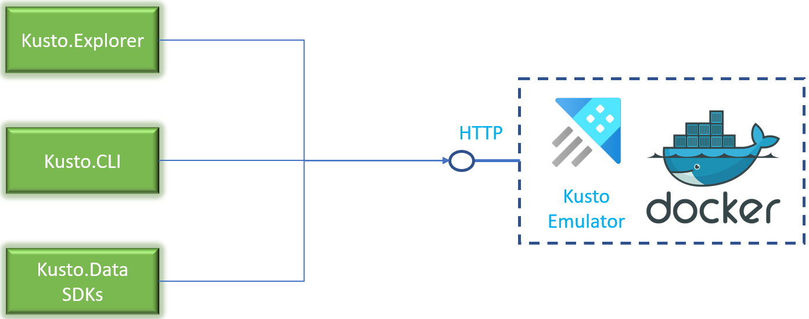

# Azure Data Explorer Kusto emulator

The Kusto emulator is a local environment that encapsulates the query engine. You can use the environment to facilitate local development and automated testing. Since the environment runs locally, it doesn't require provisioning Azure services or incurring any cost; it's a free offering under the [Microsoft Software License Terms](https://aka.ms/adx.emulator.license).

> [!IMPORTANT]
>
> - The emulator is provided *as-is*, without any support or warranties.
> - The emulator isn't intended for use in production environments.
> - The [license terms](https://aka.ms/adx.emulator.license) explicitly prohibit benchmark tests using the emulator as it is not intended or optimized for that purpose. The emulator has a very different performance profile compared to the Azure Data Explorer service.

## Architecture

The emulator is available as a *Windows* or *Linux* Docker container image. It exposes a query endpoint over HTTP that can be used with any client including [Kusto.Explorer](kusto/tools/kusto-explorer-using.md), [Kusto.CLI](kusto/tools/kusto-cli.md), or [Kusto.Data SDKs](kusto/api/netfx/about-kusto-data.md).

The emulator supports all commands and queries within its [architecture limitations](#limitations). For instance, [Row Level Security policy commands](kusto/management/rowlevelsecuritypolicy.md) are supported but since there's no authentication in the emulator, they aren't useful.

The emulator doesn't include the [data management service](ingest-data-overview.md) and hence doesn't support queued, managed, or streaming ingestion. However, you can ingest data using [ingestion commands](kusto/management/data-ingestion/ingest-from-query.md). Data can be ingested from local files, [external tables](kusto/query/schema-entities/externaltables.md), or [external data](kusto/query/externaldata-operator.md?pivots=azuredataexplorer). By default, ingested data is persisted on the disk within the container; hence, the data is as transient as the container itself. If you want to retain the data, you can persist it outside the container by mounting a volume on the container and persisting the data to the volume.

## Kusto emulator scenarios

The main scenarios for the emulator are:

- **Local development**: You can use the emulator to develop queries without provisioning an Azure service and without a connection to the internet.
- **Automated testing**: You can perform automated tests using the emulator without provisioning an Azure service and without a connection to the internet. It can be an efficient way to perform automated tests using the Kusto Query Engine.

## Kusto emulator vs. free cluster

There are some overlaps between the Kusto emulator and the [free cluster](start-for-free.md) offerings.  The following table contrasts the features of the offerings.

| Item | Kusto emulator | Free cluster |
|--|--|--|
| Storage (uncompressed) | Only limited by host capacity | Approx. 100 GB |
| Databases | Up to 10000 | Up to 10 |
| Tables per database | 10000 | Up to 100 |
| Columns per table | 10000 | Up to 200 |
| External tables | To *local* files | No support |
| Materialized views per database | 1000 | Up to 5 |
| Managed ingestion pipelines | None | All of them |
| Security features | None | Encrypted connection only |
| Long term data management | No extent merge capability | Full support |
| Internet requirement | No connectivity required | Cloud service |

When choosing the best option for your use case, you should consider the following:

- **Local development**: The best fit for local development depends on the features you require. For instance, if your scenario requires the use of managed pipelines, the free cluster offering works best. On the other hand, if your scenario requires local development in a disconnected environment, the Kusto emulator would be a better fit.
- **Automated testing**: In general, the Kusto emulator is more suited to automated testing than the free cluster offering.  It's faster to provision and doesn't require any Azure principal to set up.

[!INCLUDE [kusto-emulator-limitations](includes/kusto-emulator-limitations.md)]

## Next step

> [!div class="nextstepaction"]
> [Install the Kusto emulator](kusto-emulator-install.md)
