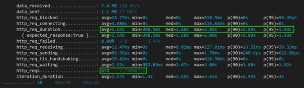
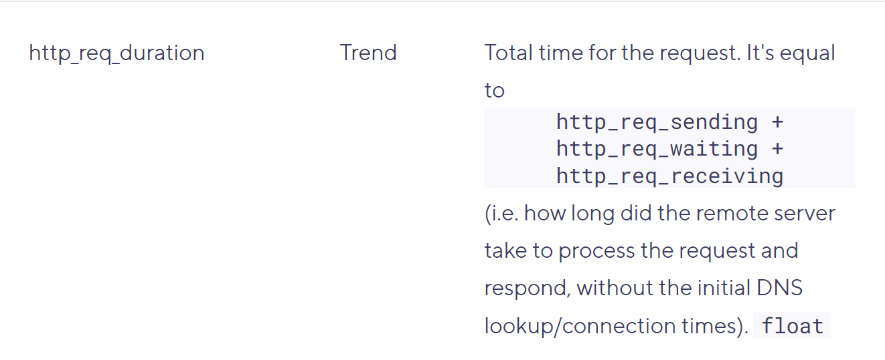
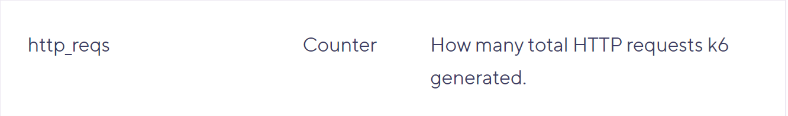

# Load testing ADX with Grafana k6

## Introdcution
Grafana K6 is a open source tool built for load testing using javascript and integration with a lot of other tools like visual studio, GitHub and more! In this article, we will configure k6 to connect to our ADX cluster, perform load test by running KQL queries on ADX REST API and interpret the results.

## Pre-requisites:
•	Latest version of Visual Studio Code or any other equivalent IDE.

•	Install k6 on your local machine. There are multiple installation options depending on the environment that you intend to use. Install (k6.io) OR You can also use k6 Cloud offering to create, configure and execute load tests. K6 cloud is accessible at https://app.k6.io. Free trial account lets you run 50 tests, so you will need to be judicious in running your tests. Local installation on your PC allows you to run unlimited tests.

## Steps to test:
### Step 1: Create and configure k6 test script
In Visual Studio Code or any other IDE, create a javascript and paste the following code and replace the following parameters in the code with the appropriate values. You will need values for the following parameters:
|Parameter|		Example value|	Guidance|
|---|---|---|
|duration|	1m	|Number of minutes for which the load test will run|
|vus	|20	|Number of virtual users that will be created for  simulating the load|
|access_token	||	Retrieved from initial prerequisites steps|
|Cluster-uri|	https://clustername.regionname.kusto.windows.net|Retrieved from initial prerequisites steps|
|Database name|	Sampledb	|
|Kusto Query|	Tablename \| take 10|	Take note of the usage of “” in the query text |
|Random UUID|	e9f884e4-90f0-404a-8e8b-01d883023bf1|	Use any internet based generator to generate a UUID|
|Host	|Clustername.regionname.kusto.windows.net|	For Synapse Data Explorer Pool, use the relevant Data Explorer Pool URI|
|'x-ms-client-request-id'	|e9f884e4-90f0-404a-8e8b-01d883023bf1	|Same as the one generated above|
|'x-ms-user-id'|	Domain/username|	Useful in tracing and Root Cause Analysis of performance|
|'x-ms-app'|	k6	||

```javascript
// Scenario: Scenario_1 (executor: constant-vus)

import { sleep } from 'k6'
import http from 'k6/http'

export const options = {
  ext: {
    loadimpact: {
      distribution: { 'amazon:fr:paris': { loadZone: 'amazon:fr:paris', percent: 100 } },
      apm: [],
    },
  },
  thresholds: {},
  scenarios: {
    Scenario_1: {
      executor: 'constant-vus',
      gracefulStop: '30s',
      duration: '<duration-in-minutes>',
      vus: <number-of-users>,
      exec: 'scenario_1',
    },
  },
}

export function scenario_1() {
  let response;
  let authtoken = 'Bearer <access_token>[retrieved in Step 3';
  
  response = http.post(
    '<cluster-uri>/v2/rest/query',
    '{\r\n  "db":"<database-name>",\r\n  "csl":"<your-kusto-query>",\r\n  "properties":"{\\"Options\\":{\\"queryconsistency\\":\\"strongconsistency\\"},\\"Parameters\\":{},\\"ClientRequestId\\":\\"k6.Query;<random-uuid>\\"}"\r\n}',
    {
      headers: {
        Accept: 'application/json',
        'Content-Type': 'application/json; charset=utf-8',
        Host: '<cluster-uri> without https://',
        'Accept-Encoding': 'gzip',
        'x-ms-client-request-id': '<app-name>;<random-uuid>',
        'x-ms-user-id': '<user-name>',
        'x-ms-app': '<app-name>',
        Authorization:
          authtoken,
      },
    }
  )
  // Automatically added sleep
  sleep(1)
}
```

>[!TIP]
>	If you plan to include multiple queries in the same load test script, distinguish each query by including a Query identifier (for example, Q001) in the Client Request Id. So, your client request id could look like ‘Q001; e9f884e4-90f0-404a-8e8b-01d883023bf1’. You can then use this identifier in Step 6 to distinguish each query and the time it took for execution. 

•	K6 provides configuring complex load tests. You can use the option() function to configure complex load test runs. You can also create multiple scenarios in the same load test. You can also use k6 Cloud offering to create, configure and execute load tests.

### Step 2: Create query performance monitoring dashboard in ADX
While k6 provides very useful statistics on the query execution results, you can build a similar dashboard in ADX with following example query:
```KQL
.show queries 
| where StartedOn >=ago(1h)l’
| where Application == "k6" //delete-this: [or app-name as you have specified in step5]
| where Database == "<database-name>"
| where State == "Completed"
| summarize percentile(Duration, 95), avg(Duration), min(Duration), max(Duration), count() by Text
| extend P95_seconds = format_timespan(percentile_Duration_95,"s.ff"), Avg_seconds = format_timespan(avg_Duration,"s.ff")
| extend Min_seconds = format_timespan(min_Duration,"s.ff"), Max_seconds = format_timespan(max_Duration,"s.ff"), TotalExecutions = count_
| project-away percentile_Duration_95, avg_Duration, min_Duration, max_Duration, count_
```

Output of this query will show the Duration that ADX takes to execute all the requests sent by k6. You can use this dashboard for future purposes as well.
### Step 3: Execute k6 test script
In VS Code or IDE of your choice, use Powershell or Bash to run the javascript that you created in step 5 using the following command:
k6 run \<your-k6-test-script-file-name>.js
On running this command, you will get the following screen showing the progress of your load test result

 
>[!TIP]
>	Before starting a full test run, perform a small load test execution with 1-2 virtual users for 10seconds. This will tell you if there are any http errors, authentication or authorization issues before you launch the full load test run and wait for it to complete and discover that all http requests had failed.

### Step 4: Interpret k6 results and ADX dashboard results
On completion of k6 load test run, you will receive the result as follows:

While there’s plenty of interesting information in the output of k6 run (refer to this link [Metrics (k6.io)](https://k6.io/docs/using-k6/metrics#built-in-metrics) for understanding all the metrics), the most important information is highlighted in green box. 


 
 
 
 

### Troubleshooting
•	Authentication issue: Bearer token is valid for 3600 seconds normally. So, ensure that you always retrieve the latest token before running the test to avoid getting http authentication failure errors.

•	Authorization issue: Ensure that the service principal has the right Viewer role on the database in ADX.