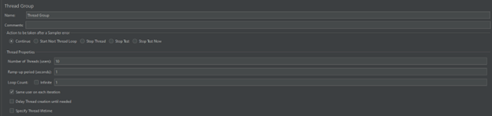
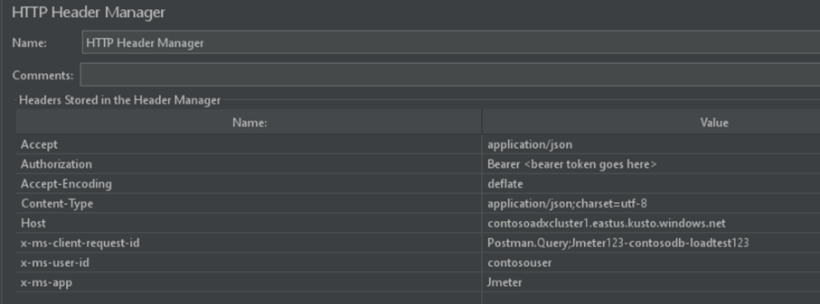

# Load Testing ADX with JMeter
## Introdcution
JMeter is a Java open source tool designed to load test functional behavior and measure performance. You can use JMeter to analyze and measure the performance of web application or a variety of services. In this article, we will configure JMeter to connect to our ADX cluster, perform load test by running KQL queries on ADX REST API and interpret the results.

## Pre-requisites :
•	Download a compressed (.tgz or .zip) source folder for JMeter from - [Download Apache JMeter](https://jmeter.apache.org/download_jmeter.cgi) . There is no installation required. You can start JMeter from the folder path : \<Extracted JMeter folder>/bin/jmeter.bat

•	Install Plugin for Microsoft Azure. Download the plugin “jmeter-plugins-functions-azure.jar” from - [JMeter Plugin]( https://github.com/pnopjp/jmeter-plugins/releases) and paste into the <Extracted JMeter folder>/lib/ext folder

> [!NOTE]
 The current test is run on Windows machine. In order to install JMeter and plugins on Mac OS, please follow the link- [JMeter on Mac](https://octoperf.com/blog/2017/10/26/how-to-install-jmeter-mac/)

## Steps to test:
Steps to configure JMeter for load testing is like that of Postman.  Since it will also use http request/response setup, the configuration will also be similar.  In this guide, we will setup 2 Thread Groups   with one HTTP request each and run 20 parallel sessions of query executions on the Kusto API
### Step 1: Add Thread Groups 
Right click on the Test Plan, select Add-> Threads (Users) - > Thread Group

 

#### Thread Group properties
**Name**: Provide Thread Group name.

**Number of Threads (users)**: Number of parallel sessions the query should run in.

**Loop Count**: How many Loops the query should run in. Note: Loop is sequential not parallel.

**Ex**: If we want 10 parallel runs, have Number of Threads: 10 and Loop Count: 1
If we want 10 sequential runs, have Number of Threads: 1 and Loop Count: 10
Checking Same user on each iteration will use query and results cache from the source.

### Step 2: Add HTTP Requests
Right click on Thread Group and select Add - > Sampler -> HTTP Request

 

#### HTTP Request Properties
Build your ADX cluster’s Query REST API in the following format:

**Server Name or IP**: \<cluster-uri>

**Path**: /v2/rest/query
In the body of this POST request, you will need to include the Kusto query that you want to send to the cluster. For building this request body, you will need the following:

**Database Name** – referred to as ‘db’ in the request body.

**Kusto Query** - Included in “” as shown in the example below. It is recommended to test this query in ADX Web Explorer or Kusto Explorer before pasting it in the request body. Also, if you are using “” in your query for strings, then you will need to replace “” with \’ \’. For example, “sampleString” -> ‘sampleString’ or \’sampleString\’

 

### Step 3: Add HTTP Header Manager
Right click on the newly created HTTP Request and select Add -> Config Element -> Http Header Manager. 
 
 
 
#### HTTP Header properties
|Key|	Value	|Guidance|
|--|--|--|
|Accept	|application/json	|Use it as-is|
|Authorization| 	Bearer \<bearer-token>|	Retrieved in initial prerequisites step|
|Accept-Encoding|	deflate|	Use it as-is|
|Content-Type|	application/json; charset=utf-8|	Use it as-is|
|Host	|\<cluster-name>.<region>.kusto.windows.net|	As retrieved in initial prerequisites step|
|x-ms-client-request-id|	Postman.Query;\<generate-uuid>|	Generate a random UUID|
|x-ms-user-id|	\<your-user-name>|	Provide one as this will be useful when tracing and Root Cause Analysis of query performance|
|x-ms-app|	Postman|	Provide one as this will be useful when tracing and Root Cause Analysis of query performance|

  

### Step 4: Add Output Reports
Output reports show HTTP response for each request going out from JMeter and show multiple aggregated reports like 95th percentile, Min, Max times, throughput and more. These reports can be added at Thread Group level, HTTP request level and Test Plan level.
1.	Add listeners to see the results of the execution. Add-> Listener -> View Results Tree.
2.	Add an Aggregated Report to the result view. Add -> Listener -> Aggregate Report
 
 

### Step 5: Running Load Test
Once enough Thread Groups/ HTTP requests are added for the load test, Initiate execution using the green play button. You can observe each HTTP request/response and aggregate report calculated live. Once the execution is done, check the 2 output reports.  
View Results Tree Tab will have response body and header

 
Aggregated Report will have final Samples #, Avg response time (ms), Error %, Throughput (Requests /sec).  

#### Points to Note: 
1.	This is just a single run of testing, but please consider running multiple rounds of testing with different concurrency, variety and sequence to meet real life testing requirements.
2.	When this test is run from your local machine, please make sure to consider the latency from your machine to the ADX cluster present in another region. 
3.	If JMeter is hosted on a VM, please take into consideration the latency that gets added because of the size and region of the VM

> [!TIP]
> When this JMeter file is saved, it uses a .jmx extension (Ex: ADX_LoadTest1.jmx) which can be used on Azure Load Test portal to automate running, scheduling, and reporting of the load test.
More information and steps on using JMeter files on Azure Load Testing portal is given at - [Create a JMeter-based load test - Azure Load Testing | Microsoft Docs](https://docs.microsoft.com/en-us/azure/load-testing/how-to-create-and-run-load-test-with-jmeter-script).

Extensive documentation JMeter and each of the elements in it is available at - [Apache JMeter - User's Manual: Getting Started](https://jmeter.apache.org/usermanual/index.html)