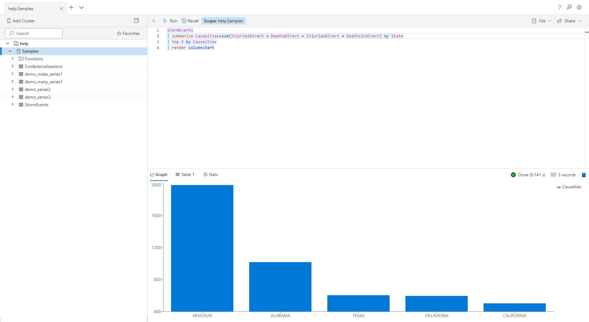

# Embed Web UI in an iframe

The Azure Data Explorer Web UI can be embedded in an iframe and hosted in third party websites.



Embedding the Azure Data Explorer Web UX in your website enables your users to do the following:

- Edit queries (includes all language features such as colorization and intellisense)
- Explore table schemas visually
- Authenticate to AAD
- Execute queries
- Display query execution results
- Create multiple tabs
- Save queries locally
- Share queries by email

All functionality is tested for accessibility and supports dark and light theme.

## Use Monaco-Kusto or embed the Web UI?

Monaco-Kusto offers you an editing experience such as completion, colorization, refactoring, renaming, and go-to-definition, it requires you to build a solution for authentication, query execution, result display, and schema exploration around it. On the other hand, you get full flexibility to fashion the user experience that fits your needs.

Embedding the Azure Data Explorer Web UI, offers you extensive functionality with little effort, but contains limited flexibility regarding the user experience. There are a fixed set of query parameters that allow limited control on the look and behavior of the system.

## How to embed the Web UI in an iframe

### Host the website in iframe

Add the following code to your website:

```html
<iframe src="https://dataexplorer.azure.com/clusters/<cluster>?ibizaPortal=true"></iframe>
```

The `ibizaPortal` query parameter tells the Azure Data Explorer Web UI *not* to redirect to get an authentication token. This is necessary since the hosting website is responsible for providing an authentication token to the embedded iframe.

Replace `<cluster>` with the hostname of the cluster you want to load into the connection pane (for `example: help.kusto.windows.net`). By default, iframe-embedded mode doesn't provide a way to add clusters from the UI, since the assumption is that the hosting website is aware of the required cluster.

### Handle authentication

1. When set to 'iframe mode' (`ibizaPortal=true`), The Azure Data Explorer Web UI won't try to redirect for authentication. The Web UI will use the message posting mechanism that browsers use to request and receive a token. During page loading, the following message will be posted to the parent window:

    ```javascript
    window.parent.postMessage(
        {
            signature: 'queryExplorer',
            type: 'getToken'
        }, 
        '*');
    window.addEventListener('message', event => this.handleIncomingMessage(event), false);
    ```

1. Then, it will listen for a message with the following structure:

    ```json
    {
        "type": "postToken",
        "message": "${the actual authentication token}"
    }
    ```

1. The provided token should be a [JWT token](https://tools.ietf.org/html/rfc7519) obtained from the [[AAD authentication endpoint]](../../management/access-control/how-to-authenticate-with-aad.md#web-client-javascript-authentication-and-authorization).

> [!IMPORTANT] 
> It is the responsibility of the hosting window to refresh the token before expiration and use the same mechanism to provide the updated token to the application. Otherwise, once the token expires, service calls will always fail.