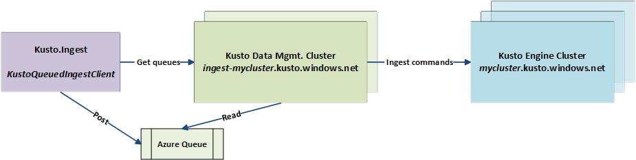
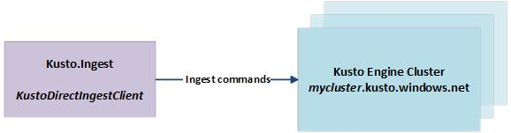

# Kusto Ingest Client Library

## Overview
Kusto.Ingest library is a .NET 4.6.2 library that allows to send data to Kusto service.
Takes dependencies on the following libraries and SDKs:
* ADAL for AAD Authentication
* Azure Storage Client
* [TBD: complete list of external dependencies]

Kusto ingestion methods are defined by [IKustoIngestClient](kusto-ingest-client-reference.md#interface-ikustoingestclient) interface and allow data ingestion from Stream, IDataReader, local file(s), and Azure blob(s) in both synchronous and asynchronous modes.

## Ingest Client Flavors
Conceptually, there are two basic flavors of Ingest client: Queued and Direct

### Queued Ingestion
Defined by [IKustoQueuedIngestClient](kusto-ingest-client-reference.md#interface-ikustoqueuedingestclient), this mode limits the client code dependency on the Kusto service. Ingestion is performed by posting a Kusto ingestion message to an Azure queue, which, in turn is acquired from Kusto Data Management (a.k.a. Ingestion) service. Any intermediate storage artifacts will be created by the ingest client using the resources allocated by Kusto Data Management service. 

**Advantages of the Queued mode** include (but are not limited to):
* Decoupling of the data ingestion process from the Kusto Engine service
* Allows ingestion requests to be persisted when the Kusto Engine (or Ingestion) service is unavailable
* Allows efficient and controllable aggregation of inbound data by the Ingestion service, thus improving performance
* Allows the Kusto Ingestion service to manage ingestion load on the Kusto Engine service
* Kusto Ingestion service will retry as needed on transient ingestion failures (e.g., XStore throttling)
* Provides a convenient mechanism to track the progress and outcome of every ingestion request

The following diagram outlines the Queued ingestion client interaction with Kusto: 

### Direct Ingestion
Defined by IKustoDirectIngestClient, this mode forces direct interaction with the Kusto Engine service. In this mode Kusto Ingestion service plays no moderative or managerial role. Every ingestion request in Direct mode is eventually translated into `.ingest` command executed directly on Kusto Engine service. 
The following diagram outlines the Direct ingestion client interaction with Kusto: 

>The Direct mode is not recommended for production grade ingestion solutions.

**Advantages of the Direct mode** include:
* Low latency (there is no aggregation). However, low latency can also be achieved with Queued ingestion
* When synchronous methods are used, method completion indicates the end of the ingestion operation

**Disadvantages of the Direct mode** include:
* The client code must implement any retry or error handling logic
* Ingestions are impossible when the Kusto Engine service is unavailable
* The client code might overwhelm the Kusto Engine service with ingestion requests, as it is not aware of the Engine service capacity

## Ingestion Best Practices

### General
[Ingestion best practices](kusto-ingest-best-practices.md) provides COGs and throughput POV on ingestion.

### Thread Safety
> Kusto Ingest Client implementations are thread-safe and intended to be reused. There is no need to create an instance of `KustoQueuedIngestClient` class for each or even several ingest operations. A single instance of `KustoQueuedIngestClient` is required per target Kusto cluster per user process. In fact, running multiple instances is counter productive and may DoS the Data Management cluster.

### Supported Data Formats
When using native ingestion, the data to be ingested is be uploaded (if not already there) to  one or more Azure Storage Blobs. Currently supported blob formats are documented in the [Supported Data Formats](../../management/data-ingestion/index.md#supported-data-formats) section.

### Schema Mapping
[Schema mappings](../../management/mappings.md) help with deterministically binding source data fields to destination table columns.

## Usage and Further Reading
* As described above, the recommended basis for sustainable and high scale ingestion solutions for Kusto should be the **KustoQueuedIngestClient**.
* In order to minimize unnecessary load on your Kusto service, it is recommended that a single instance of Kusto Ingest client (Queued or Direct) is used per process per Kusto cluster. Kusto Ingest client implementation is thread safe and fully reentrant.

### Ingestion Permissions
* [Kusto Ingestion Permissions](kusto-ingest-client-permissions.md) explains permissions setup required for a successful ingestion using Kusto.Ingest package

### Kusto.Ingest Library Reference
* [Kusto.Ingest Client Reference](kusto-ingest-client-reference.md) contains a complete reference of Kusto ingest client interfaces and implementations. There you will find the information on how to create ingest clients, augment ingestion requests, manage ingestion progress and more
* [Kusto.Ingest Operation Status](kusto-ingest-client-status.md) explains **KustoQueuedIngestClient** facilities for tracking ingestion status
* [Kusto.Ingest Errors](kusto-ingest-client-errors.md) documents Kusto Ingest Client errors and exceptions
* [Kusto.Ingest Examples](kusto-ingest-client-examples.md) presents code snippets demonstrating various techniques of ingesting data into Kusto

### Data Ingestion REST APIs
[Data Ingestion without Kusto.Ingest Library](kusto-ingest-client-rest.md) explains how to implement Queued Kusto ingestion utilizing Kusto REST APIs and without taking dependency on Kusto.Ingest library.

