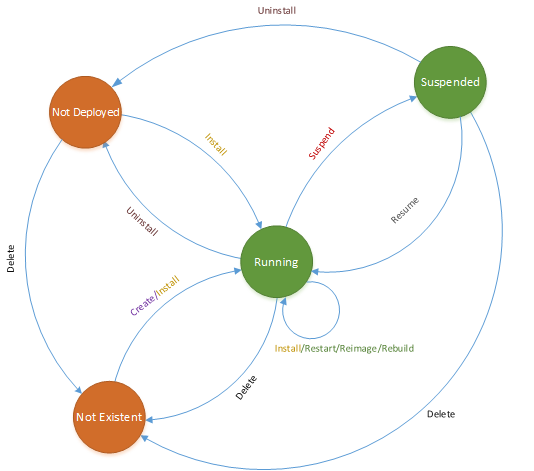

# Cluster Management

The Kusto cluster management service (abbreviated as **CM**) provides a REST API
that accepts control commands for managing Kusto accounts and clusters. It is
the way to create and configure new Kusto clusters, control their lifetime (for
example, to upgrade or stop the cluster), and view the current cluster status.
Additionally, the CM provides a few convenience commands that implement some
important workflows (for example, it implements a create-database flow that
includes setting up Azure Storage accounts).

In general, the CM manages the following Kusto entities:
* **Kusto Account**
* **Kusto Service**
* **Kusto Cluster**
* **Kusto Database**

Access to the CM is granted to principals that are registered as
[AccountAdmin](https://kusdoc2.azurewebsites.net/docs/concepts/principal-roles.html) with the Kusto team.

The CM is accessible at [https://manage-kusto.kusto.windows.net](https://manage-kusto.kusto.windows.net).
You can connect to it using any [Kusto client tool](https://kusdoc2.azurewebsites.net/docs/tools/tools.html).

## show commands - query service information

These queries extract information regarding the cloud service, its instances status and the ability to scale its resources. 

|||
|---|---
|`.show service`|Shows the status and configuration of the service by its name.
|`.show service storage objects`|Shows all storage objects used by a given service.
|`.show service aad tenants`|Shows all trusted external tenants for a given service.
|`.show operations`|Get currently running and/or the history of running admin commands on the Cluster Management service. 
|`.check service name availability`|Checks the availability and validity of a given name to be used for creating a new service. 

For these commands, access permissions are required according to the [authorization model](https://kusdoc2.azurewebsites.net/docs/concepts/principal-roles.html).

    
### show operations 

Returns operation status for specific operations which were executed in the last 12 hours

|||
|---|---| 
|.show operations [GUID] |Returns operation status for specific ID 
|.show operations ([GUID1], [GUID2], ...) |Returns operations status for specific IDs

**Return output**
  
|Output parameter |Type |Description 
|---|---|---
|Id |String |A unique identifier for the operation 
|Operation |String |Admin command alias 
|NodeId |String |If the command has a remote execution - NodeId will contain the ID of the executing remote node 
|StartedOn |DateTime |Date/time (in UTC) when the operation has started 
|LastUpdatedOn |DateTime |Date/time (in UTC) when the operation last updated (can be either a step inside the operation, or a completion step) 
|Duration |DateTime |Timespan between LastUpdateOn and StartedOn 
|State |String |The latest state of the operation <ul><li>InProgress - the operation is carried out</li><li>BadInput - the operation failed due to bad input and should not be repeated without modification</li><li>Completed - the operation finished running successfully </li><li>Failed - the operation failed, retry could succeed</li><li>PartiallySucceeded - the operation completed successfully to some extent. Retry is recommended</li><li>Scheduled - the operation is planned to be carried out promptly</li><li>Abandoned
 - The operation has been abandoned during execution (for example, it was not committed because another conflicting operation has raced ahead of it and won)</li></ul>
|Status |String |Additional help string that either holds errors for failed operations 
|RootActivityId |String |This parameter can be used to query Kuskus (Kusto-on-Kusto) as RootActivityId to observe the whole flow of the operation 
 
**Example output**
 
|Id |Operation |Node Id |Started On |Last Updated On |Duration |State |Status 
|--|--|--|--|--|--|--|--
|841fafa4-076a-4cba-9300-4836da0d9c75 |ServiceCreate |Kusto.Azure.Svc_IN_1 |2015-01-06 08:47:02.0000000 |2015-01-06 08:48:19.0000000 |0001-01-01 00:01:17.0000000 |InProgress |Started deployment of service 'Engine-NewService'| 
  
## management commands - service creation and maintenance

These queries extract information regarding the cloud service, its instances status and the ability to scale its resources. 

|||
|---|---
|`.restart service` |Restarts instances of an existing service. 
|`.reimage service` |Reimages instances of an existing service. 
|`.rebuild service` |Rebuild instances of an existing service. 
|`.install service`|Installs the given Kusto cluster(s) with the latest known good (or specified) version.
|`.uninstall service` |Uninstalls an existing service. 
|`.suspend service` |Suspends the service so that there are no compute costs while preserving data.
|`.resume service` |Stops service suspension and installs the service.
|`.delete service` |Deletes an existing service. 
|`.alter service configuration` |Alters the configuration of an existing service.  
|`.create service` |Creates a new service.
|`.create cluster` |Creates a new cluster which consists of an engine and DM services. 

For these commands, admin permissions are required according to the [authorization model](https://kusdoc2.azurewebsites.net/docs/concepts/principal-roles.html).

The following diagram shows the transistion between service's states as a result of invoking the commands:

## Cluster Management Limits

This section lists the limits of cluster management service. When a limit  is reached, the caller receives the HTTP status code 429 Too many requests. 

### Concurrent Requests Limits

The limits are applied in the scope of a service and an operation (for example, create database for KustoLab service). 

|Operation Name | Value 
|--|--
|Create Database | 20
|Delete Database | 10
|Purge Records | 2
|Add Service to Load Balancer | 1
|Drop Service from Load Balancer | 1