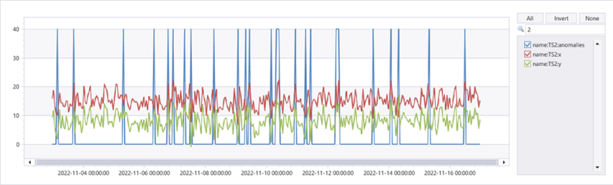
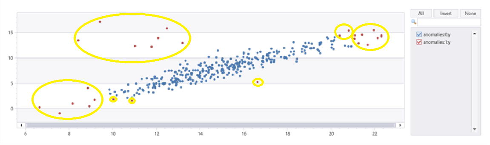

# series_mv_if_anomalies_fl()

The function `series_mv_if_anomalies_fl()` detects multivariate anomalies in series by applying [isolation forest model from scikit-learn](https://scikit-learn.org/stable/modules/generated/sklearn.ensemble.IsolationForest.html). The function accepts a set of series as numerical dynamic arrays, the names of the features columns and the expected percentage of anomalies out of the whole series. The function builds an ensemble of isolation trees for each series and marks the points that are quickly isolated as anomalies.

> [!NOTE]
> * `series_mv_if_anomalies_fl()` is a [UDF (user-defined function)](../query/functions/user-defined-functions.md). For more information, see [usage](#usage).
> * This function contains inline Python and requires [enabling the python() plugin](../query/pythonplugin.md#enable-the-plugin) on the cluster.

## Syntax

`T | invoke series_mv_if_anomalies_fl(`*features_cols*`,` *anomaly_col*`,` *anomalies_pct*`,` *num_trees*`,` *samples_pct*`)`
  
## Arguments

| Name | Type | Required | Description |
|--|--|--|--|
| *features_cols* | dynamic | &check; | Dynamic array containing the names of the columns that are used for the multivariate anomaly detection model |
| *anomaly_col* | string | &check; | The name of the column to store the detected anomalies. |
| *anomalies_pct* | real | | A real number in the range [0-50] specifying the expected percentage of anomalies in the data. Default value: 4% |
| *num_trees* | int | | The number of isolation trees to build for each time series. Default value: 100 |
| *samples_pct* | real | | A real number in the range [0-100] specifying the percentage of samples used to build each tree. Default value: 100%, i.e. use the full series |


## Usage

`series_mv_if_anomalies_fl()` is a user-defined function [tabular function](../query/functions/user-defined-functions.md#tabular-function), to be applied using the [invoke operator](../query/invokeoperator.md). You can either embed its code in your query, or install it in your database. There are two usage options: ad hoc and persistent usage. See the below tabs for examples.

# [Ad hoc](#tab/adhoc)

For ad hoc usage, embed its code using [let statement](../query/letstatement.md). No permission is required.

<!-- csl: https://help.kusto.windows.net/Samples -->
```kusto
let series_mv_if_anomalies_fl=(tbl:(*), features_cols:dynamic, anomaly_col:string, anomalies_pct:real=4.0, num_trees:int=100, samples_pct:real=100.0)
{
    let kwargs = bag_pack('features_cols', features_cols, 'anomaly_col', anomaly_col, 'anomalies_pct', anomalies_pct, 'num_trees', num_trees, 'samples_pct', samples_pct);
    let code = ```if 1:
        from sklearn.ensemble import IsolationForest
        features_cols = kargs['features_cols']
        anomaly_col = kargs['anomaly_col']
        anomalies_pct = kargs['anomalies_pct']
        num_trees = kargs['num_trees']
        samples_pct = kargs['samples_pct']
        dff = df[features_cols]
        iforest = IsolationForest(contamination=anomalies_pct/100.0, random_state=0, n_estimators=num_trees, max_samples=samples_pct/100.0)
        for i in range(len(dff)):
            dffi = dff.iloc[[i], :]
            dffe = dffi.explode(features_cols)
            iforest.fit(dffe)
            df.loc[i, anomaly_col] = (iforest.predict(dffe) < 0).astype(int).tolist()
        result = df
    ```;
    tbl
    | evaluate python(typeof(*), code, kwargs)
}
;
normal_2d_with_anomalies
| extend anomalies=dynamic(null)
| invoke series_mv_if_anomalies_fl(pack_array('x', 'y'), 'anomalies', anomalies_pct=8, num_trees=1000)
| extend anomalies=series_multiply(40, anomalies)
| render timechart
```

# [Persistent](#tab/persistent)

For persistent usage, use [`.create function`](../management/create-function.md).  Creating a function requires [database user permission](../management/access-control/role-based-authorization.md).

### One time installation

<!-- csl: https://help.kusto.windows.net/Samples -->
```kusto
.create-or-alter function with (folder = "Packages\\Series", docstring = "Anomaly Detection for multi dimensional data using isolation forest model")
series_mv_if_anomalies_fl(tbl:(*), features_cols:dynamic, anomaly_col:string, anomalies_pct:real=4.0, num_trees:int=100, samples_pct:real=100.0)
{
    let kwargs = bag_pack('features_cols', features_cols, 'anomaly_col', anomaly_col, 'anomalies_pct', anomalies_pct, 'num_trees', num_trees, 'samples_pct', samples_pct);
    let code = ```if 1:
        from sklearn.ensemble import IsolationForest
        features_cols = kargs['features_cols']
        anomaly_col = kargs['anomaly_col']
        anomalies_pct = kargs['anomalies_pct']
        num_trees = kargs['num_trees']
        samples_pct = kargs['samples_pct']
        dff = df[features_cols]
        iforest = IsolationForest(contamination=anomalies_pct/100.0, random_state=0, n_estimators=num_trees, max_samples=samples_pct/100.0)
        for i in range(len(dff)):
            dffi = dff.iloc[[i], :]
            dffe = dffi.explode(features_cols)
            iforest.fit(dffe)
            df.loc[i, anomaly_col] = (iforest.predict(dffe) < 0).astype(int).tolist()
        result = df
    ```;
    tbl
    | evaluate python(typeof(*), code, kwargs)
}
```

### Usage

<!-- csl: https://help.kusto.windows.net/Samples -->
```kusto
normal_2d_with_anomalies
| extend anomalies=dynamic(null)
| invoke series_mv_if_anomalies_fl(pack_array('x', 'y'), 'anomalies', anomalies_pct=8, num_trees=1000)
| extend anomalies=series_multiply(40, anomalies)
| render timechart
```

---

normal_2d_with_anomalies contains a set of 3 time series, each one has 2 dimensional normal distribution with daily anomalies added at midnight, 8am and 4pm respectively. It can be created by [this query](series-mv-ee-anomalies-fl.md#creating-the-sample-data-set).




We can see that on TS2 most of the anomalies occurring at 8am were detected using this multivariate model.
