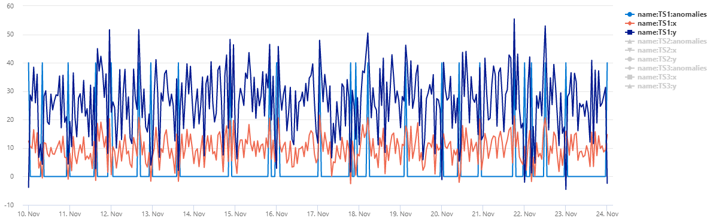
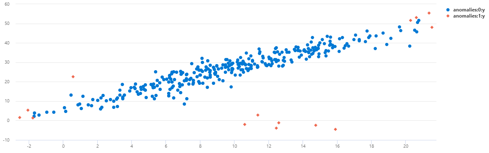

# series_mv_if_anomalies_fl()

::: zone pivot="azuredataexplorer, fabric"

The function `series_mv_if_anomalies_fl()` is a [user-defined function (UDF)](../query/functions/user-defined-functions.md) that detects multivariate anomalies in series by applying [isolation forest model from scikit-learn](https://scikit-learn.org/stable/modules/generated/sklearn.ensemble.IsolationForest.html). The function accepts a set of series as numerical dynamic arrays, the names of the features columns and the expected percentage of anomalies out of the whole series. The function builds an ensemble of isolation trees for each series and marks the points that are quickly isolated as anomalies.

[!INCLUDE [python-zone-pivot-fabric](../../includes/python-zone-pivot-fabric.md)]

## Syntax

`T | invoke series_mv_if_anomalies_fl(`*features_cols*`,` *anomaly_col* [`,` *score_col* [`,` *anomalies_pct* [`,` *num_trees* [`,` *samples_pct* ]]]]`)`

[!INCLUDE [syntax-conventions-note](../../includes/syntax-conventions-note.md)]

## Parameters

| Name | Type | Required | Description |
|--|--|--|--|
| *features_cols* | `dynamic` |  :heavy_check_mark: | An array containing the names of the columns that are used for the multivariate anomaly detection model. |
| *anomaly_col* | `string` |  :heavy_check_mark: | The name of the column to store the detected anomalies. |
| *score_col* | `string` | | The name of the column to store the scores of the anomalies. |
| *anomalies_pct* | `real` | | A real number in the range [0-50] specifying the expected percentage of anomalies in the data. Default value: 4%. |
| *num_trees* | `int` | | The number of isolation trees to build for each time series. Default value: 100. |
| *samples_pct* | `real` | | A real number in the range [0-100] specifying the percentage of samples used to build each tree. Default value: 100%, i.e. use the full series. |

## Function definition

You can define the function by either embedding its code as a query-defined function, or creating it as a stored function in your database, as follows:

### [Query-defined](#tab/query-defined)

Define the function using the following [let statement](../query/let-statement.md). No permissions are required.

> [!IMPORTANT]
> A [let statement](../query/let-statement.md) can't run on its own. It must be followed by a [tabular expression statement](../query/tabular-expression-statements.md). To run a working example of `series_mv_if_anomalies_fl()`, see [Example](#example).

```kusto
// Define function
let series_mv_if_anomalies_fl=(tbl:(*), features_cols:dynamic, anomaly_col:string, score_col:string='', anomalies_pct:real=4.0, num_trees:int=100, samples_pct:real=100.0)
{
    let kwargs = bag_pack('features_cols', features_cols, 'anomaly_col', anomaly_col, 'score_col', score_col, 'anomalies_pct', anomalies_pct, 'num_trees', num_trees, 'samples_pct', samples_pct);
    let code = ```if 1:
        from sklearn.ensemble import IsolationForest
        features_cols = kargs['features_cols']
        anomaly_col = kargs['anomaly_col']
        score_col = kargs['score_col']
        anomalies_pct = kargs['anomalies_pct']
        num_trees = kargs['num_trees']
        samples_pct = kargs['samples_pct']
        dff = df[features_cols]
        iforest = IsolationForest(contamination=anomalies_pct/100.0, random_state=0, n_estimators=num_trees, max_samples=samples_pct/100.0)
        for i in range(len(dff)):
            dffi = dff.iloc[[i], :]
            dffe = dffi.explode(features_cols)
            iforest.fit(dffe)
            df.loc[i, anomaly_col] = (iforest.predict(dffe) < 0).astype(int).tolist()
            if score_col != '':
                df.loc[i, score_col] = iforest.decision_function(dffe).tolist()
        result = df
    ```;
    tbl
    | evaluate hint.distribution=per_node python(typeof(*), code, kwargs)
};
// Write your query to use the function here.
```

### [Stored](#tab/stored)

Define the stored function once using the following [`.create function`](../management/create-function.md). [Database User permissions](../management/access-control/role-based-access-control.md) are required.

> [!IMPORTANT]
> You must run this code to create the function before you can use the function as shown in the [Example](#example).

```kusto
.create-or-alter function with (folder = "Packages\\Series", docstring = "Anomaly Detection for multi dimensional data using isolation forest model")
series_mv_if_anomalies_fl(tbl:(*), features_cols:dynamic, anomaly_col:string, score_col:string='', anomalies_pct:real=4.0, num_trees:int=100, samples_pct:real=100.0)
{
    let kwargs = bag_pack('features_cols', features_cols, 'anomaly_col', anomaly_col, 'score_col', score_col, 'anomalies_pct', anomalies_pct, 'num_trees', num_trees, 'samples_pct', samples_pct);
    let code = ```if 1:
        from sklearn.ensemble import IsolationForest
        features_cols = kargs['features_cols']
        anomaly_col = kargs['anomaly_col']
        score_col = kargs['score_col']
        anomalies_pct = kargs['anomalies_pct']
        num_trees = kargs['num_trees']
        samples_pct = kargs['samples_pct']
        dff = df[features_cols]
        iforest = IsolationForest(contamination=anomalies_pct/100.0, random_state=0, n_estimators=num_trees, max_samples=samples_pct/100.0)
        for i in range(len(dff)):
            dffi = dff.iloc[[i], :]
            dffe = dffi.explode(features_cols)
            iforest.fit(dffe)
            df.loc[i, anomaly_col] = (iforest.predict(dffe) < 0).astype(int).tolist()
            if score_col != '':
                df.loc[i, score_col] = iforest.decision_function(dffe).tolist()
        result = df
    ```;
    tbl
    | evaluate hint.distribution=per_node python(typeof(*), code, kwargs)
}
```

---

## Example

The following example uses the [invoke operator](../query/invoke-operator.md) to run the function.

### [Query-defined](#tab/query-defined)

To use a query-defined function, invoke it after the embedded function definition.

```kusto
// Define function
let series_mv_if_anomalies_fl=(tbl:(*), features_cols:dynamic, anomaly_col:string, score_col:string='', anomalies_pct:real=4.0, num_trees:int=100, samples_pct:real=100.0)
{
    let kwargs = bag_pack('features_cols', features_cols, 'anomaly_col', anomaly_col, 'score_col', score_col, 'anomalies_pct', anomalies_pct, 'num_trees', num_trees, 'samples_pct', samples_pct);
    let code = ```if 1:
        from sklearn.ensemble import IsolationForest
        features_cols = kargs['features_cols']
        anomaly_col = kargs['anomaly_col']
        score_col = kargs['score_col']
        anomalies_pct = kargs['anomalies_pct']
        num_trees = kargs['num_trees']
        samples_pct = kargs['samples_pct']
        dff = df[features_cols]
        iforest = IsolationForest(contamination=anomalies_pct/100.0, random_state=0, n_estimators=num_trees, max_samples=samples_pct/100.0)
        for i in range(len(dff)):
            dffi = dff.iloc[[i], :]
            dffe = dffi.explode(features_cols)
            iforest.fit(dffe)
            df.loc[i, anomaly_col] = (iforest.predict(dffe) < 0).astype(int).tolist()
            if score_col != '':
                df.loc[i, score_col] = iforest.decision_function(dffe).tolist()
        result = df
    ```;
    tbl
    | evaluate hint.distribution=per_node python(typeof(*), code, kwargs)
};
// Usage
normal_2d_with_anomalies
| extend anomalies=dynamic(null), scores=dynamic(null)
| invoke series_mv_if_anomalies_fl(pack_array('x', 'y'), 'anomalies', 'scores', anomalies_pct=8, num_trees=1000)
| extend anomalies=series_multiply(40, anomalies)
| render timechart
```


### [Stored](#tab/stored)

> [!IMPORTANT]
> For this example to run successfully, you must first run the [Function definition](#function-definition) code to store the function.

```kusto
normal_2d_with_anomalies
| extend anomalies=dynamic(null), scores=dynamic(null)
| invoke series_mv_if_anomalies_fl(pack_array('x', 'y'), 'anomalies', 'scores', anomalies_pct=8, num_trees=1000)
| extend anomalies=series_multiply(40, anomalies)
| render timechart
```

---

**Output**

The table normal_2d_with_anomalies contains a set of 3 time series. Each time series has two-dimensional normal distribution with daily anomalies added at midnight, 8am, and 4pm respectively. You can create this sample dataset using [an example query](series-mv-ee-anomalies-fl.md#create-a-sample-dataset).



To view the data as a scatter chart, replace the usage code with the following:

```kusto
normal_2d_with_anomalies
| extend anomalies=dynamic(null)
| invoke series_mv_if_anomalies_fl(pack_array('x', 'y'), 'anomalies')
| where name == 'TS1'
| project x, y, anomalies
| mv-expand x to typeof(real), y to typeof(real), anomalies to typeof(string)
| render scatterchart with(series=anomalies)
```



You can see that on TS2 most of the anomalies occurring at 8am were detected using this multivariate model.

::: zone-end

::: zone pivot="azuremonitor"

This feature isn't supported.

::: zone-end
