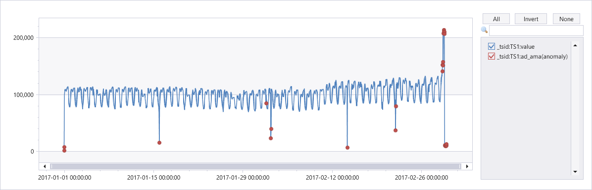

# series_uv_anomalies_fl()

::: zone pivot="azuredataexplorer"

The function `series_uv_anomalies_fl()` is a [user-defined function (UDF)](../query/functions/user-defined-functions.md) that detects anomalies in time series by calling the [Univariate Anomaly Detection API](/azure/cognitive-services/anomaly-detector/overview), part of [Azure Cognitive Services](/azure/cognitive-services/what-are-cognitive-services). The function accepts a limited set of time series as numerical dynamic arrays and the required anomaly detection sensitivity level. Each time series is converted into the required JSON format and posts it to the Anomaly Detector service endpoint. The service response contains dynamic arrays of high/low/all anomalies, the modeled baseline time series, its normal high/low boundaries (a value above or below the high/low boundary is an anomaly) and the detected seasonality.

> [!NOTE]
> Consider using the native function [series_decompose_anomalies()](../query/series-decompose-anomaliesfunction.md) which is more scalable and runs faster.

## Prerequisites

* An Azure subscription. Create a [free Azure account](https://azure.microsoft.com/free/).
* A cluster and database. [Create a cluster and database](../../create-cluster-and-database.md).
* The Python plugin must be [enabled on the cluster](../query/pythonplugin.md#enable-the-plugin). This is required for the inline Python used in the function.
* [Create an Anomaly Detector resource and obtain its key](https://ms.portal.azure.com/#create/Microsoft.CognitiveServicesAnomalyDetector) to access the service.
* Enable the [http_request plugin / http_request_post plugin](../query/http-request-plugin.md) on the cluster to access the anomaly detection service endpoint.
* Modify the [callout policy](../management/callout-policy.md) for type `webapi` to access the anomaly detection service endpoint.

In the following function example, replace `YOUR-AD-RESOURCE-NAME` in the uri and `YOUR-KEY` in the `Ocp-Apim-Subscription-Key` of the header with your Anomaly Detector resource name and key.

## Syntax

`T | invoke series_uv_anomalies_fl(`*y_series* [`,` *sensitivity* [`,` *tsid*]]`)`

[!INCLUDE [syntax-conventions-note](../../includes/syntax-conventions-note.md)]

## Parameters

| Name | Type | Required | Description |
|--|--|--|--|
| *y_series* | string | &check; | The name of the input table column containing the values of the series to be anomaly detected. |
| *sensitivity* | integer | | An integer in the range [0-100] specifying the anomaly detection sensitivity. 0 is the least sensitive detection, while 100 is the most sensitive indicating even a small deviation from the expected baseline would be tagged as anomaly. Default value: 85 |
| *tsid* | string | | The name of the input table column containing the time series ID. Can be omitted when analyzing a single time series. |

## Function definition

You can define the function by either embedding its code as a query-defined function, or creating it as a stored function in your database, as follows:

### [Query-defined](#tab/query-defined)

Define the function using the following [let statement](../query/letstatement.md). No permissions are required.

> [!IMPORTANT]
> A [let statement](../query/letstatement.md) can't run on its own. It must be followed by a [tabular expression statement](../query/tabularexpressionstatements.md). To run a working example of `series_uv_anomalies_fl()`, see [Examples](#examples).

~~~kusto
let series_uv_anomalies_fl=(tbl:(*), y_series:string, sensitivity:int=85, tsid:string='_tsid')
{
    let uri = 'https://YOUR-AD-RESOURCE-NAME.cognitiveservices.azure.com/anomalydetector/v1.0/timeseries/entire/detect';
    let headers=dynamic({'Ocp-Apim-Subscription-Key': h'YOUR-KEY'});
    let kwargs = bag_pack('y_series', y_series, 'sensitivity', sensitivity);
    let code = ```if 1:
        import json
        y_series = kargs["y_series"]
        sensitivity = kargs["sensitivity"]
        json_str = []
        for i in range(len(df)):
            row = df.iloc[i, :]
            ts = [{'value':row[y_series][j]} for j in range(len(row[y_series]))]
            json_data = {'series': ts, "sensitivity":sensitivity}     # auto-detect period, or we can force 'period': 84. We can also add 'maxAnomalyRatio':0.25 for maximum 25% anomalies
            json_str = json_str + [json.dumps(json_data)]
        result = df
        result['json_str'] = json_str
    ```;
    tbl
    | evaluate python(typeof(*, json_str:string), code, kwargs)
    | extend _tsid = column_ifexists(tsid, 1)
    | partition by _tsid (
       project json_str
       | evaluate http_request_post(uri, headers, dynamic(null))
       | project period=ResponseBody.period, baseline_ama=ResponseBody.expectedValues, ad_ama=series_add(0, ResponseBody.isAnomaly), pos_ad_ama=series_add(0, ResponseBody.isPositiveAnomaly)
       , neg_ad_ama=series_add(0, ResponseBody.isNegativeAnomaly), upper_ama=series_add(ResponseBody.expectedValues, ResponseBody.upperMargins), lower_ama=series_subtract(ResponseBody.expectedValues, ResponseBody.lowerMargins)
       | extend _tsid=toscalar(_tsid)
      )
};
// Write your query to use the function here.
~~~

### [Stored](#tab/stored)

Define the stored function once using the following [`.create function`](../management/create-function.md). [Database User permissions](../management/access-control/role-based-access-control.md) are required.

> [!IMPORTANT]
> You must run this code to create the function before you can use the function as shown in the [Examples](#examples).

~~~kusto
.create-or-alter function with (folder = "Packages\\Series", docstring = "Time Series Anomaly Detection by Azure Cognitive Service")
series_uv_anomalies_fl(tbl:(*), y_series:string, sensitivity:int=85, tsid:string='_tsid')
{
    let uri = 'https://YOUR-AD-RESOURCE-NAME.cognitiveservices.azure.com/anomalydetector/v1.0/timeseries/entire/detect';
    let headers=dynamic({'Ocp-Apim-Subscription-Key': h'YOUR-KEY'});
    let kwargs = bag_pack('y_series', y_series, 'sensitivity', sensitivity);
    let code = ```if 1:
        import json
        y_series = kargs["y_series"]
        sensitivity = kargs["sensitivity"]
        json_str = []
        for i in range(len(df)):
            row = df.iloc[i, :]
            ts = [{'value':row[y_series][j]} for j in range(len(row[y_series]))]
            json_data = {'series': ts, "sensitivity":sensitivity}     # auto-detect period, or we can force 'period': 84. We can also add 'maxAnomalyRatio':0.25 for maximum 25% anomalies
            json_str = json_str + [json.dumps(json_data)]
        result = df
        result['json_str'] = json_str
    ```;
    tbl
    | evaluate python(typeof(*, json_str:string), code, kwargs)
    | extend _tsid = column_ifexists(tsid, 1)
    | partition by _tsid (
       project json_str
       | evaluate http_request_post(uri, headers, dynamic(null))
       | project period=ResponseBody.period, baseline_ama=ResponseBody.expectedValues, ad_ama=series_add(0, ResponseBody.isAnomaly), pos_ad_ama=series_add(0, ResponseBody.isPositiveAnomaly)
       , neg_ad_ama=series_add(0, ResponseBody.isNegativeAnomaly), upper_ama=series_add(ResponseBody.expectedValues, ResponseBody.upperMargins), lower_ama=series_subtract(ResponseBody.expectedValues, ResponseBody.lowerMargins)
       | extend _tsid=toscalar(_tsid)
      )
}
~~~

---

## Examples

The following examples use the [invoke operator](../query/invokeoperator.md) to run the function.

### Use `series_uv_anomalies_fl()` to detect anomalies

### [Query-defined](#tab/query-defined)

To use a query-defined function, invoke it after the embedded function definition.

~~~kusto
let series_uv_anomalies_fl=(tbl:(*), y_series:string, sensitivity:int=85, tsid:string='_tsid')
{
    let uri = 'https://YOUR-AD-RESOURCE-NAME.cognitiveservices.azure.com/anomalydetector/v1.0/timeseries/entire/detect';
    let headers=dynamic({'Ocp-Apim-Subscription-Key': h'YOUR-KEY'});
    let kwargs = bag_pack('y_series', y_series, 'sensitivity', sensitivity);
    let code = ```if 1:
        import json
        y_series = kargs["y_series"]
        sensitivity = kargs["sensitivity"]
        json_str = []
        for i in range(len(df)):
            row = df.iloc[i, :]
            ts = [{'value':row[y_series][j]} for j in range(len(row[y_series]))]
            json_data = {'series': ts, "sensitivity":sensitivity}     # auto-detect period, or we can force 'period': 84. We can also add 'maxAnomalyRatio':0.25 for maximum 25% anomalies
            json_str = json_str + [json.dumps(json_data)]
        result = df
        result['json_str'] = json_str
    ```;
    tbl
    | evaluate python(typeof(*, json_str:string), code, kwargs)
    | extend _tsid = column_ifexists(tsid, 1)
    | partition by _tsid (
       project json_str
       | evaluate http_request_post(uri, headers, dynamic(null))
       | project period=ResponseBody.period, baseline_ama=ResponseBody.expectedValues, ad_ama=series_add(0, ResponseBody.isAnomaly), pos_ad_ama=series_add(0, ResponseBody.isPositiveAnomaly)
       , neg_ad_ama=series_add(0, ResponseBody.isNegativeAnomaly), upper_ama=series_add(ResponseBody.expectedValues, ResponseBody.upperMargins), lower_ama=series_subtract(ResponseBody.expectedValues, ResponseBody.lowerMargins)
       | extend _tsid=toscalar(_tsid)
      )
};
let etime=datetime(2017-03-02);
let stime=datetime(2017-01-01);
let dt=1h;
let ts = requests
| make-series value=avg(value) on timestamp from stime to etime step dt
| extend _tsid='TS1';
ts
| invoke series_uv_anomalies_fl('value')
| lookup ts on _tsid
| render anomalychart with(xcolumn=timestamp, ycolumns=value, anomalycolumns=ad_ama)
~~~

### [Stored](#tab/stored)

> [!IMPORTANT]
> For this example to run successfully, you must first run the [Function definition](#function-definition) code to store the function.

~~~kusto
let etime=datetime(2017-03-02);
let stime=datetime(2017-01-01);
let dt=1h;
let ts = requests
| make-series value=avg(value) on timestamp from stime to etime step dt
| extend _tsid='TS1';
ts
| invoke series_uv_anomalies_fl('value')
| lookup ts on _tsid
| render anomalychart with(xcolumn=timestamp, ycolumns=value, anomalycolumns=ad_ama)
~~~

---

**Output**



### Compare `series_uv_anomalies_fl()` and native `series_decompose_anomalies()`

The following example compares the Univariate Anomaly Detection API to the native `series_decompose_anomalies()` function over three time series and assumes the `series_uv_anomalies_fl()` function is already defined in the database:

### [Query-defined](#tab/query-defined)

To use a query-defined function, invoke it after the embedded function definition.

~~~kusto
let series_uv_anomalies_fl=(tbl:(*), y_series:string, sensitivity:int=85, tsid:string='_tsid')
{
    let uri = 'https://YOUR-AD-RESOURCE-NAME.cognitiveservices.azure.com/anomalydetector/v1.0/timeseries/entire/detect';
    let headers=dynamic({'Ocp-Apim-Subscription-Key': h'YOUR-KEY'});
    let kwargs = bag_pack('y_series', y_series, 'sensitivity', sensitivity);
    let code = ```if 1:
        import json
        y_series = kargs["y_series"]
        sensitivity = kargs["sensitivity"]
        json_str = []
        for i in range(len(df)):
            row = df.iloc[i, :]
            ts = [{'value':row[y_series][j]} for j in range(len(row[y_series]))]
            json_data = {'series': ts, "sensitivity":sensitivity}     # auto-detect period, or we can force 'period': 84. We can also add 'maxAnomalyRatio':0.25 for maximum 25% anomalies
            json_str = json_str + [json.dumps(json_data)]
        result = df
        result['json_str'] = json_str
    ```;
    tbl
    | evaluate python(typeof(*, json_str:string), code, kwargs)
    | extend _tsid = column_ifexists(tsid, 1)
    | partition by _tsid (
       project json_str
       | evaluate http_request_post(uri, headers, dynamic(null))
       | project period=ResponseBody.period, baseline_ama=ResponseBody.expectedValues, ad_ama=series_add(0, ResponseBody.isAnomaly), pos_ad_ama=series_add(0, ResponseBody.isPositiveAnomaly)
       , neg_ad_ama=series_add(0, ResponseBody.isNegativeAnomaly), upper_ama=series_add(ResponseBody.expectedValues, ResponseBody.upperMargins), lower_ama=series_subtract(ResponseBody.expectedValues, ResponseBody.lowerMargins)
       | extend _tsid=toscalar(_tsid)
      )
};
let ts = demo_make_series2
| summarize TimeStamp=make_list(TimeStamp), num=make_list(num) by sid;
ts
| invoke series_uv_anomalies_fl('num', 'sid', 90)
| join ts on $left._tsid == $right.sid
| project-away _tsid
| extend (ad_adx, score_adx, baseline_adx)=series_decompose_anomalies(num, 1.5, -1, 'linefit')
| project-reorder num, *
| render anomalychart with(series=sid, xcolumn=TimeStamp, ycolumns=num, baseline_adx, baseline_ama, lower_ama, upper_ama, anomalycolumns=ad_adx, ad_ama)
~~~

### [Stored](#tab/stored)

> [!IMPORTANT]
> For this example to run successfully, you must first run the [Function definition](#function-definition) code to store the function.

~~~kusto
let ts = demo_make_series2
| summarize TimeStamp=make_list(TimeStamp), num=make_list(num) by sid;
ts
| invoke series_uv_anomalies_fl('num', 'sid', 90)
| join ts on $left._tsid == $right.sid
| project-away _tsid
| extend (ad_adx, score_adx, baseline_adx)=series_decompose_anomalies(num, 1.5, -1, 'linefit')
| project-reorder num, *
| render anomalychart with(series=sid, xcolumn=TimeStamp, ycolumns=num, baseline_adx, baseline_ama, lower_ama, upper_ama, anomalycolumns=ad_adx, ad_ama)
~~~

---

**Output**

The following graph shows anomalies detected by the Univariate Anomaly Detection API on TS1. You can also select TS2 or TS3 in the chart filter box.


The following graph shows the anomalies detected by native function on TS1.


::: zone-end

::: zone pivot="azuremonitor, fabric"

This feature isn't supported.

::: zone-end
