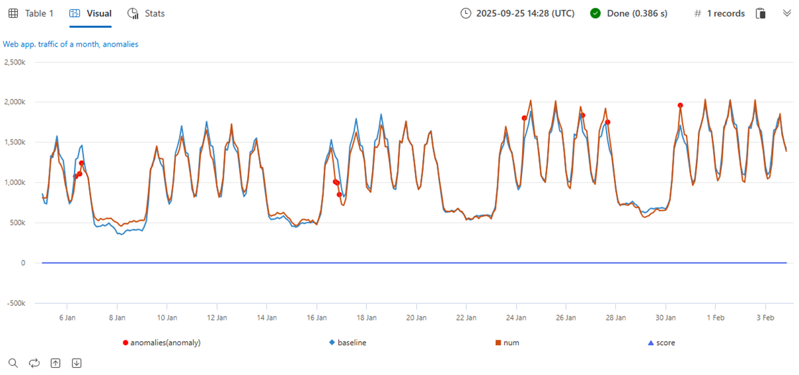
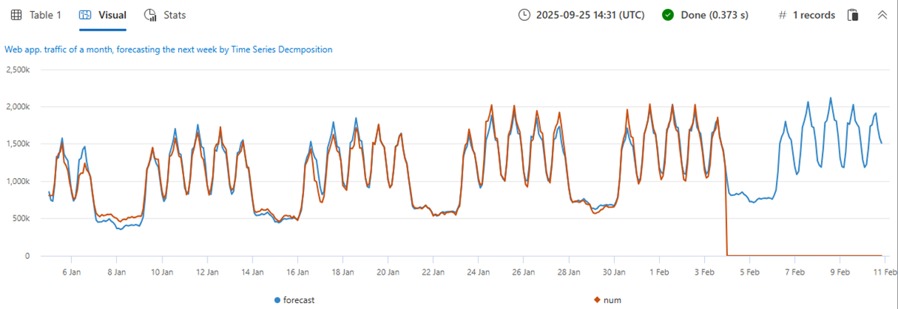
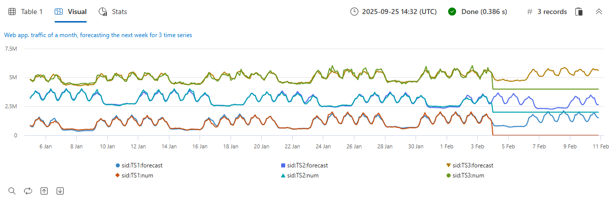

# Anomaly detection and forecasting

> [!INCLUDE [applies](../includes/applies-to-version/applies.md)] [!INCLUDE [fabric](../includes/applies-to-version/fabric.md)] [!INCLUDE [azure-data-explorer](../includes/applies-to-version/azure-data-explorer.md)] [!INCLUDE [monitor](../includes/applies-to-version/monitor.md)] [!INCLUDE [sentinel](../includes/applies-to-version/sentinel.md)]

Cloud services and IoT devices generate telemetry you use to monitor service health, production processes, and usage trends. Time series analysis helps you spot deviations from each metric's baseline pattern.

Kusto Query Language (KQL) includes native support for creating, manipulating, and analyzing multiple time series. Use KQL to create and analyze thousands of time series in seconds for near real time monitoring.

This article describes KQL time series anomaly detection and forecasting capabilities. The functions use a robust, well known decomposition model that splits each time series into seasonal, trend, and residual components. Detect anomalies by finding outliers in the residual component. Forecast by extrapolating the seasonal and trend components. KQL adds automatic seasonality detection, robust outlier analysis, and a vectorized implementation that processes thousands of time series in seconds.

## Prerequisites

* Use a Microsoft account or a Microsoft Entra user identity. You don't need an Azure subscription.
* Read about time series capabilities in [Time series analysis](time-series-analysis.md).

## Time series decomposition model

The KQL native implementation for time series prediction and anomaly detection uses a well known decomposition model. Use this model for time series with periodic and trend behavior—like service traffic, component heartbeats, and periodic IoT measurements—to forecast future values and detect anomalies. The regression assumes the remainder is random after removing the seasonal and trend components. Forecast future values from the seasonal and trend components (the baseline) and ignore the residual. Detect anomalies by running outlier analysis on the residual component.
Use the [`series_decompose()`](series-decompose-function.md) function to create a decomposition model. It decomposes each time series into seasonal, trend, residual, and baseline components.

Example: Decompose internal web service traffic:

:::moniker range="azure-data-explorer"
> [!div class="nextstepaction"]
> <a href="https://dataexplorer.azure.com/clusters/help/databases/Samples?query=H4sIAAAAAAAAA3WQ3WrDMAyF7/sUukvCnDXJGIOVPEULuwxqoixm/gm2+jf28JObFjbYrmyho3M+yRCD1a5jaGFAJtaW8qaqX8qqLqvnYrMySYHnvxRNWT1B07xW1U03JFEzbVYDWd9Z/KAuUtAUm9UXpLJcSnAH2+LxPZe3AO9gJ6ZbRjvDGLy9EbG/BUemOXnvLxD1AOJ1mijQtWhbyHbbOgOA9RogkqGeAaXn3g1BooVb6OiDNHpD6CjAUccDGv2JrL0TSzozuQHyPYqHdqRkDKN3aBRwkJaCQJIoQ4VsuXh2A/Xezj5SWkVBWSvI0vSoOSsWpLtEpyDwY4KTW8nnJ5ws+2+eAhSyOxjkd+HDVVcIfHplp2TYTxgYTpqnnDUbarM32gPO86PY4jjqfmGw3vGkftNlCi5xNprbWW5kYvENQQnqDh8CAAA=" target="_blank">Run the query</a>
::: moniker-end

```kusto
let min_t = datetime(2017-01-05);
let max_t = datetime(2017-02-03 22:00);
let dt = 2h;
demo_make_series2
| make-series num=avg(num) on TimeStamp from min_t to max_t step dt by sid 
| where sid == 'TS1'   // Select a single time series for cleaner visualization
| extend (baseline, seasonal, trend, residual) = series_decompose(num, -1, 'linefit')  // Decompose each time series into seasonal, trend, residual, and baseline (seasonal + trend)
| render timechart with(title='Web app traffic for one month, decomposition', ysplit=panels)
```


* The original time series is labeled **num** (in red). 
* The process autodetects seasonality using the [`series_periods_detect()`](series-periods-detect-function.md) function and extracts the **seasonal** pattern (purple).
* Subtract the seasonal pattern from the original time series, then run a linear regression with the [`series_fit_line()`](series-fit-line-function.md) function to find the **trend** component (light blue).
* The function subtracts the trend, and the remainder is the **residual** component (green).
* Finally, add the seasonal and trend components to generate the **baseline** (blue).

## Time series anomaly detection

The function [`series_decompose_anomalies()`](series-decompose-anomalies-function.md) finds anomalous points on a set of time series. This function calls `series_decompose()` to build the decomposition model and then runs [`series_outliers()`](series-outliers-function.md) on the residual component. `series_outliers()` calculates anomaly scores for each point of the residual component using Tukey's fence test. Anomaly scores above 1.5 or below -1.5 indicate a mild anomaly rise or decline respectively. Anomaly scores above 3.0 or below -3.0 indicate a strong anomaly.

The following query allows you to detect anomalies in internal web service traffic:

:::moniker range="azure-data-explorer"
> [!div class="nextstepaction"]
> > [!div class="nextstepaction"]
> <a href="https://dataexplorer.azure.com/clusters/help/databases/Samples?query=H4sIAAAAAAAAA3WR3W7CMAyF73mKI25KpRbaTmjSUJ8CpF1WoXVptPxUifmb9vBLoGO7GFeR7ePv2I4ihpamYdToBBNLTYuqKF/zosyLdbqZqagQl/8UVV68oKreimLSdVFUDZtZR9o2WnxQ48lJ8tXsCzHM7yHMUdfidFiEN4U12AXoloUe0Turp4nYTsaeaYzs/RVedgis80CObkFdI9ltywTAagV4UtQyRKiZgyLEaTGZ9taFQqtIGHI4SX8USn4KltYEJF2YTIeFMFaHPPkMvrWOMuxFoEpDaVjujmo6aq0erafmIY+7ZCiX6wx5mSGJHb3kJA1sF8jB8q69toNwjLPkYfGTseqoja//eLNkRXXyTnuIcVyCneh72cL2YQdtDQ8ZHvIkDcsfPWH+3AvPvObx0FMXD/RLhfDYW9VhtNKwj/8U69M1b2S//AbRUQMWQQIAAA==" target="_blank">Run the query</a>
::: moniker-end

```kusto
let min_t = datetime(2017-01-05);
let max_t = datetime(2017-02-03 22:00);
let dt = 2h;
demo_make_series2
| make-series num=avg(num) on TimeStamp from min_t to max_t step dt by sid 
| where sid == 'TS1'   //  select a single time series for a cleaner visualization
| extend (anomalies, score, baseline) = series_decompose_anomalies(num, 1.5, -1, 'linefit')
| render anomalychart with(anomalycolumns=anomalies, title='Web app. traffic of a month, anomalies') //use "| render anomalychart with anomalycolumns=anomalies" to render the anomalies as bold points on the series charts.
```



* The original time series (in red). 
* The baseline (seasonal + trend) component (in blue).
* The anomalous points (in purple) on top of the original time series. The anomalous points significantly deviate from the expected baseline values.

## Time series forecasting

The function [`series_decompose_forecast()`](series-decompose-forecast-function.md) predicts future values of a set of time series. This function calls `series_decompose()` to build the decomposition model and then, for each time series, extrapolates the baseline component into the future.

The following query allows you to predict next week's web service traffic:

:::moniker range="azure-data-explorer"
> [!div class="nextstepaction"]
> > [!div class="nextstepaction"]
> <a href="https://dataexplorer.azure.com/clusters/help/databases/Samples?query=H4sIAAAAAAAAA22QzW6DMBCE73mKuQFqKISqitSIW98gkXpEDl5iK9hG9uanUR++dqE99YRGO8x845EYRtuO0UIKJtaG8qbebMt6U9avxW41Joe4/+doyvoFTfNW14tPJlOjZqGc1w9n263crSQZ1xlxpi6Q1xSa1ReSLGcJezGtuJ7y+C3gLA6xZM/CTBi8MwshuxnkaUlGYJpS5/ETQUvEzJsiTz+ibZEd9psMQFUBgUbqGSLe7GkkpBVYygfn46EfSVjyuOpwEaN+CNbOxki6M1mZTNSLkAbOv3WSemcmF6j7vSX8dcTUlvOFsZJcFDHFx4wYnmp7JTzjplnlrHmkNvugI8Q0PYO9GAbdww0RyDjLav1XHLnBimAjEG5E5zQ7vRP284x36hOOTtxZ8Q3The8P2QEAAA==" target="_blank">Run the query</a>
::: moniker-end

```kusto
let min_t = datetime(2017-01-05);
let max_t = datetime(2017-02-03 22:00);
let dt = 2h;
let horizon=7d;
demo_make_series2
| make-series num=avg(num) on TimeStamp from min_t to max_t+horizon step dt by sid 
| where sid == 'TS1'   //  select a single time series for a cleaner visualization
| extend forecast = series_decompose_forecast(num, toint(horizon/dt))
| render timechart with(title='Web app. traffic of a month, forecasting the next week by Time Series Decomposition')
```



* Original metric (in red). Future values are missing and set to 0, by default.
* Extrapolate the baseline component (in blue) to predict next week's values.

## Scalability

Kusto Query Language syntax enables a single call to process multiple time series. Its unique optimized implementation allows for fast performance, which is critical for effective anomaly detection and forecasting when monitoring thousands of counters in near real-time scenarios.

The following query shows the processing of three time series simultaneously:

:::moniker range="azure-data-explorer"
> [!div class="nextstepaction"]
> > [!div class="nextstepaction"]
> <a href="https://dataexplorer.azure.com/clusters/help/databases/Samples?query=H4sIAAAAAAAAA21Qy26DMBC85yvmFlChcUirSI34ikTqETl4KVawjfDmqX587UCaHuqLtePxPLYjhtG2YpRQkom1oaQQy3Uulrl4TzezLjLk5T9GkYsViuJDiImnIqlox6F1g745W67VZqbIuMrIA1WeBk2+mH0jjvk4wh5NKU9fSbhTOItdMNmyND2awZkpIbsxyMukDM/UR8/9FV6rIEkXJqvgmsYTl7X0lISHspzvtqt5hjdxPxkeYBHA4gGKFMBiAUilIAfWja617CY1NG4ASX/FSfuj7PRNsg4ZXANz7Fj3HSGuBmOjZ5hYbcSqIBwbZpNk+iQFcQpx4/omrqLamd55qh5v41d22nIybWChOI0qQ9Cg4e5ftyE6zprbhDV3VM4/aQ/Z96/gQTahU4wsYZzlNvs11vYL3BJsCIQz0eHed/W30jz9AUEBI0ktAgAA" target="_blank">Run the query</a>
::: moniker-end

```kusto
let min_t = datetime(2017-01-05);
let max_t = datetime(2017-02-03 22:00);
let dt = 2h;
let horizon=7d;
demo_make_series2
| make-series num=avg(num) on TimeStamp from min_t to max_t+horizon step dt by sid
| extend offset=case(sid=='TS3', 4000000, sid=='TS2', 2000000, 0)   //  add artificial offset for easy visualization of multiple time series
| extend num=series_add(num, offset)
| extend forecast = series_decompose_forecast(num, toint(horizon/dt))
| render timechart with(title='Web app. traffic of a month, forecasting the next week for 3 time series')
```



## Summary

This document details native KQL functions for time series anomaly detection and forecasting. Each original time series is decomposed into seasonal, trend and residual components for detecting anomalies and/or forecasting. These functionalities can be used for near real-time monitoring scenarios, such as fault detection, predictive maintenance, and demand and load forecasting.

## Related content

* Learn about [Anomaly diagnosis capabilities](anomaly-diagnosis.md) with KQL
