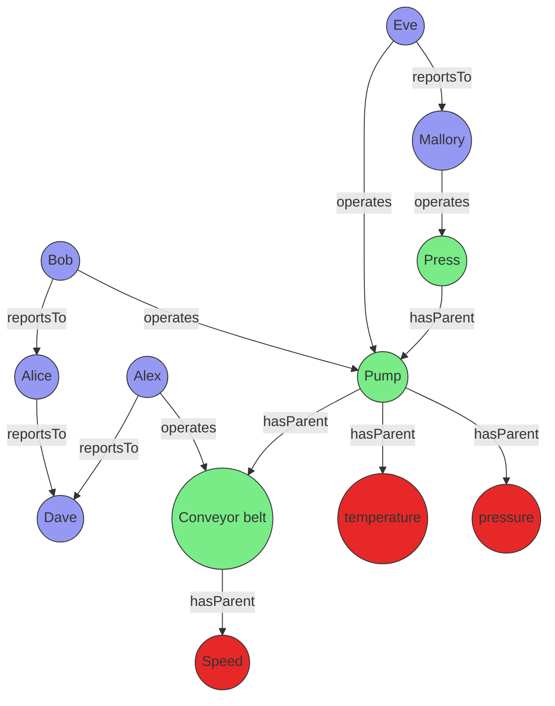

# Best practices for graph semantics

>[!INCLUDE [applies](../includes/applies-to-version/applies.md)] [!INCLUDE [fabric](../includes/applies-to-version/fabric.md)] [!INCLUDE [azure-data-explorer](../includes/applies-to-version/azure-data-explorer.md)] [!INCLUDE [monitor](../includes/applies-to-version/monitor.md)] [!INCLUDE [sentinel](../includes/applies-to-version/sentinel.md)]

Kusto supports two primary approaches for working with graphs: transient graphs created in-memory for each query, and persistent graphs defined as graph models and snapshots within the database. This article provides best practices for both methods, enabling you to select the optimal approach and use KQL graph semantics efficiently.

This guidance covers:

- Graph creation and optimization strategies
- Querying techniques and performance considerations
- Schema design for persistent graphs
- Integration with other KQL features
- Common pitfalls to avoid

## Graph modeling approaches in Kusto

Kusto provides two approaches for working with graphs: transient and persistent.

### Transient graphs

Created dynamically using the [`make-graph`](make-graph-operator.md) operator. These graphs exist only during query execution and are optimal for ad hoc or exploratory analysis on small to medium datasets.

### Persistent graphs

Defined using [graph models](../management/graph/graph-model-overview.md) and [graph snapshots](../management/graph/graph-snapshot-overview.md). These graphs are stored in the database, support schema and versioning, and are optimized for repeated, large-scale, or collaborative analysis.

## Best practices for transient graphs

Transient graphs, created in-memory using the `make-graph` operator, are ideal for ad hoc analysis, prototyping, and scenarios where graph structure changes frequently or requires only a subset of available data.

### Optimize graph size for performance

The [`make-graph`](make-graph-operator.md) creates an in-memory representation including both structure and properties. Optimize performance by:

- **Apply filters early** - Select only relevant nodes, edges, and properties before graph creation
- **Use projections** - Remove unnecessary columns to minimize memory consumption
- **Apply aggregations** - Summarize data where appropriate to reduce graph complexity

**Example: Reducing graph size through filtering and projection**

In this scenario, Bob changed managers from Alice to Eve. To view only the latest organizational state while minimizing graph size:

```kusto
let allEmployees = datatable(organization: string, name:string, age:long)
[
  "R&D", "Alice", 32,
  "R&D","Bob", 31,
  "R&D","Eve", 27,
  "R&D","Mallory", 29,
  "Marketing", "Alex", 35
];
let allReports = datatable(employee:string, manager:string, modificationDate: datetime)
[
  "Bob", "Alice", datetime(2022-05-23),
  "Bob", "Eve", datetime(2023-01-01),
  "Eve", "Mallory", datetime(2022-05-23),
  "Alice", "Dave", datetime(2022-05-23)
];
let filteredEmployees =
    allEmployees
    | where organization == "R&D"
    | project-away age, organization;
let filteredReports =
    allReports
    | summarize arg_max(modificationDate, *) by employee
    | project-away modificationDate;
filteredReports
| make-graph employee --> manager with filteredEmployees on name
| graph-match (employee)-[hasManager*2..5]-(manager)
  where employee.name == "Bob"
  project employee = employee.name, topManager = manager.name
```

**Output:**

| employee | topManager |
| -------- | ---------- |
| Bob      | Mallory    |

### Maintain current state with materialized views

The previous example showed how to obtain the last known state using `summarize` and `arg_max`. This operation can be compute-intensive, so consider using materialized views for improved performance.

**Step 1: Create tables with versioning**

Create tables with a versioning mechanism for graph time series:

```kusto
.create table employees (organization: string, name:string, stateOfEmployment:string, properties:dynamic, modificationDate:datetime)

.create table reportsTo (employee:string, manager:string, modificationDate: datetime)
```

**Step 2: Create materialized views**

Use the [arg_max aggregation](arg-max-aggregation-function.md) function to determine the latest state:

```kusto
.create materialized-view employees_MV on table employees
{
    employees
    | summarize arg_max(modificationDate, *) by name
}

.create materialized-view reportsTo_MV on table reportsTo
{
    reportsTo
    | summarize arg_max(modificationDate, *) by employee
}
```

**Step 3: Create helper functions**

Ensure only the materialized component is used and apply additional filters:

```kusto
.create function currentEmployees () {
    materialized_view('employees_MV')
    | where stateOfEmployment == "employed"
}

.create function reportsTo_lastKnownState () {
    materialized_view('reportsTo_MV')
    | project-away modificationDate
}
```

This approach provides faster queries, higher concurrency, and lower latency for current state analysis while preserving access to historical data.

```kusto
let filteredEmployees =
    currentEmployees
    | where organization == "R&D"
    | project-away organization;
reportsTo_lastKnownState
| make-graph employee --> manager with filteredEmployees on name
| graph-match (employee)-[hasManager*2..5]-(manager)
  where employee.name == "Bob"
  project employee = employee.name, reportingPath = hasManager.manager
```

### Implement graph time travel

Analyzing data based on historical graph states provides valuable temporal context. Implement this "time travel" capability by combining time filters with `summarize` and `arg_max`:

```kusto
.create function graph_time_travel (interestingPointInTime:datetime ) {
    let filteredEmployees =
        employees
        | where modificationDate < interestingPointInTime
        | summarize arg_max(modificationDate, *) by name;
    let filteredReports =
        reportsTo
        | where modificationDate < interestingPointInTime
        | summarize arg_max(modificationDate, *) by employee
        | project-away modificationDate;
    filteredReports
    | make-graph employee --> manager with filteredEmployees on name
}
```

**Usage example:**

Query Bob's top manager based on June 2022 graph state:

```kusto
graph_time_travel(datetime(2022-06-01))
| graph-match (employee)-[hasManager*2..5]-(manager)
  where employee.name == "Bob"
  project employee = employee.name, reportingPath = hasManager.manager
```

**Output:**

| employee | topManager |
| -------- | ---------- |
| Bob      | Dave       |

### Handle multiple node and edge types

When working with complex graphs containing multiple node types, use a canonical property graph model. Define nodes with attributes like `nodeId` (string), `label` (string), and `properties` (dynamic), while edges include `source` (string), `destination` (string), `label` (string), and `properties` (dynamic) fields.

**Example: Factory maintenance analysis**

Consider a factory manager investigating equipment issues and responsible personnel. The scenario combines asset graphs of production equipment with maintenance staff hierarchy:



The data for those entities can be stored directly in your cluster or acquired using query federation to a different service. To illustrate the example, the following tabular data is created as part of the query:

```kusto
let sensors = datatable(sensorId:string, tagName:string, unitOfMeasure:string)
[
  "1", "temperature", "°C",
  "2", "pressure", "Pa",
  "3", "speed", "m/s"
];
let timeseriesData = datatable(sensorId:string, timestamp:string, value:double, anomaly: bool )
[
    "1", datetime(2023-01-23 10:00:00), 32, false,
    "1", datetime(2023-01-24 10:00:00), 400, true,
    "3", datetime(2023-01-24 09:00:00), 9, false
];
let employees = datatable(name:string, age:long)
[
  "Alice", 32,
  "Bob", 31,
  "Eve", 27,
  "Mallory", 29,
  "Alex", 35,
  "Dave", 45
];
let allReports = datatable(employee:string, manager:string)
[
  "Bob", "Alice",
  "Alice", "Dave",
  "Eve", "Mallory",
  "Alex", "Dave"
];
let operates = datatable(employee:string, machine:string, timestamp:datetime)
[
  "Bob", "Pump", datetime(2023-01-23),
  "Eve", "Pump", datetime(2023-01-24),
  "Mallory", "Press", datetime(2023-01-24),
  "Alex", "Conveyor belt", datetime(2023-01-24),
];
let assetHierarchy = datatable(source:string, destination:string)
[
  "1", "Pump",
  "2", "Pump",
  "Pump", "Press",
  "3", "Conveyor belt"
];
```

The employees, sensors, and other entities and relationships do not share a canonical data model. The [union operator](union-operator.md) can be used to combine and standardize the data.

The following query joins the sensor data with the time series data to identify sensors with abnormal readings, then uses a projection to create a common model for the graph nodes.

```kusto
let nodes =
    union
        (
            sensors
            | join kind=leftouter
            (
                timeseriesData
                | summarize hasAnomaly=max(anomaly) by sensorId
            ) on sensorId
            | project nodeId = sensorId, label = "tag", properties = pack_all(true)
        ),
        ( employees | project nodeId = name, label = "employee", properties = pack_all(true));
```

The edges are transformed in a similar manner.

```kusto
let edges =
    union
        ( assetHierarchy | extend label = "hasParent" ),
        ( allReports | project source = employee, destination = manager, label = "reportsTo" ),
        ( operates | project source = employee, destination = machine, properties = pack_all(true), label = "operates" );
```

With the standardized nodes and edges data, you can create a graph using the [make-graph operator](make-graph-operator.md)


```kusto
let graph = edges
| make-graph source --> destination with nodes on nodeId;
```

Once the graph is created, define the path pattern and project the required information. The pattern begins at a tag node, followed by a variable-length edge to an asset. That asset is operated by an operator who reports to a top manager via a variable-length edge called *reportsTo*. The constraints section of the [graph-match operator](graph-match-operator.md), in this case the **where** clause, filters the tags to those with an anomaly that were operated on a specific day.

```kusto
graph
| graph-match (tag)-[hasParent*1..5]->(asset)<-[operates]-(operator)-[reportsTo*1..5]->(topManager)
    where tag.label=="tag" and tobool(tag.properties.hasAnomaly) and
        startofday(todatetime(operates.properties.timestamp)) == datetime(2023-01-24)
        and topManager.label=="employee"
    project
        tagWithAnomaly = tostring(tag.properties.tagName),
        impactedAsset = asset.nodeId,
        operatorName = operator.nodeId,
        responsibleManager = tostring(topManager.nodeId)
```

**Output**

| tagWithAnomaly | impactedAsset | operatorName | responsibleManager |
| -------------- | ------------- | ------------ | ------------------ |
| temperature    | Pump          | Eve          | Mallory            |

The projection in `graph-match` shows that the temperature sensor exhibited an anomaly on the specified day. The sensor was operated by Eve, who ultimately reports to Mallory. With this information, the factory manager can contact Eve and, if necessary, Mallory to better understand the anomaly.

## Best practices for persistent graphs

Persistent graphs, defined using [graph models](../management/graph/graph-model-overview.md) and [graph snapshots](../management/graph/graph-snapshot-overview.md), provide robust solutions for advanced graph analytics needs. These graphs excel in scenarios requiring repeated analysis of large, complex, or evolving data relationships, and facilitate collaboration by enabling teams to share standardized graph definitions and consistent analytical results. By persisting graph structures in the database, this approach significantly enhances performance for recurring queries and supports sophisticated versioning capabilities.

### Use schema and definition for consistency and performance

A clear schema for your graph model is essential, as it specifies node and edge types along with their properties. This approach ensures data consistency and enables efficient querying. Utilize the `Definition` section to specify how nodes and edges are constructed from your tabular data through `AddNodes` and `AddEdges` steps.

### Leverage static and dynamic labels for flexible modeling

When modeling your graph, you can utilize both static and dynamic labeling approaches for optimal flexibility. Static labels are ideal for well-defined node and edge types that rarely change—define these in the `Schema` section and reference them in the `Labels` array of your steps. For cases where node or edge types are determined by data values (for example, when the type is stored in a column), use dynamic labels by specifying a `LabelsColumn` in your step to assign labels at runtime. This approach is especially useful for graphs with heterogeneous or evolving schemas. Both mechanisms can be effectively combined—you can define a `Labels` array for static labels and also specify a `LabelsColumn` to incorporate additional labels from your data, providing maximum flexibility when modeling complex graphs with both fixed and data-driven categorization.

#### Example: Using dynamic labels for multiple node and edge types

The following example demonstrates an effective implementation of dynamic labels in a graph representing professional relationships. In this scenario, the graph contains people and companies as nodes, with employment relationships forming the edges between them. The flexibility of this model comes from determining node and edge types directly from columns in the source data, allowing the graph structure to adapt organically to the underlying information.

```json
{
  "Schema": {
    "Nodes": {
      "Person": {"Name": "string", "Age": "long"},
      "Company": {"Name": "string", "Industry": "string"}
    },
    "Edges": {
      "WORKS_AT": {"StartDate": "datetime", "Position": "string"}
    }
  },
  "Definition": {
    "Steps": [
      {
        "Kind": "AddNodes",
        "Query": "Employees | project Id, Name, Age, NodeType",
        "NodeIdColumn": "Id",
        "Labels": ["Person"],
        "LabelsColumn": "NodeType"
      },
      {
        "Kind": "AddEdges",
        "Query": "EmploymentRecords | project EmployeeId, CompanyId, StartDate, Position, RelationType",
        "SourceColumn": "EmployeeId",
        "TargetColumn": "CompanyId",
        "Labels": ["WORKS_AT"],
        "LabelsColumn": "RelationType"
      }
    ]
  }
}
```

This dynamic labeling approach provides exceptional flexibility when modeling graphs with numerous node and edge types, eliminating the need to modify your schema each time a new entity type appears in your data. By decoupling the logical model from the physical implementation, your graph can continuously evolve to represent new relationships without requiring structural changes to the underlying schema.

## Multi-tenant partitioning strategies for large-scale ISV scenarios

In large organizations, particularly ISV scenarios, graphs can consist of multiple billions of nodes and edges. This scale presents unique challenges that require strategic partitioning approaches to maintain performance while managing costs and complexity.

### Understanding the challenge

Large-scale multi-tenant environments often exhibit the following characteristics:

- **Billions of nodes and edges** - Enterprise-scale graphs that exceed traditional graph database capabilities
- **Tenant size distribution** - Typically follows a power law where 99.9% of tenants have small to medium graphs, while 0.1% have massive graphs
- **Performance requirements** - Need for both real-time analysis (current data) and historical analysis capabilities
- **Cost considerations** - Balance between infrastructure costs and analytical capabilities

### Partitioning by natural boundaries

The most effective approach for managing large-scale graphs is partitioning by natural boundaries, typically tenant identifiers or organizational units:

**Key partitioning strategies:**

- **Tenant-based partitioning** - Separate graphs by customer, organization, or business unit
- **Geographic partitioning** - Divide by region, country, or datacenter location
- **Temporal partitioning** - Separate by time periods for historical analysis
- **Functional partitioning** - Split by business domain or application area

**Example: Multi-tenant organizational structure**

```kusto
// Partition employees and reports by tenant
let tenantEmployees = 
    allEmployees
    | where tenantId == "tenant_123"
    | project-away tenantId;
    
let tenantReports = 
    allReports
    | where tenantId == "tenant_123"
    | summarize arg_max(modificationDate, *) by employee
    | project-away modificationDate, tenantId;

tenantReports
| make-graph employee --> manager with tenantEmployees on name
| graph-match (employee)-[hasManager*1..5]-(manager)
  where employee.name == "Bob"
  project employee = employee.name, reportingChain = hasManager.manager
```

### Hybrid approach: Transient vs. persistent graphs by tenant size

The most cost-effective strategy combines both transient and persistent graphs based on tenant characteristics:

#### Small to medium tenants (99.9% of tenants)

Use **transient graphs** for the majority of tenants:

**Advantages:**

- **Always up-to-date data** - No snapshot maintenance required
- **Lower operational overhead** - No graph model or snapshot management
- **Cost-effective** - No additional storage costs for graph structures
- **Immediate availability** - No pre-processing delays

**Implementation pattern:**

```kusto
.create function getTenantGraph(tenantId: string) {
    let tenantEmployees = 
        employees
        | where tenant == tenantId and stateOfEmployment == "employed"
        | project-away tenant, stateOfEmployment;
    let tenantReports = 
        reportsTo
        | where tenant == tenantId
        | summarize arg_max(modificationDate, *) by employee
        | project-away modificationDate, tenant;
    tenantReports
    | make-graph employee --> manager with tenantEmployees on name
}

// Usage for small tenant
getTenantGraph("small_tenant_456")
| graph-match (employee)-[reports*1..3]-(manager)
  where employee.name == "Alice"
  project employee = employee.name, managerChain = reports.manager
```

#### Large tenants (0.1% of tenants)

Use **persistent graphs** for the largest tenants:

**Advantages:**

- **Scalability** - Handle graphs exceeding memory limitations
- **Performance optimization** - Eliminate construction latency for complex queries
- **Advanced analytics** - Support sophisticated graph algorithms and analysis
- **Historical analysis** - Multiple snapshots for temporal comparison

**Implementation pattern:**

```kusto
// Create graph model for large tenant (example: Contoso)
.create graph model ContosoOrgChart
{
    "Schema": {
        "Nodes": {
            "Employee": {
                "Name": "string",
                "Department": "string",
                "Level": "int",
                "JoinDate": "datetime"
            }
        },
        "Edges": {
            "ReportsTo": {
                "Since": "datetime",
                "Relationship": "string"
            }
        }
    },
    "Definition": {
        "Steps": [
            {
                "Kind": "AddNodes",
                "Query": "employees | where tenant == 'Contoso' and stateOfEmployment == 'employed' | project Name, Department, Level, JoinDate",
                "NodeIdColumn": "Name",
                "Labels": ["Employee"]
            },
            {
                "Kind": "AddEdges", 
                "Query": "reportsTo | where tenant == 'Contoso' | summarize arg_max(modificationDate, *) by employee | project employee, manager, modificationDate as Since | extend Relationship = 'DirectReport'",
                "SourceColumn": "employee",
                "TargetColumn": "manager",
                "Labels": ["ReportsTo"]
            }
        ]
    }
}

// Create snapshot for Contoso
.create graph snapshot ContosoSnapshot from ContosoOrgChart

// Query Contoso's organizational graph
graph("ContosoOrgChart")
| graph-match (employee)-[reports*1..10]-(executive)
  where employee.Department == "Engineering"
  project employee = employee.Name, executive = executive.Name, pathLength = array_length(reports)
```

### Best practices for ISV scenarios

1. **Start with transient graphs** - Begin all new tenants with transient graphs for simplicity
2. **Monitor growth patterns** - Implement automatic detection of tenants requiring persistent graphs
3. **Batch snapshot creation** - Schedule snapshot updates during low-usage periods
4. **Tenant isolation** - Ensure graph models and snapshots are properly isolated between tenants
5. **Resource management** - Use workload groups to prevent large tenant queries from affecting smaller tenants
6. **Cost optimization** - Regularly review and optimize the persistent/transient threshold based on actual usage patterns

This hybrid approach enables organizations to provide always-current data analysis for the majority of tenants while delivering enterprise-scale analytics capabilities for the largest tenants, optimizing both cost and performance across the entire customer base.

## Related content

- [Graph semantics overview](graph-semantics-overview.md)
- [Common scenarios for using graph semantics](graph-scenarios.md)
- [Graph operator](graph-operator.md)
- [make-graph operator](make-graph-operator.md)
- [Graph models overview](../management/graph/graph-model-overview.md)
