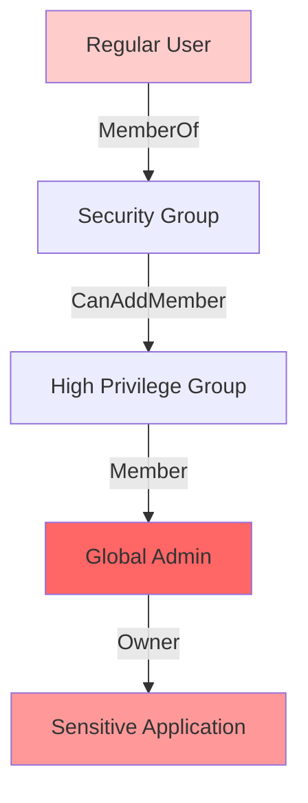
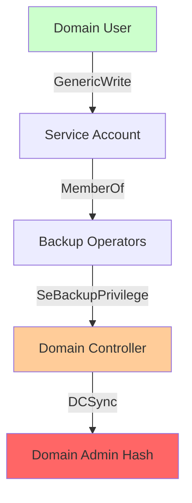

# Graph sample datasets and examples

This page lists existing graphs on our help cluster at [https://help.kusto.windows.net](https://help.kusto.windows.net) in the "Samples" database and shows how to query them with KQL. These examples demonstrate querying pre-built graph models without requiring any creation or setup steps.

## Usage notes

Use `graph("ModelName")` with the model name to reference existing graphs.

## Simple

**Purpose**: Basic graph operations and learning fundamental graph query patterns.

**Description**: A small educational graph containing people, companies, and cities with various relationships. Perfect for learning graph traversals and understanding basic patterns.

**Schema**:

- **Nodes**: Person, Company, City
- **Edges**: works_at, located_at, knows, likes

**Schema Relationships**:

:::image type="content" source="media/graphs/graph-example-simple-schema.png" alt-text="A schema of a graph containing people, companies, and cities with various relationships":::

**Sample Data Structure**:

:::image type="content" source="media/graphs/graph-example-simple-instances.png" alt-text="A graph containing instances of people, companies, and cities with various relationships":::

**Use Cases**:

- Learning graph query fundamentals
- Testing graph algorithms
- Understanding relationship patterns
- Educational examples for graph concepts

**Example Queries**:

Find all employees of a specific company:

```kusto
graph("Simple")
| graph-match (person)-[works_at]->(company)
    where company.name == "TechCorp"
    project employee_name = person.name, employee_age = person.properties.age
```

|employee_name|employee_age|
|---|---|
|Alice|25|
|Bob|30|
|Emma|26|

Find colleagues (people working at the same company):

```kusto
graph("Simple")
| graph-match (person1)-->(company)<--(person2)
    where person1.id != person2.id and labels(company) has "Company"
    project colleague1 = person1.name, colleague2 = person2.name, company = company.name
| take 1
```

|colleague1|colleague2|company|
|---|---|---|
|Alice|Bob|TechCorp|

## LDBC_SNB_Interactive

**Purpose**: Social network traversals and friend-of-friend exploration.

> [!NOTE]
> This dataset is provided under the [Apache License 2.0](https://www.apache.org/licenses/LICENSE-2.0). The LDBC Social Network Benchmark datasets are created by the Linked Data Benchmark Council (LDBC).

**Description**: The Linked Data Benchmark Council (LDBC) [Social Network Benchmark Interactive](https://ldbcouncil.org/benchmarks/snb/) workload dataset represents a comprehensive social network modeling real-world social media platforms. This benchmark captures the complexity of modern social networks with over 300,000 nodes and multiple relationship types, including hierarchical geographic data, multi-level organizational structures, and rich content interactions. The dataset includes people, posts, comments, forums, universities, companies, geographic locations (continents, countries, cities), tags, and tag classifications, making it ideal for testing complex graph traversals, recommendation algorithms, and social network analysis patterns.

**Tables and Location**:
All LDBC SNB Interactive tables are located in the **`Graph/LDBC/SnbInteractive`** folder and include:

- **Core Entity Tables**:
  - `LDBC_SNB_Person` - Social network users (1,528 persons)
  - `LDBC_SNB_Post` - User posts (135,701 posts)  
  - `LDBC_SNB_Comment` - Comments on posts (151,043 comments)
  - `LDBC_SNB_Forum` - Discussion forums (13,750 forums)

- **Organizational Tables**:
  - `LDBC_SNB_Organisation` - Universities and companies (7,955 total)

- **Geographic Tables**:
  - `LDBC_SNB_Place` - Geographic locations including continents (6), countries (111), and cities (1,343) - total 1,460 places

- **Content Classification Tables**:
  - `LDBC_SNB_Tag` - Content tags (16,080 tags)
  - `LDBC_SNB_TagClass` - Tag categories (71 classes)

- **Relationship Tables** (contain edge data):
  - `LDBC_SNB_Person_knows_Person` - Friend relationships (14,073 edges)
  - `LDBC_SNB_Person_likes_Post` - Post likes (47,215 edges)
  - `LDBC_SNB_Person_likes_Comment` - Comment likes (62,225 edges)  
  - `LDBC_SNB_Forum_hasMember_Person` - Forum memberships (123,268 edges)
  - `LDBC_SNB_Forum_hasModerator_Person` - Forum moderation (13,750 edges)
  - `LDBC_SNB_Person_studyAt_Organization` - Educational history (1,209 edges)
  - `LDBC_SNB_Person_workAt_Organization` - Employment history (3,313 edges)
  - `LDBC_SNB_Post_hasTag_Tag` - Post tagging (51,118 edges)
  - `LDBC_SNB_Comment_hasTag_Tag` - Comment tagging (191,303 edges)
  - `LDBC_SNB_Forum_hasTag_Tag` - Forum tagging (47,697 edges)
  - `LDBC_SNB_Place_isPartOf_Place` - Geographic hierarchy (1,454 edges)
  - `LDBC_SNB_Comment_hasCreator_Person` - Comment authorship (151,043 edges)
  - `LDBC_SNB_Post_hasCreator_Person` - Post authorship (135,701 edges)
  - `LDBC_SNB_Comment_replyOf_Comment` - Comment replies (76,787 edges)
  - `LDBC_SNB_Comment_replyOf_Post` - Post replies (74,256 edges)
  - `LDBC_SNB_Forum_containerOf_Post` - Forum post containment (135,701 edges)
  - `LDBC_SNB_Person_hasInterest_Tag` - Person interests (35,475 edges)
  - `LDBC_SNB_Person_isLocatedIn_Place` - Person location (1,528 edges)
  - `LDBC_SNB_Organisation_isLocatedIn_Place` - Organization location (7,955 edges)
  - `LDBC_SNB_Post_isLocatedIn_Place` - Post location (135,701 edges)
  - `LDBC_SNB_Comment_isLocatedIn_Place` - Comment location (151,043 edges)
  - `LDBC_SNB_Tag_hasType_TagClass` - Tag classification (16,080 edges)
  - `LDBC_SNB_TagClass_isSubclassOf_TagClass` - Tag class hierarchy (70 edges)

**Schema**:

- **Nodes**: PERSON, POST, COMMENT, FORUM, ORGANISATION, PLACE, TAG, TAGCLASS
- **Edges**: KNOWS, LIKES, HAS_CREATOR, REPLY_OF, HAS_MEMBER, HAS_MODERATOR, STUDY_AT, WORK_AT, IS_LOCATED_IN, HAS_INTEREST, HAS_TAG, IS_PART_OF, CONTAINER_OF, HAS_TYPE, IS_SUBCLASS_OF

**Use Cases**:

- Social network analysis and recommendation systems
- Community detection algorithms
- Influence propagation studies
- Content recommendation based on social connections
- Friend-of-friend discovery
- Social graph mining research

**Example Queries**:

Find direct friendships with similar ages:

This query identifies pairs of people who are directly connected through a "KNOWS" relationship and have similar ages (birthdays within 30 days of each other). It traverses the LDBC social network graph to find existing friendships between people of similar age groups. The query returns the total count of such age-similar friendship pairs in the network, which can be useful for analyzing age-based social patterns or validating friend recommendation algorithms.

```kusto
graph("LDBC_SNB_Interactive")
| graph-match (person1)-[knows]->(person2)
    where labels(person1) has "PERSON" and labels(person2) has "PERSON" and 
        labels(knows) has "KNOWS"and abs(person1.birthday - person2.birthday) < 30d
    project person_name = person1.firstName, friend_name = person2.firstName
| count 
```

|Count|
|---|
|225|

Find popular posts by likes:

This query analyzes social engagement by identifying the most popular content creators based on how many unique people have liked their posts. It traverses the social network graph through the path: person → likes → post → has_creator → creator. The query aggregates the data to show each creator's total number of unique likers and distinct posts, then returns the top 3 creators with the most likes. This is useful for identifying influential content creators, understanding engagement patterns, and discovering viral content in the social network.

```kusto
graph("LDBC_SNB_Interactive")
| graph-match (person)-[likes]->(post)-[has_creator]->(creator)
    where labels(person) has "Person" and labels( post) has "POST" and labels(has_creator) has "HAS_CREATOR" and isnotempty(creator.lastName)
    project personId = person.id, postId = post.id, creator = creator.lastName
| summarize Likes = dcount(personId), posts = dcount(postId) by creator
| top 3 by Likes desc
```

|creator|Likes|posts|
|---|---|---|
|Zhang|371|207|
|Hoffmann|340|9|
|Singh|338|268|

## LDBC_Financial

**Purpose**: Financial transaction analysis and fraud detection patterns.

> [!NOTE]
> This dataset is provided under the [Apache License 2.0](https://www.apache.org/licenses/LICENSE-2.0). The LDBC Financial Benchmark datasets are created by the Linked Data Benchmark Council (LDBC).

**Description**: LDBC Financial Benchmark dataset representing a financial network with companies, persons, accounts, loans, and various financial transactions. Designed for fraud detection and financial crime investigation scenarios.

**Schema**:

- **Nodes**: COMPANY, PERSON, ACCOUNT, LOAN, MEDIUM
- **Edges**: TRANSFER, WITHDRAW, DEPOSIT, OWN, APPLY, GUARANTEE, INVEST, SIGN_IN, REPAY

**Use Cases**:

- Financial fraud detection
- Anti-money laundering (AML) analysis
- Transaction pattern analysis
- Risk assessment and credit scoring
- Suspicious activity monitoring
- Financial network analysis

**Example Queries**:

Detect potential money laundering through circular transfers:

This query identifies suspicious circular transaction patterns that could indicate money laundering activities. It searches for accounts that send money to another account and then receive it back through a chain of 1 to 3 transfers, creating a circular flow. The query specifically looks for large initial transfers (over 10,000) and returns details about the suspicious accounts, including the transfer amount and the length of the circular chain. This pattern detection is useful for anti-money laundering (AML) systems and financial fraud investigations.

```kusto
graph("LDBC_Financial")
| graph-match (account1)-[t1]->(account2)-[t2*1..3]->(account1)
    where labels(t1) has "TRANSFER" and t1.amount > 10000  // Large initial transfer
    project suspicious_account = account1.node_id,
            amount = t1.amount,
            transfer_chain_length = array_length(t2) + 1
| take 10
```

|suspicious_account|amount|transfer_chain_length|
|---|---|---|
|Account::4818007176356300028|5035377,73|2|
|Account::4818007176356300028|5035377,73|2|
|Account::4845310249097233848|359062,45|2|
|Account::4818007176356300028|5035377,73|3|
|Account::4818007176356300028|5035377,73|4|
|Account::4840243699516440940|5753668,55|4|
|Account::4818007176356300028|5035377,73|4|
|Account::180143985094820389|465338,26|4|
|Account::4814910951612482356|1684581,62|4|
|Account::4816599801472746629|963626,42|4|

Find high-risk loan guarantors:

This query identifies individuals or companies who guarantee multiple loans totaling significant amounts, which could indicate financial risk exposure. It traverses the financial network graph following the path: guarantor → guarantee → borrower → apply → loan. The query aggregates the total amount guaranteed and number of loans for each guarantor, then filters for those guaranteeing over 100,000 in total and returns the top 5 by total guaranteed amount. This analysis is useful for risk assessment, identifying over-leveraged guarantors, and evaluating systemic financial risks in lending networks.

```kusto
graph("LDBC_Financial")
| graph-match (guarantor)-[guarantee]->(borrower)-[apply]->(loan)
    where labels(guarantee) has "GUARANTEE" and labels(apply) has "APPLY"
    project guarantor_id = guarantor.node_id,
            borrower_id = borrower.node_id,
            loan_amount = loan.loanAmount
| summarize total_guaranteed = sum(loan_amount), loan_count = count() by guarantor_id
| where total_guaranteed > 100000
| top 5 by total_guaranteed desc
```

|guarantor_id|total_guaranteed|loan_count|
|---|---|---|
|Person::44|439802195|8|
|Person::15393162789155|411111642|8|
|Company::12094627905931|404538891|6|
|Company::4398046511208|366243272|8|
|Person::19791209300551|338838223|6|

## BloodHound Entra

**Purpose**: Azure Active Directory privilege escalation and attack path analysis.

> [!NOTE]
> This dataset is provided under the [Apache License 2.0](https://www.apache.org/licenses/LICENSE-2.0). The BloodHound datasets are created by the BloodHound Community Edition project.

**Description**: BloodHound Community Edition dataset for Azure Active Directory environments. Contains nodes representing Azure AD objects (users, groups, applications, service principals) and edges representing various permissions and relationships.

**Schema**:

- **Nodes**: Various Azure AD object types (Users, Groups, Applications, Service Principals, etc.)
- **Edges**: Permission and relationship types (Member, Owner, various Azure AD privileges)

**Security Analysis Example**:



**Use Cases**:

- Entra ID security assessments
- Privilege escalation path discovery
- Attack path visualization
- Identity governance analysis
- Risk-based security controls
- Compliance auditing for cloud environments

**Example Queries**:

Find paths to administrative privileges:

This query identifies privilege escalation paths from regular users to administrative groups in Azure AD environments. It searches for users who can reach admin groups (like AAD DC Administrators, DnsAdmins, etc.) through 1-5 relationship hops, helping security teams understand potential attack paths and privilege escalation risks.

```kusto
graph("BloodHound_Entra")
| graph-match (user)-[path*1..3]->(admingroup)
    where labels(user) has_any ("User", "AZUser") 
          and labels(admingroup) has_any ("Group", "AZGroup")
          and (admingroup.name contains "ADMIN" or admingroup.displayname contains "ADMIN")
    project source_user = user.name,
             path_length = array_length(path),
             admin_group = coalesce(admingroup.displayname, admingroup.name)
| order by path_length asc
| take 10
```

|source_user|path_length|admin_group|
|---|---|---|
|THISUSERHASINTUNEADMINROLE@PHANTOMCORP.ONMICROSOFT.COM|1|ADSyncAdmins|
|097EF6C2-GROUPSADMINISTRATOR@PHANTOMCORP.ONMICROSOFT.COM|1|AAD DC Administrators|
|USERBELONGSTOGAGROUP@PHANTOMCORP.ONMICROSOFT.COM|1|ADSyncAdmins|
|THISUSERHASINTUNEADMINROLE@PHANTOMCORP.ONMICROSOFT.COM|1|DnsAdmins|
|RHADMIN@PHANTOMCORP.ONMICROSOFT.COM|1|DnsAdmins|
|CJACKSON@PHANTOMCORP.ONMICROSOFT.COM|1|Azure ATP phantom Administrators|
|097EF6C2-INTUNEADMINISTRATOR@PHANTOMCORP.ONMICROSOFT.COM|1|AAD DC Administrators|
|RHADMIN_PHANTOMCORP.ONMICROSOFT.COM#EXT#@PHANTOMCORP.ONMICROSOFT.COM|1|Resource Group Admins|
|THISUSERHASKNOWLEDGEMANAGERROLE@PHANTOMCORP.ONMICROSOFT.COM|1|DnsAdmins|
|097EF6C2-INTUNEADMINISTRATOR@PHANTOMCORP.ONMICROSOFT.COM|1|DnsAdmins|

Identify high-value targets (Tier 0 assets):

This query identifies critical administrative assets marked as "admin_tier_0" in the environment. These are the most sensitive and powerful accounts, service principals, and resources that pose the highest risk if compromised. Understanding these assets helps prioritize security monitoring and protection efforts.

```kusto
graph("BloodHound_Entra")
| graph-match (asset)
    where asset.properties.system_tags contains "admin_tier_0"
    project asset_name = asset.name,
             asset_type = tostring(labels(asset)[1]),  // Get primary type (AZUser, AZServicePrincipal, etc.)
             system_tags = asset.properties.system_tags
| take 10
```

|asset_name|asset_type|system_tags|
|---|---|---|
|JJACOB@PHANTOMCORP.ONMICROSOFT.COM|AZUser|admin_tier_0|
|PLEWIS@PHANTOMCORP.ONMICROSOFT.COM|AZUser|admin_tier_0|
|JMILLER@PHANTOMCORP.ONMICROSOFT.COM|AZUser|admin_tier_0|
|CJACKSON@PHANTOMCORP.ONMICROSOFT.COM|AZUser|admin_tier_0|
|RHALL@PHANTOMCORP.ONMICROSOFT.COM|AZUser|admin_tier_0|
|THISAPPHASGLOBALADMIN@PHANTOMCORP|AZServicePrincipal|admin_tier_0|
|MYCOOLAUTOMATIONACCOUNT@PHANTOMCORP|AZServicePrincipal|admin_tier_0|
|SERVICEPRINCIPALE@PHANTOMCORP|AZServicePrincipal|admin_tier_0|
|31E3B75F-PRIVILEGED AUTHENTICATION ADMINISTRATOR@PHANTOMCORP|AZServicePrincipal|admin_tier_0|
|31E3B75F-PRIVILEGED ROLE ADMINISTRATOR@PHANTOMCORP|AZServicePrincipal|admin_tier_0|

## BloodHound_AD

**Purpose**: On-premises Active Directory security analysis and privilege mapping.

> [!NOTE]
> This dataset is provided under the [Apache License 2.0](https://www.apache.org/licenses/LICENSE-2.0). The BloodHound datasets are created by the BloodHound Community Edition project.

**Description**: BloodHound Community Edition dataset for on-premises Active Directory environments. Contains comprehensive information about AD objects, group memberships, ACLs, and various attack paths in traditional Windows domains.

**Attack Path Visualization Example**:



**Use Cases**:

- Active Directory security assessments
- Attack path analysis and penetration testing
- Domain privilege mapping
- Group policy security analysis
- Kerberoasting and ASREPRoasting target identification
- Security control gap analysis

**Example Queries**:

Find potential privilege escalation:

This query counts how many non-admin users can potentially escalate to admin in Azure AD. It traverses up to 10 MemberOf group hops (no cycles) from each user to groups that grant dangerous permissions (GenericAll, WriteDacl, WriteOwner, ForceChangePassword) over admin users (admincount=true), then returns the distinct number of such “potential attacker” users.

```kusto
graph("BloodHound_AD")
| graph-match cycles=none (user)-[memberof*0..10]->(group)-[permission]->(target)
    where labels(user) has "User" 
          and labels(group) has "Group"
          and all(memberof, labels() has "MemberOf")
          and user.properties.admincount == false
          and (labels(permission) has_any ("GenericAll", "WriteDacl", "WriteOwner", "ForceChangePassword"))
          and (labels(target) has "User" and target.properties.admincount == true)
    project  attack_user = user.name
| summarize ['Potential attackers'] = dcount(attack_user)
```

|Potential attackers|
|---|
|2|

Find Golden Certificate attack paths:

This query identifies entities that can perform Golden Certificate attacks, which allow attackers to forge certificates as any user in the domain. These are extremely critical vulnerabilities as they enable complete domain compromise by allowing the attacker to impersonate any user, including domain administrators, through forged certificates.

```kusto
graph("BloodHound_AD")
| graph-match (attacker)-[goldencert]->(target)
    where labels(goldencert) has "GoldenCert"
    project 
        Attacker = attacker.name,
        AttackerType = case(
            attacker.name has "DC", "Domain Controller",
            attacker.name has "CA", "Certificate Authority", 
            attacker.name has "SRV", "Server",
            "Unknown System"
        ),
        Target = target.name,
        RiskLevel = "CRITICAL",
        AttackCapability = case(
            attacker.name has "DC", "Primary domain controller with certificate services",
            attacker.name has "EXTCA", "External Certificate Authority with root access",
            attacker.name has "SRV", "Compromised server with certificate generation rights",
            "System with certificate forging capabilities"
        )
```

|Attacker|AttackerType|Target|RiskLevel|AttackCapability|
|---|---|---|---|---|
|DC01.PHANTOM.CORP|Unknown System|PHANTOM.CORP|CRITICAL|System with certificate forging capabilities|
|SRV-SHARPHOUND.PHANTOM.CORP|Server|PHANTOM.CORP|CRITICAL|Compromised server with certificate generation rights|
|EXTCA01.WRAITH.CORP|Unknown System|WRAITH.CORP|CRITICAL|System with certificate forging capabilities|
|EXTCA02.WRAITH.CORP|Unknown System|WRAITH.CORP|CRITICAL|System with certificate forging capabilities|

## Common Analysis Queries

These queries work across all graph models and help you understand the structure and characteristics of any graph dataset. Use these queries to explore new graphs or perform basic analysis.

### Graph Overview and Statistics

**Count total nodes and edges**:

```kusto
// Get node count
graph("GRAPH_NAME")
| graph-match (node)
project node
| summarize NodeCount = count()
```

```kusto
// Get edge count
graph("GRAPH_NAME")
| graph-match (source)-[edge]->(target)
project edge
| summarize EdgeCount = count()
```

**Get graph summary statistics**:

```kusto
let nodes = graph("GRAPH_NAME") | graph-match (node) project node | summarize NodeCount = count();
let edges = graph("GRAPH_NAME") | graph-match (source)-[edge]->(target) project edge | summarize EdgeCount = count();
union nodes, edges
```

### Node Analysis

**Discover all node types (labels)**:

```kusto
graph("GRAPH_NAME")
| graph-match (node) 
project labels = labels(node)
| mv-expand label = labels 
| summarize count() by tostring(label)
| order by count_ desc
```

**Find nodes with multiple labels**:

```kusto
graph("GRAPH_NAME")
| graph-match (node) 
project node_id = node.id, labels = labels(node), label_count = array_length(labels(node))
| where label_count > 1
| take 10
```

**Sample nodes by type**:

```kusto
graph("GRAPH_NAME")
| graph-match (node) 
where labels(node) has "DESIRED_LABEL"  // Replace with actual label
project node_id = node.id, properties = node.properties
| take 5
```

### Edge Analysis

**Discover all edge types** (works with different graph schemas):

```kusto
// For graphs using 'labels' array (like BloodHound)
graph("GRAPH_NAME")
| graph-match (source)-[edge]->(target)
project edge_labels = labels(edge)
| mv-expand label = edge_labels 
| summarize count() by tostring(label)
| order by count_ desc
```

```kusto
// For graphs using 'label' column (like LDBC)
graph("GRAPH_NAME")
| graph-match (source)-[edge]->(target)
project edge_label = edge.label
| summarize count() by edge_label
| order by count_ desc
```

```kusto
// For graphs using 'lbl' column (like Simple)
graph("GRAPH_NAME")
| graph-match (source)-[edge]->(target)
project edge_label = edge.lbl
| summarize count() by edge_label
| order by count_ desc
```

**Find most connected nodes (highest degree)**:

```kusto
graph("GRAPH_NAME")
| graph-match (node)-[edge]-(connected)
project node_id = node.id
| summarize degree = count() by node_id
| order by degree desc
| take 10
```

### Relationship Pattern Analysis

**Find nodes with specific relationship patterns**:

```kusto
// Nodes that have both incoming and outgoing edges
graph("GRAPH_NAME")
| graph-match (node)
where (graph("GRAPH_NAME") | graph-match (other1)-[]->(node) | take 1 | count() > 0)
  and (graph("GRAPH_NAME") | graph-match (node)-[]->(other2) | take 1 | count() > 0)
project node_id = node.id, node_labels = labels(node)
| take 10
```

**Discover triangular relationships** (nodes connected in a triangle):

```kusto
graph("GRAPH_NAME")
| graph-match (a)-[]->(b)-[]->(c)-[]->(a)
where a.id != b.id and b.id != c.id and c.id != a.id
project node1 = a.id, node2 = b.id, node3 = c.id
| take 5
```

### Property Analysis

**Explore node properties**:

```kusto
graph("GRAPH_NAME")
| graph-match (node)
where labels(node) has "DESIRED_LABEL"  // Replace with actual label
project properties = node.properties
| take 1
| project property_names = bag_keys(properties)
```

**Find nodes with specific property values**:

```kusto
graph("GRAPH_NAME")
| graph-match (node)
where isnotnull(node.properties.name)  // Replace 'name' with actual property
project node_id = node.id, property_value = node.properties.name
| take 10
```

> [!TIP]
> Replace `"GRAPH_NAME"` with the actual graph model name (e.g., "Simple", "LDBC_SNB_Interactive", "BloodHound_Entra", etc.). Some queries may need adjustment based on the specific schema of your graph model.

## Related content

- [Graph semantics overview](./graph-semantics-overview.md)
- [Graph operators](./graph-operators.md)
- [Graph best practices](./graph-best-practices.md)
- [Persistent graph overview](../management/graph/graph-persistent-overview.md)
