# Tutorial: Create your first graph

> [!INCLUDE [applies](../../includes/applies-to-version/applies.md)] [!INCLUDE [fabric](../../includes/applies-to-version/fabric.md)] [!INCLUDE [azure-data-explorer](../../includes/applies-to-version/azure-data-explorer.md)] [!INCLUDE [monitor](../../includes/applies-to-version/monitor.md)] [!INCLUDE [sentinel](../../includes/applies-to-version/sentinel.md)]

Graph semantics in Kusto enables you to model and query data as interconnected networks. A graph consists of nodes (entities) and edges (relationships) that connect them. This tutorial introduces the essential concepts and shows you how to create and query your first graphs using Kusto Query Language (KQL).

## What are graph semantics in Kusto?

Graph semantics represent data as a network of connected entities. Unlike traditional relational data that uses tables and joins, graphs use direct relationships between entities, making it intuitive to model and traverse complex connections such as:

- Social networks (users following each other)
- Organizational hierarchies (employees reporting to managers)  
- Attack paths in cybersecurity (threat actors targeting systems)
- Supply chains (suppliers providing to manufacturers)

Kusto provides two approaches for working with graphs:

1. **Transient graphs** - Created dynamically during query execution using the `make-graph` operator
2. **Persistent graphs** - Stored models that can be queried repeatedly without reconstruction

In this tutorial, you'll learn how to:

> [!div class="checklist"]
>
> * [Create a transient graph](#create-a-transient-graph)
> * [Query graphs with graph-match](#query-graphs-with-graph-match)
> * [Create a persistent graph](#create-a-persistent-graph)
> * [Query persistent graphs](#query-persistent-graphs)

::: moniker range="azure-data-explorer"
The examples in this tutorial use sample data that you can run in the [**help** cluster](https://help.kusto.windows.net/Samples). To explore with your own data, [create your own free cluster](/azure/data-explorer/start-for-free-web-ui).
::: moniker-end

::: moniker range="microsoft-fabric"
The examples in this tutorial use sample data that you can create and run in your **Microsoft Fabric** environment.
::: moniker-end

## Prerequisites

To run the following queries, you need a query environment with access to the sample data. You can use one of the following:

:::moniker range="azure-data-explorer"
* A Microsoft account or Microsoft Entra user identity to sign in to the [help cluster](https://dataexplorer.azure.com/clusters/help) 
::: moniker-end

:::moniker range="microsoft-fabric"
* A Microsoft account or Microsoft Entra user identity 
* A [Fabric workspace](/fabric/get-started/create-workspaces) with a Microsoft Fabric-enabled [capacity](/fabric/enterprise/licenses#capacity)
::: moniker-end

## Create a transient graph

Let's start with a simple organizational hierarchy to understand the basics. First, we'll create our sample data and then visualize it as a graph.

### Sample data for our organizational hierarchy

We'll work with a small company structure where employees report to managers:

```mermaid
graph TD
    Alice[👤 Alice<br/>CEO, Age 45]
    Bob[👤 Bob<br/>Engineering Manager, Age 35] 
    Carol[👤 Carol<br/>Marketing Manager, Age 38]
    Dave[👤 Dave<br/>Developer, Age 28]
    Eve[👤 Eve<br/>Developer, Age 26]
    Frank[👤 Frank<br/>Marketing Specialist, Age 30]

    Alice -->|manages| Bob
    Alice -->|manages| Carol
    Bob -->|manages| Dave
    Bob -->|manages| Eve
    Carol -->|manages| Frank

    style Alice fill:#ff6b6b,stroke:#d63031,color:#fff
    style Bob fill:#4ecdc4,stroke:#00b894,color:#fff
    style Carol fill:#4ecdc4,stroke:#00b894,color:#fff
    style Dave fill:#a8e6cf,stroke:#00b894,color:#000
    style Eve fill:#a8e6cf,stroke:#00b894,color:#000
    style Frank fill:#a8e6cf,stroke:#00b894,color:#000
```



Now let's create this graph using the `make-graph` operator:

:::moniker range="azure-data-explorer"
> [!div class="nextstepaction"]
> <a href="https://help.kusto.windows.net/Samples?query=H4sIAAAAAAAEAG1STWuEMBC9C%2f6HwVMLiqVflC0tdF17W3rosfQwuw4ajEmI6baF%2fvjGuIm67MFI3nszk%2feYPIdCExqCHjvFCcie8pcIKjQYR5xMgHp4cqjBHacLgR2teqOZqFPQkk8XrGnFpagvIY4%2b7AeQvHC2pySFpCjf7O%2f2LoWRWMvdAJeiZoJoqIctCttBW%2fgmyAq0EwbhFnVL5kT24GUbPLgpGzoQl8qx14Etz5D3qaNeNYp22f9d0Z4hZ70ZRlzF0eejbZOHvDQpqZ1SE0fDpOgbpvoxspFcBuZjDDl1o4PjfZbWMRQf2kkES9hbdjVzmxMQzI0tJifrL8YrMA1BrVE1gKIC%2brGv1ATMxJF3EUd%2f9rEtZaMsrEiWPXsT8M1MM9sUKWBYEFfqqjIjM5cDCFlZwT%2bAlxSzeQIAAA%3d%3d&web=0" target="_blank">Run the query</a>
::: moniker-end

```kusto
// Create sample employee data
let employees = datatable(name:string, role:string, age:long) 
[ 
  "Alice", "CEO", 45,  
  "Bob", "Engineering Manager", 35,  
  "Carol", "Marketing Manager", 38,  
  "Dave", "Developer", 28,  
  "Eve", "Developer", 26,
  "Frank", "Marketing Specialist", 30
]; 
// Create reporting relationships
let reports = datatable(employee:string, manager:string) 
[ 
  "Bob", "Alice",  
  "Carol", "Alice",  
  "Dave", "Bob",
  "Eve", "Bob",
  "Frank", "Carol"
]; 
// Build the graph and explore it
reports 
| make-graph employee --> manager with employees on name 
| graph-to-table nodes 
```

**Output**

|name|role|age|
|---|---|---|
|Alice|CEO|45|
|Bob|Engineering Manager|35|
|Carol|Marketing Manager|38|
|Dave|Developer|28|
|Eve|Developer|26|
|Frank|Marketing Specialist|30|

## Query graphs with graph-match

Now let's use the `graph-match` operator to find patterns in our organizational graph. The `graph-match` operator searches for specific patterns and relationships within the graph.

### Find all employees who report to Alice

:::moniker range="azure-data-explorer"
> [!div class="nextstepaction"]
> <a href="https://help.kusto.windows.net/Samples?query=H4sIAAAAAAAEAG1STWuEMBC9C%2f6HwdMKWkq%2fKNtaaHftbemhx2UPWTtoakxCDLsU%2buObRBN1KSI68%2bbjzZthqAE7ycQPYg8FfBFtniPDFScdrnutKK8zUIJNBqlxzQSvU4ijvXkBkldGK0wySDblh%2fnc3WcwAG%2fiaN0lrylHtPmwI9xUUMZ9G8I2xHSwgTuiWtQXYY8%2bbEtOrssWT8iEdOhNQMt%2fwIfMQe%2bK8HZZ%2f1NiRQmjvbYtruPo8GTKMKOHQimUXqrhNQoidAO90Z5JMU7sFbmYb%2bn287ic%2bQyTIzAfSow0PcU4%2bjVMWsxrRWQTNgl5%2fuIZwpnqZrZjwcGu1qW6rLwjumpgRSy19Dnfj8UPeZg6tVTODSoEF3XlKhSFn8fCUolvrKZrMvL5Xxc%2bHNHca213TXOnMf8AJFalqZQCAAA%3d&web=0" target="_blank">Run the query</a>
::: moniker-end

```kusto
let employees = datatable(name:string, role:string, age:long) 
[ 
  "Alice", "CEO", 45,  
  "Bob", "Engineering Manager", 35,  
  "Carol", "Marketing Manager", 38,  
  "Dave", "Developer", 28,  
  "Eve", "Developer", 26,
  "Frank", "Marketing Specialist", 30
]; 
let reports = datatable(employee:string, manager:string) 
[ 
  "Bob", "Alice",  
  "Carol", "Alice",  
  "Dave", "Bob",
  "Eve", "Bob",
  "Frank", "Carol"
]; 
reports 
| make-graph employee --> manager with employees on name 
| graph-match (alice)<-[reports]-(employee)
  where alice.name == "Alice"
  project employee = employee.name, role = employee.role, age = employee.age
```

**Output**

|employee|role|age|
|---|---|---|
|Bob|Engineering Manager|35|
|Carol|Marketing Manager|38|

### Find all employees in Alice's organization (including indirect reports)

Using variable length edges with `*1..3`, we can find employees at multiple levels of the hierarchy:

:::moniker range="azure-data-explorer"
> [!div class="nextstepaction"]
> <a href="https://help.kusto.windows.net/Samples?query=H4sIAAAAAAAEAG1SwWqDQBC9B%2fyHwZMWlbZpS0lroU3SU0MOPYZQJnZQ67ormyUh0I%2fv7uoaDUVEd%2bbNzHtvlpECqhsmTkR7SOEblX52jAKONc32SpY8j0AKdj5gTjMmeB6CN9noF8B%2fZWVGfgT%2bfLnWn7v7CNrEm9iZ8JLnJScy9bBCrjtIHZ72sDnqCQa4QlmRuoA9OtgCD3bKgg7ERGOzt312%2bU%2fyIbKpd4m8Gvf%2fbCgrkZV7ZUZce5Ptk27DtB%2bSGiHV2A3nUW9C3dLrzgMrOsXOkQt947DTY2uGGs6BnnnboqPpKHqTX82kojiX2BT9JiGOXxxDOJaqGOxYcDCrtaW2Kq5RZQUEaKiFz%2fGma351kyTTbdxLDw2fY0GSwEIT2yZNnSgrqZHih7LzndImul%2bLb6%2fSMGrOUee5dvLDbM94j1Li6YsRz1URdJTCP18Ls96vAgAA&web=0" target="_blank">Run the query</a>
::: moniker-end

```kusto
let employees = datatable(name:string, role:string, age:long) 
[ 
  "Alice", "CEO", 45,  
  "Bob", "Engineering Manager", 35,  
  "Carol", "Marketing Manager", 38,  
  "Dave", "Developer", 28,  
  "Eve", "Developer", 26,
  "Frank", "Marketing Specialist", 30
]; 
let reports = datatable(employee:string, manager:string) 
[ 
  "Bob", "Alice",  
  "Carol", "Alice",  
  "Dave", "Bob",
  "Eve", "Bob",
  "Frank", "Carol"
]; 
reports 
| make-graph employee --> manager with employees on name 
| graph-match (alice)<-[reports*1..3]-(employee)
  where alice.name == "Alice" 
  project employee = employee.name, role = employee.role, reportingLevels = array_length(reports)
```

**Output**

|employee|role|reportingLevels|
|---|---|---|
|Bob|Engineering Manager|1|
|Carol|Marketing Manager|1|
|Dave|Developer|2|
|Eve|Developer|2|
|Frank|Marketing Specialist|2|

## Create a persistent graph

Now let's create the same organizational structure as a persistent graph. Persistent graphs are stored in the database and can be queried repeatedly without rebuilding the graph structure.

### Step 1: Create the graph model

First, we need to create functions that return our sample data, then define a graph model:

```kusto
// Create a function that returns employee data
.create function Employees() {
    datatable(name: string, role: string, age: long)
    [
        "Alice", "CEO", 45,
        "Bob", "Engineering Manager", 35,
        "Carol", "Marketing Manager", 38,
        "Dave", "Developer", 28,
        "Eve", "Developer", 26,
        "Frank", "Marketing Specialist", 30
    ]
}

// Create a function that returns reporting relationships
.create function Reports() {
    datatable(employee: string, manager: string)
    [
        "Bob", "Alice",
        "Carol", "Alice",
        "Dave", "Bob",
        "Eve", "Bob",
        "Frank", "Carol"
    ]
}
```

Now create the graph model:

```kusto
.create graph model OrganizationGraph
{
    "Schema": {
        "Nodes": {
            "Employee": {
                "name": "string",
                "role": "string",
                "age": "long"
            }
        },
        "Edges": {
            "ReportsTo": {
            }
        }
    },
    "Definition": {        "Steps": [
            {
                "Kind": "AddNodes",
                "Query": "Employees()",
                "NodeIdColumn": "name",
                "Labels": ["Employee"]
            },
            {
                "Kind": "AddEdges",
                "Query": "Reports()",
                "SourceColumn": "employee",
                "TargetColumn": "manager",
                "Labels": ["ReportsTo"]
            }
        ]
    }
}
```

### Step 2: Create a graph snapshot

A graph snapshot materializes the graph model into a queryable structure:

```kusto
.make graph snapshot OrganizationGraph_v1 from model OrganizationGraph
```

## Query persistent graphs

Now we can query our persistent graph using the same patterns as with transient graphs:

### Find all employees who report to Alice

```kusto
graph("OrganizationGraph")
| graph-match (alice)<-[reports]-(employee)
  where alice.name == "Alice"
  project employee = employee.name, role = employee.role, age = employee.age
```

### Find all employees in Alice's organization (including indirect reports)

```kusto
graph("OrganizationGraph")
| graph-match (alice)<-[reports*1..3]-(employee)
  where alice.name == "Alice"
  project employee = employee.name, role = employee.role, reportingLevels = array_length(reports)
```

### Query a specific snapshot

If you want to query a specific snapshot instead of the latest one:

```kusto
graph("OrganizationGraph", "OrganizationGraph_v1")
| graph-match (alice)<-[reports*1..3]-(employee)
  where alice.name == "Alice"
  project employee = employee.name, role = employee.role
```

## Key differences: Transient vs Persistent graphs

| Aspect | Transient Graphs | Persistent Graphs |
|--------|------------------|-------------------|
| **Creation** | `make-graph` operator during query | `.create graph model` + `.make graph snapshot` |
| **Storage** | In-memory during query execution | Stored in database metadata |
| **Reusability** | Must rebuild for each query | Query repeatedly without rebuilding |
| **Performance** | Good for smaller datasets | Optimized for large, complex graphs |
| **Use cases** | Ad-hoc analysis, exploration | Production analytics, repeated queries |
| **Memory limits** | Limited by node memory | Can handle larger datasets |

## Next steps

Now that you understand the basics of graph semantics in Kusto, you can explore more advanced topics:

- [Graph best practices](../../graph-best-practices.md) - Learn optimization techniques and best practices
- [Graph operators](../graph-operators.md) - Explore all available graph operators
- [Graph model overview](../../management/graph/graph-model-overview.md) - Deep dive into persistent graph models
- [Graph shortest paths](../graph-shortest-paths-operator.md) - Find optimal paths between entities

You're now ready to model your own complex relationship data using Kusto's powerful graph capabilities!
