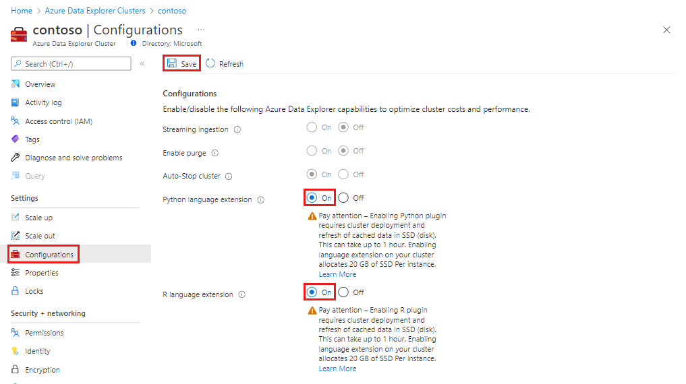
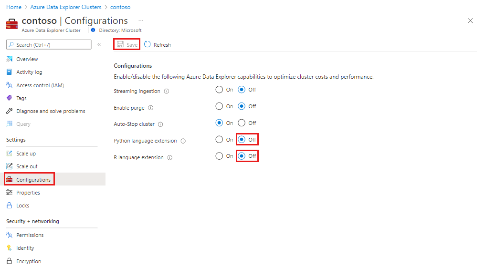

# Manage language extensions in your Azure Data Explorer cluster (Preview)

The language extensions feature allows you to use language extension plugins to integrate other languages into your Azure Data Explorer KQL queries. When you run a user-defined-function (UDF) using a relevant script, the script gets tabular data as its input and is expected to produce tabular output. The plugin's runtime is hosted in a [sandbox](kusto/concepts/sandboxes.md), an isolated and secure environment, running on the cluster's nodes. In this article, you manage the language extensions plugin in your Azure Data Explorer cluster within the Azure portal.

> [!NOTE]
> Azure Data Explorer language extensions that are currently supported are Python and R.

## Prerequisites

* If you don't have an Azure subscription, create a [free Azure account](https://azure.microsoft.com/free/) before you begin.
* Create [an Azure Data Explorer cluster and database](create-cluster-database-portal.md).

## Enable language extensions on your cluster

> [!WARNING]
> Please review the [limitations](#limitations) prior to enabling a language extension.

Do the following steps to enable language extensions on your cluster:

1. In the Azure portal, go to your Azure Data Explorer cluster. 
1. In **Settings**, select **Configurations**. 
1. In the **Configurations** pane, select **On** to enable a language extension.
1. Select **Save**.
 
    

> [!NOTE]
> Enabling the language extension process can take up to a few minutes. During that time, your cluster may be unavailable.
 
## Run language extension-integrated queries

* Learn how to [run Python integrated KQL queries](kusto/query/pythonplugin.md).
* Learn how to [run R integrated KQL queries](kusto/query/rplugin.md). 

## Disable language extensions on your cluster

> [!NOTE]
> Disabling language extensions could take a few minutes.

Do the following steps to disable language extensions on your cluster:

1. In the Azure portal, go to your Azure Data Explorer cluster. 
1. In **Settings**, select **Configurations**. 
1. In the **Configurations** pane, select **Off** to disable a language extension.
1. Select **Save**.

    

## Limitations

* The language extensions feature doesn't support [Disk encryption](cluster-disk-encryption.md). 
* The language extensions runtime sandbox allocates disk space even if no query runs in the scope of the relevant language.
See [sandboxes](kusto/concepts/sandboxes.md) for more detailed limitations.
