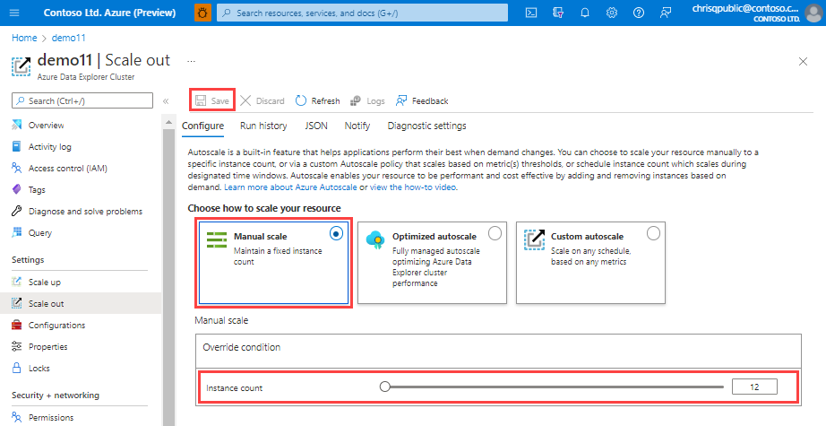

# Manage cluster horizontal scaling (scale out) in Azure Data Explorer to accommodate changing demand

Sizing a cluster appropriately is critical to the performance of Azure Data Explorer. A static cluster size can lead to underutilization or overutilization, neither of which is ideal. Because demand on a cluster can't be predicted with absolute accuracy, it's better to *scale* a cluster, adding and removing capacity and CPU resources with changing demand.

There are two workflows for scaling an Azure Data Explorer cluster:

* Horizontal scaling, also called scaling in and out.
* [Vertical scaling](manage-cluster-vertical-scaling.md), also called scaling up and down.
This article explains the horizontal scaling workflow.

## Configure horizontal scaling

By using horizontal scaling, you can scale the instance count automatically, based on predefined rules and schedules. To specify the autoscale settings for your cluster:

1. In the Azure portal, go to your Azure Data Explorer cluster resource. Under **Settings**, select **Scale out**.

2. In the **Scale out** window, select the autoscale method that you want: **Manual scale**, **Optimized autoscale**, or **Custom autoscale**.

### Manual scale

In the manual scale option, the cluster has a static capacity that doesn't change automatically. Select the static capacity by using the **Instance count** bar. The cluster's scaling remains at the selected setting until changed.

   

### Optimized autoscale (recommended option)

Optimized autoscale is the default setting during cluster creation and the recommended scaling method. This method optimizes cluster performance and cost, as follows:

* If the cluster is underutilized, it is scaled in to lower cost without affecting the required performance.
* If the cluster is overutilized, it is scaled out to maintain optimal performance.

To configure optimized autoscale:

1. Select **Optimized autoscale**.

1. Specify a minimum and maximum instance count. The cluster autoscaling ranges between these values based on load.
1. Select **Save**.

   

Optimized autoscale starts working. Its actions can be viewed in the cluster's activity log in Azure.

#### Logic of optimized autoscale

Optimized autoscale is managed by either predictive or reactive logic.
Predictive logic tracks the usage pattern of the cluster and when it identifies seasonality with high confidence, it manages the cluster's scaling.
Otherwise, reactive logic that tracks the actual usage of the cluster is used to make decisions on cluster scale operations based on the current level of resource usage.

The main metrics for both predictive and reactive flows are:

* CPU
* Cache utilization factor
* Ingestion utilization

Both predictive and reactive logic are bound to the cluster's size boundaries, the min and max number of instances, as defined in the optimized autoscale configuration.
Frequent cluster *scale out* and *scale in* operations are undesirable because of the impact on the cluster's resources and the required time for adding or removing instances, as well as rebalancing the hot cache across all nodes.

##### Predictive autoscale

Predictive logic forecasts the cluster's usage for the next day based on its usage pattern over the last few weeks. The forecast is used to create a schedule of *scale in* or *scale out* operations to adjust the cluster's size ahead of time. This allows the cluster scaling and data rebalancing to complete in time for when the load changes. This logic is especially effective for seasonal patterns, such as daily or weekly usage spikes.

However, in scenarios where there is a unique spike in usage that exceeds the forecast, optimized autoscale will fall back on reactive logic. When this happens, *scale in* or *scale out* operations are performed ad hoc based on the latest level of resource usage.

##### Reactive autoscale

**Scale out**

When the cluster approaches a state of overutilization, a *scale out* operation will take place to maintain optimal performance. A *scale out* operation is performed when at least one of the following conditions occurs:

* The cache utilization is high for over an hour
* The CPU is high for over an hour
* The ingestion utilization is high for over an hour

**Scale in**

When the cluster is underutilized, a *scale in* operation will take place to lower cost while maintaining optimal performance. Multiple metrics are used to verify that it's safe to *scale in* the cluster.

To ensure that there's no overloading of resources, the following metrics are evaluated before *scale in* is performed:

* Cache utilization isn't high
* CPU is below average
* Ingestion utilization is below average
* If streaming ingest is used, streaming ingest utilization isn't high
* Keep alive metric is above a defined minimum, processed properly, and on time indicating that the cluster is responsive
* There is no query throttling
* Number of failed queries are below a defined minimum

> [!NOTE]
> The *scale in* logic requires a 1-day evaluation before implementation of optimized *scale in*. This evaluation takes place once every hour. If an immediate change is needed, use [manual scale](#manual-scale).

### Custom autoscale

Although [optimized autoscale](#optimized-autoscale-recommended-option) is the recommended scaling option, Azure custom autoscale is also supported. By using custom autoscale, you can scale your cluster dynamically based on metrics that you specify. Use the following steps to configure custom autoscale.

1. In the **Autoscale setting name** box, enter a name, such as *Scale-out: cache utilization*.

1. For **Scale mode**, select **Scale based on a metric**. This mode provides dynamic scaling. You can also select **Scale to a specific instance count**.
1. Select **+ Add a rule**.
1. In the **Scale rule** section on the right, enter values for each setting.

    **Criteria**

    | Setting | Description and value |
    | --- | --- |
    | **Time aggregation** | Select an aggregation criteria, such as **Average**. |
    | **Metric name** | Select the metric you want the scale operation to be based on, such as **Cache Utilization**. |
    | **Time grain statistic** | Choose between **Average**, **Minimum**, **Maximum**, and **Sum**. |
    | **Operator** | Choose the appropriate option, such as **Greater than or equal to**. |
    | **Threshold** | Choose an appropriate value. For example, for cache utilization, 80 percent is a good starting point. |
    | **Duration (in minutes)** | Choose an appropriate amount of time for the system to look back when calculating metrics. Start with the default of 10 minutes. |
    |  |  |

    **Action**

    | Setting | Description and value |
    | --- | --- |
    | **Operation** | Choose the appropriate option to scale in or scale out. |
    | **Instance count** | Choose the number of nodes or instances you want to add or remove when a metric condition is met. |
    | **Cool down (minutes)** | Choose an appropriate time interval to wait between scale operations. Start with the default of five minutes. |
    |  |  |

1. Select **Add**.
1. In the **Instance limits** section on the left, enter values for each setting.

    | Setting | Description and value |
    | --- | --- |
    | **Minimum** | The number of instances that your cluster won't scale below, regardless of utilization. |
    | **Maximum** | The number of instances that your cluster won't scale above, regardless of utilization. |
    | **Default** | The default number of instances. This setting is used if there are problems with reading the resource metrics. |
    |  |  |

1. Select **Save**.

You've now configured horizontal scaling for your Azure Data Explorer cluster. Add another rule for vertical scaling. If you need assistance with cluster scaling issues, [open a support request](https://portal.azure.com/#blade/Microsoft_Azure_Support/HelpAndSupportBlade/overview) in the Azure portal.

## Related content

* [Monitor Azure Data Explorer performance, health, and usage with metrics](using-metrics.md)
* [Manage cluster vertical scaling](manage-cluster-vertical-scaling.md) for appropriate sizing of a cluster.

