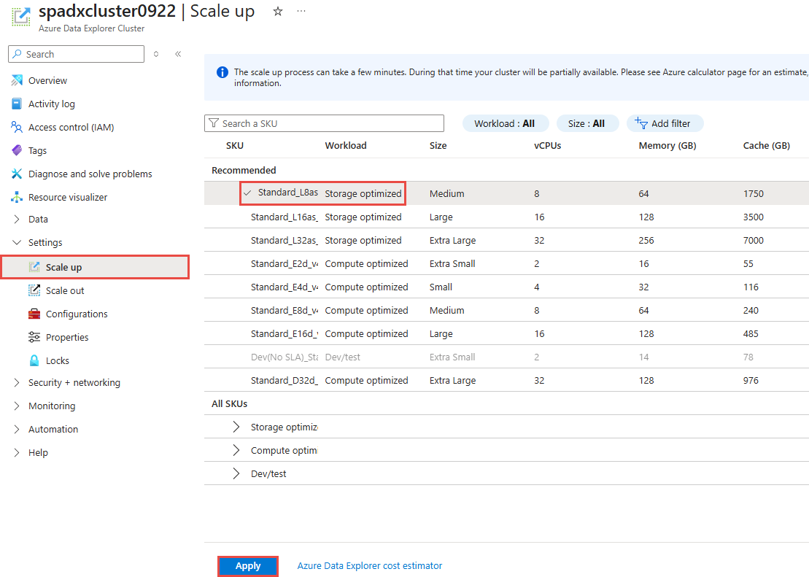

# Manage cluster vertical scaling (scale up) in Azure Data Explorer to accommodate changing demand

Sizing a cluster appropriately is critical to the performance of Azure Data Explorer. A static cluster size can lead to under-utilization or over-utilization, neither of which is ideal.

Since demand on a cluster can’t be predicted with absolute accuracy, a better approach is to *scale* a cluster, adding and removing capacity and CPU resources with changing demand. 

There are two workflows for scaling an Azure Data Explorer cluster:

* [Horizontal scaling](manage-cluster-horizontal-scaling.md), also called scaling in and out.
* Vertical scaling, also called scaling up and down.

This article explains the vertical scaling workflow:

## Configure vertical scaling

1. In the Azure portal, go to your Azure Data Explorer cluster resource. Under **Settings**, select **Scale up**.
1. In the **Scale up** window, you'll see available SKUs for your cluster. For example, in the following figure, there are eight recommended SKUs available. Expand the **Storage optimized**, **Compute optimized**, and **Dev/test** dropdowns to see more options.

    

    The SKUs are disabled because they're the current SKU, or they aren't available in the region where the cluster is located.
1. To change your SKU, select a new SKU and then select **Apply**.

> [!NOTE]
> 
> * During the vertical scaling process we first prepare the new VMSS in parallel to the old cluster's VMSS continuing to provide service. This process may take tens of minutes. Only when the new VMSS is ready, switchover is performed to the new VMSS. The parallel process makes the SKU migration experience relatively seamless, with minimal service disruption during the switchover process (~1-3 mins). Query performance may be impacted during SKU migration. The impact may vary due to different usage patterns.

* We recommend enabling [Optimized Autoscale](/azure/data-explorer/manage-cluster-horizontal-scaling) to allow the cluster to scale-in following migration. For SKU migration recommendation, see [Change Data Explorer clusters to a more cost effective and better performing SKU](/azure/data-explorer/azure-advisor).
* Clusters with Virtual Network configuration may experience longer service disruptions. 
* The price is an estimate of the cluster's virtual machines and Azure Data Explorer service costs. Other costs are not included. For an estimate, see the Azure Data Explorer [cost estimator](https://dataexplorer.azure.com/AzureDataExplorerCostEstimator.html). For full pricing, see the Azure Data Explorer [pricing page](https://azure.microsoft.com/pricing/details/data-explorer/).

You've now configured vertical scaling for your Azure Data Explorer cluster. Add another rule for a horizontal scaling. If you need assistance with cluster-scaling issues, [open a support request](https://portal.azure.com/#blade/Microsoft_Azure_Support/HelpAndSupportBlade/overview) in the Azure portal.

## Next steps

* [Manage cluster horizontal scaling](manage-cluster-horizontal-scaling.md) to dynamically scale out the instance count based on metrics that you specify.
* Monitor your resource usage by following this article: [Monitor Azure Data Explorer performance, health, and usage with metrics](using-metrics.md).

