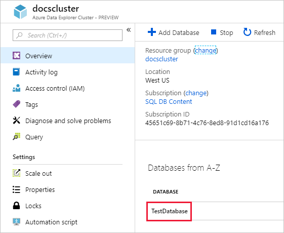
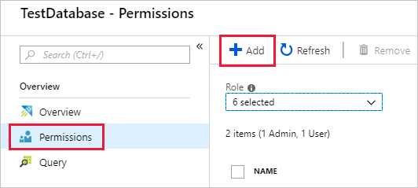

# Manage database permissions in Azure Data Explorer by using the Azure portal

Azure Data Explorer uses a *role-based access control* model to control access to databases and tables. In this model, *principals* (users, groups, and apps) map to *roles*, and each principal can access resources according to its assigned roles. For a list of available roles, see [role-based access control](/kusto/access-control/role-based-access-control?view=azure-data-explorer&preserve-view=true).

This article describes the available roles and how to assign principals to those roles by using the Azure portal. To set database permissions with management commands instead, see [Manage database security roles](/kusto/management/manage-database-security-roles?view=azure-data-explorer&preserve-view=true).

## Prerequisites

* An Azure Data Explorer cluster and database. [Create a cluster and database](create-cluster-and-database.md).
* At least **Contributor** Azure Resource Manager (ARM) permissions on the cluster to create or delete a database. To assign ARM permissions, see [Assign Azure roles using the Azure portal](/azure/role-based-access-control/role-assignments-portal).

## Add database principals

1. Sign in to the [Azure portal](https://portal.azure.com/).

1. Go to your Azure Data Explorer cluster.

1. In the **Overview** section, select the database where you want to manage permissions. For roles that apply to all databases, skip this step and go directly to the next step.

    

1. Select **Permissions**, and then select **Add**.

    

1. Search for the principal, select it, and then select **Select**.

    :::image type="content" source="media/manage-database-permissions/new-principals.png" alt-text="Screenshot of the Azure portal New Principals page. A principal name and image are selected and highlighted. The Select button is also highlighted." border="false":::

## Remove database principals

1. Sign in to the [Azure portal](https://portal.azure.com/).

1. Go to your Azure Data Explorer cluster.

1. In the **Overview** section, select the database where you want to manage permissions. For roles that apply to all databases, go directly to the next step.

    

1. Select **Permissions**, and then select the principal to remove.

1. Select **Remove**.

## Related content

* Learn about [Azure Data Explorer role-based access control](/kusto/access-control/role-based-access-control?view=azure-data-explorer&preserve-view=true).
* To set cluster-level permissions, see [Manage cluster permissions](manage-cluster-permissions.md).
* To set permissions for a database with management commands, see [Manage database security roles](/kusto/management/manage-database-security-roles?view=azure-data-explorer&preserve-view=true).
* To grant a principal view access to a subset of tables, see [Manage table view access](/kusto/management/manage-table-view-access?view=azure-data-explorer&preserve-view=true).
