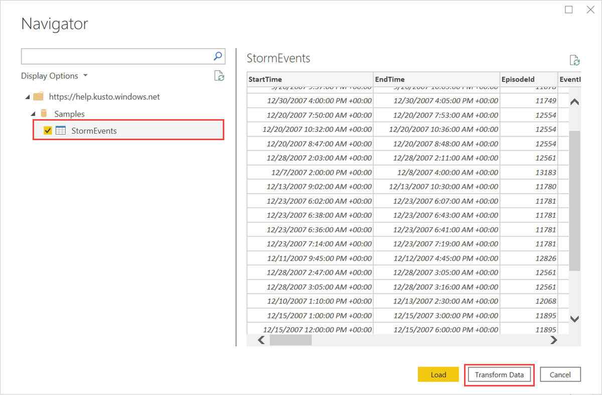

# Use Dynamic M query parameters with Azure Data Explorer for Power BI

Azure Data Explorer is a fast and highly scalable data exploration service for log and telemetry data. Power BI is a business analytics solution that lets you visualize your data and share the results across your organization. Using [Dynamic M parameters](/power-query/power-query-query-parameters), you can create Power BI reports that give viewers the ability to use filters or slicers to set values for KQL query parameters.

This article shows how to use Dynamic M parameters using a KQL query function in the help cluster.

## Prerequisites

You need the following to complete this article:

* If you don't have an Azure subscription, create a [free Azure account](https://azure.microsoft.com/free/) before you begin.
* An organizational email account that is a member of Azure Active directory, so you can connect to the [Azure Data Explorer help cluster](https://dataexplorer.azure.com/clusters/help/databases/samples).
* [Power BI Desktop](https://powerbi.microsoft.com/get-started/) (select **DOWNLOAD FREE**)
* [Enabling Dynamic M query parameters](/power-bi/connect-data/desktop-dynamic-m-query-parameters#enabling-dynamic-m-query-parameters)

## Get data from Azure Data Explorer

First, [set up a connector for Power BI](power-bi-connector.md) setting the connectivity mode to *DirectQuery* until the **Navigator** screen, and then continue using the following steps.

1. On the **Navigator** screen, expand the **Samples** database, select **EventsByStates**, for **EventTypeParam** enter *High Wind*, then select **Transform Data**.

    

    The table opens in Power Query Editor, where you can edit rows and columns before importing the data.

1. In the Power Query Editor, select the arrow next to the **DamageCrops** column then **Sort descending**.

    

1. On the **Home** tab, select **Keep Rows** then **Keep Top Rows**. Enter a value of *1000* to bring in the top 1000 rows of the sorted table.

    

1. On the **Home** tab, select **Close & Apply**.

    

## Visualize data in a report

[!INCLUDE [data-explorer-power-bi-visualize-basic](includes/data-explorer-power-bi-visualize-basic.md)]

## Clean up resources

If you no longer need the report you created for this article, delete the Power BI Desktop (.pbix) file.

## Next steps

[Tips for using the Azure Data Explorer connector for Power BI to query data](power-bi-best-practices.md#tips-for-using-the-azure-data-explorer-connector-for-power-bi-to-query-data)