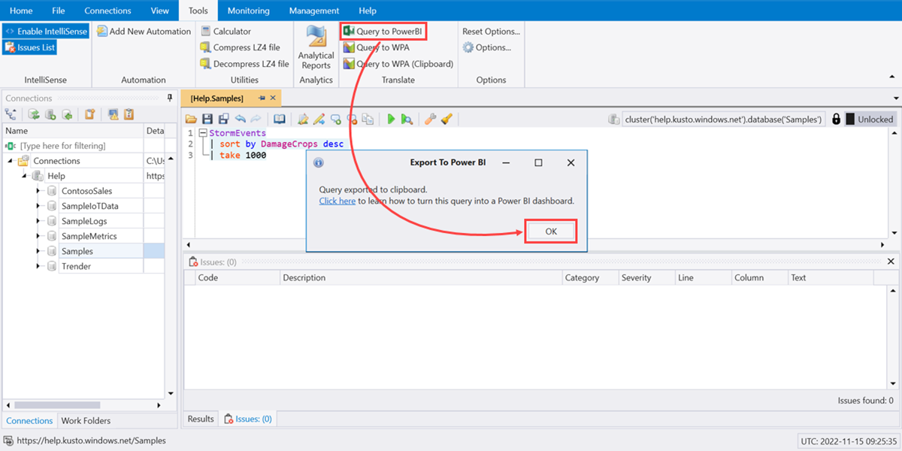

# Visualize data using a query imported into Power BI

This article shows you how to import a query so that you can get data and visualize it in a Power BI report.

## Prerequisites

You need the following to complete this article:

* A [Microsoft account](https://account.microsoft.com/account/Account?ru=https%3A%2F%2Faccount.microsoft.com%2F&destrt=home.landing) so you can connect to the [Azure Data Explorer help cluster](https://dataexplorer.azure.com/clusters/help/databases/samples).
* [Power BI Desktop](https://powerbi.microsoft.com/get-started/) (select **DOWNLOAD FREE**).
* [Power BI Desktop - Alternate Download Link](https://www.microsoft.com/download/details.aspx?id=58494).
* [Azure Data Explorer desktop app](kusto/tools/kusto-explorer.md) or **[Azure Data Web Explorer](link TBD)**

## Get data from Azure Data Explorer

First, you create a query in Azure Data Explorer and export it for use in Power BI. Then, you connect to the Azure Data Explorer help cluster, and bring in a subset of the data from the *StormEvents* table. [!INCLUDE [data-explorer-storm-events](includes/data-explorer-storm-events.md)]

# [Kusto Explorer](#tab/kusto-explorer/)

1. Launch the Azure Data Explorer desktop app.
1. Select query from cluster.
1. On the **Tools** tab, select **Query to Power BI** then **OK**.

    

1. Launch Power BI Desktop.
1. On the **Home** tab, select **Transform data**.

    

1. Paste the query in the **Navigator** pane.

    

1. On the **Home** tab, select **Close & Apply**.

    

# [Kusto Web Explorer](#tab/kusto-web-explorer/)

In a browser, go to [https://help.kusto.windows.net/](https://help.kusto.windows.net/)

---

## Next steps

[Visualize data using the Azure Data Explorer connector for Power BI](power-bi-connector.md)
