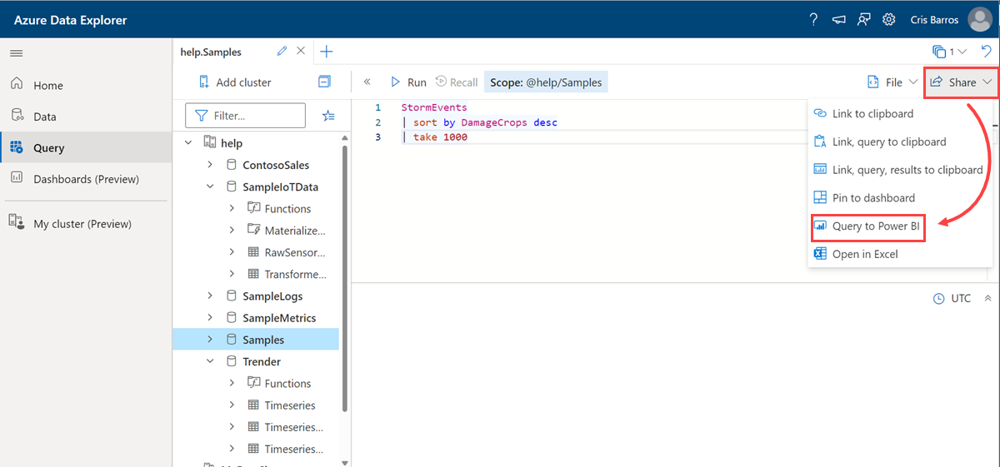
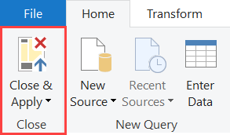

# Use Azure Data Explorer Data in Power BI

In this article, you'll learn about the different ways in which you can connect Azure Data Explorer as a data source to Power BI. Once connected, you can proceed to build Power BI reports and visualizations.

## Prerequisites

You need the following to complete this article:

* A [Microsoft account](https://account.microsoft.com/account/Account), or an Azure Active Directory user identity.
* [Power BI Desktop](https://powerbi.microsoft.com/get-started/) (select **DOWNLOAD FREE**).

## Use data in Power BI

There are multiple ways to query data in Power BI. The following tabs show you two ways of querying data:

* Starting in Azure Data Explorer web UI and then pasting the data in Power BI Desktop.
* Starting directly in Power BI Desktop and using the built-in connector.

# [Web UI](#tab/web-ui/)

This section shows you how to query data in Power BI starting from the Azure Data Explorer web UI.

1. In a browser, go to [https://help.kusto.windows.net/](https://help.kusto.windows.net/)
1. Create a query and select it. Take the following query for example:

    ```Kusto
    StormEvents
    | sort by DamageCrops desc
    | take 1000
    ```

1. Select **Share** then **Query to Power BI**

    

1. Launch Power BI Desktop.
1. On the **Home** tab, select **Transform data**.

    

1. Paste the query in the **Navigator** pane.

    

1. On the **Home** tab, select **Close & Apply**.

    

# [Connector](#tab/connector/)

This section shows you how to use the built-in connector to query Azure Data Explorer data in a Power BI report. The Power BI connector supports [Import and Direct Query connectivity modes](/power-bi/desktop-directquery-about). You can build dashboards using **Import** or **DirectQuery** mode depending on the scenario, scale, and performance requirements.

1. Launch Power BI Desktop.
1. On the **Home** tab, select **Get Data** then **More**.

    

1. Search for *Azure Data Explorer (Kusto)*, select **Azure Data Explorer (Kusto)** then **Connect**.

    

1. On the **Azure Data Explorer (Kusto)** screen, fill out the form with the following information.

    

    | Setting | Value | Field description
    |---|---|---
    | Cluster | *https://help.kusto.windows.net* | The URL for the help cluster. For other clusters, the URL is in the form *https://\<ClusterName\>.\<Region\>.kusto.windows.net*. |
    | Database | Leave blank | A database that is hosted on the cluster you're connecting to. We'll select this in a later step. |
    | Table name | Leave blank | One of the tables in the database, or a query like <code>StormEvents \| take 1000</code>. We'll select this in a later step. |
    | Advanced options | Leave blank | Options for your queries, such as result set size.
    | Data connectivity mode | *DirectQuery* | Determines whether Power BI imports the data or connects directly to the data source. You can use either option with this connector. |

    > [!NOTE]
    > In **Import** mode, data is moved to Power BI. In **DirectQuery** mode, data is queried directly from your Azure Data Explorer cluster.
    >
    > Use **Import** mode when:
    >
    > * Your data set is small.
    > * You don't need near real-time data.
    > * Your data is already aggregated or you perform [aggregation in Kusto](./kusto/query/aggregation-functions.md)
    >
    > Use **DirectQuery** mode when:
    >
    > * Your data set is very large.
    > * You need near real-time data.

    **Advanced options**

    | Setting | Sample value | Field description
    |---|---|---
    | Limit query result record number| `300000` | The maximum number of records to return in the result |
    | Limit query result data size | `4194304` | The maximum data size in bytes to return in the result |
    | Disable result set truncation | `true` | Enable/disable result truncation by using the notruncation request option |
    | Additional set statements | `set query_datascope=hotcache` | Sets query options for the duration of the query. Query options control how a query executes and returns results. |

1. On the **Navigator** screen, expand the **Samples** database, select **StormEvents** then **Transform Data**.

    

1. On the **Home** tab, select **Close & Apply**.

    

[Tips for using the Azure Data Explorer connector for Power BI to query data](power-bi-best-practices.md#tips-for-using-the-azure-data-explorer-connector-for-power-bi-to-query-data).

---

You now know how to query data from Azure Data Explorer in Power BI.
## Next steps

[Create reports and dashboards in Power BI](/power-bi/create-reports/)
