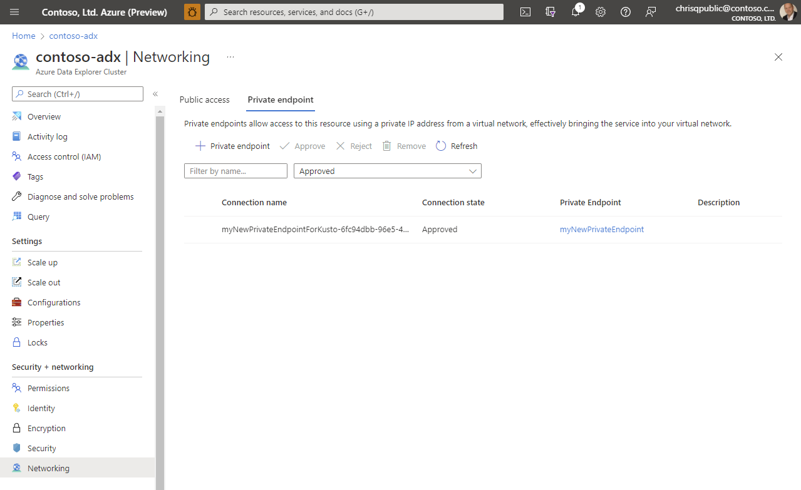
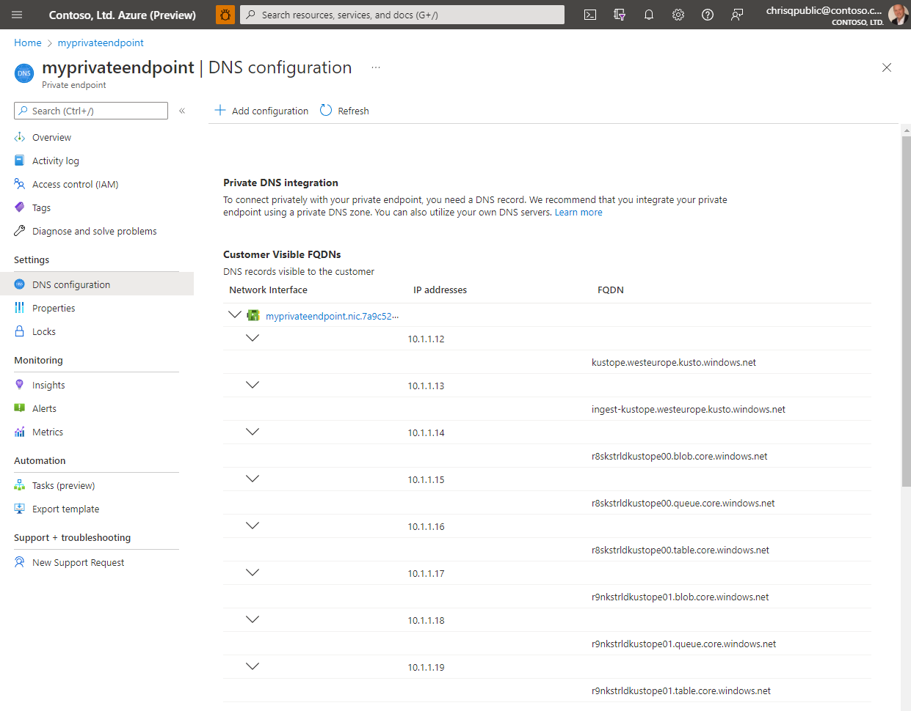

# Troubleshooting private endpoints for Azure Data Explorer

In this section you learn how to troubleshoot connectivity, operational, and cluster creation issues for an Azure Data Explorer cluster that is using Private Endpoints.

## Private Endpoint troubleshooting

Please follow the [troubleshooting guide of Private Endpoints](/azure/private-link/troubleshoot-private-endpoint-connectivity#diagnose-connectivity-problems) to diagnose connectivity problems to Private Endpoints for Azure Data Explorer. All Private Endpoints must be in state "Approved".

Additionally to the standard tests mentioned in the section above, make sure that the Private Endpoint shows the "Connection State" as "Approved" in the Networking blade of the Azure Data Explorer resource.



## Additional checks

Once you checked that all Private Endpoints are approved you can check if the name resolution is working properly. In order to do that it's recommended to deploy a virtual machine in the same virtual network, where you created the private endpoint. Once you logged into the machine you can execute the following tests.

Iterate over all FQDNs of the Private Endpoint DNS configuration and execute the tests using tools like "nslookup, Test-NetConnection, ..." to verify that each DNS matches the corresponding IP address.



### DNS checks

Executing the following command will allow you to verify that the DNS name of one of the FQDNs matches the IP address.

```bash
#replace the <...> placeholders with the correct values
user@testVM:~$ nslookup kustope.westeurope.kusto.windows.net

Server:127.0.0.53
Address:127.0.0.53#53

Non-authoritative answer:
kustope.westeurope.kusto.windows.netcanonical name = kustope.privatelink.westeurope.kusto.windows.net.
Name:kustope.privatelink.westeurope.kusto.windows.net
Address: 10.1.1.12
```

If you find a FQDN which is not matching its corresponding IP address then you need to fix your customer DNS server. If you are not using a custom DNS server, create a support ticket.

### Connectivity checks

After you ensured that the DNS resolution is working properly you should check if you can establish a TCP connection to the Azure Data Explorer endpoints. Run those tests on all FQDNs mentioned in the DNS configuration of the Private Endpoint.

```Powershell
#replace the <...> placeholders with the correct values
Test-NetConnection -ComputerName kustope.westeurope.kusto.windows.net -Port 443


ComputerName     : kustope.westeurope.kusto.windows.net
RemoteAddress    : 10.1.1.12
RemotePort       : 443
InterfaceAlias   : Ethernet
SourceAddress    : 10.2.1.23
TcpTestSucceeded : True
```

A successful result returns a **TcpTestSucceeded : True** which means that the caller was able to establish a TCP connection to the Azure Data Explorer cluster successfully.

### Checking the health of the Azure Data Explorer endpoints

The last step of the troubleshooting is to test the health of the Azure Data Explorer endpoints.

```Powershell
#replace the <...> placeholders with the correct values
#engine
Invoke-RestMethod https://kustope.westeurope.kusto.windows.net/v1/rest/ping
Pong! IP address: 'IPv6IPaddress1'

#data management
Invoke-RestMethod https://ingest-kustope.westeurope.kusto.windows.net/v1/rest/ping
Pong! IP address: 'IPv6IPaddress2'
```

A successful result must return **Pong!** and an IPv6 address.

## Managed Private Endpoint troubleshooting

There is not a lot which can be checked for Managed Private Endpoints. You need to verify that the status of all Managed Private Endpoint connections is "Approved". Otherwise Azure Data Explorer will not be able to connect to the corresponding services.

## Other troubleshooting guidelines

If all the checks mentioned above were successful and you are still not able to establish a connection to the cluster, then you should contact your corporate security team which is responsible for firewalls and networking in general.

Potential reasons for failure:

* Misconfiguration of the firewall appliance
* Misconfiguration of User Defined Routes in your Azure Virtual Network
* A wrong proxy configuration on the client machine
* A misconfigured proxy between the client and the Azure Data Explorer cluster
