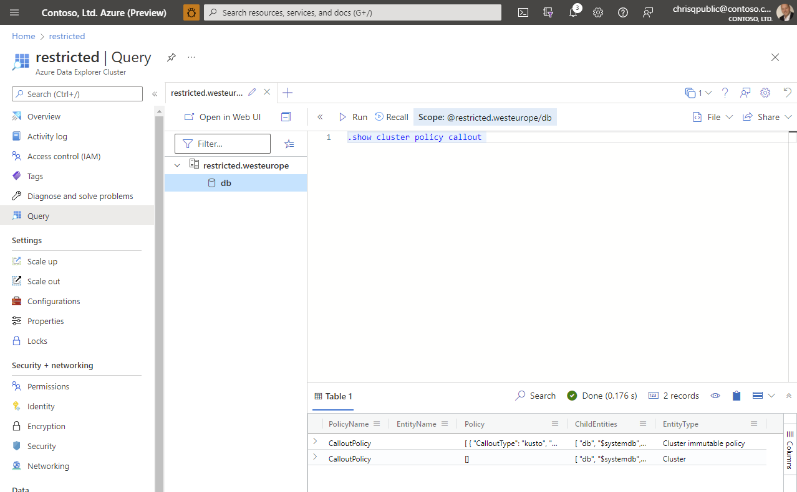
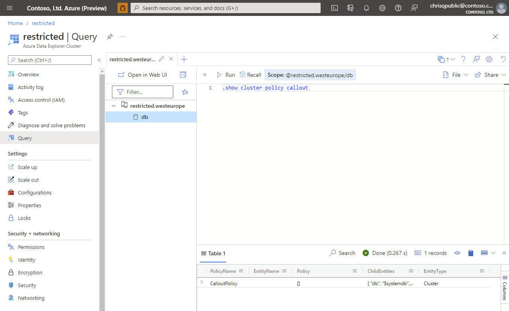
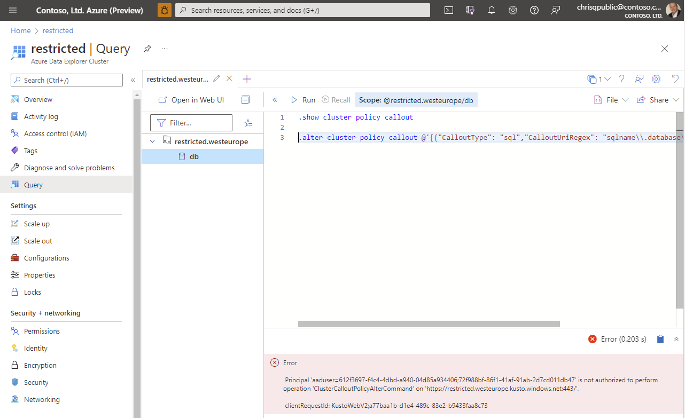

# Howto restrict outbound access from Azure Data Explorer (public preview)

foo bar

## Callout policies

description + link

## restrictOutboundNetworkAccess and AllowedFQDNList

set to enabled -> the immutable callout policies will not be used and the allowedFQDN list will be used instead. Changing the callout policy through the data plane will not be possible. Only through ARM

after setting the param in ARM

## Next steps

* [Troubleshooting Private Endpoints in Azure Data Explorer](security-network-private-endpoint-troubleshoot.md)
