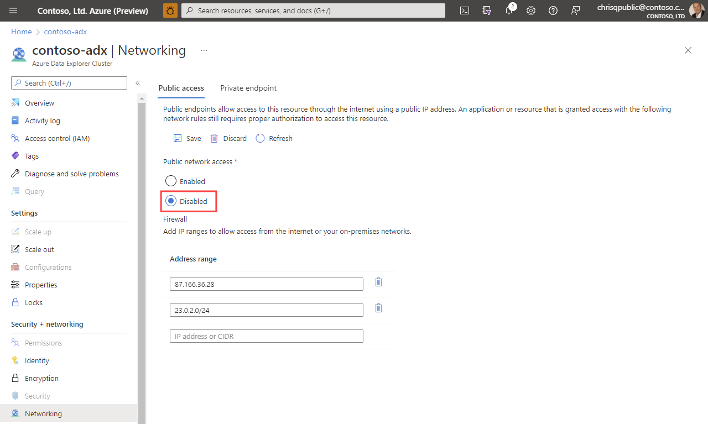

# Howto restrict public access to Azure Data Explorer (public preview)

Restricting public access to an Azure Data Explorer cluster allowes you to disable its public endpoints. Users will not be able to connect to it and might need to use a Private Endpoint.

Additionally, the user is able to define a list of IP address ranges which are allowed to access the public endpoint of a cluster.

## Next steps

* [Troubleshooting Private Endpoints in Azure Data Explorer](security-network-private-endpoint-troubleshoot.md)
