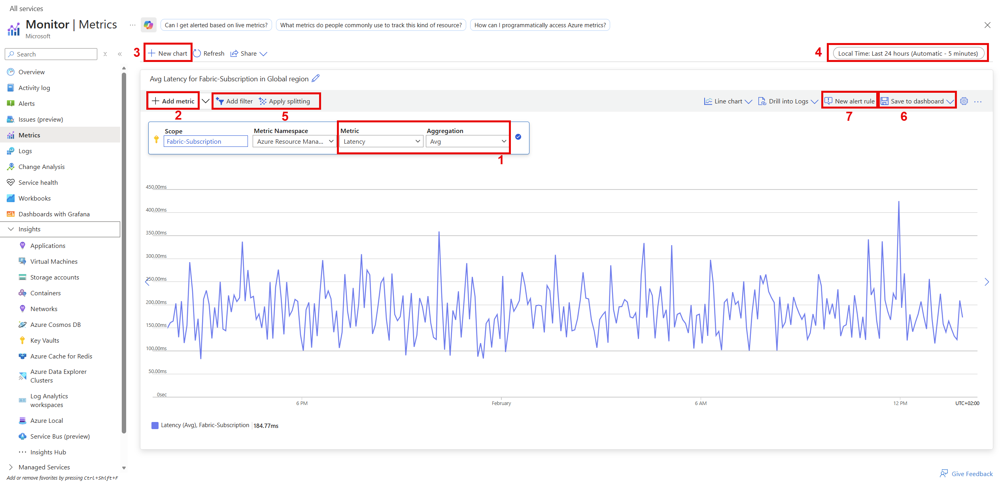

# Monitor Azure Data Explorer performance, health, and usage with metrics

Azure Data Explorer metrics provide key indicators as to the health and performance of the Azure Data Explorer cluster resources. Use the metrics that are detailed in this article to monitor Azure Data Explorer cluster usage, health, and performance in your specific scenario as standalone metrics. You can also use metrics as the basis for operational [Azure Dashboards](/azure/azure-portal/azure-portal-dashboards) and [Azure Alerts](/azure/azure-monitor/platform/alerts-metric-overview).

For more information about Azure Metrics Explorer, see [Metrics Explorer](/azure/azure-monitor/platform/metrics-getting-started).

## Prerequisites

* An Azure subscription. If you don't have one, you can create a [free Azure account](https://azure.microsoft.com/free/).
* A [cluster and database](create-cluster-database-portal.md).

## Use metrics to monitor your Azure Data Explorer resources

1. Sign in to the [Azure portal](https://portal.azure.com/).
1. In the left-hand pane of your Azure Data Explorer cluster, search for *metrics*.
1. Select **Metrics** to open the metrics pane and begin analysis on your cluster.
    :::image type="content" source="media/using-metrics/select-metrics.gif" alt-text="Search and select metrics in the Azure portal":::

## Work in the metrics pane

In the metrics pane, select specific metrics to track, choose how to aggregate your data, and create metric charts to view on your dashboard.

The **Resource** and **Metric Namespace** pickers are pre-selected for your Azure Data Explorer cluster. The numbers in the following image correspond to the numbered list below. They guide you through different options in setting up and viewing your metrics.

1. To create a metric chart, select **Metric** name and relevant **Aggregation** per metric. For more information about different metrics, see [supported Azure Data Explorer metrics](#supported-azure-data-explorer-metrics).
1. Select **Add metric** to see multiple metrics plotted in the same chart.
1. Select **+ New chart** to see multiple charts in one view.
1. Use the time picker to change the time range (default: past 24 hours).
1. Use [**Add filter** and **Apply splitting**](/azure/azure-monitor/platform/metrics-getting-started#apply-dimension-filters-and-splitting) for metrics that have dimensions.
1. Select **Pin to dashboard** to add your chart configuration to the dashboards so that you can view it again.
1. Set **New alert rule** to visualize your metrics using the set criteria. The new alerting rule will include your target resource, metric, splitting, and filter dimensions from your chart. Modify these settings in the [alert rule creation pane](/azure/azure-monitor/platform/metrics-charts#create-alert-rules).

## Supported Azure Data Explorer metrics

The Azure Data Explorer metrics give insight into both overall performance and use of your resources, as well as information about specific actions, such as ingestion or query. The metrics in this article have been grouped by usage type. 

The types of metrics are: 
* [Cluster metrics](#cluster-metrics) 
* [Export metrics](#export-metrics) 
* [Ingestion metrics](#ingestion-metrics) 
* [Streaming ingest metrics](#streaming-ingest-metrics)
* [Query metrics](#query-metrics) 
* [Materialized view metrics](#materialized-view-metrics)

For an alphabetical list of Azure Monitor's metrics for Azure Data Explorers, see [supported Azure Data Explorer cluster metrics](/azure/azure-monitor/platform/metrics-supported#microsoftkustoclusters).

## Cluster metrics

The cluster metrics track the general health of the cluster. For example, resource and ingestion use and responsiveness.

|**Metric** | **Unit** | **Aggregation** | **Metric description** | **Dimensions** |
|---|---|---|---|---|
| Cache utilization | Percent | Avg, Max, Min | Percentage of allocated cache resources currently in use by the cluster. Cache is the size of SSD allocated for user activity according to the defined cache policy.     An average cache utilization of 80% or less is a sustainable state for a cluster. If the average cache utilization is above 80%, the cluster should be   [scaled up](manage-cluster-vertical-scaling.md) to a storage optimized pricing tier or   [scaled out](manage-cluster-horizontal-scaling.md) to more instances. Alternatively, adapt the cache policy (fewer days in cache). If cache utilization is over 100%, the size of data to be cached, according to the caching policy, is larger that the total size of cache on the cluster. | None |
| CPU | Percent | Avg, Max, Min | Percentage of allocated compute resources currently in use by machines in the cluster.     An average CPU of 80% or less is sustainable for a cluster. The maximum value of CPU is 100%, which means there are no additional compute resources to process data.   When a cluster isn't performing well, check the maximum value of the CPU to determine if there are specific CPUs that are blocked. | None |
| Ingestion utilization | Percent | Avg, Max, Min | Percentage of actual resources used to ingest data from the total resources allocated, in the capacity policy, to perform ingestion. The default capacity policy is no more than 512 concurrent ingestion operations or 75% of the cluster resources invested in ingestion.     Average ingestion utilization of 80% or less is a sustainable state for a cluster. Maximum value of ingestion utilization is 100%, which means all cluster ingestion ability is used and an ingestion queue may result. | None |
| Keep alive | Count | Avg | Tracks the responsiveness of the cluster.     A fully responsive cluster returns value 1 and a blocked or disconnected cluster returns 0. |
| Total number of throttled commands | Count | Avg, Max, Min, Sum | The number of throttled (rejected) commands in the cluster, since the maximum allowed number of concurrent (parallel) commands was reached. | None |
| Total number of extents | Count | Avg, Max, Min, Sum | Total number of data extents in the cluster.     Changes in this metric can imply massive data structure changes and high load on the cluster, since merging data extents is a CPU-heavy activity. | None |

## Export metrics

Export metrics track the general health and performance of export operations like lateness, results, number of records, and utilization.

|**Metric** | **Unit** | **Aggregation** | **Metric description** | **Dimensions** |
|---|---|---|---|---|
Continuous export number of exported records	| Count	| Sum |	The number of exported records in all continuous export jobs. | ContinuousExportName |
Continuous export max lateness |	Count	| Max	| The lateness (in minutes) reported by the continuous export jobs in the cluster. | None |
Continuous export pending count	| Count	| Max	| The number of pending continuous export jobs. These jobs are ready to run but waiting in a queue, possibly due to insufficient capacity). 
Continuous export result	| Count |	Count	| The Failure/Success result of each continuous export run. | ContinuousExportName |
Export utilization |	Percent	| Max	| Export capacity used, out of the total export capacity in the cluster (between 0 and 100). | None |

## Ingestion metrics

Ingestion metrics track the general health and performance of ingestion operations like latency, results, and volume.

> [!NOTE]
> * [Apply filters to charts](/azure/azure-monitor/platform/metrics-charts#apply-filters-to-charts) to plot partial data by dimensions. For example, explore ingestion to a specific `Database`.
> * [Apply splitting to a chart](/azure/azure-monitor/platform/metrics-charts#apply-splitting-to-a-chart) to visualize data by different components. This process is useful for analyzing metrics that are reported by each step of the ingestion pipeline, for example `Blobs received`.

|**Metric** | **Unit** | **Aggregation** | **Metric description** | **Dimensions** |
|---|---|---|---|---|
| Batch blob count  | Count | Avg, Max, Min | Number of data sources in a completed batch for ingestion. | Database |
| Batch duration    | Seconds | Avg, Max, Min | The duration of the batching phase in the ingestion flow.  | Database |
| Batch size        | Bytes | Avg, Max, Min | Uncompressed expected data size in an aggregated batch for ingestion. | Database |
| Batches processed | Count | Avg, Max, Min | Number of batches completed for ingestion. `Batching Type`: whether the batch reached the batching time, data size or number of files limit, set by [batching policy](./kusto/management/batchingpolicy.md). | Database, Batching Type |
| Blobs received    | Count | Avg, Max, Min | Number of blobs received from input stream by a component.     Use **apply splitting** to analyze each component. | Database, Component Type, Component Name |
| Blobs processed   | Count | Avg, Max, Min | Number of blobs processed by a component.     Use **apply splitting** to analyze each component. | Database, Component Type, Component Name |
| Blobs dropped     | Count | Avg, Max, Min | Number of blobs permanently dropped by a component. An `Ingestion result` metric with a failure reason will be sent.     Use **apply splitting** to analyze each component. | Database, Component Type, Component Name |
| Discovery latency | Seconds | Avg | Time from data enqueue until discovery by data connections. This time isn't included in the **Stage latency** or in the **Ingestion latency** metrics | Component Type, Component Name |
| Events received   | Count | Avg, Max, Min, Sum | Number of events received by data connections from input stream. | Component Type, Component Name |
| Events processed  | Count | Avg, Max, Min, Sum | Number of events processed by data connections. | Component Type, Component Name | 
| Events dropped    | Count | Avg, Max, Min, Sum | Number of events permanently dropped by data connections. | Component Type, Component Name | 
| Events processed (for Event/IoT Hubs) | Count | Max, Min, Sum | Total number of events read from Event Hubs and processed by the cluster. These events are split into two groups: events rejected, and events accepted by the cluster engine. | Status |
| Ingestion latency | Seconds | Avg, Max, Min | Latency of data ingested, from the time the data was received in the cluster until it's ready for query. The ingestion latency period depends on the ingestion scenario. | None |
| Ingestion result  | Count | Count | Total number of ingest operations that either failed or succeeded.     Use **apply splitting** to create buckets of success and failure results and analyze the dimensions (**Value** > **Status**).  For more information about possible fail results, see [Ingestion error codes in Azure Data Explorer](error-codes.md)| Status |
| Ingestion volume (in MB) | Count | Max, Sum | The total size of data ingested to the cluster (in MB) before compression. | Database |
| Queue length | Count | Avg | Number of pending messages in a component's input queue. | Component Type |
| Queue Oldest Message | Seconds | Avg | Time in seconds from when the oldest message was inserted to a component's input queue. | Component Type | 
| Received Data Size Bytes | Bytes | Avg, Sum | Size of data received by data connections from input stream. | Component Type, Component Name |
| Stage latency | Seconds | Avg | Time from when a message is discovered by Azure Data Explorer, until its content is received by an ingestion component for processing.     Use **apply filters** and select `Component Type` > `EngineStorage` to filter the total ingestion latency.| Database, Component Type | 

## Streaming ingest metrics

Streaming ingest metrics track streaming ingestion data and request rate, duration, and results.

|**Metric** | **Unit** | **Aggregation** | **Metric description** | **Dimensions** |
|---|---|---|---|---|
Streaming Ingest Data Rate |	Count	| RateRequestsPerSecond	| Total volume of data ingested to the cluster. | None |
Streaming Ingest Duration	| Milliseconds	| Avg, Max, Min	| Total duration of all streaming ingestion requests. | None |
Streaming Ingest Request Rate	| Count	| Count, Avg, Max, Min, Sum	| Total number of streaming ingestion requests. | None |
Streaming Ingest Result	| Count	| Avg	| Total number of streaming ingestion requests by result type. | Result |

## Query metrics

Query performance metrics track query duration and total number of concurrent or throttled queries.

|**Metric** | **Unit** | **Aggregation** | **Metric description** | **Dimensions** |
|---|---|---|---|---|
| Query duration | Milliseconds | Avg, Min, Max, Sum | Total time until query results are received (doesn't include network latency). | QueryStatus |
| Total number of concurrent queries | Count | Avg, Max, Min, Sum | The number of queries run in parallel in the cluster. This metric is a good way to estimate the load on the cluster. | None |
| Total number of throttled queries | Count | Avg, Max, Min, Sum | The number of throttled (rejected) queries in the cluster. The maximum number of concurrent (parallel) queries allowed is defined in the concurrent query policy. | None |

## Materialized view metrics

|**Metric** | **Unit** | **Aggregation** | **Metric description** | **Dimensions** |
|---|---|---|---|---|
|MaterializedViewHealth                    | 1, 0    | Avg     |  Value is 1 if the view is considered healthy, otherwise 0. | Database, MaterializedViewName |
|MaterializedViewAgeMinutes                | Minutes | Avg     | The `age` of the view is defined by the current time minus the last ingestion time processed by the view. Metric value is time in minutes (the lower the value is, the view is "healthier"). | Database, MaterializedViewName |
|MaterializedViewResult                    | 1       | Avg     | Metric includes a `Result` dimension indicating the result of the last materialization cycle (see possible values below). Metric value always equals 1. | Database, MaterializedViewName, Result |
|MaterializedViewRecordsInDelta            | Records count | Avg | The number of records currently in the non-processed part of the source table. For more information, see [how materialized views work](./kusto/management/materialized-views/materialized-view-overview.md#how-materialized-views-work)| Database, MaterializedViewName |
|MaterializedViewExtentsRebuild            | Extents count | Avg | The number of extents rebuilt in the materialization cycle. | Database, MaterializedViewName|
|MaterializedViewDataLoss                  | 1       | Max    | Metric is fired when unprocessed source data is approaching retention. | Database, MaterializedViewName, Kind |

## Next steps

* [Tutorial: Ingest and query monitoring data in Azure Data Explorer](ingest-data-no-code.md)
* [Monitor Azure Data Explorer ingestion operations using diagnostic logs](using-diagnostic-logs.md)
* [Quickstart: Query data in Azure Data Explorer](web-query-data.md)
