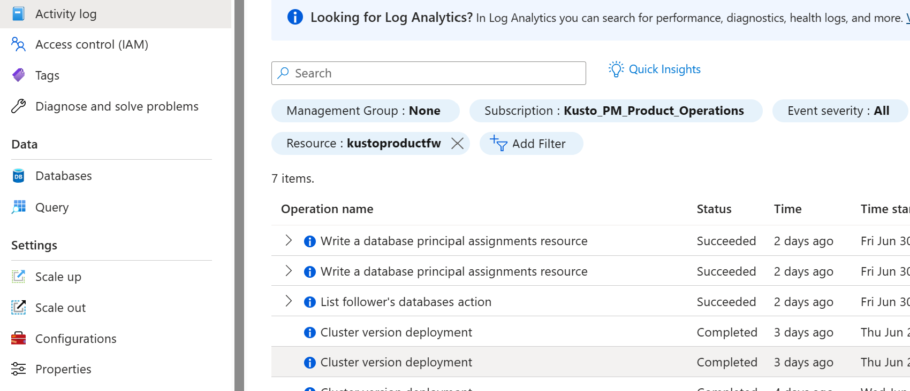
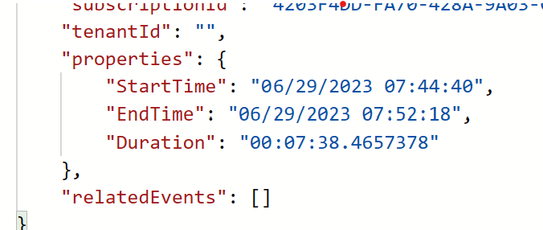
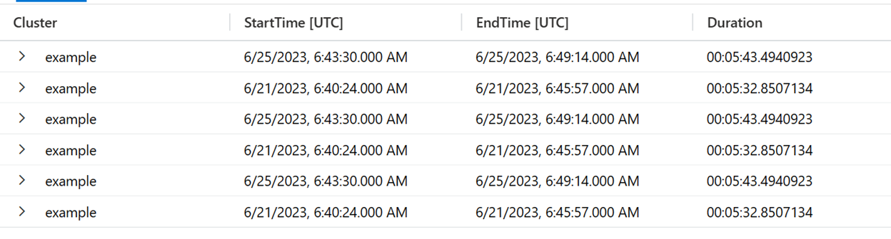

# Version Deployment Notification

Azure Data Explorer regularly releases new versions to your cluster. When a version deployment occurs in Azure Data Explorer, a notification is generated in the Azure Activity logs. This article explains how to find and understand these notifications.

> [!NOTE]
> A version deployment notification doesn't necessarily indicate downtime. Whenever possible, the cluster continues to operate during deployments. To check cluster availability, use the **Keep alive** metric under **Monitoring** > **Metrics** in the Azure portal.

### Version Deployment Overview 

In the Azure Activity blade of the Azure Portal, an event will be generated anytime we do a ADX software deployment. The Operation Name for the event will be "Cluster Version deployment"



As part of each event, the properties will contain the Start Time, End Time, and the Duration



This notification happens when the software deployment occurs. As such it is not intended to notify the customer of upcoming maintenance. But instead to help them with root cause analysis by allowing them to correlate behavior observed on the cluster to software deployments.

### Sending Data to Log Analytics

Besides viewing these events in the Azure Activity Log blade in the portal, customers can also send their Activity Log events to Azure Log Analytics. 

[Azure Activity Log - Azure Monitor](https://learn.microsoft.com/azure/azure-monitor/essentials/activity-log?tabs=powershell#send-to-log-analytics-workspace)

An example of a useful query in Azure Log Analytics of the Version Deployment Notifications

<!-- csl -->
```
AzureActivity
| where OperationName == 'Cluster version deployment'
| project Cluster=Resource,StartTime=todatetime(todynamic(Properties).StartTime), EndTime=todatetime(todynamic(Properties).EndTime), Duration=totimespan(todynamic(Properties).Duration)
```

The results would look something like this:



Now that we have the data in Log Analytics and a query to parse the information we can setup alerts via Azure Monitor or visualize it using tools such as [Azure Workbooks](https://learn.microsoft.com/azure/azure-monitor/visualize/workbooks-overview), [ADX Dashboards](https://learn.microsoft.com/azure/data-explorer/azure-data-explorer-dashboards), or [Grafana](https://learn.microsoft.com/azure/azure-monitor/visualize/grafana-plugin).

### Conclusion
This notification provides transparency on when and how long software deployment takes. This notification is not an indication of downtime and can not be utilized to determine SLA of the clusters.

<br><br>
