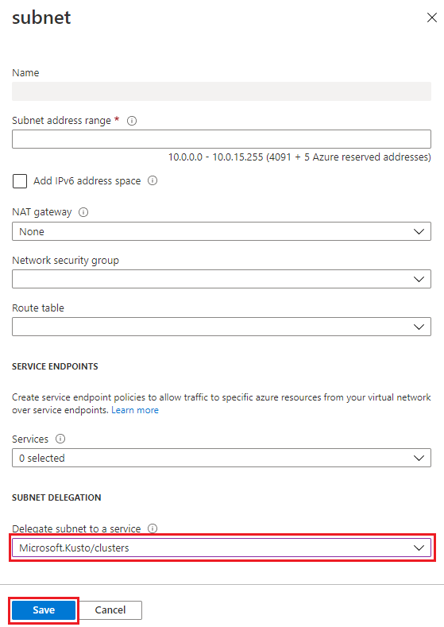
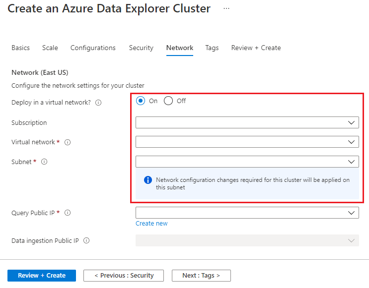
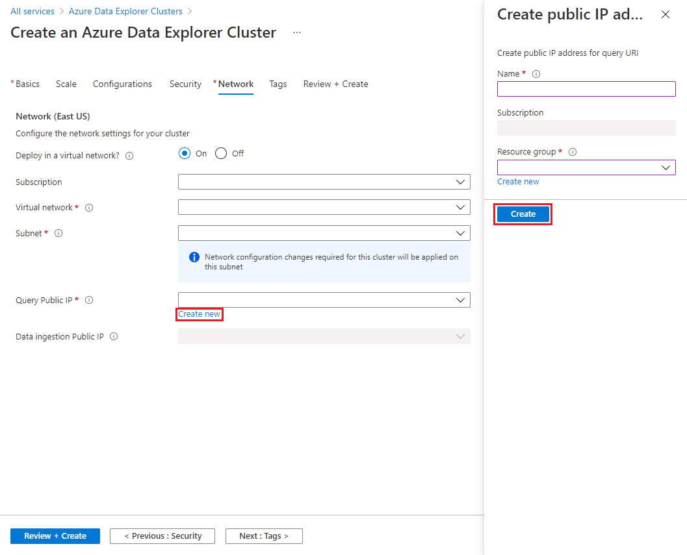

# Create an Azure Data Explorer cluster in your virtual network

Azure Data Explorer supports deploying a cluster into a subnet in your virtual network (VNet). This capability enables you to access the cluster privately from your Azure virtual network or on-premises, access resource such as Event Hub and Storage inside your virtual network, and restrict inbound and outbound traffic.

## Prerequisites

* If you don't have an Azure subscription, create a [free Azure account](https://azure.microsoft.com/free/) before you begin.
* Sign in to the [Azure portal](https://portal.azure.com/).

## Create Virtual Network and subnet

To create the virtual network and subnet:

1. Select the **+ Create a resource** button in the upper-left corner of the portal.
1. Search for *Virtual Network*.
1. Under **Virtual Network**, at the bottom of the screen, select **Create**.
1. In the **Create virtual network** window, complete the following information.

   

    **Setting** | **Suggested value** | **Field description**
    |---|---|---|
    | Subscription | Your subscription | Select the Azure subscription that you want to use for your cluster.|
    | Resource group | Your resource group | Use an existing resource group or create a new resource group. |
    | Name | AzureDataExplorerVnet | Choose a name that identifies your virtual network in the resource group.
    | Region | *West US* | Select the region that best meets your needs.
    | | | |

    > [!NOTE]
    > For production workloads, plan your subnet size according to [plan subnet size in your VNet](vnet-deployment.md#plan-subnet-size-in-your-vnet)

1. Select **Review + create** to review your cluster details, and **Create** to provision the cluster.

1. When the deployment is complete, select **Go to resource**.
1. Go to **Subnets** blade and select the **default** subnet.
    
    

1. In your **default** subnet window:
    1. Select **Microsoft.Kusto/clusters** from the subnet delegation drop-down menu.
    1. Select **Save**.
    
    

## Create a cluster

Create an Azure Data Explorer cluster with a defined set of compute and storage resources in an Azure resource group as described in [create a cluster](create-cluster-database-portal.md#create-a-cluster).

1. Prior to finalizing cluster creation, in the **Create an Azure Data Explorer cluster** window, select the **Network** tab to provide virtual network details using the resources created in the previous tabs:

   

    **Setting** | **Suggested value** | **Field description**
    |---|---|---|
    | Subscription | Your subscription | Select the Azure subscription that you want to use for networking resources.|
    | Virtual Network | AzureDataExplorerVnet | Choose the virtual network created in the previous steps.
    | Subnet | default | Choose the subnet created in the previous steps.

1. Create Query Public IP:
    1. Select **Create new**
    1. In **Create Public IP** window, provide the following details:
    
    

   | **Setting** | **Suggested value** | **Field description** |
    |---|---|---|
    | Name | Engine-public-ip | The name of the public ip address resource.|
    | Resource group | Your resource group | Select the resource group that you want to use for creating public ip.|

1. Do the same steps for **Data ingestion Public IP**
1. Select **Review + create** to create your cluster.
1. When the deployment is complete, select **Go to resource**.

To deploy your Azure Data Explorer cluster into your virtual network, use the [Deploy Azure Data Explorer cluster into your VNet](https://azure.microsoft.com/resources/templates/101-kusto-vnet/) Azure Resource Manager template.

## Next steps

> [!div class="nextstepaction"]
> [Deploy Azure Data Explorer into your Virtual Network](vnet-deployment.md)
