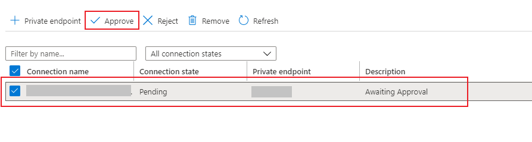

# Using Private Endpoint in your Azure Data Explorer cluster in your virtual network

You can use Private Endpoint for your Azure Data Explorer cluster in your virtual network to securely access the ADX cluster over Private Link.
The Private Endpoint uses an IP address from your Azure VNet address space. Network traffic between a client on your private network and the ADX cluster traverses over the VNet and a Private Link on the Microsoft backbone network, eliminating exposure from the public Internet.

For more information check: 

1. [What is Azure Private Endpoint?
](https://docs.microsoft.com/en-us/azure/private-link/private-endpoint-overview)
1. [What is Azure Private Link service?
](https://docs.microsoft.com/en-us/azure/private-link/private-link-service-overview)
1. [Azure Private Endpoint DNS configuration](https://docs.microsoft.com/en-us/azure/private-link/private-endpoint-dns)

## Create Private Link Service

To create the Private Link Service for the Engine:

1. Select the **+ Create a resource** button in the upper-left corner of the portal.
1. Search for *Private Link Service*.
1. Under **Private Link Service**, select **Create**.
1. In the **Create Private Link Service** pane, complete the following 

   

    **Setting** | **Suggested value** | **Field description**
    |---|---|---|
    | Subscription | Your subscription | Select the Azure subscription that holds your virtual network cluster.|
    | Resource group | Your resource group | Select the resource group that hold your virtual network cluster. |
    | Name | AzureDataExplorerPLS | Choose a name that identifies your private link service in the resource group.
    | Region | Same as virtual network | Select the region that matches your virtual network region. |
    | | | |

1. In the **Outbound settings** pane, complete the following 
 

    **Setting** | **Suggested value** | **Field description**
    |---|---|---|
    | Load Balancer | Your engine Load Balancer | Select the Load Balancer that was created for your cluster engine, Load Balancer that point to your engine public IP.  The LB name should be in the following format: kucompute-{clustername}-elb|
    | Load balancer frontend IP address | Your engine public IP | Select the load balancer public IP address. |
    | Source NAT subnet | Your subnet - where the cluster is deployed | Your subnet - where the cluster is deployed.
    | | | |

1. In the **Access  security** pane, choose who can request access to your private link service.
1. Select **Review + create** to review your private link service configuration, and **Create** the private link service.
1. After the private link service was created, open the resource and save the private link alias for the next step (Create Private Endpoint).
1. To create the Private Link Service for ingestion (Data Management), follow the same instructions with the following change:
    1. In the **Outbound settings** pane
        1. Choose the ingestion load balancer (The LB name should be in the following format: kudatamgmt-{clustername}-elb)
        1. Choose your ingestion public IP

## Create Private Endpoint

To create the Private Endpoint for the Engine:

1. Select the **+ Create a resource** button in the upper-left corner of the portal.
1. Search for *Private Endpoint*.
1. Under **Private Endpoint**, select **Create**.
1. In the **Create a Private Endpoint** pane, complete the following

   

    **Setting** | **Suggested value** | **Field description**
    |---|---|---|
    | Subscription | Your subscription | Select the Azure subscription that you want to use for your Private Endpoint.|
    | Resource group | Your resource group | Use an existing resource group or create a new resource group. |
    | Name | AzureDataExplorerPE | Choose a name that identifies your virtual network in the resource group.
    | Region | *West US* | Select the region that best meets your needs.
    | | | |

1. In the **Resource** pane, complete the following

   

    **Setting** | **Value**
    |---|---|
    | Connection method | Your Private Link Service Alias |
    | Resource ID or alias | Your Engine Private Link Service Alias  |
    | | |
1. Select **Review + create** to review your private endpoint configuration, and **Create** the private endpoint service.
1. To create the Private Endpoint for ingestion (Data Management), follow the same instructions with the following change:
    1. In the **Resource** pane, Choose Your ingestion (Data Management) Private Link Service Alias.

> [!Note]
> You can connect to the Private Link Service from multiple Private Endpoints.

## Approve your Private Endpoint in your Private Link Service

> [!Note]
> This step is not mandatory if you chosen *auto-approve* option in the the **Access  security** pane, when you created the Private Link Service.

1. In your Private Link Service choose Private endpoint connections under settings.
1. Choose your Private Endpoint from the connections list and approve.
 

## DNS configuration for your Private Endpoint

When you deploy an ADX cluster in your virtual network, we update the DNS entry to point to the canonical name with "privatelink" between the record name and the zone host name, both for Engine and ingestion (Data Management).

For example, if your Engine DNS name is myadx.westus.kusto.windows.net the name resolution will be:

|Name |Type |Value |Remark |
|-----|-----|------|-------|
|myadx.westus.kusto.windows.net|CNAME|myadx.privatelink.westus.kusto.windows.net|
|myadx.privatelink.westus.kusto.windows.net|A|40.122.110.154|<--This is your Engine public IP address (provided by you when you created the cluster)|

You must setup a private DNS server or an Azure private DNS zone, for tests you can modify the host entry of your test machine.
The DNS zone that you need to create is **privatelink.{zone host name}** in our example: **privatelink.westus.kusto.windows.net**. Register the record for your Engine with a A record and the Private Endpoint IP.
For example, the name resolution will be:

|Name |Type |Value |Remark |
|-----|-----|------|-------|
|myadx.westus.kusto.windows.net|CNAME|myadx.privatelink.westus.kusto.windows.net|
|myadx.privatelink.westus.kusto.windows.net|A|10.3.0.9|<--This is your Private Endpoint IP (that you already connected to the Engine private link service)|

After this DNS configuration, you can reach your ADX Engine privately with the default DNS name. for example: myadx.westus.kusto.windows.net.

To reach your ADX ingestion (Data Management) privately, register the record for your ingestion (Data Management) with a A record and the ingestion Private Endpoint IP.
