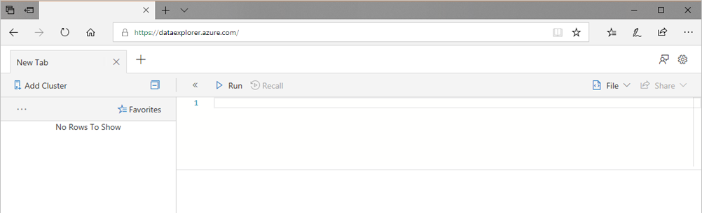
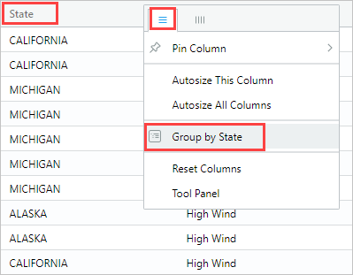
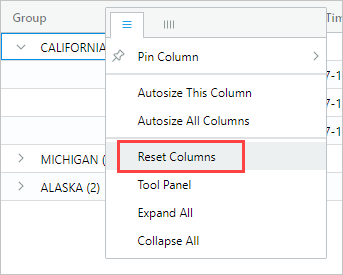
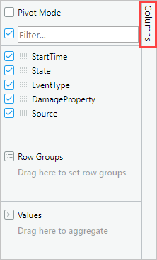
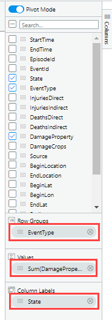
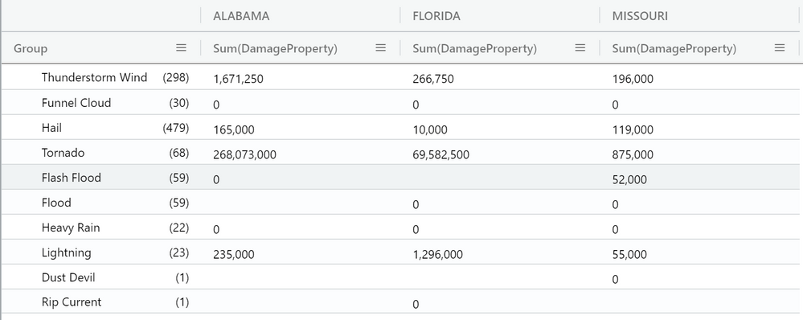

# Quickstart: Query data in Azure Data Explorer Web Explorer

Azure Data Explorer (ADX) is a fast, fully managed data analytics service for real-time analysis of large volumes of data. <br/>
ADX provides a web experience, that enables users to connect to their ADX clusters and write, run and share KQL commands and queries. <br/>
The web experience is available in the Azure portal and as a stand-alone web application, the ADX Web Explorer. <br/>
The **ADX Web Explorer** is hosted at https://dataexplorer.azure.com/ and short-linked by https://aka.ms/kwe.<br/>
ADX Web Explorer can also be hosted by other web portals in an HTML iframe. See [Monaco IDE integration](https://docs.microsoft.com/en-us/azure/data-explorer/kusto/api/monaco/monaco-kusto) for details on how to host it and the Monaco editor it uses.<br/>
In this quickstart guide, you will be working in the stand-alone ADX Web Explorer.


## Prerequisites
For this quickstart guide you’ll need an Azure subscription, if you don’t have one, create a [free Azure account](https://azure.microsoft.com/free/) before you begin.<br/>
In addition to an Azure subscription, you’ll need a test cluster and database with data, you can create your own [test cluster](https://docs.microsoft.com/en-us/azure/data-explorer/create-cluster-database-portal) or use the ADX Help cluster.


## Sign in to the application

Sign in to [the application](https://dataexplorer.azure.com/).

## Add clusters

When you first open the application, there are no cluster connections.



You must add a connection to at least one cluster before you can start running queries. In this section, you’ll add connections to the ADX **help** cluster that has been set up to aid learning, and to the test cluster you've created in a previous quickstart (optional).

1. In the upper left of the application, select **Add cluster**.

1. In the **Add cluster** dialog box, enter the URI https://help.kusto.windows.net, then select **Add**.
   
1. In the left pane, you should now see the **help** cluster. Expand the **Samples** database and open the **Tables** folder to see the sample tables that you have access to.

    :::image type="content" source="media/web-query-data/connection.png" alt-text="samples-database":::

    We use the **StormEvents** table later in this quickstart, and in other Azure Data Explorer articles.

Now add the test cluster you created.

1. Select **Add cluster**.

1. In the **Add cluster** dialog box, enter your test cluster URL in the form `https://<ClusterName>.<Region>.kusto.windows.net/`, then select **Add**.
 
    For example, https://mydataexplorercluster.westus.kusto.windows.net as in the following image:
    :::image type="content" source="media/web-query-data/server-uri.png" alt-text="server-uri":::
    
1. In the example below, you see the **help** cluster and a new cluster, **docscluster.westus** (full URL is `https://docscluster.westus.kusto.windows.net/`).

    

## Run queries

You can now run queries against either cluster that you're connected to (assuming you have data in your test cluster). For the purpose of this tutorial, we'll focus on the **help** cluster.

1. In the left pane, under the **help** cluster, select the **Samples** database.

1. Copy and paste the following query into the query window. At the top of the window, select **Run**.

    ```Kusto
    StormEvents
    | sort by StartTime desc
    | take 10
    ```
    
    This query returns the 10 newest records in the **StormEvents** table. The left side of the result should look like the following table.

    :::image type="content" source="media/web-query-data/result-set-01.png" alt-text="Screenshot of a table that lists the start time, end time, episode, event ID, state, and event type for 10 storm events." border="false":::

    The following image shows the state that the application should now be in, with the cluster added, and a query with results.

    :::image type="content" source="media/web-query-data/Capture2.png" alt-text="full screen":::

1. Copy and paste the following query into the query window, below the first query. Notice how it's not formatted on separate lines like the first query.

    ```Kusto
    StormEvents | sort by StartTime desc | project StartTime, EndTime, State, EventType, DamageProperty, EpisodeNarrative | take 10
    ```

1. Select the new query in the window, which selects the query. Press **Shift+Alt+F** to format the query, so it looks like the following.

    

1. Press **Shift+Enter**, which is a shortcut to run a query.

   This query returns the same records as the first one, but includes only the columns specified in the `project` statement. The result should look like the following table.

    :::image type="content" source="media/web-query-data/result-set-02.png" alt-text="Screenshot of a table that lists the start time, end time, state, event type, damage property, and episode narrative for 10 storm events." border="false":::

1. At the top of the query window, select **Recall**.

    The query window now shows the result set from the first query without having to rerun the query. Often during analysis, you run multiple queries, and **Recall** enables you to revisit the results of previous queries.

1. Let's run one more query to see a different type of output.

    ```Kusto
    StormEvents
    | summarize event_count=count(), mid = avg(BeginLat) by State
    | sort by mid
    | where event_count > 1800
    | project State, event_count
    | render columnchart
    ```
    The result should look like the following chart.

    

> [!NOTE]
> Blank lines in the query expression can affect which part of the query is executed.
>
> If no text selected, it's assumed that the query or command is separated by empty lines.
> If text is selected, the selected text is run.

## Work with the table grid

Now you've seen how basic queries work, let's look at how you can use the table grid to customize results and do further analysis.

1. Rerun the first query. Mouse-over the **State** column, select the menu, and select **Group by State**.

    

1. In the grid, expand **California** to see records for that state.

    :::image type="content" source="media/web-query-data/result-set-03.png" alt-text="Screenshot of a query results grid. The California group is expanded, and three rows are visible, with data from events in California." border="false":::

    This type of grouping can be helpful when doing exploratory analysis.

1. Mouse-over the **Group** column, then select **Reset columns**.

    

    This returns the grid to its original state.

1. Run the following query.

    ```Kusto
    StormEvents
    | sort by StartTime desc
    | where DamageProperty > 5000
    | project StartTime, State, EventType, DamageProperty, Source
    | take 10
    ```
1. In the results grid select few of the numerical cells. <br/>
    The table grid allows you to select multiple rows, columns, and cells and calculate aggregations on them. The web explorer currently supports the following functions for numeric values: **Average**, **Count**, **Min**, **Max**, and **Sum** as seen on the bottom right in the example below.

:::image type="content" source="media/web-query-data/selectstats.png" alt-text="select-stats"::: 


1. On the right side of the grid, select **Columns** to see the tool panel.

    

    This panel functions similarly to the pivot table field list in Excel, enabling you to do more analysis in the grid itself.

1. Select **Pivot Mode**, then drag columns as follows: **State** to **Row groups**; **DamageProperty** to **Values**; and **EventType** to **Column labels**.  

    

    The result should look like the following pivot table.

    

    Notice how Vermont and Alabama each have two events under the same category, while Texas has two events under different categories. Pivot tables enable you to quickly spot things like this; they are a great tool for quick analysis.


## Search in grid
You can look for a specific expression within a result table.
1.	Run the following query:

    ```Kusto
    StormEvents
	| where DamageProperty > 5000
    | take 1000
    ```

1. Click on the **Search** button on the right and type in *"Wabash"*

 :::image type="content" source="media/web-query-data/search1.png" alt-text="search1":::

1. All mentions of your searched expression are now highlighted in the table. You can navigate between them by clicking **Enter** to go forward or **Shift+Enter** to go backward, or you can use the **up** and **down** buttons next to the search box.

:::image type="content" source="media/web-query-data/search2.png" alt-text="search2":::

## Share queries

Many times, you want to share the queries you create. 

1. In the query window, select the first query you copied in.

1. At the top of the query window, select **Share**. 

:::image type="content" source="media/web-query-data/share-menu.png" alt-text="Share menu":::

The following options are available in the drop-down:
* Link to clipboard
* [Link query to clipboard](#provide-a-deep-link)
* Link, query, results to clipboard
* [Pin to dashboard](#pin-to-dashboard)
* [Query to Power BI](power-bi-imported-query.md)

### Provide a deep link

You can provide a deep link so that other users with access to the cluster can run the queries.

1. In **Share**, select **Link, query to clipboard**.

1. Copy the link and query to a text file.

1. Paste the link into a new browser window. The result should look like the following

    :::image type="content" source="media/web-query-data/shared-query.png" alt-text="Shared query deep link":::

### Pin to dashboard

When you complete data exploration using queries in the Web UI and find the data you need, you can pin it to a dashboard for continuous monitoring. 

To pin a query:

1. In **Share**, select **Pin to dashboard**.

1. In the **Pin to dashboard** pane:
    1. Provide a **Query name**.
    1. Select **Use existing** or **Create new**.
    1. Provide **Dashboard name**
    1. Select the **View dashboard after creation** checkbox (if it's a new dashboard).
    1. Select **Pin**

    :::image type="content" source="media/web-query-data/pin-to-dashboard.png" alt-text="Pin to dashboard pane":::
    
> [!NOTE]
> **Pin to dashboard** only pins the selected query. To create the dashboard data source and translate render commands to a visual in the dashboard, the relevant database must be selected in the database list.

## Export query results

To export the query results to a CSV file, select **File** > **Export to CSV**.

:::image type="content" source="media/web-query-data/export-results.png" alt-text="Export results to CSV file":::


## Export and import environment settings

The export and import actions have been created to help users protect their work environment and to relocate it into other browsers and devices. <br/>
The export action will export all your settings, cluster connections, and query tabs to a JSON file, that can be later imported into the same or different browser or device.
1.	Open **Settings** (cogwheel icon) on the top right
1.	Click on the **Export** button
	 :::image type="content" source="media/web-query-data/imexport1.png" alt-text="export":::
1.	An **adx-export.json** file will be downloaded to your local storage
1.	Click on **Clear local state**, this will revert your environment to its original state. <br/>
    This action should delete all your cluster connections and close any open tabs
1.	Open **Settings** again
1.	Click **Import** and approve the warning pop-up
	 :::image type="content" source="media/web-query-data/imexport2.png" alt-text="import":::
1.	Locate your **adx-export.json** file from your local storage and open it
1.	Your previous cluster connections and open tabs should be available again

>[!NOTE]
>The export action only exports query related data, no dashboards data will be exported within the **adx-export.json** file. <br/>
The import action overrides any existing environment settings and data.

## Provide feedback

1. In the upper right of the application, select the feedback icon .

1. Enter your feedback, then select **Submit**.

## Clean up resources

You didn't create any resources in this quickstart, but if you'd like to remove one or both clusters from the application, right-click the cluster and select **Remove connection**.
Another option is to select **Clear local state** from the settings panel. This action will remove all cluster connections and close all open query tabs.

:::image type="content" source="media/web-query-data/imexport1.png" alt-text="clear":::

## Next steps

[Write queries for Azure Data Explorer](write-queries.md)
