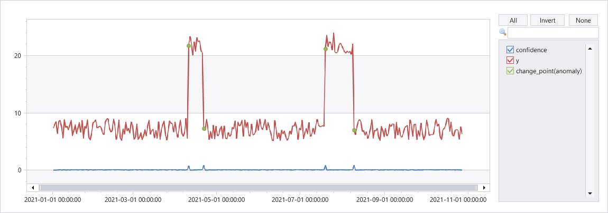

# series_uv_change_points_fl()

::: zone pivot="azuredataexplorer"

The function `series_uv_change_points_fl()` is a [user-defined function (UDF)](../query/functions/user-defined-functions.md) that finds change points in time series by calling the [Univariate Anomaly Detection API](/azure/cognitive-services/anomaly-detector/overview), part of [Azure Cognitive Services](/azure/cognitive-services/what-are-cognitive-services). The function accepts a limited set of time series as numerical dynamic arrays, the change point detection threshold, and the minimum size of the stable trend window. Each time series is converted into the required JSON format and posts it to the Anomaly Detector service endpoint. The service response contains dynamic arrays of change points, their respective confidence, and the detected seasonality.

> [!NOTE]
> Consider using the native function [series_decompose_anomalies()](../query/series-decompose-anomalies-function.md) which is more scalable and runs faster.

## Prerequisites

* An Azure subscription. Create a [free Azure account](https://azure.microsoft.com/free/).
* A cluster and database. [Create a cluster and database](../../create-cluster-and-database.md).
* The Python plugin must be [enabled on the cluster](../query/python-plugin.md#enable-the-plugin). This is required for the inline Python used in the function.
* [Create an Anomaly Detector resource and obtain its key](https://ms.portal.azure.com/#create/Microsoft.CognitiveServicesAnomalyDetector) to access the service.
* Enable the [http_request plugin / http_request_post plugin](../query/http-request-plugin.md) on the cluster to access the anomaly detection service endpoint.
* Modify the [callout policy](../management/callout-policy.md) for type `webapi` to access the anomaly detection service endpoint.

## Syntax

`T | invoke series_uv_change_points_fl(`*y_series* [`,` *score_threshold* [`,` *trend_window* [`,` *tsid*]]]`)`

[!INCLUDE [syntax-conventions-note](../includes/syntax-conventions-note.md)]

## Parameters

| Name | Type | Required | Description |
|--|--|--|--|
| *y_series* | `string` |  :heavy_check_mark: | The name of the input table column containing the values of the series to be anomaly detected. |
| *score_threshold* | `real` | | A value specifying the minimum confidence to declare a change point. Each point whose confidence is above the threshold is defined as a change point. Default value: 0.9 |
| *trend_window* | integer | | A value specifying the minimal window size for robust calculation of trend changes. Default value: 5 |
| *tsid* | `string` | | The name of the input table column containing the time series ID. Can be omitted when analyzing a single time series. |

## Function definition

You can define the function by either embedding its code as a query-defined function, or creating it as a stored function in your database, as follows:

### [Query-defined](#tab/query-defined)

Define the function using the following [let statement](../query/let-statement.md). No permissions are required. In the following function definition, replace `YOUR-AD-RESOURCE-NAME` in the uri and `YOUR-KEY` in the `Ocp-Apim-Subscription-Key` of the header with your Anomaly Detector resource name and key.

> [!IMPORTANT]
> A [let statement](../query/let-statement.md) can't run on its own. It must be followed by a [tabular expression statement](../query/tabular-expression-statements.md). To run a working example of `series_uv_change_points_fl()`, see [Example](#example).

~~~kusto
let series_uv_change_points_fl=(tbl:(*), y_series:string, score_threshold:real=0.9, trend_window:int=5, tsid:string='_tsid')
{
    let uri = 'https://YOUR-AD-RESOURCE-NAME.cognitiveservices.azure.com/anomalydetector/v1.0/timeseries/changepoint/detect';
    let headers=dynamic({'Ocp-Apim-Subscription-Key': h'YOUR-KEY'});
    let kwargs = bag_pack('y_series', y_series, 'score_threshold', score_threshold, 'trend_window', trend_window);
    let code = ```if 1:
        import json
        y_series = kargs["y_series"]
        score_threshold = kargs["score_threshold"]
        trend_window = kargs["trend_window"]
        json_str = []
        for i in range(len(df)):
            row = df.iloc[i, :]
            ts = [{'value':row[y_series][j]} for j in range(len(row[y_series]))]
            json_data = {'series': ts, "threshold":score_threshold, "stableTrendWindow": trend_window}     # auto-detect period, or we can force 'period': 84
            json_str = json_str + [json.dumps(json_data)]
        result = df
        result['json_str'] = json_str
    ```;
    tbl
    | evaluate python(typeof(*, json_str:string), code, kwargs)
    | extend _tsid = column_ifexists(tsid, 1)
    | partition by _tsid (
       project json_str
       | evaluate http_request_post(uri, headers, dynamic(null))
        | project period=ResponseBody.period, change_point=series_add(0, ResponseBody.isChangePoint), confidence=ResponseBody.confidenceScores
        | extend _tsid=toscalar(_tsid)
       )
};
// Write your query to use the function here.
~~~

### [Stored](#tab/stored)

Define the stored function once using the following [`.create function`](../management/create-function.md). [Database User permissions](../management/access-control/role-based-access-control.md) are required. In the following function definition, replace `YOUR-AD-RESOURCE-NAME` in the uri and `YOUR-KEY` in the `Ocp-Apim-Subscription-Key` of the header with your Anomaly Detector resource name and key.

> [!IMPORTANT]
> You must run this code to create the function before you can use the function as shown in the [Example](#example).

~~~kusto
.create-or-alter function with (folder = "Packages\\Series", docstring = "Time Series Change Points Detection by Azure Cognitive Service")
series_uv_change_points_fl(tbl:(*), y_series:string, score_threshold:real=0.9, trend_window:int=5, tsid:string='_tsid')
{
    let uri = 'https://YOUR-AD-RESOURCE-NAME.cognitiveservices.azure.com/anomalydetector/v1.0/timeseries/changepoint/detect';
    let headers=dynamic({'Ocp-Apim-Subscription-Key': h'YOUR-KEY'});
    let kwargs = bag_pack('y_series', y_series, 'score_threshold', score_threshold, 'trend_window', trend_window);
    let code = ```if 1:
        import json
        y_series = kargs["y_series"]
        score_threshold = kargs["score_threshold"]
        trend_window = kargs["trend_window"]
        json_str = []
        for i in range(len(df)):
            row = df.iloc[i, :]
            ts = [{'value':row[y_series][j]} for j in range(len(row[y_series]))]
            json_data = {'series': ts, "threshold":score_threshold, "stableTrendWindow": trend_window}     # auto-detect period, or we can force 'period': 84
            json_str = json_str + [json.dumps(json_data)]
        result = df
        result['json_str'] = json_str
    ```;
    tbl
    | evaluate python(typeof(*, json_str:string), code, kwargs)
    | extend _tsid = column_ifexists(tsid, 1)
    | partition by _tsid (
       project json_str
       | evaluate http_request_post(uri, headers, dynamic(null))
        | project period=ResponseBody.period, change_point=series_add(0, ResponseBody.isChangePoint), confidence=ResponseBody.confidenceScores
        | extend _tsid=toscalar(_tsid)
       )
}
~~~

---

## Example

The following example uses the [invoke operator](../query/invoke-operator.md) to run the function.

### [Query-defined](#tab/query-defined)

To use a query-defined function, invoke it after the embedded function definition.

~~~kusto
let series_uv_change_points_fl=(tbl:(*), y_series:string, score_threshold:real=0.9, trend_window:int=5, tsid:string='_tsid')
{
    let uri = 'https://YOUR-AD-RESOURCE-NAME.cognitiveservices.azure.com/anomalydetector/v1.0/timeseries/changepoint/detect';
    let headers=dynamic({'Ocp-Apim-Subscription-Key': h'YOUR-KEY'});
    let kwargs = bag_pack('y_series', y_series, 'score_threshold', score_threshold, 'trend_window', trend_window);
    let code = ```if 1:
        import json
        y_series = kargs["y_series"]
        score_threshold = kargs["score_threshold"]
        trend_window = kargs["trend_window"]
        json_str = []
        for i in range(len(df)):
            row = df.iloc[i, :]
            ts = [{'value':row[y_series][j]} for j in range(len(row[y_series]))]
            json_data = {'series': ts, "threshold":score_threshold, "stableTrendWindow": trend_window}     # auto-detect period, or we can force 'period': 84
            json_str = json_str + [json.dumps(json_data)]
        result = df
        result['json_str'] = json_str
    ```;
    tbl
    | evaluate python(typeof(*, json_str:string), code, kwargs)
    | extend _tsid = column_ifexists(tsid, 1)
    | partition by _tsid (
       project json_str
       | evaluate http_request_post(uri, headers, dynamic(null))
        | project period=ResponseBody.period, change_point=series_add(0, ResponseBody.isChangePoint), confidence=ResponseBody.confidenceScores
        | extend _tsid=toscalar(_tsid)
       )
};
let ts = range x from 1 to 300 step 1
| extend y=iff(x between (100 .. 110) or x between (200 .. 220), 20, 5)
| extend ts=datetime(2021-01-01)+x*1d
| extend y=y+4*rand()
| summarize ts=make_list(ts), y=make_list(y)
| extend sid=1;
ts
| invoke series_uv_change_points_fl('y', 0.8, 10, 'sid')
| join ts on $left._tsid == $right.sid
| project-away _tsid
| project-reorder y, *      //  just to visualize the anomalies on top of y series
| render anomalychart with(xcolumn=ts, ycolumns=y, confidence, anomalycolumns=change_point)
~~~

### [Stored](#tab/stored)

> [!IMPORTANT]
> For this example to run successfully, you must first run the [Function definition](#function-definition) code to store the function.

~~~kusto
let ts = range x from 1 to 300 step 1
| extend y=iff(x between (100 .. 110) or x between (200 .. 220), 20, 5)
| extend ts=datetime(2021-01-01)+x*1d
| extend y=y+4*rand()
| summarize ts=make_list(ts), y=make_list(y)
| extend sid=1;
ts
| invoke series_uv_change_points_fl('y', 0.8, 10, 'sid')
| join ts on $left._tsid == $right.sid
| project-away _tsid
| project-reorder y, *      //  just to visualize the anomalies on top of y series
| render anomalychart with(xcolumn=ts, ycolumns=y, confidence, anomalycolumns=change_point)
~~~

---

**Output**

The following graph shows change points on a time series.



::: zone-end

::: zone pivot="azuremonitor, fabric"

This feature isn't supported.

::: zone-end