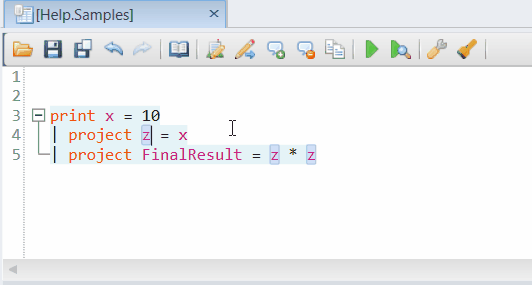
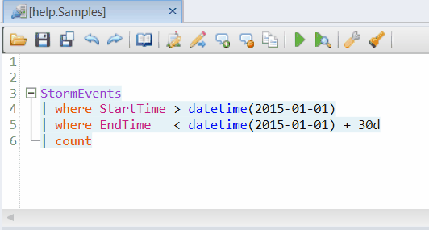

# Kusto.Explorer code features

Similar to other IDEs, Kusto.Explorer offers a variety of code features, including [Code refactoring](#code-refactoring), [Code navigation](#code-navigation), and a [Code analyzer](#code-analyzer) utility.

## Code refactoring

Use Kusto.Explorer's KQL query editing and refactoring features to rename variables and column names, and extract scalars and tabular statements as `let` expressions.

### Rename variable or column name

Rename selected symbols by clicking `Ctrl`+`R` in the query editor window.

### Extract scalars as `let` expressions

To define selected literals as `let` expressions, press `Alt`+`Ctrl`+`M`.

### Extract tabular statements as `let` expressions

To define tabular expressions as `let` statements, select the text, and then press `Alt`+`Ctrl`+`M`.

## Code navigation

Kusto.Explorer provides several features for easy code navigation using query symbols information.

### Go-to symbol definition

You can navigate to the definition of the current symbol using `F12` or the `Alt`+`Home` shortcuts.

### List all references of a symbol

You can obtain all references of the current symbol using the `Ctrl`+`F12` shortcut.

:::image type="content" source="media/kusto-explorer-code-features/ke-code-nav-references.gif" alt-text="References of a symbol Kusto Explorer Code Navigation.":::

For more information on keyboard shortcuts in Kusto.Explorer, see [Keyboard shortcuts](../tools/kusto-explorer-shortcuts.md).

## Code analyzer

Use Kusto.Explorer's code analyzer utility to automatically analyze the current query and output a set of applicable improvement recommendations.

To view improvement recommendations, at the bottom of the result grid, select the **Issues** tab.

:::image type="content" source="media/kusto-explorer-code-features/ke-code-analyze.gif" alt-text="Code analyzer GIF in Kusto Explorer.":::
